# VOJNA V UKRAJINI: ŠTIRI LETA IN POL RUSKE TOTALNE AGRESIJE IN NJENE POSLEDICE
### *Celovit pregled humanitarne, demografske in civilizacijske katastrofe skozi prizmo mednarodnega prava, avtentičnih fotografskih dokazov in preiskovalnega video gradiva (2022–2026)*

> 🌐 **Spletni ogled na GitHub Pages:**  
> **[https://bluzimir.github.io/karavla/posledice_vojne_v_ukrajini](https://bluzimir.github.io/karavla/posledice_vojne_v_ukrajini)**  
> 🔗 **Povezava na glavno stran dokumentacije:** [README.md](README.md)

---

  <h3 style="margin-top: 0; color: #ffffff; font-size: 1.35em;">📌 Ključni kazalniki posledic ruske totalne agresije (stanje 2022–2026)</h3>
  

    

      
> 6,5 mio

      
Ukrajinskih beguncev z začasno zaščito v EU in po svetu (90 % ženske in otroci)

    

    

      
> 3,7 mio

      
Notranje razseljenih oseb (IDP), ki so izgubile svoje domove

    

    

      
> 10 mest

      
Popolnoma izbrisanih z obličja zemlje (Mariupol, Bahmut, Marjinka, Avdijivka ...)

    

    

      
4 nalogi ICC

      
Mednarodni nalogi za aretacijo (V. Putin, M. Lvova-Belova, S. Šojgu, V. Gerasimov)

    

  

---

## 1. UVOD IN PRAVNI OKVIR VOJNE

24. februarja 2022 je Ruska federacija začela neizzvano, obsežno vojaško invazijo na suvereno državo Ukrajino. Do jeseni 2026 ta totalna vojna visoke intenzivnosti traja že **štiri leta in pol** (oziroma več kot 12 let, če upoštevamo začetek agresije z nezakonito zasedbo polotoka Krim in vojaškim vdorom v Donbas spomladi 2014).

Za celoten demokratični svet, združen v Organizaciji združenih narodov (OZN), Evropski uniji, Svetu Evrope in zavezništvu demokratičnih držav, je narava te vojne pravno in moralno povsem nedvoumna:

* **Kršitev temeljev mednarodnega prava:** Ruska invazija predstavlja grobo kršitev 2. člena Ustanovne listine OZN, ki prepoveduje grožnjo s silo ali uporabo sile proti ozemeljski celovitosti ali politični neodvisnosti katere koli države.
* **Prekršitev specifičnih mednarodnih zavez:** Rusija je z napadom poteptala *Helsinško sklepno listino* (1975), *Budimpeštanski memorandum* (1994), v katerem se je v zameno za odpoved Ukrajine tretjemu največjemu jedrskemu arzenalu na svetu izrecno zavezala k spoštovanju ukrajinskih meja, ter *Pogodbo o prijateljstvu in sodelovanju med Rusijo in Ukrajino* (1997).
* **Konsenz Generalne skupščine OZN:** Generalna skupščina ZN je z zgodovinsko večino (resolucije ES-11/1, ES-11/2, ES-11/4) agresijo obsodila, razglasila poskuse priključitve ukrajinskih regij (Doneck, Lugansk, Zaporožje, Herson, Krim) za pravno nične ter zahtevala takojšen, popoln in brezpogojen umik vseh ruskih vojaških sil z mednarodno priznanega ozemlja Ukrajine.

Vojna v Ukrajini zato za svobodni svet ni »lokalni konflikt« ali »spopad velesil«, temveč **eksistencialni boj za ohranitev mednarodnega pravnega reda**, v katerem meje določa pravo in samoodločba narodov, ne pa surova vojaška sila avtokratskih imperijev.

---

## 2. HUMANITARNA KATASTROFA IN BEGUNSKA KRIZA

Agresija je sprožila največjo begunsko in humanitarno krizo na evropskih tleh po koncu druge svetovne vojne. Več kot tretjina vseh prebivalcev Ukrajine je bila prisiljena zapustiti svoje domove.

### Milijoni razseljenih oseb
* **Zunanji begunci (več kot 6,5 milijona):** Po podatkih Visokega komisariata ZN za begunce (UNHCR) je v državah Evropske unije in širše začasno zaščito poiskalo več kot 6,5 milijona ljudi. Približno 90 % beguncev predstavljajo **ženske in otroci**, saj moški v starosti od 18 do 60 let zaradi obrambnih nalog ostajajo v domovini.
* **Notranje razseljene osebe (IDP – več kot 3,7 milijona):** Znotraj same Ukrajine je na milijone ljudi moralo zapustiti svoje uničene domove na vzhodu in jugu ter poiskati zasilno bivališče v osrednjih in zahodnih regijah države.
* **Človeške stiske in razbite družine:** Milijoni ukrajinskih družin že več kot štiri leta živijo ločeno. Otroci odraščajo brez očetov, šolanje poteka na daljavo ali v podzemnih zakloniščih pod nenehnim tuljenjem siren.

### Odziv in solidarnost demokratičnega sveta
Evropska unija je prvič v zgodovini soglasno aktivirala *Direktivo o začasni zaščiti*, ki je ukrajinskim beguncem omogočila pravico do bivanja, dela, zdravstvenega varstva in izobraževanja. Kljub poskusom proruskih političnih sil (vključno s skrajno desnimi gibanji, kot je nemška AfD), da bi begunce demonizirale in prikazale kot »finančno breme«, večina evropskih družb ostaja trdno zavezana humanitarni pomoči žrtvam agresije.

---

### 📸 FOTOGRAFSKA DOKUMENTACIJA: Ljudje, begunci in razbita življenja

#### 📷 Slika 1: Beg pred ruskim obstreljevanjem pod zrušenim mostom v Irpinu (marec 2022)
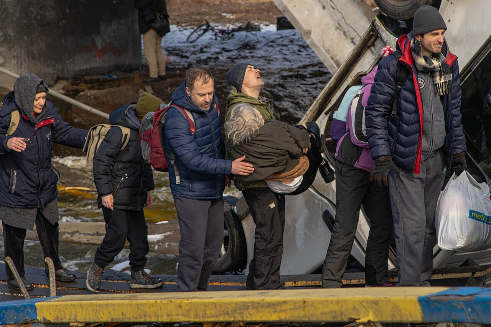

* **Opis:** Ena najbolj prepoznavnih fotografij začetka ruske agresije. Tisoče civilistov – predvsem mater z dojenčki, majhnih otrok in ostarelih – se je stiskalo pod betonskimi ruševinami zrušenega mostu čez reko Irpin severozahodno od Kijeva, medtem ko je ruska vojska območje evakuacijskih koridorjev obstreljevala s težkim topništvom in minometi.
* **Vir in licenca:** Mednarodna foto-dokumentacija / Arhiv evakuacije Kijevske oblasti (licenca CC BY / Wikimedia Commons).
* 🔍 **[Povezava do fotografije v polni velikosti](priloge/irpin_porusen_most_evakuacija.jpg)**

---

#### 📷 Slika 2: Eksodus nedolžnih: Ukrajinske družine na železniških postajah na poti v varnost
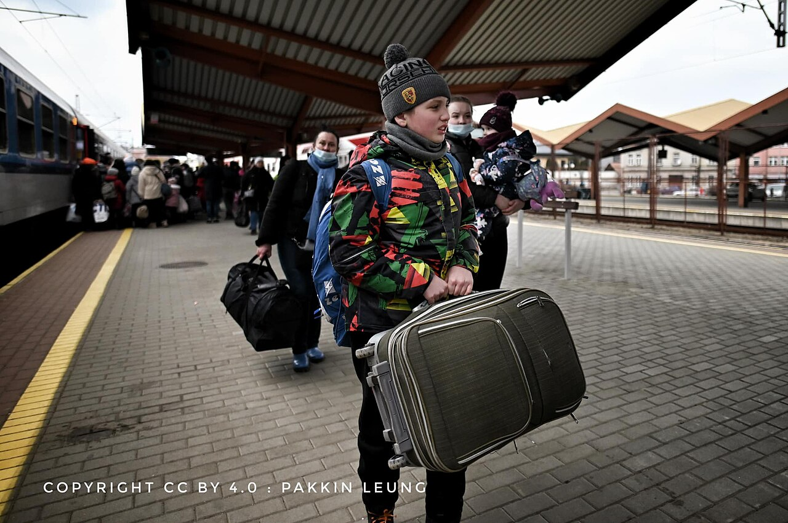

* **Opis:** Ženske, otroci in starejši ljudje z nekaj najnujnejšimi osebnimi stvarmi v plastičnih vrečkah in kovčkih vstopajo na evakuacijske vlake proti poljski meji in naprej v države EU. Za seboj so pustili može, moževe očete, porušena stanovanja in celotno dotedanje življenje.
* **Vir in licenca:** Dokumentacija sprejemnih centrov v Evropi (licenca CC BY-SA / Wikimedia Commons).
* 🔍 **[Povezava do fotografije v polni velikosti](priloge/begunci_poljska_vlak.jpg)**

---

### 🎬 VIDEO DOKUMENTACIJA: Humanitarna drama na mejah z Evropo

#### 🎬 Poročilo Reuters: Begunski center v Przemyślu na poljsko-ukrajinski meji
Ta posnetek dokumentira prve dni in tedne masovnega bega ukrajinskih mater in otrok v sosednjo Poljsko ter neprecenljivo solidarnost prostovoljcev iz vse Evrope:

<iframe width="100%" height="480" src="https://www.youtube.com/embed/341s0ollkzc" title="Inside Poland's Przemysl camp for Ukrainian refugees | Reuters" frameborder="0" allowfullscreen></iframe>

* 🔗 **Neposredna povezava:** [Ogled na YouTube: Inside Poland's Przemysl camp for Ukrainian refugees (Reuters)](https://www.youtube.com/watch?v=341s0ollkzc)
* **Ključni prizori v posnetku:** Pretresljiva pričevanja ukrajinskih mater z majhnimi otroki ob prihodu na varno, organizacija prostovoljcev iz celotne Evrope ter soočenje z izgubo domov in negotovo prihodnostjo.

---

## 3. URBICID: POPOLNO UNIČENJE CELIH MEST DO TAL

Ruska vojaška doktrina se v Ukrajini opira na taktiko t. i. **urbicida** – sistematičnega uničenja celotnih urbanih središč in infrastrukture z masovnim topniškim obstreljevanjem, težkimi drsnimi letalskimi bombami (KAB, FAB-500, FAB-1500) in raketnimi salvami. Cilj te taktike je spremeniti cvetoča mesta v neprimerna za kakršno koli človeško bivanje ter zlomiti moralno voljo prebivalstva.

### Mesta, zbrisana z obličja zemlje
* **Mariupol:** Pristaniško industrijsko mesto z več kot 430.000 prebivalci je bilo spomladi 2022 skoraj tri mesece v popolni ruski blokadi brez vode, hrane, elektrike in ogrevanja. Po ugotovitvah OZN in organizacij Human Rights Watch ter Amnesty International je bilo poškodovanih ali uničenih več kot **90 % vseh stanovanjskih stavb**. Pod ruševinami in v množičnih grobiščih je po ocenah lokalnih oblasti umrlo več deset tisoč civilistov.
* **Bahmut:** Zgodovinsko mesto solinarjev in vinarjev z več kot 70.000 prebivalci je ruska vojska (skupaj s plačanci skupine Wagner) med skoraj enoletnim obleganjem dobesedno spremenila v apokaliptično lunarno pokrajino brez ene same cele zgradbe.
* **Marjinka, Avdijivka, Vovčansk, Popasna, Severodoneck, Lisičansk:** Ta mesta danes fizično ne obstajajo več. Rusko »osvajanje« teh območij je pomenilo njihovo stoodstotno fizično izničenje – ostali so le kupi zdrobljenega betona, zažgane armaturne mreže in kraterji težkih letalskih bomb.
* **Borodjanka in Harkiv (Severna Saltivka):** V Borodjanki so ruska bojna letala s poltonskimi bombami načrtno presekala večnadstropne bloke na pol, v Harkivu pa je bila ena največjih stanovanjskih četrti v Evropi (Saltivka) več kot pol leta pod vsakodnevnimi udarci ruskih raketnih sistemov Grad in Uragan.

### Sistematično uničevanje energetske infrastrukture
Od jeseni 2022 ruske strateške zračne sile načrtno izvajajo masovne valove napadov na termoelektrarne, hidroelektrarne, visokonapetostne transformatorske postaje in plinsko omrežje Ukrajine. Namen teh napadov ni vojaški, temveč teroriziranje civilnega prebivalstva – odvzeti milijonom družin ogrevanje, vodo in elektriko sredi hudih zimskih temperatur pod ničlo ter umetno izsiliti nov val beguncev proti Evropi.

### Ekocid: Razstrelitev jezu Kahovka (junij 2023)
Zrušitev in razstrelitev velikega hidroelektrarniškega jezu Nova Kahovka pod ruskim nadzorom je povzročila eno največjih okoljskih in industrijskih katastrof v sodobni evropski zgodovini:
* Poplavljenih je bilo več kot 80 naselij in mestnih četrti v spodnjem toku reke Dneper.
* Na tisoče živali je utonilo, uničeni so bili edinstveni naravni narodni parki.
* Na tisoče ton strojnega olja, strupenih kemikalij in odplaknjenih protipehotnih min je onesnažilo reko in Črno morje.
* Kmetijska območja južne Ukrajine so ostala brez namakalnih sistemov za desetletja, kar je ogrozilo oskrbo s hrano.

---

### 📸 FOTOGRAFSKA DOKUMENTACIJA: Urbicid – območja popolnega uničenja

#### 📷 Slika 3: Zračni posnetek Mariupola med ruskim obleganjem spomladi 2022
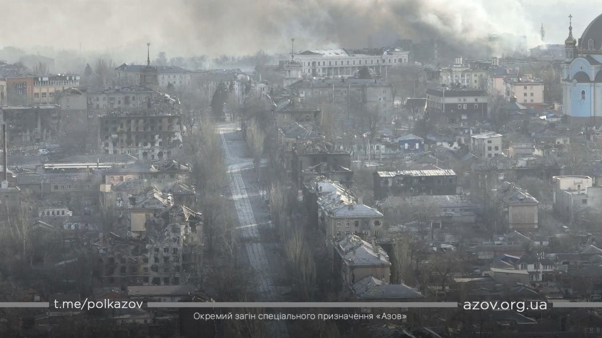

* **Opis:** Pogled na stanovanjska naselja in mestno središče Mariupola. Po večtedenskem neprekinjenem obstreljevanju s kopnega, z morja in iz zraka so bili celotni stanovanjski bloki požgani, porušeni ali spremenjeni v neprepoznavne skelete. V mestu je bilo uničenih več kot 90 % celotnega stanovanjskega fonda.
* **Vir in licenca:** Zračni in satelitski posnetki Mariupola (licenca CC BY-SA / Wikimedia Commons).
* 🔍 **[Povezava do fotografije v polni velikosti](priloge/mariupol_letalski_posnetek_razdejanja.jpg)**

---

#### 📷 Slika 4: Bahmut – popolno fizično izničenje mesta (posnetek iz zraka, 2023)
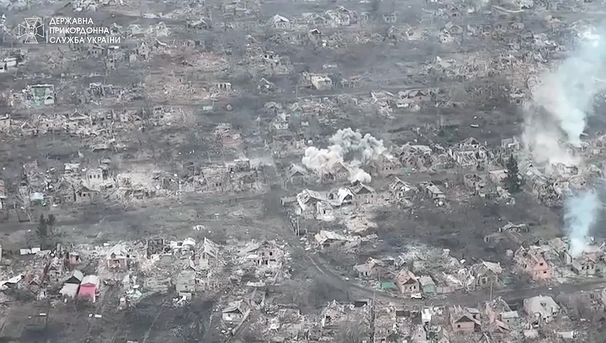

* **Opis:** Posnetek iz drona prikazuje osrednji del Bahmuta po mesecih topniškega mletja s strani ruske vojske. Na območju, kjer je nekoč živelo več kot 70.000 ljudi, ni ostala niti ena cela stavba; celotne ulice so bile spremenjene v prah, zoglenele ruševine in kraterje težkega topništva.
* **Vir in licenca:** Posnetki ukrajinskih zračnih izvidniških enot / Wikimedia Commons.
* 🔍 **[Povezava do fotografije v polni velikosti](priloge/bahmut_letalski_posnetek_popolno_unicenje.jpg)**

---

#### 📷 Slika 5: Borodjanka – zračni napadi na stanovanjske bloke (pomlad 2022)
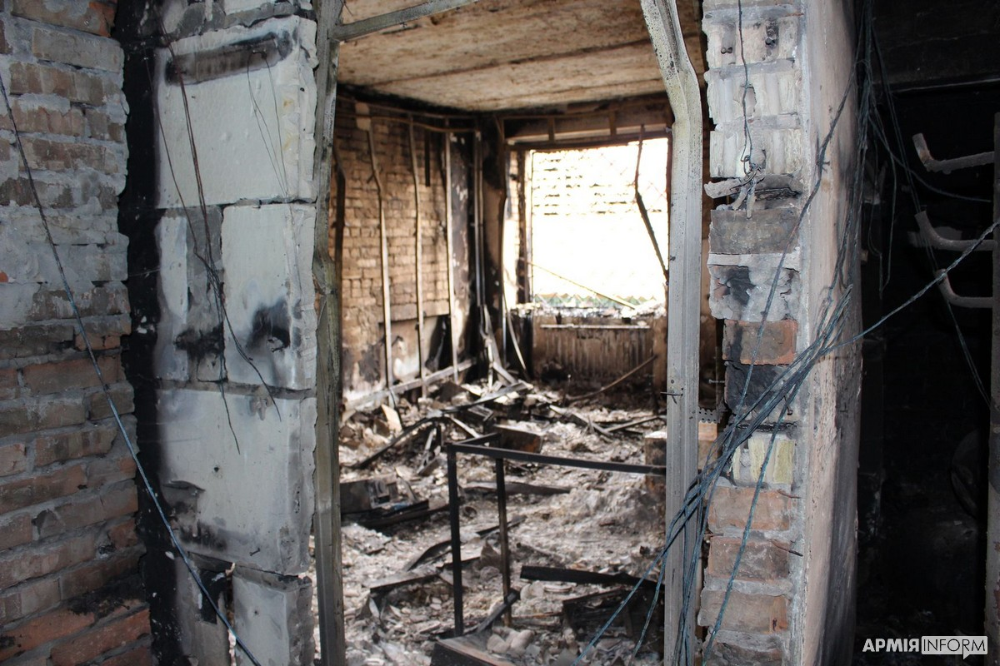

* **Opis:** Posledice odmetavanja poltonskih letalskih bomb FAB na civilne stanovanjske stolpnice v Borodjanki severno od Kijeva. Bombe so stolpnice dobesedno razklale na dvoje in zasule prebivalce v kletnih zakloniščih.
* **Vir in licenca:** Državna služba za izredne razmere Ukrajine (DSNS) / Wikimedia Commons.
* 🔍 **[Povezava do fotografije v polni velikosti](priloge/borodjanka_rusko_bombardiranje_blokov.jpg)**

---

#### 📷 Slika 6: Harkiv – Severna Saltivka po mesecih topniškega in raketnega uničevanja
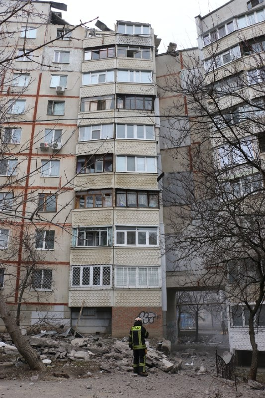

* **Opis:** Največja stanovanjska soseska v Ukrajini (dom za več kot 300.000 prebivalcev), ki so jo ruske sile sistematično zadevale z večcevnimi raketometi Grad, Uragan in kasetnim strelivom.
* **Vir in licenca:** Foto-arhiv Harkovske regionalne administracije / Wikimedia Commons.
* 🔍 **[Povezava do fotografije v polni velikosti](priloge/harkiv_saltivka_unicena_soseska.jpg)**

---

#### 📷 Slika 7: Ekocid: Poplave v Hersonu po ruski razstrelitvi jezu Nova Kahovka (junij 2023)
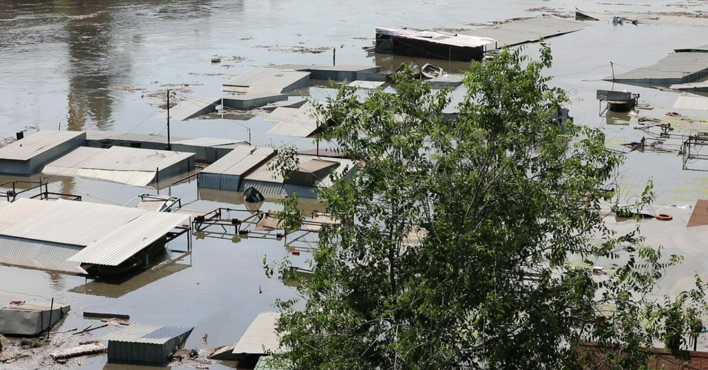

* **Opis:** Celotne stanovanjske četrti v Hersonu in na desnem bregu Dnepra pod vodo po razstrelitvi hidroelektrarniškega jezu pod ruskim nadzorom. Ruske sile so med evakuacijo civilistov s čolni celo streljale na reševalce in domačine.
* **Vir in licenca:** Foto-dokumentacija reševalnih operacij DSNS / Wikimedia Commons.
* 🔍 **[Povezava do fotografije v polni velikosti](priloge/kahovka_poplave_herson.jpg)**

---

### 🎬 VIDEO DOKUMENTACIJA: Posnetki iz zraka in pričevanje iz Mariupola

#### 🎬 Posnetek The Guardian: Zračni posnetki z drona prikazujejo razsežnost uničenja Bahmuta
Posnetek britanskega dnevnika The Guardian prikazuje razsežnost opustošenja v Bahmutu:

<iframe width="100%" height="480" src="https://www.youtube.com/embed/88AuACygKwg" title="Ukraine drone footage shows scale of destruction in city of Bakhmut | Guardian News" frameborder="0" allowfullscreen></iframe>

* 🔗 **Neposredna povezava:** [Ogled na YouTube: Ukraine drone footage shows scale of destruction in city of Bakhmut (Guardian News)](https://www.youtube.com/watch?v=88AuACygKwg)
* **Ključni prizori:** Verificirani posnetki brezpilotnih letalnikov prikazujejo neskončne nize popolnoma uničenih zgradb, požganih industrijskih obratov in ruševin nekdanjega mesta, ki ga je rusko topništvo zravnalo z zemljo.

---

#### 🎬 Zgodovinski govor Mstislava Černova ob prejemu Oskarja za film »20 dni v Mariupolu« (96. podelitev oskarjev)
Posnetek zgodovinskega trenutka, ko je ukrajinski režiser in novinar AP Mstislav Černov prejel prvega oskarja v zgodovini Ukrajine za dokumentarni film »20 dni v Mariupolu«:

<iframe width="100%" height="480" src="https://www.youtube.com/embed/SN_ArrwkU9U" title="'20 Days in Mariupol' Wins Best Documentary Feature Film | 96th Oscars" frameborder="0" allowfullscreen></iframe>

* 🔗 **Neposredna povezava:** [Ogled na YouTube: '20 Days in Mariupol' Wins Best Documentary Feature Film | Oscars](https://www.youtube.com/watch?v=SN_ArrwkU9U)

> »To je prvi oskar v ukrajinski zgodovini. In verjetno sem prvi režiser na tem odru, ki bo rekel: želim si, da tega filma ne bi nikoli posnel. Želim si, da bi to nagrado lahko zamenjal za to, da Rusija ne bi nikoli napadla Ukrajine, da ne bi nikoli zasedla naših mest ... da Rusija ne bi pobila na desettisoče mojih rojakov. Vendar preteklosti ne morem spremeniti. Lahko pa poskrbimo, da bo zgodovinski spomin ostal resničen, da bo resnica zmagala in da ljudje Mariupola ter tisti, ki so dali svoja življenja, ne bodo nikoli pozabljeni.«  
> – **Mstislav Černov**, režiser in prejemnik Pulitzerjeve nagrade ter oskarja

---

## 4. NAMERNI NAPADI NA CIVILISTE IN VOJNI ZLOČINI

Ena najbolj grozljivih značilnosti štiriletne agresije je dejstvo, da ukrajinski civilisti niso zgolj »naključne kolateralne žrtve bojev«, temveč so postali **neposredna, namensko izbrana tarča ruske vojaške mašinerije**.

### Prizorišča dokumentiranih grozodejstev
* **Masaker v Buči in okolici Kijeva (marec 2022):** Po osvoboditvi območja so preiskovalci našli več kot 450 trupel civilistov. Številni so imeli zvezane roke na hrbtu, strelne rane v tilnik, sledi mučenja, odrezane ude ter ožganine. Trupla so tedne ležala na pločnikih in dvoriščih, saj so ruske patrulje streljale na vsakogar, ki jih je skušal pokopati.
* **Dramsko gledališče v Mariupolu (16. marec 2022):** Največje civilno zaklonišče v mestu, v katerem se je skrivalo več kot 1000 žensk in otrok. Čeprav sta bili na asfaltu pred in za poslopjem z ogromnimi belimi črkami izpisani opozorili **»ДЕТИ«** (otroci), jasno čitljivi celo iz satelitov, je rusko bojno letalo nanj odvrglo dve poltonski bombi, ki sta porušili osrednji del stavbe. Po preiskavi tiskovne agencije Associated Press (AP) in Amnesty International je pod ruševinami umrlo okoli 600 civilistov.
* **Železniška postaja v Kramatorsku (8. april 2022):** Ruska balistična raketa Točka-U s kasetno bojno glavo je treščila sredi množice več kot 4000 civilistov, ki so z otroki čakali na evakuacijske vlake. Na ohišju rakete je bil v ruščini cinično izpisan napis *»Za otroke«* (*За детей*). Ubito je bilo 61 civilistov, več kot 120 pa jih je utrpelo hude poškodbe in amputacije.
* **Stanovanjski blok v Dnipru (14. januar 2023):** Ruska težka protiladijska raketa H-22 z 950-kilogramsko bojno glavo, zasnovana za uničevanje letalonosilk, je zadela večnadstropni stanovanjski blok in zradirala celoten vhod. Umrlo je 46 ljudi, med njimi 6 otrok, 80 je bilo ranjenih.
* **Otroška pediatrična bolnišnica Ohmatdit v Kijevu (8. julij 2024):** Ruska strateška manevrirna raketa H-101 je neposredno zadela največjo specializirano otroško bolnišnico v Ukrajini, kjer se zdravijo najtežje bolni otroci z rakom. Uničen je bil toksikološki oddelek za dializo, operacijske dvorane in intenzivna nega, otroci z infuzijami pa so morali bežati na ulico.

---

### 📸 FOTOGRAFSKA DOKUMENTACIJA: Dokazi napadov na civilno prebivalstvo

#### 📷 Slika 8: Dramsko gledališče v Mariupolu – uničenje zaklonišča z napisom »ДЕТИ«
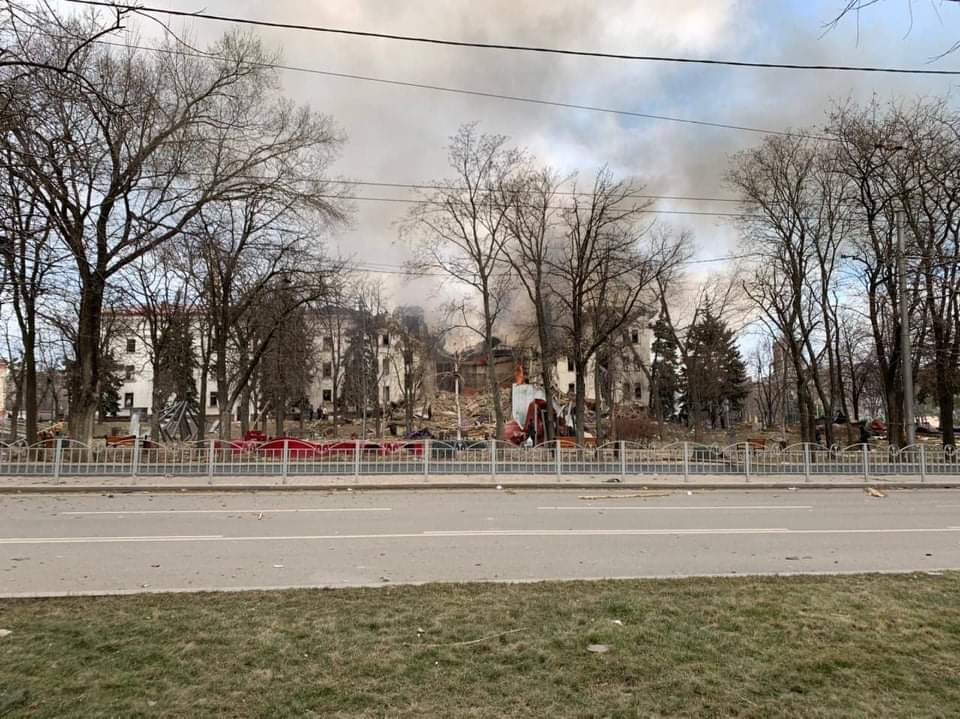

* **Opis:** Pogled na porušeno pročelje in zrušeno streho mariupolskega gledališča po neposrednem letalskem napadu 16. marca 2022. Ruski piloti so bombardirali stavbo kljub dejstvu, da je bilo na tleh jasno označeno, da so v njej otroci. Amnesty International je dogodek opredelil kot nedvoumen vojni zločin.
* **Vir in licenca:** Dokumentacija vojnih zločinov v Mariupolu / Wikimedia Commons.
* 🔍 **[Povezava do fotografije v polni velikosti](priloge/mariupol_dramsko_gledalisce_unicenje.jpg)**

---

#### 📷 Slika 9: Železniška postaja Kramatorsk po kasetnem napadu (april 2022)
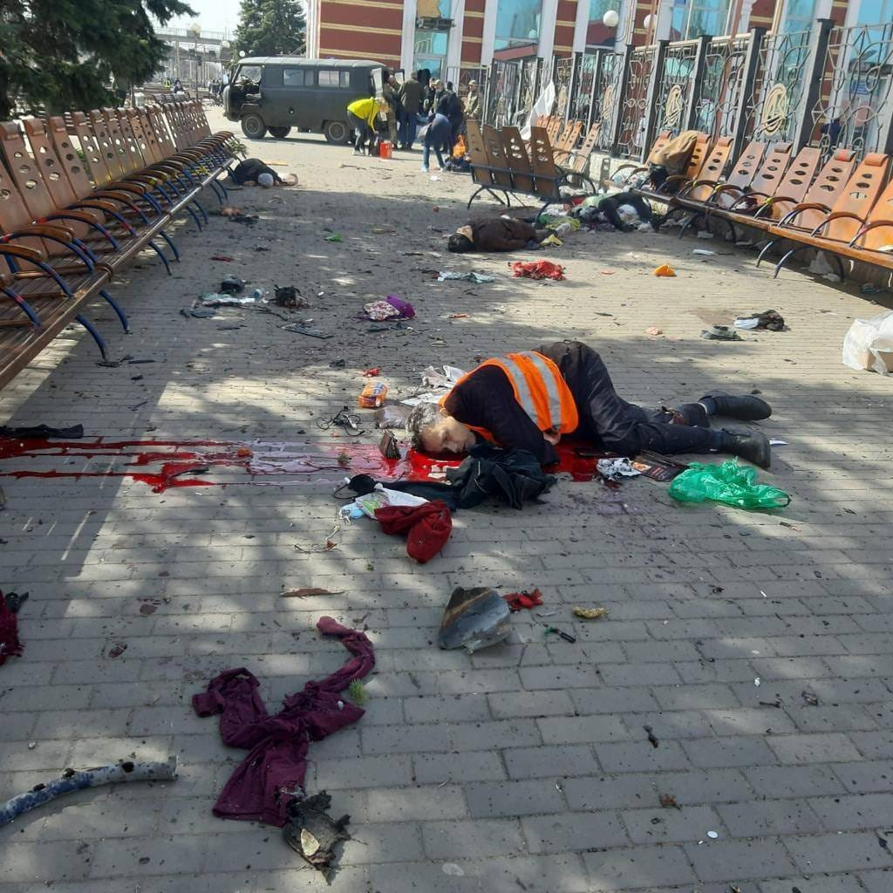

* **Opis:** Prizorišče po udaru balistične rakete Točka-U s kasetnim polnjenjem na tisoče čakajočih beguncev. Na tleh so ostala zapuščena prtljaga, otroški vozički in kri več kot 60 ubitih civilistov.
* **Vir in licenca:** Policija Donecke oblasti / DSNS / Wikimedia Commons.
* 🔍 **[Povezava do fotografije v polni velikosti](priloge/kramatorsk_zelezniska_postaja_napad.jpg)**

---

#### 📷 Slika 10: Dnipro – zadetek rakete H-22 v večnadstropni stanovanjski blok (januar 2023)
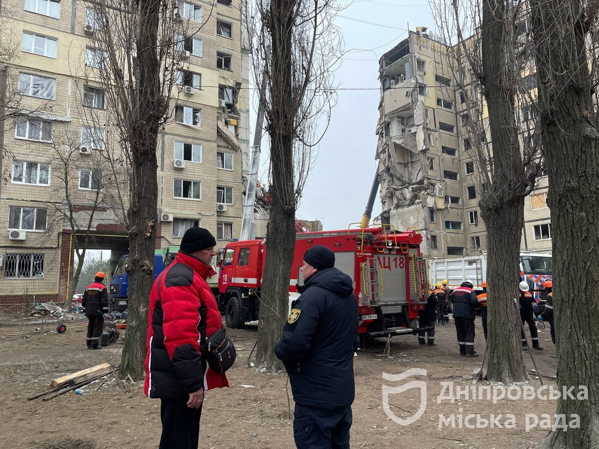

* **Opis:** Reševalna akcija po zadetku težke protiladijske rakete v polno zaseden devetnadstropni blok (januar 2023). V nekaj sekundah je bilo ubitih 46 stanovalcev, celoten vhod pa se je sesedel v klet.
* **Vir in licenca:** DSNS Ukrajine / Wikimedia Commons.
* 🔍 **[Povezava do fotografije v polni velikosti](priloge/dnipro_raketni_napad_blok.jpg)**

---

#### 📷 Slika 11: Kijev – napad na pediatrično kliniko Ohmatdit (julij 2024)
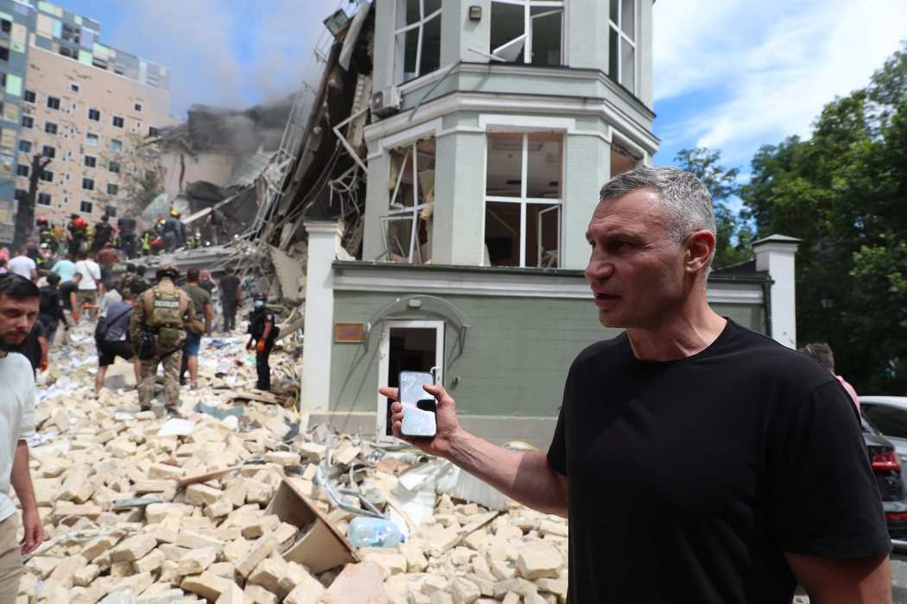

* **Opis:** Uničeni oddelki največje ukrajinske otroške bolnišnice po neposrednem zadetku ruske manevrirne rakete H-101 (8. julij 2024). Reševalci in zdravniki v okrvavljenih haljah so otroke z rakom reševali izpod ruševin.
* **Vir in licenca:** Ministrstvo za zdravje Ukrajine / Wikimedia Commons.
* 🔍 **[Povezava do fotografije v polni velikosti](priloge/kijev_bolnisnica_ohmatdit_napad.jpg)**

---

#### 📷 Slika 12: Buča – pobiti civilisti na ulici Jablunska (pomlad 2022)
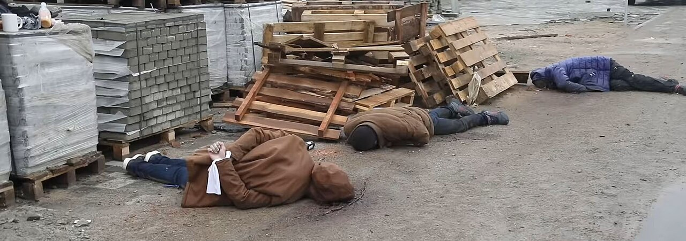

* **Opis:** Prizor po umiku ruskih sil marca 2022. Trupla zvezanih in usmrčenih domačinov so tedne ležala ob cestišču. Forenzične preiskave ZN so potrdile usmrtitve brez sojenja in sistematično mučenje s strani ruske 234. desantne enote.
* **Vir in licenca:** Urad predsednika Ukrajine / Neodvisna preiskovalna komisija ZN / Wikimedia Commons.
* 🔍 **[Povezava do fotografije v polni velikosti](priloge/buca_zlocini_ulica_jablunska.jpg)**

---

### 🎬 VIDEO DOKUMENTACIJA: Forenzične preiskave vojnih zločinov

#### 🎬 The New York Times Visual Investigations: Kdo so bili ruski vojaki, ki so pobijali v Buči (Pulitzerjeva nagrada 2023)
Osemmesečna preiskava časopisa The New York Times z analizo tisočev ur posnetkov nadzornih kamer, prestreženih telefonskih klicev in pričevanj:

<iframe width="100%" height="480" src="https://www.youtube.com/embed/IrGZ66uKcl0" title="Exposing the Russian Military Unit Behind a Massacre in Bucha | Visual Investigations | The New York Times" frameborder="0" allowfullscreen></iframe>

* 🔗 **Neposredna povezava:** [Ogled na YouTube: Exposing the Russian Military Unit Behind a Massacre in Bucha (The New York Times)](https://www.youtube.com/watch?v=IrGZ66uKcl0)
* **Ključne ugotovitve preiskave:** Preiskovalci so poimensko identificirali rusko 234. desantno-jurišno polkovno enoto pod poveljstvom podpolkovnika Artjoma Gorodilova, ki je načrtno pobijala civiliste na ulici Jablunska v Buči ter uporabljala njihove telefone za klice v Rusijo.

---

#### 🎬 BBC News: Raketni napad na železniško postajo Kramatorsk, polno beguncev
Poročilo novinarjev BBC s prizorišča napada v Kramatorsku:

<iframe width="100%" height="480" src="https://www.youtube.com/embed/U8V3VwDC4uw" title="At least 50 dead as missiles strike Ukraine train station packed with civilians - BBC News" frameborder="0" allowfullscreen></iframe>

* 🔗 **Neposredna povezava:** [Ogled na YouTube: At least 50 dead as missiles strike Ukraine train station packed with civilians (BBC News)](https://www.youtube.com/watch?v=U8V3VwDC4uw)
* **Poročilo novinarjev BBC s terena:** Dokumentiranje uporabe kasetnega streliva proti civilnemu zbirališču, analiza ostankov balistične rakete z napisom »Za otroke« ter prikazi reševanja desetin hudo ranjenih otrok in odraslih.

---

### Mednarodnopravna odgovornost in nalogi Mednarodnega kazenskega sodišča (ICC)
Mednarodno kazensko sodišče v Haagu ter Neodvisna mednarodna preiskovalna komisija ZN za Ukrajino sta zbrali neizpodbitne dokaze o sistematičnih vojnih zločinih in zločinih proti človečnosti (namerni uboji, nezakonita pridržanja, mučenje, posilstva, napadi na civilne objekte).

ICC je izdal zgodovinske mednarodne naloge za aretacijo:
1. **Vladimir Putin** (predsednik Ruske federacije) – obtožen vojnega zločina nezakonite deportacije in prisilnega transferja ukrajinskih otrok v Rusijo.
2. **Marija Lvova-Belova** (ruska predsedniška komisarka za otrokove pravice) – soobtožena pri sistematičnem odvzemalnem programu in posvajanju ukrajinskih otrok.
3. **Sergej Šojgu in Valerij Gerasimov** (nekdanji obrambni minister in načelnik generalštaba) – obtožena vojnih zločinov usmerjanja napadov na civilne objekte ter sistematičnega uničenja civilne elektroenergetske infrastrukture.

---

## 5. RAZNARODOVANJE IN KULTURNI GENOCID NA OKUPIRANIH OBMOČJIH

Na ozemljih, ki jih začasno zaseda ruska vojska (približno petina ukrajinskega ozemlja), okupacijske oblasti izvajajo vnaprej načrtovano politiko **izbrisa ukrajinske nacionalne identitete**, ki ustreza definicijam kulturnega genocida po mednarodnem pravu:

### 1. Ugrabitve in prisilne posvojitve otrok
Ruske oblasti so z zasedenih ozemelj v Rusijo nezakonito odpeljale **desetine tisočev ukrajinskih otrok** (številne brez soglasja staršev ali sirote). Te otroke prisilno oddajajo v posvojitev ruskim družinam, jim spreminjajo imena, rojstne liste in državljanstvo ter jih v t. i. prevzgojnih taboriščih izpostavljajo intenzivni militaristični propagandi, v kateri jih učijo sovraštva do lastne domovine. Po Mednarodni konvenciji o preprečevanju in kaznovanju genocida (2. člen, točka e) prisilen prenos otrok iz ene skupine v drugo predstavlja **dejanje genocida**.

### 2. Popolno izkoreninjenje ukrajinskega jezika in šolstva
* V vseh šolah na okupiranih območjih je bil ukrajinski jezik v celoti prepovedan in ukinjen.
* Ruske oblasti so zaplenile, odstranile iz knjižnic in javno sežigale ukrajinske učbenike, knjige o zgodovini in literaturi.
* Učitelji, ki so zavrnili poučevanje po uradnem ruskem militarističnem kurikulumu, so bili podvrženi ustrahovanju, aretacijam, mučenju ali prisilnemu izgonu.

### 3. Prisilna »pasportizacija« in izguba človekovih pravic
Prebivalci zasedenih mest in vasi so prisiljeni v prevzem ruskih potnih listov. Kdor zavrne rusko državljanstvo, je razglašen za »tujca«, mu je odvzeta pravica do zdravstvenega zavarovanja, pokojnine, nakupa zdravil, zaposlitve in lastništva nad lastno nepremičnino. Moški z zasedenih ozemelj so nato prisilno mobilizirani v rusko vojsko in poslani v prve bojne črte proti lastnim rojakom.

### 4. »Filtracijski tabori« in teror nad civilisti
Vsakdo, ki želi zapustiti okupirano območje ali ostati živeti na njem, mora skozi t. i. filtracijo: ponižujoča zasliševanja s strani ruske varnostne službe FSB, preiskovanje telefonov, zasebnih sporočil in družbenih omrežij ter iskanje »nacionalističnih« simbolov ali tetovaž. Na tisoče ljudi, ki niso prestali filtracije, je izginilo v zaporih in mučilnicah.

---

## 6. GLOBALNE IN VARNOSTNE POSLEDICE RUSKEGA RAVNANJA

Vojna v Ukrajini ima daljnosežne uničujoče posledice za ves svet:

1. **Prehranska varnost sveta:** Z blokado ukrajinskih črnomorskih pristanišč in načrtnim uničevanjem žitnih silosov ter terminalov v Odesi in na Donavi je Rusija izsiljevala svet in povzročila skokovito rast cen hrane v Afriki in na Bližnjem vzhodu, s čimer je ogrozila preživetje najranljivejših populacij.
2. **Jedrsko izsiljevanje in nevarnost katastrofe:** Zasedba in militarizacija največje evropske jedrske elektrarne v Zaporožju (ZNPP) s strani ruskih oboroženih sil ter nenehno obstreljevanje električnih daljnovodov pomenita nevarno kršitev vseh mednarodnih jedrskih protokolov Mednarodne agencije za atomsko energijo (IAEA) in stalno tveganje za novo sevalno katastrofo.
3. **Poteptanje svetovnega mirovnega reda:** Če bi bila agresija nagrajena z ozemeljskimi dobički, bi to pomenilo konec veljavnosti Ustanovne listine ZN in signal vsakemu agresivnemu režimu po svetu, da se napad na šibkejšo sosedo splača.

---

## 7. SOOČENJE Z REALNOSTJO: SPOZNAVANJE PROPAGANDNIH LAŽI

V luči teh neizpodbitnih, s fotografijami, videoposnetki, satelitskimi dokazi in preiskavami Združenih narodov potrjenih dejstev postane popolnoma jasno, kako sprevrženi in moralno nevzdržni so narativi, ki so se pojavljali v obravnavani dopisni korespondenci:

| Trditev ruske propagande (Borisova sporočila) | Dokumentirana realnost na terenu (Fakti in mednarodno pravo) |
| :--- | :--- |
| **»Kijevski nacistični režim«** | Cinična dehumanizacija celotnega napadenega naroda, ki služi kot propagandni izgovor za rušenje mest, poboje civilistov in ugrabitve otrok. Ukrajina je mednarodno priznana demokracija z izvoljenim parlamentom in predsednikom. |
| **»Posebna vojaška operacija (SVO)«** | Cenzurni kremeljski evfemizem za prikrivanje štiriinpolletnega totalnega klanja, urbicida in uničenja celotnih pokrajin z več kot 6,5 milijona begunci. |
| **»Ukrajinski begunci so privilegiranci«** | Zaničevalno pomanjkanje človeške empatije do mater in otrok, ki so čez noč izgubili svoje domove, može in očete ter se pod točo granat stiskali pod zrušenimi mostovi v Irpinu. |
| **»Zahod in Ukrajina sta kriva za vojno«** | Klasična inverzija krivde, enaka obtoževanju žrtve napada namesto oboroženega napadalca. Rusija je tista, ki je z vojsko prestopila mednarodno priznano mejo suverene sosede. |

Demokratični svet zato enotno vztraja: **pravičen in trajen mir je mogoč le na temeljih mednarodnega prava, umika agresorskih sil z okupiranih ozemelj, varnostnih jamstev za žrtev agresije ter kazenske odgovornosti za vse storjene vojne zločine.**

---

## 8. NAVIGACIJA PO DOKUMENTACIJI

* 🏠 **[Glavna stran dokumentacije (README.md)](README.md)**
* 📊 **[Poročilo o sporočilih Borisa in ruski propagandi](porocilo_propaganda_boris.md)**
* 🏛️ **[Poročilo o odgovorih Edvarda in zgodovinskih dejstvih](porocilo_odgovori_edvard.md)**
* 🎬 **[Video posnetki skupne parade v Brest-Litovsku 1939](videos_nemcija_rusija_brest_1939.md)**
* 🔬 **[Kritična analiza članka »Boj med nacizmom in demokracijo«](analiza_clanka_boj_med_nacizmom_in_demokracijo.md)**
* 📨 **[Kronološko zbrana sporočila korespondence](zbrana_sporocila.md)**
