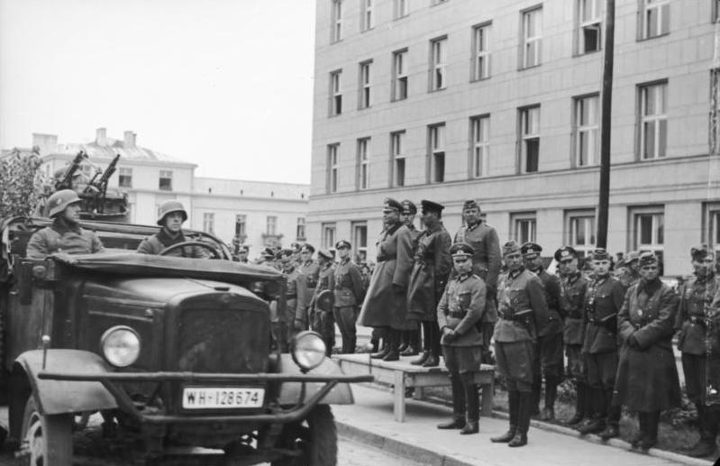
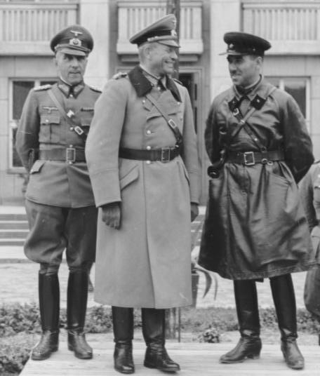

# SKUPNA VOJAŠKA PARADA WEHRMACHTA IN RDEČE ARMADE V BREST-LITOVSKU (22. SEPTEMBER 1939)
### *Zgodovinski video posnetki, arhivski viri in vizualni dokazi o neposrednem vojaškem sodelovanju med nacistično Nemčijo in Sovjetsko zvezo po skupnem napadu na Poljsko*

> 🌐 **Spletni ogled na GitHub Pages:**  
> **[https://bluzimir.github.io/karavla/videos_nemcija_rusija_brest_1939](https://bluzimir.github.io/karavla/videos_nemcija_rusija_brest_1939)**  
> 🔗 **Povezava na glavno stran dokumentacije:** [README.md](README.md) | **Povezava na poročilo o odgovorih:** [porocilo_odgovori_edvard.md](porocilo_odgovori_edvard.md#b-invazija-na-poljsko-in-sovjetska-agresija-17-septembra-1939)

---

## 1. UVOD IN ZGODOVINSKI POMEN DOGODKA

Eden najbolj nazornih, dokumentiranih in neizpodbitnih dokazov o tesnem zavezništvu ter operativnem vojaškem usklajevanju med Hitlerjevo Nemčijo in Stalinovo Sovjetsko zvezo je **skupna zmagovalna vojaška parada** (*Gemeinsame Siegesparade*), ki se je odvila **22. septembra 1939 v Brest-Litovsku** (današnji Brest v Belorusiji).

Ta zgodovinski dogodek je bil neposredna operativna izvedba določil **Pakta Molotov-Ribbentrop** z dne 23. avgusta 1939 in njegovega **tajnega dodatnega protokola**, s katerim sta si Berlin in Moskva vnaprej razdelila ozemlje neodvisne poljske države in interesne sfere v vzhodni Evropi.

### Ključna dejstva o paradi v Brestu:
* **Datum in lokacija:** Petek, 22. september 1939, osrednja mestna avenija v Brest-Litovsku.
* **Glavna poveljnika na častni tribuni:**
  * General nemških oklepnih sil **Heinz Guderian** (poveljnik XIX. motoriziranega korpusa Wehrmachta).
  * Kombrig **Semjon Moisejevič Krivošein** (*Semyon Krivoshein*, poveljnik 29. lahke tankovske brigade Rdeče armade).
* **Kontekst operacije:** Nemške sile so v prodoru proti vzhodu zavzele trdnjavo in mesto Brest. Ker pa je mesto po tajnih zemljevidih pakta ležalo vzhodno od dogovorjene demarkacijske črte na reki Bug (v sovjetski coni), so se nemške enote po podpisu formalnega sporazuma umaknile, mesto pa so z uradnim zmagovalnim mimohodom predale zavezniški Rdeči armadi.

---

## 2. ARHIVSKI FOTOGRAFSKI DOKAZI (BUNDESARCHIV)

Uradni fotografski oddelki nemške vojske (*Propagandakompanie - PK 689*) so dogodek podrobno ovekovečili. Izvirni negativi so danes del uradne zbirke **Nemškega zveznega arhiva v Koblenzu (Bundesarchiv)**:

### Fotografija 1: General Guderian in kombrig Krivošein na častni tribuni
  
*Vir: Bundesarchiv, Bild 101I-121-0011A-23 (Foto: Arthur Grimm, 22. september 1939).*  
*Opis: General Heinz Guderian (levo) in sovjetski brigadni poveljnik Semjon Krivošein (na sredini) na skupni slavnostni tribuni v Brest-Litovsku opazujeta mimohod vojaških enot. Ob njima stojijo nemški in sovjetski častniki v sproščenem, prijateljskem pogovoru.*

---

### Fotografija 2: Skupni mimohod nemških in sovjetskih sil
  
*Vir: Arhiv zgodovinskih fotografij Brest-Litovsk / Bundesarchiv Bild 101I-121-0011-20.*  
*Opis: Nemški motorizirani oddelki in pehota korakajo mimo častne tribune, medtem ko sovjetske tankovske enote čakajo na vstop v mesto. Na ulicah Bresta so bili postavljeni slavoloki, okrašeni s svastikami in rdečimi zvezdami ter portretoma Hitlerja in Stalina.*

---

## 3. ZGODOVINSKI VIDEO POSNETKI (ORIGINALNE FILMSKE KRONIKE)

Dogodek so na filmski trak posneli tako nemški kot sovjetski snemalci filmskih novic. Ti posnetki so desetletja veljali za enega najbolj neprijetnih vizualnih dokazov za sovjetsko zgodovinopisje, ki je skušalo zavezništvo s Hitlerjem zamolčati.

Spodaj so na voljo neposredne arhivske povezave in predvajalniki izvirnih posnetkov:

### Video 1: Uradni arhivski posnetek skupne parade (Brest-Litovsk, 22. 9. 1939)
Ta posnetek prikazuje celoten potek slovesnosti: usklajevanje poveljnikov, mimohod vojaških sil, rokovanje vojakov ter skupno spuščanje nemške in dviganje sovjetske zastave ob igranju obeh himn.

<iframe width="100%" height="480" src="https://www.youtube.com/embed/__Ztie1-v7s" title="German-Soviet military parade in Brest-Litovsk, 1939" frameborder="0" allowfullscreen></iframe>

* 🔗 **Neposredna povezava:** [Ogled na YouTube: German-Soviet military parade in Brest-Litovsk, 1939](https://www.youtube.com/watch?v=__Ztie1-v7s)
* **Ključni prizori v posnetku:**
  * **0:00 - 0:45:** Srečanje nemških in sovjetskih častnikov ter pregledovanje vojaških zemljevidov demarkacijske črte.
  * **0:45 - 1:30:** Guderian in Krivošein na dvignjeni leseni tribuni salutirata vojaškim kolonam.
  * **1:30 - 2:40:** Mimohod nemških poltovornjakov, motornih koles ter sovjetskih lahkih tankov T-26.
  * **2:40 - 3:20:** Nemški praporščaki spuščajo zastavo s kljukastim križem, sovjetski vojaki pa ob zvočni spremljavi vojaškega orkestra dvigajo rdečo zastavo s srpom in kladivom.

---

### Video 2: Nemški tednik Ufa-Tonwoche Nr. 473 (september 1939)
Uradna izdaja osrednjega nemškega zvočnega tednika (*UfA-Tonwoche*), objavljena konec septembra 1939, ki je nemškemu prebivalstvu v kinematografih predstavila uspešen zaključek »poljskega pohoda« in bratsko srečanje s silami Sovjetske zveze.

<iframe width="100%" height="480" src="https://www.youtube.com/embed/4-jhDNeIi7c" title="The German - Soviet Military Parade in Brest-Litovsk 1939" frameborder="0" allowfullscreen></iframe>

* 🔗 **Neposredna povezava:** [Ogled na YouTube: The German - Soviet Military Parade in Brest-Litovsk 1939](https://www.youtube.com/watch?v=4-jhDNeIi7c)
* 🏛️ **Arhivski vir na Internet Archive:** [*UfA-Tonwoche Nr. 473 (1939-09-21/27)*](https://archive.org/details/1939-09-21-UfA-Tonwoche-473)
* **Pomen posnetka:** Jasno dokazuje, da je nemško vodstvo dogodek v Brestu javno slavilo kot triumf skupnega zavezništva z Moskvo, ne pa kot sovražno srečanje.

---

### Video 3: Sovjetska filmska kronika (Centralni studio filmskih novic, 1939)
Odlomek iz uradnega sovjetskega propagandnega filma *»Osvoboditev Zahodne Belorusije in Zahodne Ukrajine«* (*Освобождение Западной Беларуси и Западной Украины*), posnetega oktobra 1939 s strani osrednjega filmskega studia v Moskvi.

<iframe width="100%" height="480" src="https://www.youtube.com/embed/gOOUVKfN2-0" title="Soviet-German parade in Brest - September 23, 1939" frameborder="0" allowfullscreen></iframe>

* 🔗 **Neposredna povezava:** [Ogled na YouTube: Soviet-German parade in Brest - September 23, 1939](https://www.youtube.com/watch?v=gOOUVKfN2-0)
* **Ključni prizori:** Prikaz prijateljskega druženja med rdečearmejci in vojaki Wehrmachta, izmenjava cigaret, smeh in skupni pogovori na oklepnikih.

---

### Video 4: Zavezniško slavje in delitev plena ob uničenju Poljske
Dokumentarni posnetki srečevanja patrulj obeh vojsk v osrednji Poljski (Brest, Bialystok, Lvov), kjer so si enote delile položaje, usklajevale topniške meje in predajale zajete poljske ujetnike.

<iframe width="100%" height="480" src="https://www.youtube.com/embed/x2uKJeVphy4" title="Nazi and Soviet officers meet in Poland 1939" frameborder="0" allowfullscreen></iframe>

* 🔗 **Neposredna povezava:** [Ogled na YouTube: Nazi and Soviet officers meet in Poland 1939](https://www.youtube.com/watch?v=x2uKJeVphy4)

---

## 4. FORMALNI DOKUMENT O PREDAJI MESTA

O tem, da ni šlo za spontano ali naključno srečanje dveh armad, priča uradno podpisan **dokument o predaji mesta Brest-Litovsk**, ki sta ga 21. septembra 1939 ob 24.00 sestavila in podpisala general Guderian in kombrig Krivošein.

V dokumentu (*Vereinbarung über die Übergabe der Stadt Brest-Litowsk*) je bilo dobesedno določeno:
1. Ob 14.00 dne 22. septembra 1939 se začne uradni mimohod nemških in sovjetskih sil pred poveljnikoma obeh strani.
2. Pred mimohodom se na osrednjem trgu izvede slovesna zamenjava zastav ob prisotnosti vojaških orkestrov.
3. Tehnične oklepne enote Rdeče armade nemudoma prevzamejo varovanje železniškega vozlišča, mostov in skladišč.
4. Za reševanje vseh morebitnih incidentov med vojaki se ustanovi skupna nemško-sovjetska mešana komisija.

---

## 5. SOOČENJE Z REVIZIONIZMOM V E-POŠTNI KORESPONDENCI

V razpravah, ki so potekale v e-poštni skupini Karavla (september 2026), je pošiljatelj **Boris** trdil naslednje:
> *»Stalin ni napadel Poljske ampak jo je šel previdno OSVOBAJAT!«*  
> *»Pakt Molotov-Ribbentrop je bil še najbolj pošten pakt...«*  
> *»Vsi so podpisovali pakte s Hitlerjem...«* (ob priloženi sliki `Hiteljevi pakti.jpg`)

Zgoraj prikazani video posnetki in arhivski dokumenti te trditve **v celoti in neizpodbitno demantirajo**:

| Trditev Borisa | Zgodovinska in vizualna realnost | Dokaz v video gradivu |
| :--- | :--- | :--- |
| *»Stalin je šel Poljsko le previdno osvobajat.«* | Rdeča armada je 17. septembra izvedla zahrbten napad na že tako borečo se Poljsko, nato pa z agresorjem Hitlerjem skupaj praznovala padec države. | Posnetki skupnega slavja, nazdravljanja in mimohoda enot z roko v roki. |
| *»Pakt je bil običajen pakt o nenapadanju.«* | Nobena druga država na svetu (ne Velika Britanija, ne Francija, ne Poljska) ni s Hitlerjem sklenila pakta o delitvi tujih držav niti ni izvajala skupnih zmagovalnih vojaških parad s svastiko. | Skupna tribuna generala Guderiana in kombriga Krivošeina. |
| *»Sovjeti niso bili zavezniki nacistov.«* | Med 23. avgustom 1939 in 22. junijem 1941 sta bili ZSSR in nacistična Nemčija de facto strateški in gospodarski zaveznici (Moskva je Berlinu dobavljala nafto, žito in rudo za napad na Francijo in Veliko Britanijo). | Uradni sporazum o predaji Bresta in Pogodba o meji in prijateljstvu (28. 9. 1939). |

Kot je v svojih odgovorih natančno in argumentirano opozoril **Edvard** (sporočilo #11 in #17), je bil pakt Molotov-Ribbentrop edinstven prav v svoji zločinski naravi – v tajnem dogovoru dveh totalitarizmov o uničenju sosednjih suverenih držav, kar je neposredno odprlo vrata drugi svetovni vojni in vsem njenim grozotam.

---

## 6. NAVIGACIJA PO DOKUMENTACIJI

* 🏠 **[Glavna stran dokumentacije (README.md)](README.md)**
* 🏛️ **[Poročilo o odgovorih Edvarda in zgodovinskih dejstvih](porocilo_odgovori_edvard.md)**
* 📊 **[Poročilo o sporočilih Borisa in ruski propagandi](porocilo_propaganda_boris.md)**
* 🔬 **[Kritična analiza članka »Boj med nacizmom in demokracijo«](analiza_clanka_boj_med_nacizmom_in_demokracijo.md)**
* 🌍 **[Vojna v Ukrajini: Štiri leta in pol ruske agresije in posledice](posledice_vojne_v_ukrajini.md)**
* 📨 **[Kronološko zbrana sporočila korespondence](zbrana_sporocila.md)**
