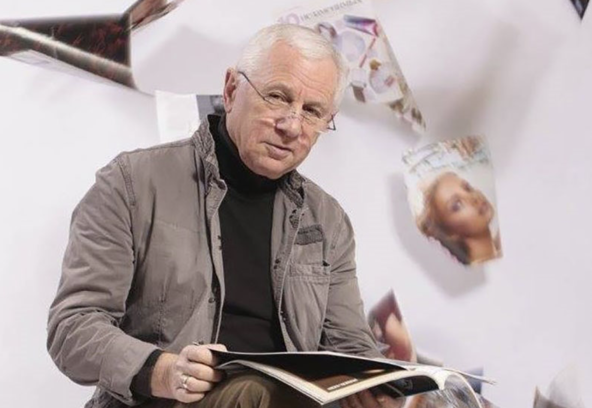

# ZAKAJ PUTIN NE MORE USTAVITI VOJNE V UKRAJINI
### *Odprto pismo pisatelja in režiserja Eduarda Topola ameriškemu predsedniku Donaldu Trumpu ter zgodovinska analiza kremeljske oblasti*

> 🌐 **Spletni ogled na GitHub Pages:**  
> **[https://bluzimir.github.io/karavla/zakaj_putin_ne_more_ustaviti_vojne_v_ukrajini](https://bluzimir.github.io/karavla/zakaj_putin_ne_more_ustaviti_vojne_v_ukrajini)**  
> 🔗 **Povezava na glavno stran dokumentacije:** [README.md](README.md) | **Povezava na posledice vojne:** [posledice_vojne_v_ukrajini.md](posledice_vojne_v_ukrajini.md)

---

  
  

    <strong>Eduard Topol (Edmond Topelberg)</strong> – mednarodno priznani rusko-ameriški pisatelj, scenarist in filmski režiser
  

---

  <h3 style="margin-top: 0; color: #ffffff; font-size: 1.3em;">📌 Osrednje sporočilo pisma</h3>
  

    Svetovno znani pisatelj in režiser <strong>Eduard Topol</strong> v odprtem pismu predsedniku ZDA razkriva ključno zgodovinsko zakonitost ruske oblasti: <strong>Vladimir Putin vojne v Ukrajini ne more ustaviti ne zato, ker ne bi hotel, ampak ker bi vrnitev oborožene vojske domov pomenila neizogiben propad njegovega režima</strong>.
  

---

## 1. BESEDILO ODPRTEGA PISMA EDUARDA TOPOLA DONALDU TRUMPU

*Dobro znani sovjetski in ruski filmski režiser in pisatelj **EDUARD TOPOL** (Edmond Topelberg) je pred napovedanim srečanjem z ruskim voditeljem naslovil neposredno odprto pismo ameriškemu predsedniku Donaldu Trumpu:*

> ### »Spoštovani gospod predsednik!  
> ### Spoštovani Donald!
> 
> Kot avtor petdesetih knjig in ducata filmov o Rusiji se imam za upravičenega, da vas obvestim pred vašim srečanjem s Putinom.
> 
> Vedeti morate, da **ne more ustaviti vojne z Ukrajino**, tudi če mu daste svojo vilo Mar-a-Lago na Palm Beachu, Trump Tower v New Yorku in ducat vaših golfskih klubov.
> 
> In ne zato, ker ne bi hotel vzeti odmora od vojne, ampak **ker ne more**.
> 
> Ker pozna rusko zgodovino ne iz učbenika Medinskega, ampak iz prave:
> 
> * **Vrnitev ruskih čet iz Evrope v Rusijo po zmagi nad Napoleonom** je privedla do proticsarskega upora dekabristov leta 1825.  
> * **Poraz Rusije v rusko-japonski vojni** je privedel do revolucije leta 1905.  
> * **Pobeg milijona ruskih vojakov z rusko-nemške fronte med prvo svetovno vojno** je privedel do abdikacije cesarja Nikolaja II. s prestola in februarske revolucije leta 1917.  
> * **Mir, ki ga je Lenin podpisal z Nemčijo**, je boljševikom omogočil, da so ustrelili celotno kraljevo družino.  
> * **Z vrnitvijo sovjetskih čet iz Afganistana februarja 1989** se je začel razpad ZSSR.
> 
> Ker to ve, Putin ne more končati vojne z Ukrajino in vrniti svojih čet domov.  
> 
> Samo možnost, da pusti skoraj celotno svojo vojsko v Evropi kot okupacijske čete maja 1945, je Stalinu pomagala, da se izogne povojnemu udaru.
> 
> Zato Putin sanja o okupaciji Ukrajine, pa tudi Baltika, Finske, Poljske itd., **da bi svojo vojsko držal stran od Moskve**.  
> 
> Spominja se, kako se je **525 tisoč vojakov**, ki so se vrnili iz Afganistana leta 1989, spremenilo v bandite-afganistance, ki so terorizirali celotno prebivalstvo ZSSR.  
> 
> In ve, kaj se bo zgodilo, če se **milijon in pol vojakov**, ki so sposobni profesionalno ubijati, ropati in posiljevati, vrne z ukrajinske fronte.
> 
> Vojna z Ukrajino je Putinu omogočila, da se znebi dveh milijonov svojih najbolj aktivnih nasprotnikov, ki jih je prisilil, da pobegnejo iz Rusije, ostale mlade ruske moške pa je bodisi poslal na fronto bodisi rekrutiral v kazenske službe.  
> 
> Danes je katera koli vojna – z Ukrajino, z Baltikom, z Natom – in s komerkoli drugim – **najboljši način, da prisili Rusijo, da se podredi Putinu in njegovi hunti**.
> 
> Žal vam noben od vaših svetovalcev tega ne bo razložil pred srečanjem s Putinom, vendar lahko moje argumente preverite pri Jacku Matlocku in Michaelu McFaulu.
> 
> Ne želim, da Putin, gangster, tat in morilec milijonov ljudi, še naprej drzno norčuje iz vas, laže in vara mojega predsednika.  
> 
> Seveda nisem vojaški strokovnjak ali politolog, ampak sem pisatelj z dobrim spominom.  
> 
> Spominjam se, kako so **Ronald Reagan, Margaret Thatcher in papež Janez Pavel II.** uspeli znižati ceno nafte na 9 dolarjev za sod, dali Afganistancem »Stingerje« in s tem ustavili moskovsko zavzetje Afganistana ter uničili ZSSR.
> 
> Če želite ustaviti Putina in imperialne ambicije vsaj polovice ruskega prebivalstva, morate narediti isto – **znižati ceno nafte vsaj na 25 dolarjev za sod in dati Ukrajini orožje, ki ji bo pomagalo zdrobiti agresorja**.
> 
> Kar zadeva vašo željo po vzpostavitvi ameriško-ruskih partnerskih poslovnih odnosov, ne v besedah, ampak v praksi, se to lahko zgodi čez sto let ali pa sploh nikoli.  
> 
> Če vas zanima zakaj, me pokličite, razložil bom.
> 
> S spoštovanjem,  
> **EDWARD TOPOLE**, državljan ZDA in Izraela.«

---

## 2. ZGODOVINSKA ANALIZA TOPOLOVIH TEZ

Argumentacija Eduarda Topola temelji na globokem poznavanju notranje dinamike ruskega imperija in sovjetskega režima:

### A. Ruska vojska kot grožnja lastnemu carju / diktatorju
Zgodovina ruskega imperija kaže stalni vzorec: ruske oblasti se najbolj bojijo lastnih vojakov, ko se ti vrnejo iz tujine ali ko doživijo zlom na fronti:
1. **Dekabristi (1825):** Mladi ruski častniki so po zmagi nad Napoleonom leta 1814–1815 videli svobodno in razvito Evropo. Po vrnitvi v Rusijo so ugotovili nevzdržnost carskega fevdalizma in tiranije ter decembra 1825 sprožili upor na Senatnem trgu v Sankt Peterburgu.
2. **Revolucija 1905:** Ponižujoč poraz carske armade in mornarice v vojni z Japonsko (Tsushima, Port Arthur) je sprožil prvo rusko revolucijo in prisilil Nikolaja II. v uvedbo parlamenta (Duma).
3. **Februarska revolucija 1917:** Utrujeni in obubožani vojaki so množično zapuščali jarke prve svetovne vojne, kar je v nekaj dneh odneslo tristoletno vladavino dinastije Romanov.
4. **Afganistanski zlom (1979–1989):** Vrnitev več kot pol milijona travmatiziranih vojakov iz Afganistana (*»afganci«*) v propadajoče sovjetsko gospodarstvo je pospešila razpad institucij ZSSR ter sprožila epidemijo organiziranega kriminala in mafijskih obračunov v 90. letih.

### B. Ukrajinska fronta: Vojska, ki se ne sme vrniti
Danes je na ukrajinskem bojišču na stotisoče ruskih vojakov, med katerimi so številni rekrutirani iz zaporov, kazenskih kolonij in najrevnejših provinc. Naučeni so surovega nasilja, ropanja in preživetja v kaosu.
* Če bi se ta armada vrnila v Rusijo brez prepričljive »zmage«, bi predstavljala **neposredno eksistencialno grožnjo Putinovi oblasti v Moskvi**.
* Nenehno vojno stanje je zato za Kremljev režim edini mehanizem preživetja: omogoča popolno militarizacijo družbe, izničenje opozicije, cenzuro ter pošiljanje potencialnih upornikov v smrt.

### C. Zgodovinski recept za zlom imperializma: Nafta in orožje
Topol opozarja na preverjen zgodovinski model Ronalda Reagana iz 80. let 20. stoletja:
* **Gospodarski pritisk:** Znižanje svetovnih cen energentov (glavni vir dohodka Kremlja za financiranje vojne mašinerije).
* **Tehnološka in vojaška premoč žrtve:** Dobava sodobnega orožja Ukrajini, ki onemogoča rusko napredovanje in agresorju vsili strateški poraz.

---

## 3. KDO JE EDVARD TOPOLA (EDWARD TOPOL)?

**Eduard Vladimirovič Topol** (rusko: *Эдуард Владимирович Тополь*, rojen kot **Edmond Topelberg**, *Эдмонд Топельберг*) je svetovno znani rusko-ameriški romanopisec, filmski režiser, novinar in scenarist.

  

    📖 <strong>Glavni biografski vir:</strong> <a href="https://en.wikipedia.org/wiki/Edward_Topol" target="_blank">Edward Topol – Wikipedia (angleška enciklopedija)</a>
  

### Življenjepis in izobraževanje
* **Rojstvo:** Rojen 8. oktobra 1938 v Bakuju (tedanja Azerbajdžanska SSR v Sovjetski zvezi).
* **Šolanje:** Diplomiral je na prestižnem **VGIK** (*Vsesovjetski državni inštitut za kinematografijo*) v Moskvi leta 1965, na smeri scenaristike.
* **Novinarsko delo:** V sovjetskem obdobju je deloval kot novinar za časopise *Bakinski raboči*, *Komsomolskaja pravda* ter številne literarne revije.

### Delo v Sovjetski zvezi
Pred odhodom na Zahod je bil Topol uveljavljen sovjetski scenarist. Napisal je scenarije za več priljubljenih sovjetskih celovečernih filmov, med njimi:
* *Mladi mornar severne flote* (*Юнга Северного флота*, 1973)
* *Ljubezen na prvi pogled* (*Любовь с первого взгляда*, 1977)
* *Odkritje* (*Открытие*, 1973)

### Emigracija v ZDA in mednarodni literarni preboj
Leta 1978 je zaradi sovjetske cenzure in antisemitizma emigriral v Združene države Amerike ter se ustalil v New Yorku. Postal je državljan ZDA in kasneje pridobil tudi izraelsko državljanstvo.

Na Zahodu je dosegel izjemen uspeh z vrsto političnih srhljivk, vohunskih romanov in zgodovinskih del, v katerih je z izjemno natančnostjo razkrival zakulisje delovanja Kremlja, KGB-ja in sovjetskega vojaškega aparata:
* **Rdeči trg (*Red Square*, 1983):** Svetovna uspešnica, prevedena v več kot 18 jezikov, prodana v večmilijonskih nakladah, v kateri je napovedal razpad sovjetskega sistema.
* **Podmornica U-137 (*Submarine U-137*):** Triler o incidentu s sovjetsko podmornico ob švedski obali.
* **Rdeči sneg (*Red Snow*), Zavezništvo (*The Alliance*), Kitajski marš (*The Chinese March*):** Vrhunska geopolitična leposlovna dela.
* **Romani o novodobni Rusiji:** *Moskovski let*, *Kremljevski ljubimci*, *Ljudski predsednik* in številni drugi romani, ki so analizirali vzpon oligarhov in Vladimirja Putina.

Kot režiser in scenarist je kasneje sodeloval pri številnih televizijskih serijah in filmih v ZDA in v postsovjetski Rusiji (npr. *Na robu*, *Montan*, *Mirgorod i ego obitateli*).

Zaradi svoje življenjske poti, osebne izkušnje z emigracijo in polstoletnega literarnega ustvarjanja o mehanizmih ruske oblasti velja Eduard Topol za enega najbolj lucidnih in avtentičnih analitikov kremeljske miselnosti.

---

## 4. POVEZAVA Z RAZPRAVO V SKUPINI KARAVLA

Objavljeno pismo Eduarda Topola ponuja neposredno razlago vprašanj, ki so se odprla v dopisni korespondenci:
* **Zavrnitev lažne teze o »obrambni naravi« ruske vojne:** Ruska agresija ni odgovor na nikakršno »ogroženost s strani Nata ali Ukrajine«, temveč notranjepolitični instrument tiranije za obvladovanje lastne populacije in preprečitev izgube oblasti.
* **Soočenje s propagando:** Ko zagovorniki Kremlja trdijo, da se Putin bori proti »nacizmu« ali »zahodnemu vplivu«, v resnici prikrivajo strah avtokrata pred lastno vojsko in neizogibnim zlomom diktature v primeru miru.

---

## 5. NAVIGACIJA PO DOKUMENTACIJI

* 🏠 **[Glavna stran dokumentacije (README.md)](README.md)**
* 🌍 **[Vojna v Ukrajini: Posledice agresije, kremeljske laži in grobovi](posledice_vojne_v_ukrajini.md)**
* 📊 **[Poročilo o sporočilih Borisa in ruski propagandi](porocilo_propaganda_boris.md)**
* 🏛️ **[Poročilo o odgovorih Edvarda in zgodovinskih dejstvih](porocilo_odgovori_edvard.md)**
* 🎬 **[Video posnetki skupne parade v Brest-Litovsku 1939](videos_nemcija_rusija_brest_1939.md)**
* 🔬 **[Kritična analiza članka »Boj med nacizmom in demokracijo«](analiza_clanka_boj_med_nacizmom_in_demokracijo.md)**
* 📨 **[Kronološko zbrana sporočila korespondence](zbrana_sporocila.md)**
