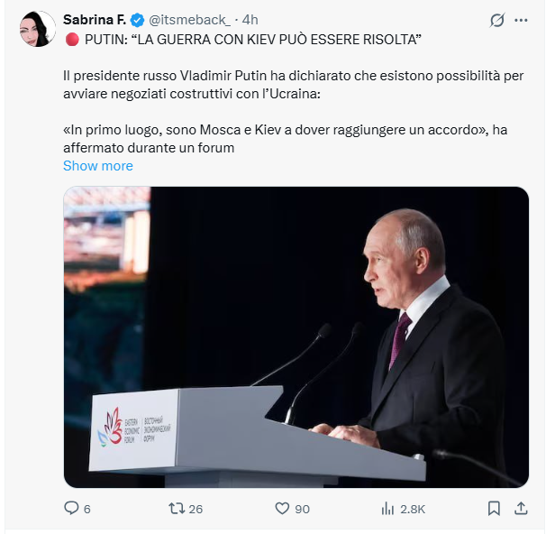
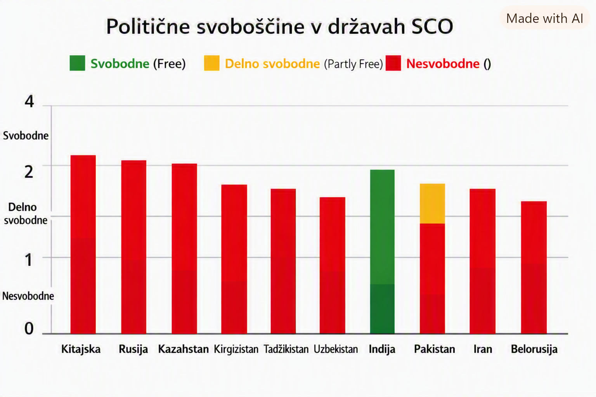
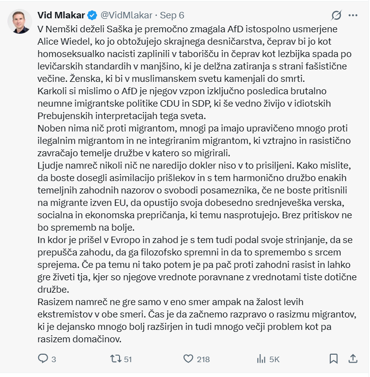

# ZBRANA E-POŠTNA SPOROČILA: BORIS, EDVARD IN JERNEJ (SEPTEMBER 2026)
### *Izvirna arhivirana e-poštna korespondenca z vsemi prilogami (urejeno po načelu: samo imena)*

> 📌 **Povezave do povezanih dokumentov:**
> * 🏠 **[Glavna stran in metodološki viri (README.md)](README.md)** *(spletni ogled: [bluzimir.github.io/karavla/](https://bluzimir.github.io/karavla/))*
> * 📄 **[Poročilo o sporočilih Borisa in ruski propagandi](porocilo_propaganda_boris.md)** *(spletni ogled: [bluzimir.github.io/karavla/porocilo_propaganda_boris](https://bluzimir.github.io/karavla/porocilo_propaganda_boris))*
> * 📄 **[Poročilo o odgovorih Edvarda in zgodovinskih dejstvih](porocilo_odgovori_edvard.md)** *(spletni ogled: [bluzimir.github.io/karavla/porocilo_odgovori_edvard](https://bluzimir.github.io/karavla/porocilo_odgovori_edvard))*
> * 🌐 **Spletni ogled celotne dokumentacije na GitHub Pages:** **[bluzimir.github.io/karavla/zbrana_sporocila](https://bluzimir.github.io/karavla/zbrana_sporocila)**

---

## 1. UVOD IN STRUKTURA KORESPONDENCE

Na tej strani je zbrana celotna, kronološko urejena izvirna e-poštna korespondenca med **Borisom**, **Edvardom** in **Jernejem** ter drugimi člani širše goriške kulturno-družbene dopisne skupine (*Karavlarji*) v obdobju med **3. in 12. septembrom 2026**.

V skladu z navodili in varovanjem zasebnosti so v vseh sporočilih uporabljena **izključno osebna imena** brez elektronskih naslovov ali osebnih kontaktnih podatkov:

* **Edvard** (sodelujoči / pobudnik faktografskega preverjanja)
* **Boris** (sodelujoči / zagovornik alternativnih narativov in posredovalec člankov)
* **Jernej** (sodelujoči / kritični komentator posredovanih propagandnih vsebin)
* Ostali prejemniki in naslovniki v skupini: **Darinka**, **Radovan**, **Boris Š.**, **Vinko**, **Bojana**, **Inga**, **Lucija**, **Svetlana**, **Uljana**, **Črtomir**.

---

## 2. KAZALO IN PREGLED VSEH PRILOG (ATTACHMENTS)

Vsa poslana gradiva in priponke so trajno shranjene v arhivu repozitorija v mapi [`priloge/`](priloge/) ter neposredno dostopne spodaj in ob vsakem posameznem sporočilu:

| Zap. št. | Datoteka priloge | Pošiljatelj | Sporočilo / Datum | Vsebina in pomen priloge | Povezava za ogled / prenos |
| :---: | :--- | :---: | :---: | :--- | :---: |
| 1 | `graf_house_of_freedom.png` | **Edvard** | #3 (7. 9. 2026, 06:53) | Primerjalni graf političnih in demokratičnih svoboščin v državah SCO (Freedom House). | [📄 Ogled slike](priloge/graf_house_of_freedom.png) |
| 2 | `Hiteljevi pakti.jpg` | **Boris** | #9 (9. 9. 2026, 20:51) | Preglednica predvojnih pogodb z nacistično Nemčijo za relativizacijo pakta Molotov-Ribbentrop. | [📄 Ogled slike](priloge/Hiteljevi%20pakti.jpg) |
| 3 | `edvard_5456_image.png` | **Edvard** | #15 (9. 9. 2026, 22:29) | Posnetek zaslona objave dr. Vida Mlakarja o volitvah v Nemčiji (Saška) in analizi AfD. | [📄 Ogled slike](priloge/edvard_5456_image.png) |
| 4 | `Primorski-Primorski-11_09_2026-22.pdf` | **Boris** | #27 (11. 9. 2026, 10:49) | Izvirna objava članka tržaškega občinskega svetnika Stefana Ukmarja v *Primorskem dnevniku* (*»Boj med nacizmom in demokracijo«*). | [📥 Prenos PDF](priloge/Primorski-Primorski-11_09_2026-22.pdf) |
| 5 | `edvard_5412_image.png` | **Edvard** | #2 (3. 9. 2026, 22:23) | Posnetek zaslona objave z izjavo V. Putina na gospodarskem forumu o pogajanjih. | [📄 Ogled slike](priloge/edvard_5412_image.png) |
| 6 | `edvard_5437_image001.png` | **Edvard** | #25 ref (8. 9. 2026) | Naslovnica knjige Slavenke Drakulić *»Kako smo preživeli komunizem in se celo smejali«*. | [📄 Ogled slike](priloge/edvard_5437_image001.png) |

---

## 3. KRONOLOŠKO KAZALO VSEH SPOROČIL (HITRI SKOKI)

| Št. | Datum in ura | Pošiljatelj | Zadeva | Priloge | Skok na vsebino |
| :---: | :--- | :---: | :--- | :---: | :---: |
| **#1** | 03. 09. 2026, 22:12 | **Edvard** | Rusi nimajo izgub v ukrajini ! ( samo Ruski v... | — | [Pojdi na sporočilo](#sporocilo-1) |
| **#2** | 03. 09. 2026, 22:23 | **Edvard** | Obetavno, morda se bližamo koncu vojne v Ukra... | 📎 Da | [Pojdi na sporočilo](#sporocilo-2) |
| **#3** | 07. 09. 2026, 06:53 | **Edvard** | Re:  | 📎 Da | [Pojdi na sporočilo](#sporocilo-3) |
| **#4** | 07. 09. 2026, 10:35 | **Boris** | RE:  | — | [Pojdi na sporočilo](#sporocilo-4) |
| **#5** | 09. 09. 2026, 00:21 | **Edvard** | Re:  | — | [Pojdi na sporočilo](#sporocilo-5) |
| **#6** | 09. 09. 2026, 09:54 | **Boris** | RE:  | — | [Pojdi na sporočilo](#sporocilo-6) |
| **#7** | 09. 09. 2026, 11:42 | **Edvard** | Re:  | — | [Pojdi na sporočilo](#sporocilo-7) |
| **#8** | 09. 09. 2026, 20:39 | **Boris** | RE:  | — | [Pojdi na sporočilo](#sporocilo-8) |
| **#9** | 09. 09. 2026, 20:51 | **Boris** | RE:  | 📎 Da | [Pojdi na sporočilo](#sporocilo-9) |
| **#10** | 09. 09. 2026, 21:10 | **Edvard** | Re:  | — | [Pojdi na sporočilo](#sporocilo-10) |
| **#11** | 09. 09. 2026, 22:01 | **Boris** | RE:  | — | [Pojdi na sporočilo](#sporocilo-11) |
| **#12** | 09. 09. 2026, 22:13 | **Edvard** | Re:  | — | [Pojdi na sporočilo](#sporocilo-12) |
| **#13** | 09. 09. 2026, 22:23 | **Edvard** | O skorumpirani in navidezni zahodni demokraci... | — | [Pojdi na sporočilo](#sporocilo-13) |
| **#14** | 09. 09. 2026, 22:24 | **Boris** | RE:  | — | [Pojdi na sporočilo](#sporocilo-14) |
| **#15** | 09. 09. 2026, 22:29 | **Edvard** | Re: O skorumpirani in navidezni zahodni demok... | 📎 Da | [Pojdi na sporočilo](#sporocilo-15) |
| **#16** | 09. 09. 2026, 22:33 | **Edvard** | koalicijska pogodba sedanje vlade | — | [Pojdi na sporočilo](#sporocilo-16) |
| **#17** | 09. 09. 2026, 22:38 | **Boris** | RE:  | — | [Pojdi na sporočilo](#sporocilo-17) |
| **#18** | 09. 09. 2026, 23:46 | **Edvard** | Re:  | — | [Pojdi na sporočilo](#sporocilo-18) |
| **#19** | 09. 09. 2026, 23:55 | **Edvard** | Re:  | — | [Pojdi na sporočilo](#sporocilo-19) |
| **#20** | 10. 09. 2026, 09:16 | **Edvard** | Re:  | — | [Pojdi na sporočilo](#sporocilo-20) |
| **#21** | 10. 09. 2026, 09:28 | **Edvard** | Kaj narediti za hitrejši razvoj Slovenije ? | — | [Pojdi na sporočilo](#sporocilo-21) |
| **#22** | 10. 09. 2026, 10:49 | **Boris** | RE:  | — | [Pojdi na sporočilo](#sporocilo-22) |
| **#23** | 10. 09. 2026, 11:46 | **Edvard** | Re:  | — | [Pojdi na sporočilo](#sporocilo-23) |
| **#24** | 10. 09. 2026, 12:16 | **Edvard** | Re: Kaj narediti za hitrejši razvoj Slovenije... | — | [Pojdi na sporočilo](#sporocilo-24) |
| **#25** | 10. 09. 2026, 13:37 | **Edvard** | Re: Kaj narediti za hitrejši razvoj Slovenije... | — | [Pojdi na sporočilo](#sporocilo-25) |
| **#26** | 10. 09. 2026, 14:01 | **Edvard** | Re: Kaj narediti za hitrejši razvoj Slovenije... | — | [Pojdi na sporočilo](#sporocilo-26) |
| **#27** | 11. 09. 2026, 10:49 | **Boris** | EU podpira nacizem in ne demokracijo v Ukraji... | 📎 Da | [Pojdi na sporočilo](#sporocilo-27) |
| **#28** | 11. 09. 2026, 15:48 | **Jernej** | Re: EU podpira nacizem in ne demokracijo v Uk... | — | [Pojdi na sporočilo](#sporocilo-28) |
| **#29** | 11. 09. 2026, 16:36 | **Boris** | RE: EU podpira nacizem in ne demokracijo v Uk... | — | [Pojdi na sporočilo](#sporocilo-29) |
| **#30** | 11. 09. 2026, 16:52 | **Edvard** | Re: EU podpira nacizem in ne demokracijo v Uk... | — | [Pojdi na sporočilo](#sporocilo-30) |
| **#31** | 11. 09. 2026, 18:18 | **Boris** | RE: EU podpira nacizem in ne demokracijo v Uk... | — | [Pojdi na sporočilo](#sporocilo-31) |
| **#32** | 11. 09. 2026, 23:03 | **Edvard** | Re: EU podpira nacizem in ne demokracijo v Uk... | — | [Pojdi na sporočilo](#sporocilo-32) |
| **#33** | 11. 09. 2026, 23:28 | **Edvard** | Analiza  korespondence med Borisom in Edvardo... | — | [Pojdi na sporočilo](#sporocilo-33) |
| **#34** | 12. 09. 2026, 13:59 | **Jernej** | Re: EU podpira nacizem in ne demokracijo v Uk... | — | [Pojdi na sporočilo](#sporocilo-34) |

---

## 4. CELOTNA VSEBINA VSEH SPOROČIL

### Sporočilo #1 | Pošiljatelj: Edvard
* **Datum in ura:** Četrtek, 3. september 2026, ob 22:12 (CEST)
* **Pošiljatelj:** **Edvard**
* **Za (prejemniki):** Inga, Vinko, Radovan, Darinka, Črtomir, Boris Š., Edvard, Jernej, Bojana, Uljana
* **Zadeva:** `Rusi nimajo izgub v ukrajini ! ( samo Ruski vojaki ... )`
* **Priloge:** Brez

**Vsebina sporočila:**

> https://drive.google.com/file/d/1uMpSwVi-02H6gYq5hIFZZXNEpwzM3Kud/view?usp=sharing
> 
> lp Edvard

[⬆ Nazaj na kazalo sporočil](#3-kronološko-kazalo-vseh-sporočil-hitri-skoki)

---

### Sporočilo #2 | Pošiljatelj: Edvard
* **Datum in ura:** Četrtek, 3. september 2026, ob 22:23 (CEST)
* **Pošiljatelj:** **Edvard**
* **Za (prejemniki):** Inga, Vinko, Radovan, Darinka, Črtomir, Boris Š., Edvard, Jernej, Bojana, Uljana
* **Zadeva:** `Obetavno, morda se bližamo koncu vojne v Ukrajini ( objava na X-u)`
* 📎 **Priloge:** [`edvard_5412_image.png`](priloge/edvard_5412_image.png)

**Vsebina sporočila:**

> [image: image.png]
> 
> 
> 🔴 PUTIN: »VOJNA Z KIJEVOM SE LAHKO REŠI«Ruski predsednik Vladimir Putin je
> izjavil, da obstajajo možnosti za začetek konstruktivnih pogajanj z
> Ukrajino:»Najprej morata Moskva in Kijev doseči dogovor,« je dejal med
> gospodarskim forumom v Rusiji.Putin se je zahvalil državam, ki poskušajo
> prispevati k rešitvi konflikta, poudaril vlogo Kitajske, »vedno pozorne na
> potrebo po mirni rešitvi«, in kot pozitivno označil tudi dialog z ZDA.Po
> Putinu pa grožnje Volodimirja Zelenskega, da bi z napadi z droni »popolnoma
> negotovo naredil ruski zračni prostor za civilne lete«, otežujejo pot do
> rešitve.Ruski predsednik je te grožnje označil kot »državni terorizem« in
> dodal, da Moskva ohranja stike s Kijevom prek obveščevalnih služb.

> 🖼️ **Priložena slika (`edvard_5412_image.png`):**  
> 

[⬆ Nazaj na kazalo sporočil](#3-kronološko-kazalo-vseh-sporočil-hitri-skoki)

---

### Sporočilo #3 | Pošiljatelj: Edvard
* **Datum in ura:** Ponedeljek, 7. september 2026, ob 06:53 (CEST)
* **Pošiljatelj:** **Edvard**
* **Za (prejemniki):** Darinka
* **Kp (v vednost):** Radovan, Boris Š., Boris, Vinko, Bojana, Jernej, Inga, Lucija, Svetlana, Uljana
* **Zadeva:** `Re: `
* 📎 **Priloge:** [`graf_house_of_freedom.png`](priloge/graf_house_of_freedom.png)

**Vsebina sporočila:**

> samo tole bom tukaj pustil.
> 
> A bi si želeli biti v družbi avtokratskih držav, ki zatirajo svoboščine.
> 
> lp Edvard
> 
> V V pon., 7. sep. 2026 ob 00:46 je oseba Darinka Kozinc 
> Darinka napisala:
> 
> > Uroš lipušček, posredujem, lpd
> >
> > Od Blejskega foruma do Šanghaja: svet se premika v multipolarno ureditev
> > Medtem ko so na Blejskem strateškem forumu razpravljali o moči
> > soustvarjanja prihodnosti – verjetno so organizatorji pod tem naslovom
> > mislili na to, v kolikšni meri lahko manjše evropske države prispevajo k
> > razvoju Evrope in sveta –, so na zasedanju tako imenovane Šanghajske
> > organizacije za sodelovanje (SCO) v Kirgistanu, ki uradno združuje deset
> > azijskih držav, začeli razpravo o čimprejšnji uveljavitvi nastajajočega
> > multipolarnega mednarodnega sistema, ki naj bi zmanjšal politično, finančno
> > in strateško prevlado ZDA in Zahoda.
> > O omenjenem srečanju na vrhu te pomembne organizacije zahodni, pa tudi
> > naši mediji skorajda niso poročali. Priče smo bili skoraj popolni cenzuri
> > tega dogodka, čeprav so se na njem zbrali najvišji predstavniki okoli 40 %
> > svetovnega prebivalstva.
> > Pomen Blejskega strateškega foruma postaja postopoma večji zaradi
> > naraščajoče krize v EU. Eden od tujih diplomatov, ki so se ga je udeležil,
> > meni, da daje dober uvid v stanje v Uniji. Po njegovem mnenju je pokazal
> > vse večje politične razpoke, kar zadeva Slovenijo, pa je potrdil, da nova
> > slovenska vlada daje izrazito prednost sodelovanju z ZDA in Izraelom na
> > škodo EU, kljub temu da naraščajo strateška nesoglasja med ZDA in EU.
> > Po drugi strani je zasedanje Šanghajske organizacije za sodelovanje
> > potrdilo vse večjo enotnost pa tudi odločenost za skupno akcijo. SCO je bil
> > generalka za zasedanje na vrhu mnogo širšega gospodarskega združenja držav
> > svetovnega juga, znanega pod kratico BRICS, ki se bo začelo sredi meseca v
> > Indiji. Na njegovem dnevnem redu bo pospešena uveljavitev novega plačilnega
> > sistema, ki naj bi končal monopol ameriškega sistema za finančne poravnave
> > SWIFT, s tem pa tudi prevlado dolarja, v katerem poteka večina plačil v
> > svetovni trgovini.
> > Zahodni analitiki Šanghajsko organizacijo za sodelovanje večinoma
> > označujejo za vzhodni NATO, ker so v njegovem ospredju predvsem vprašanja
> > varnosti. V bistvu ima omenjena organizacija, ki ji dajejo največji pečat
> > Kitajska, Rusija in Indija, podobno vlogo, kot naj bi jo imela Organizacija
> > za varnost in sodelovanje v Evropi – OVSE –, ki je od začetka vojne v
> > Ukrajini povsem na stranskem tiru.
> > Na tokratnem srečanju te organizacije, ki so se ga med drugim udeležili
> > najvišji voditelji Kitajske, Rusije, Indije, Irana itd., je potekala
> > razprava tudi o vojni v Iranu, ki ima zaradi blokade Hormuške ožine in s
> > tem povezanega izvoza nafte iz Perzijskega zaliva hude posledice za
> > mednarodno gospodarstvo. Pomemben dosežek vrha je bil skupna obsodba
> > agresije na Iran, ki se ji je tokrat prvič pridružila tudi Indija. Propadli
> > so tudi poskusi, da bi zaradi vojne v Ukrajini, izolirali Putina.
> > Blokada Hormuške ožine je povzročila, padec ameriških strateških zalog
> > nafte, na najnižjo raven po drugi svetovni vojni oziroma na 25 do 40 dni
> > potrošnje. Nadaljevanje blokade zato ne napoveduje samo bistveno višjih cen
> > nafte na svetovnem tržišču, temveč v nekaj mesecih tudi hudo pomanjkanje
> > tega najpomembnejšega svetovnega energenta, posebej dizla in letalskega
> > goriva.
> > Iran, ki je član Šanghajske organizacije za sodelovanje, je kljub
> > naraščajočemu pritisku ZDA, na zasedanju SCO dobil polno podporo članic,
> > zlasti Kitajske in Rusije, ki sta odločno zavrnili najnovejšo zahtevo
> > Trumpove administracije za prepoved kakršne koli trgovine ali sodelovanja z
> > Iranom. Ameriške sankcije so zavrnile tudi druge države udeleženke
> > zasedanja, čeprav so v Washingtonu zagrozili, da bodo proti vsem državam,
> > ki ne bodo spoštovale te ameriške zahteve, uvedli ostre sekundarne sankcije.
> > Rusije, ki praktično nima več trgovine z ZDA, ta ukrep ne bo prizadel.
> > Kitajske pa v Washingtonu tokrat ne bodo niti poskušali kaznovati, ker bi v
> > tem primeru verjetno odpadlo tudi napovedano srečanje med ameriškim
> > predsednikom Trumpom in kitajskim predsednikom Ši Džinpingom sredi tega
> > meseca v ZDA, poleg tega bi lahko Kitajska ustavila izvoz redkih kovin
> > oziroma rudnin v ZDA, ki so ključnega pomena za vojaško industrijo in
> > proizvodnjo čipov. Ameriška industrija uvozi več kot 80 odstotkov teh
> > rudnin iz Kitajske.
> > Časi, ko so ZDA lahko po mili volji narekovale pravila igre in odločale o
> > usodi številnih držav, so očitno mimo. Zadnji vrh Šanghajske organizacije
> > za sodelovanje v Kirgistanu, je potrdil, da azijske države takoimenovanega
> > globalnega svetovnega juga težijo k oblikovanju razpršene multipolarne
> > ureditve, ki bo zamenjala dosedanjo dominacijo Zahoda v mednarodnih odnosih.
> > Članice Šanghajske organizacije za sodelovanje in skupine BRICS niso
> > monolitni blok. Indija ima na primer v nekaterih pomembnih vprašanjih
> > stališča, ki so bližja ameriškim kot kitajskim ali ruskim. Po eni strani to
> > zavira skupne akcije, po drugi strani pa kaže na pluralizem in spoštovanje
> > različnih interesov.
> > Glede na vse bolj ekstremistično Trumpovo politiko, ki škodi tudi Indiji
> > in dejstva, da Indija večino nafte uvaža iz Rusije, je jasno, da indijski
> > premier Modi ne more več vztrajati pri posredni podpori ZDA oziroma
> > Izraelu.
> > Najnovejše zasedanje te organizacije, ki mu je dal največji pečat
> > energični nastop kitajskega predsednika Ši Džinpinga, je pokazalo, da se
> > težišče svetovne politike in gospodarstva vse bolj premika proti Aziji in
> > Evraziji. Vse večja je nevarnost, da bo EU ostala ujeta med ameriško
> > hegemonijo in skupino držav svetovnega juga, ki si prizadevajo za
> > uveljavitev multipolarnega sveta.
> > Odločitev za dolgoročno sodelovanje z državami BRICS, ki bi prekinilo
> > vazalni odnos Evrope do ZDA, bo brez dvoma glavno strateško vprašanje
> > Evrope v naslednjem desetletju. Dejstvo, da je ameriški predsednik Trump v
> > najnovejšem izpadu napovedal, da bo od Evrope zahteval poplačilo za vse
> > orožje, ki so ga ZDA doslej dobavile Ukrajini, kaže da bo do kraha v
> > medsebojnih odnosih prišlo mnogo prej kot je bilo pričakovati.
> >

> 🖼️ **Priložena slika (`graf_house_of_freedom.png`):**  
> 

[⬆ Nazaj na kazalo sporočil](#3-kronološko-kazalo-vseh-sporočil-hitri-skoki)

---

### Sporočilo #4 | Pošiljatelj: Boris
* **Datum in ura:** Ponedeljek, 7. september 2026, ob 10:35 (CEST)
* **Pošiljatelj:** **Boris**
* **Za (prejemniki):** Edvard, Darinka
* **Kp (v vednost):** Radovan, Boris Š., Vinko, Bojana, Jernej, Inga, Lucija, Svetlana, Uljana
* **Zadeva:** `RE: `
* **Priloge:** Brez

**Vsebina sporočila:**

> Edi , 
> 
> 95% ljudi zanima razvoj, kruh, varnost in prav malo skorupirana in navidezna zahodna demokracija, ki dela same vojne po svetu!
> Zadnji dokaz- volitve v Sachen-Anhalt. Razmere tam poznam dobro, ker sem tam vsako leto in s temi ljudmi vzdržujem stike. Živeli so pod strahovlado SZ in sedaj AfDjevi hodijo okrog z rusko zastavo- seveda v protest, ker so ameriška kolonija. Od ZDA je Nemčija  dobili veliko do leta 1990 in od  tedaj je vedno večja kolonija ZDA, ki bodo Nemčijo še kako izkoriščale. Tega se Nemci danes zavedajo!
> Boris

📜 <i>Kliknite za ogled predhodno citiranega besedila v tem sporočilu</i>

 

> From: Edvard Grmadnik Edvard 
> Sent: Monday, September 7, 2026 6:54 AM
> To: Darinka Kozinc Darinka
> Cc: Radovan Radovan; Boris Boris Š.; boris nemec Boris; STUDIO TORKAR D.O.O. Vinko; bojana kompare Bojana; Jernej Jernej; Inga Brezigar Inga; Lucija Mozetič Lucija; Svetlana Lipužič Svetlana; Uljana Gruntar Uljana
> Subject: Re:
> 
>  
> 
> samo tole bom tukaj pustil.
> 
>  
> 
> A bi si želeli biti v družbi avtokratskih držav, ki zatirajo svoboščine.
> 
>  
> 
> lp Edvard
> 
>  
> 
> V V pon., 7. sep. 2026 ob 00:46 je Darinka Kozinc Darinka   napisal(a):
> 
> Uroš lipušček, posredujem, lpd
> 
>  
> 
> Od Blejskega foruma do Šanghaja: svet se premika v multipolarno ureditev
> 
> Medtem ko so na Blejskem strateškem forumu razpravljali o moči soustvarjanja prihodnosti – verjetno so organizatorji pod tem naslovom mislili na to, v kolikšni meri lahko manjše evropske države prispevajo k razvoju Evrope in sveta –, so na zasedanju tako imenovane Šanghajske organizacije za sodelovanje (SCO) v Kirgistanu, ki uradno združuje deset azijskih držav, začeli razpravo o čimprejšnji uveljavitvi nastajajočega multipolarnega mednarodnega sistema, ki naj bi zmanjšal politično, finančno in strateško prevlado ZDA in Zahoda.
> 
> O omenjenem srečanju na vrhu te pomembne organizacije zahodni, pa tudi naši mediji skorajda niso poročali. Priče smo bili skoraj popolni cenzuri tega dogodka, čeprav so se na njem zbrali najvišji predstavniki okoli 40 % svetovnega prebivalstva.
> 
> Pomen Blejskega strateškega foruma postaja postopoma večji zaradi naraščajoče krize v EU. Eden od tujih diplomatov, ki so se ga je udeležil, meni, da daje dober uvid v stanje v Uniji. Po njegovem mnenju je pokazal vse večje politične razpoke, kar zadeva Slovenijo, pa je potrdil, da nova slovenska vlada daje izrazito prednost sodelovanju z ZDA in Izraelom na škodo EU, kljub temu da naraščajo strateška nesoglasja med ZDA in EU.
> 
> Po drugi strani je zasedanje Šanghajske organizacije za sodelovanje potrdilo vse večjo enotnost pa tudi odločenost za skupno akcijo. SCO je bil generalka za zasedanje na vrhu mnogo širšega gospodarskega združenja držav svetovnega juga, znanega pod kratico BRICS, ki se bo začelo sredi meseca v Indiji. Na njegovem dnevnem redu bo pospešena uveljavitev novega plačilnega sistema, ki naj bi končal monopol ameriškega sistema za finančne poravnave SWIFT, s tem pa tudi prevlado dolarja, v katerem poteka večina plačil v svetovni trgovini.
> 
> Zahodni analitiki Šanghajsko organizacijo za sodelovanje večinoma označujejo za vzhodni NATO, ker so v njegovem ospredju predvsem vprašanja varnosti. V bistvu ima omenjena organizacija, ki ji dajejo največji pečat Kitajska, Rusija in Indija, podobno vlogo, kot naj bi jo imela Organizacija za varnost in sodelovanje v Evropi – OVSE –, ki je od začetka vojne v Ukrajini povsem na stranskem tiru.
> 
> Na tokratnem srečanju te organizacije, ki so se ga med drugim udeležili najvišji voditelji Kitajske, Rusije, Indije, Irana itd., je potekala razprava tudi o vojni v Iranu, ki ima zaradi blokade Hormuške ožine in s tem povezanega izvoza nafte iz Perzijskega zaliva hude posledice za mednarodno gospodarstvo. Pomemben dosežek vrha je bil skupna obsodba agresije na Iran, ki se ji je tokrat prvič pridružila tudi Indija. Propadli so tudi poskusi, da bi zaradi vojne v Ukrajini, izolirali Putina. 
> 
> Blokada Hormuške ožine je povzročila, padec ameriških strateških zalog nafte, na najnižjo raven po drugi svetovni vojni oziroma na 25 do 40 dni potrošnje. Nadaljevanje blokade zato ne napoveduje samo bistveno višjih cen nafte na svetovnem tržišču, temveč v nekaj mesecih tudi hudo pomanjkanje tega najpomembnejšega svetovnega energenta, posebej dizla in letalskega goriva.
> 
> Iran, ki je član Šanghajske organizacije za sodelovanje, je kljub naraščajočemu pritisku ZDA, na zasedanju SCO dobil polno podporo članic, zlasti Kitajske in Rusije, ki sta odločno zavrnili najnovejšo zahtevo Trumpove administracije za prepoved kakršne koli trgovine ali sodelovanja z Iranom. Ameriške sankcije so zavrnile tudi druge države udeleženke zasedanja, čeprav so v Washingtonu zagrozili, da bodo proti vsem državam, ki ne bodo spoštovale te ameriške zahteve, uvedli ostre sekundarne sankcije.
> 
> Rusije, ki praktično nima več trgovine z ZDA, ta ukrep ne bo prizadel. Kitajske pa v Washingtonu tokrat ne bodo niti poskušali kaznovati, ker bi v tem primeru verjetno odpadlo tudi napovedano srečanje med ameriškim predsednikom Trumpom in kitajskim predsednikom Ši Džinpingom sredi tega meseca v ZDA, poleg tega bi lahko Kitajska ustavila izvoz redkih kovin oziroma rudnin v ZDA, ki so ključnega pomena za vojaško industrijo in proizvodnjo čipov. Ameriška industrija uvozi več kot 80 odstotkov teh rudnin iz Kitajske.
> 
> Časi, ko so ZDA lahko po mili volji narekovale pravila igre in odločale o usodi številnih držav, so očitno mimo. Zadnji vrh Šanghajske organizacije za sodelovanje v Kirgistanu, je potrdil, da azijske države takoimenovanega globalnega svetovnega juga težijo k oblikovanju razpršene multipolarne ureditve, ki bo zamenjala dosedanjo dominacijo Zahoda v mednarodnih odnosih.
> 
> Članice Šanghajske organizacije za sodelovanje in skupine BRICS niso monolitni blok. Indija ima na primer v nekaterih pomembnih vprašanjih stališča, ki so bližja ameriškim kot kitajskim ali ruskim. Po eni strani to zavira skupne akcije, po drugi strani pa kaže na pluralizem in spoštovanje različnih interesov.
> 
> Glede na vse bolj ekstremistično Trumpovo politiko, ki škodi tudi Indiji in dejstva, da Indija večino nafte uvaža iz Rusije, je jasno, da indijski premier Modi ne more več vztrajati pri posredni podpori ZDA oziroma Izraelu. 
> 
> Najnovejše zasedanje te organizacije, ki mu je dal največji pečat energični nastop kitajskega predsednika Ši Džinpinga, je pokazalo, da se težišče svetovne politike in gospodarstva vse bolj premika proti Aziji in Evraziji. Vse večja je nevarnost, da bo EU ostala ujeta med ameriško hegemonijo in skupino držav svetovnega juga, ki si prizadevajo za uveljavitev multipolarnega sveta.
> 
> Odločitev za dolgoročno sodelovanje z državami BRICS, ki bi prekinilo vazalni odnos Evrope do ZDA, bo brez dvoma glavno strateško vprašanje Evrope v naslednjem desetletju. Dejstvo, da je ameriški predsednik Trump v najnovejšem izpadu napovedal, da bo od Evrope zahteval poplačilo za vse orožje, ki so ga ZDA doslej dobavile Ukrajini, kaže da bo do kraha v medsebojnih odnosih prišlo mnogo prej kot je bilo pričakovati.

[⬆ Nazaj na kazalo sporočil](#3-kronološko-kazalo-vseh-sporočil-hitri-skoki)

---

### Sporočilo #5 | Pošiljatelj: Edvard
* **Datum in ura:** Sreda, 9. september 2026, ob 00:21 (CEST)
* **Pošiljatelj:** **Edvard**
* **Za (prejemniki):** Boris
* **Kp (v vednost):** Darinka, Radovan, Boris Š., Vinko, Bojana, Jernej, Inga, Lucija, Svetlana, Uljana
* **Zadeva:** `Re: `
* **Priloge:** Brez

**Vsebina sporočila:**

> Afd je pridobil v Nemčiji  predvsem zaradi neumne migracijske politike
> prejšnjih vlad, v manjši meri do ameriškega vpliva.
> Je proti globalistom in zagovarja nacionalno nemško avtonomijo.
> AfD podpira "nacionalni kapital" , podobno kot Trumpov slogan "America
> First".
> 
> lp Edvard
> 
> 
> 
> 
> 
> V V pon., 7. sep. 2026 ob 10:36 je Boris napisal(a):
> 
> > Edi ,
> >
> > 95% ljudi zanima razvoj, kruh, varnost in prav malo skorupirana in
> > navidezna zahodna demokracija, ki dela same vojne po svetu!
> > Zadnji dokaz- volitve v Sachen-Anhalt. Razmere tam poznam dobro, ker sem
> > tam vsako leto in s temi ljudmi vzdržujem stike. Živeli so pod strahovlado
> > SZ in sedaj AfDjevi hodijo okrog z rusko zastavo- seveda v protest, ker so
> > ameriška kolonija. Od ZDA je Nemčija  dobili veliko do leta 1990 in od
> >  tedaj je vedno večja kolonija ZDA, ki bodo Nemčijo še kako izkoriščale.
> > Tega se Nemci danes zavedajo!
> > Boris
> >
> >
> >
> > *From:* Edvard Grmadnik Edvard
> > *Sent:* Monday, September 7, 2026 6:54 AM
> > *To:* Darinka Kozinc Darinka
> > *Cc:* Radovan Radovan; Boris Boris Š.;
> > boris nemec Boris; STUDIO TORKAR D.O.O. 
>  Vinko>; bojana kompare Bojana;
> > Jernej Jernej; Inga Brezigar Inga;
> > Lucija Mozetič Lucija; Svetlana Lipužič 
>  Svetlana>; Uljana Gruntar Uljana
> > *Subject:* Re:
> >
> >
> >
> > samo tole bom tukaj pustil.
> >
> >
> >
> > A bi si želeli biti v družbi avtokratskih držav, ki zatirajo svoboščine.
> >
> >
> >
> > lp Edvard
> >
> >
> >
> > V V pon., 7. sep. 2026 ob 00:46 je oseba Darinka Kozinc 
>  Darinka> napisala:
> >
> > Uroš lipušček, posredujem, lpd
> >
> >
> >
> > Od Blejskega foruma do Šanghaja: svet se premika v multipolarno ureditev
> >
> > Medtem ko so na Blejskem strateškem forumu razpravljali o moči
> > soustvarjanja prihodnosti – verjetno so organizatorji pod tem naslovom
> > mislili na to, v kolikšni meri lahko manjše evropske države prispevajo k
> > razvoju Evrope in sveta –, so na zasedanju tako imenovane Šanghajske
> > organizacije za sodelovanje (SCO) v Kirgistanu, ki uradno združuje deset
> > azijskih držav, začeli razpravo o čimprejšnji uveljavitvi nastajajočega
> > multipolarnega mednarodnega sistema, ki naj bi zmanjšal politično, finančno
> > in strateško prevlado ZDA in Zahoda.
> >
> > O omenjenem srečanju na vrhu te pomembne organizacije zahodni, pa tudi
> > naši mediji skorajda niso poročali. Priče smo bili skoraj popolni cenzuri
> > tega dogodka, čeprav so se na njem zbrali najvišji predstavniki okoli 40 %
> > svetovnega prebivalstva.
> >
> > Pomen Blejskega strateškega foruma postaja postopoma večji zaradi
> > naraščajoče krize v EU. Eden od tujih diplomatov, ki so se ga je udeležil,
> > meni, da daje dober uvid v stanje v Uniji. Po njegovem mnenju je pokazal
> > vse večje politične razpoke, kar zadeva Slovenijo, pa je potrdil, da nova
> > slovenska vlada daje izrazito prednost sodelovanju z ZDA in Izraelom na
> > škodo EU, kljub temu da naraščajo strateška nesoglasja med ZDA in EU.
> >
> > Po drugi strani je zasedanje Šanghajske organizacije za sodelovanje
> > potrdilo vse večjo enotnost pa tudi odločenost za skupno akcijo. SCO je bil
> > generalka za zasedanje na vrhu mnogo širšega gospodarskega združenja držav
> > svetovnega juga, znanega pod kratico BRICS, ki se bo začelo sredi meseca v
> > Indiji. Na njegovem dnevnem redu bo pospešena uveljavitev novega plačilnega
> > sistema, ki naj bi končal monopol ameriškega sistema za finančne poravnave
> > SWIFT, s tem pa tudi prevlado dolarja, v katerem poteka večina plačil v
> > svetovni trgovini.
> >
> > Zahodni analitiki Šanghajsko organizacijo za sodelovanje večinoma
> > označujejo za vzhodni NATO, ker so v njegovem ospredju predvsem vprašanja
> > varnosti. V bistvu ima omenjena organizacija, ki ji dajejo največji pečat
> > Kitajska, Rusija in Indija, podobno vlogo, kot naj bi jo imela Organizacija
> > za varnost in sodelovanje v Evropi – OVSE –, ki je od začetka vojne v
> > Ukrajini povsem na stranskem tiru.
> >
> > Na tokratnem srečanju te organizacije, ki so se ga med drugim udeležili
> > najvišji voditelji Kitajske, Rusije, Indije, Irana itd., je potekala
> > razprava tudi o vojni v Iranu, ki ima zaradi blokade Hormuške ožine in s
> > tem povezanega izvoza nafte iz Perzijskega zaliva hude posledice za
> > mednarodno gospodarstvo. Pomemben dosežek vrha je bil skupna obsodba
> > agresije na Iran, ki se ji je tokrat prvič pridružila tudi Indija. Propadli
> > so tudi poskusi, da bi zaradi vojne v Ukrajini, izolirali Putina.
> >
> > Blokada Hormuške ožine je povzročila, padec ameriških strateških zalog
> > nafte, na najnižjo raven po drugi svetovni vojni oziroma na 25 do 40 dni
> > potrošnje. Nadaljevanje blokade zato ne napoveduje samo bistveno višjih cen
> > nafte na svetovnem tržišču, temveč v nekaj mesecih tudi hudo pomanjkanje
> > tega najpomembnejšega svetovnega energenta, posebej dizla in letalskega
> > goriva.
> >
> > Iran, ki je član Šanghajske organizacije za sodelovanje, je kljub
> > naraščajočemu pritisku ZDA, na zasedanju SCO dobil polno podporo članic,
> > zlasti Kitajske in Rusije, ki sta odločno zavrnili najnovejšo zahtevo
> > Trumpove administracije za prepoved kakršne koli trgovine ali sodelovanja z
> > Iranom. Ameriške sankcije so zavrnile tudi druge države udeleženke
> > zasedanja, čeprav so v Washingtonu zagrozili, da bodo proti vsem državam,
> > ki ne bodo spoštovale te ameriške zahteve, uvedli ostre sekundarne sankcije.
> >
> > Rusije, ki praktično nima več trgovine z ZDA, ta ukrep ne bo prizadel.
> > Kitajske pa v Washingtonu tokrat ne bodo niti poskušali kaznovati, ker bi v
> > tem primeru verjetno odpadlo tudi napovedano srečanje med ameriškim
> > predsednikom Trumpom in kitajskim predsednikom Ši Džinpingom sredi tega
> > meseca v ZDA, poleg tega bi lahko Kitajska ustavila izvoz redkih kovin
> > oziroma rudnin v ZDA, ki so ključnega pomena za vojaško industrijo in
> > proizvodnjo čipov. Ameriška industrija uvozi več kot 80 odstotkov teh
> > rudnin iz Kitajske.
> >
> > Časi, ko so ZDA lahko po mili volji narekovale pravila igre in odločale o
> > usodi številnih držav, so očitno mimo. Zadnji vrh Šanghajske organizacije
> > za sodelovanje v Kirgistanu, je potrdil, da azijske države takoimenovanega
> > globalnega svetovnega juga težijo k oblikovanju razpršene multipolarne
> > ureditve, ki bo zamenjala dosedanjo dominacijo Zahoda v mednarodnih odnosih.
> >
> > Članice Šanghajske organizacije za sodelovanje in skupine BRICS niso
> > monolitni blok. Indija ima na primer v nekaterih pomembnih vprašanjih
> > stališča, ki so bližja ameriškim kot kitajskim ali ruskim. Po eni strani to
> > zavira skupne akcije, po drugi strani pa kaže na pluralizem in spoštovanje
> > različnih interesov.
> >
> > Glede na vse bolj ekstremistično Trumpovo politiko, ki škodi tudi Indiji
> > in dejstva, da Indija večino nafte uvaža iz Rusije, je jasno, da indijski
> > premier Modi ne more več vztrajati pri posredni podpori ZDA oziroma
> > Izraelu.
> >
> > Najnovejše zasedanje te organizacije, ki mu je dal največji pečat
> > energični nastop kitajskega predsednika Ši Džinpinga, je pokazalo, da se
> > težišče svetovne politike in gospodarstva vse bolj premika proti Aziji in
> > Evraziji. Vse večja je nevarnost, da bo EU ostala ujeta med ameriško
> > hegemonijo in skupino držav svetovnega juga, ki si prizadevajo za
> > uveljavitev multipolarnega sveta.
> >
> > Odločitev za dolgoročno sodelovanje z državami BRICS, ki bi prekinilo
> > vazalni odnos Evrope do ZDA, bo brez dvoma glavno strateško vprašanje
> > Evrope v naslednjem desetletju. Dejstvo, da je ameriški predsednik Trump v
> > najnovejšem izpadu napovedal, da bo od Evrope zahteval poplačilo za vse
> > orožje, ki so ga ZDA doslej dobavile Ukrajini, kaže da bo do kraha v
> > medsebojnih odnosih prišlo mnogo prej kot je bilo pričakovati.
> >
> >

[⬆ Nazaj na kazalo sporočil](#3-kronološko-kazalo-vseh-sporočil-hitri-skoki)

---

### Sporočilo #6 | Pošiljatelj: Boris
* **Datum in ura:** Sreda, 9. september 2026, ob 09:54 (CEST)
* **Pošiljatelj:** **Boris**
* **Za (prejemniki):** Edvard
* **Kp (v vednost):** Darinka, Radovan, Boris Š., Vinko, Bojana, Jernej, Inga, Lucija, Svetlana, Uljana
* **Zadeva:** `RE: `
* **Priloge:** Brez

**Vsebina sporočila:**

> Spoštovani, 
> 
> dobro poznam Nemčijo in še posebej Turingijo in Sachsen-Anhalt, kjer sem vsako leto-Sangerhausen in okoli- že več ko 25 let ter vzdržujem številne stike. Pred dvema letoma so  na osrednjem Marktplatzu  Sangerhausna  demonstrirali tudi z ruskimi zastavami. Potem sem si drznil enega sprovocirati, da nosi zastavo Slovenije. Jezno je odgovoril, da je to ruska zastava. 
> Torej povem samo DEJSTVA, ki je mediji VSI po vrsti zamolčijo.
> 
> AfD in večina  pravi:
> 
> sedaj moramo dajati denar za orožje Kijevu , da se čim bolj uniči Ukrajino, potem pa bo Ukrajina v EU in bomo dajali denar za obnovo Ukrajine. Poleg tega nam jemljejo denar ,da se Nemčija oborožuje za spopad z Rusijo. 
> 
> Jemljejo nam od zdravstva , šolstva , penzij… 1,5 milijona Ukrajincev  pa uživa privilegije, ki jih moramo mi plačevati
> 
> VOJNE nočemo z Rusijo pač pa njihov poceni Plin in njihovo tržišče. TO JE BISTVO programa AfD , ki je 90% enak kot program CDU/CSU iz leta 2000. Tradicionalni volivci , ki so leta 2000 volili CDU/CSU sedaj volijo AfD-to so popolnoma normalni ljudje krščanskih vrednot- rahlo konservativni. 
> 
> Šele potem sledijo tisti, ki ne marajo muslimanov, češ da  jih je že preveč
> Šele potem pridejo tisti, ki pravijo: “ manj o Hitlerju in več o Bismarku”. TI hočejo povedati, da Nemci niso nič večji zločinci zaradi Hitlerja kot so bili Angleži, Francozi, ……. do njih po prvi vojni, v drugi vojni in do genocidov v Afriki, Avstraliji, Ameriki…….
> 
> Naj izpostavim samo uničenje Nordhuasna v Turingiji (  RAF bombardiranje 3-4 aprila!)- konec vojne v Turingiji 11.aprila 1945!! Kjer so popolnoma odprto-nebranjeno  mesto- popolnoma brez vojakov -nebranjeno NAMERNO  uničili do tal. Pobili so 8800 otrok, žena in starcev ( mladih ni bilo tam) ter 2000 političnih jetnikov iz cele Evrope ( med njimi tudi mojega očeta!!) . 
> 
> O teh barbarskih zločinih ANGLEŽEV danes Nemci ne smejo niti spregovoriti- ker dobijo takoj porcijo nazaj, kakšne zločine so počeli med drugo vojno.!
> 
>  Nemcem so vcepili v glavo: Vi ste zločinci, mi na Zahodu pa popolnoma nedolžni in sveti ter  vaši osvoboditelji in prinositelji demokracije. Na to vsiljeno paradigmo AfD ne pristaja. AfD o tem noče molčati in zato  naj bi bili po zahodnajško nacisti.
> 
> LP Boris

📜 <i>Kliknite za ogled predhodno citiranega besedila v tem sporočilu</i>

 

> From: Edvard Grmadnik Edvard 
> Sent: Wednesday, September 9, 2026 12:22 AM
> To: Boris
> Cc: Darinka Kozinc Darinka; Radovan Radovan; Boris Boris Š.; STUDIO TORKAR D.O.O. Vinko; bojana kompare Bojana; Jernej Jernej; Inga Brezigar Inga; Lucija Mozetič Lucija; Svetlana Lipužič Svetlana; Uljana Gruntar Uljana
> Subject: Re:
> 
>  
> 
> Afd je pridobil v Nemčiji  predvsem zaradi neumne migracijske politike prejšnjih vlad, v manjši meri do ameriškega vpliva.
> 
> Je proti globalistom in zagovarja nacionalno nemško avtonomijo.
> 
> AfD podpira "nacionalni kapital" , podobno kot Trumpov slogan "America First".
> 
>  
> 
> lp Edvard
> 
>  
> 
>  
> 
>  
> 
>  
> 
> V V pon., 7. sep. 2026 ob 10:36 je Boris   napisal(a):
> 
> Edi , 
> 
> 95% ljudi zanima razvoj, kruh, varnost in prav malo skorupirana in navidezna zahodna demokracija, ki dela same vojne po svetu!
> Zadnji dokaz- volitve v Sachen-Anhalt. Razmere tam poznam dobro, ker sem tam vsako leto in s temi ljudmi vzdržujem stike. Živeli so pod strahovlado SZ in sedaj AfDjevi hodijo okrog z rusko zastavo- seveda v protest, ker so ameriška kolonija. Od ZDA je Nemčija  dobili veliko do leta 1990 in od  tedaj je vedno večja kolonija ZDA, ki bodo Nemčijo še kako izkoriščale. Tega se Nemci danes zavedajo!
> Boris 
> 
>  
> 
> From: Edvard Grmadnik Edvard   
> Sent: Monday, September 7, 2026 6:54 AM
> To: Darinka Kozinc Darinka  
> Cc: Radovan Radovan  ; Boris Boris Š.  ; boris nemec Boris  ; STUDIO TORKAR D.O.O. Vinko  ; bojana kompare Bojana  ; Jernej Jernej  ; Inga Brezigar Inga  ; Lucija Mozetič Lucija  ; Svetlana Lipužič Svetlana  ; Uljana Gruntar Uljana  
> Subject: Re:
> 
>  
> 
> samo tole bom tukaj pustil.
> 
>  
> 
> A bi si želeli biti v družbi avtokratskih držav, ki zatirajo svoboščine.
> 
>  
> 
> lp Edvard
> 
>  
> 
> V V pon., 7. sep. 2026 ob 00:46 je Darinka Kozinc Darinka   napisal(a):
> 
> Uroš lipušček, posredujem, lpd
> 
>  
> 
> Od Blejskega foruma do Šanghaja: svet se premika v multipolarno ureditev
> 
> Medtem ko so na Blejskem strateškem forumu razpravljali o moči soustvarjanja prihodnosti – verjetno so organizatorji pod tem naslovom mislili na to, v kolikšni meri lahko manjše evropske države prispevajo k razvoju Evrope in sveta –, so na zasedanju tako imenovane Šanghajske organizacije za sodelovanje (SCO) v Kirgistanu, ki uradno združuje deset azijskih držav, začeli razpravo o čimprejšnji uveljavitvi nastajajočega multipolarnega mednarodnega sistema, ki naj bi zmanjšal politično, finančno in strateško prevlado ZDA in Zahoda.
> 
> O omenjenem srečanju na vrhu te pomembne organizacije zahodni, pa tudi naši mediji skorajda niso poročali. Priče smo bili skoraj popolni cenzuri tega dogodka, čeprav so se na njem zbrali najvišji predstavniki okoli 40 % svetovnega prebivalstva.
> 
> Pomen Blejskega strateškega foruma postaja postopoma večji zaradi naraščajoče krize v EU. Eden od tujih diplomatov, ki so se ga je udeležil, meni, da daje dober uvid v stanje v Uniji. Po njegovem mnenju je pokazal vse večje politične razpoke, kar zadeva Slovenijo, pa je potrdil, da nova slovenska vlada daje izrazito prednost sodelovanju z ZDA in Izraelom na škodo EU, kljub temu da naraščajo strateška nesoglasja med ZDA in EU.
> 
> Po drugi strani je zasedanje Šanghajske organizacije za sodelovanje potrdilo vse večjo enotnost pa tudi odločenost za skupno akcijo. SCO je bil generalka za zasedanje na vrhu mnogo širšega gospodarskega združenja držav svetovnega juga, znanega pod kratico BRICS, ki se bo začelo sredi meseca v Indiji. Na njegovem dnevnem redu bo pospešena uveljavitev novega plačilnega sistema, ki naj bi končal monopol ameriškega sistema za finančne poravnave SWIFT, s tem pa tudi prevlado dolarja, v katerem poteka večina plačil v svetovni trgovini.
> 
> Zahodni analitiki Šanghajsko organizacijo za sodelovanje večinoma označujejo za vzhodni NATO, ker so v njegovem ospredju predvsem vprašanja varnosti. V bistvu ima omenjena organizacija, ki ji dajejo največji pečat Kitajska, Rusija in Indija, podobno vlogo, kot naj bi jo imela Organizacija za varnost in sodelovanje v Evropi – OVSE –, ki je od začetka vojne v Ukrajini povsem na stranskem tiru.
> 
> Na tokratnem srečanju te organizacije, ki so se ga med drugim udeležili najvišji voditelji Kitajske, Rusije, Indije, Irana itd., je potekala razprava tudi o vojni v Iranu, ki ima zaradi blokade Hormuške ožine in s tem povezanega izvoza nafte iz Perzijskega zaliva hude posledice za mednarodno gospodarstvo. Pomemben dosežek vrha je bil skupna obsodba agresije na Iran, ki se ji je tokrat prvič pridružila tudi Indija. Propadli so tudi poskusi, da bi zaradi vojne v Ukrajini, izolirali Putina. 
> 
> Blokada Hormuške ožine je povzročila, padec ameriških strateških zalog nafte, na najnižjo raven po drugi svetovni vojni oziroma na 25 do 40 dni potrošnje. Nadaljevanje blokade zato ne napoveduje samo bistveno višjih cen nafte na svetovnem tržišču, temveč v nekaj mesecih tudi hudo pomanjkanje tega najpomembnejšega svetovnega energenta, posebej dizla in letalskega goriva.
> 
> Iran, ki je član Šanghajske organizacije za sodelovanje, je kljub naraščajočemu pritisku ZDA, na zasedanju SCO dobil polno podporo članic, zlasti Kitajske in Rusije, ki sta odločno zavrnili najnovejšo zahtevo Trumpove administracije za prepoved kakršne koli trgovine ali sodelovanja z Iranom. Ameriške sankcije so zavrnile tudi druge države udeleženke zasedanja, čeprav so v Washingtonu zagrozili, da bodo proti vsem državam, ki ne bodo spoštovale te ameriške zahteve, uvedli ostre sekundarne sankcije.
> 
> Rusije, ki praktično nima več trgovine z ZDA, ta ukrep ne bo prizadel. Kitajske pa v Washingtonu tokrat ne bodo niti poskušali kaznovati, ker bi v tem primeru verjetno odpadlo tudi napovedano srečanje med ameriškim predsednikom Trumpom in kitajskim predsednikom Ši Džinpingom sredi tega meseca v ZDA, poleg tega bi lahko Kitajska ustavila izvoz redkih kovin oziroma rudnin v ZDA, ki so ključnega pomena za vojaško industrijo in proizvodnjo čipov. Ameriška industrija uvozi več kot 80 odstotkov teh rudnin iz Kitajske.
> 
> Časi, ko so ZDA lahko po mili volji narekovale pravila igre in odločale o usodi številnih držav, so očitno mimo. Zadnji vrh Šanghajske organizacije za sodelovanje v Kirgistanu, je potrdil, da azijske države takoimenovanega globalnega svetovnega juga težijo k oblikovanju razpršene multipolarne ureditve, ki bo zamenjala dosedanjo dominacijo Zahoda v mednarodnih odnosih.
> 
> Članice Šanghajske organizacije za sodelovanje in skupine BRICS niso monolitni blok. Indija ima na primer v nekaterih pomembnih vprašanjih stališča, ki so bližja ameriškim kot kitajskim ali ruskim. Po eni strani to zavira skupne akcije, po drugi strani pa kaže na pluralizem in spoštovanje različnih interesov.
> 
> Glede na vse bolj ekstremistično Trumpovo politiko, ki škodi tudi Indiji in dejstva, da Indija večino nafte uvaža iz Rusije, je jasno, da indijski premier Modi ne more več vztrajati pri posredni podpori ZDA oziroma Izraelu. 
> 
> Najnovejše zasedanje te organizacije, ki mu je dal največji pečat energični nastop kitajskega predsednika Ši Džinpinga, je pokazalo, da se težišče svetovne politike in gospodarstva vse bolj premika proti Aziji in Evraziji. Vse večja je nevarnost, da bo EU ostala ujeta med ameriško hegemonijo in skupino držav svetovnega juga, ki si prizadevajo za uveljavitev multipolarnega sveta.
> 
> Odločitev za dolgoročno sodelovanje z državami BRICS, ki bi prekinilo vazalni odnos Evrope do ZDA, bo brez dvoma glavno strateško vprašanje Evrope v naslednjem desetletju. Dejstvo, da je ameriški predsednik Trump v najnovejšem izpadu napovedal, da bo od Evrope zahteval poplačilo za vse orožje, ki so ga ZDA doslej dobavile Ukrajini, kaže da bo do kraha v medsebojnih odnosih prišlo mnogo prej kot je bilo pričakovati.

[⬆ Nazaj na kazalo sporočil](#3-kronološko-kazalo-vseh-sporočil-hitri-skoki)

---

### Sporočilo #7 | Pošiljatelj: Edvard
* **Datum in ura:** Sreda, 9. september 2026, ob 11:42 (CEST)
* **Pošiljatelj:** **Edvard**
* **Za (prejemniki):** Boris
* **Kp (v vednost):** Darinka, Radovan, Boris Š., Vinko, Bojana, Jernej, Inga, Lucija, Svetlana, Uljana
* **Zadeva:** `Re: `
* **Priloge:** Brez

**Vsebina sporočila:**

> Pa saj sem napisal da ponavljajo Trumpv slogan: Germany first -
> Deutschland zuerst.
> To o angležih pa je zraslo na tvojem zeljniku.
> 
> Kot vidim pa si zadovoljen z Afd-jem, čeprav si radikalni levičar, tako mi
> prihaja naprej, da se bo lahko zgodovina ponovila
> kot farsa.
> Ko je Hitler ( socialni  nacionalist ) sklenil pakt z stalinom ( komunisti
> ) leta 1939.
> 
> lp Edvard
> 
> V V sre., 9. sep. 2026 ob 09:55 je Boris napisal(a):
> 
> > Spoštovani,
> >
> > dobro poznam Nemčijo in še posebej Turingijo in Sachsen-Anhalt, kjer sem
> > vsako leto-Sangerhausen in okoli- že več ko 25 let ter vzdržujem številne
> > stike. Pred dvema letoma so  na osrednjem Marktplatzu  Sangerhausna
> >  demonstrirali tudi z ruskimi zastavami. Potem sem si drznil enega
> > sprovocirati, da nosi zastavo Slovenije. Jezno je odgovoril, da je to ruska
> > zastava.
> > *Torej povem samo DEJSTVA, ki je mediji VSI po vrsti zamolčijo.*
> >
> > *AfD in večina  pravi:*
> >
> > * sedaj moramo dajati denar za orožje Kijevu , da se čim bolj uniči
> > Ukrajino, potem pa bo Ukrajina v EU in bomo dajali denar za obnovo
> > Ukrajine. Poleg tega nam jemljejo denar ,da se Nemčija oborožuje za spopad
> > z Rusijo. *
> >
> > *Jemljejo nam od zdravstva , šolstva , penzij… 1,5 milijona Ukrajincev  pa
> > uživa privilegije, ki jih moramo mi plačevati*
> >
> > *VOJNE nočemo z Rusijo pač pa njihov poceni Plin in njihovo tržišče. TO JE
> > BISTVO programa AfD , ki je 90% enak kot program CDU/CSU iz leta 2000.
> > Tradicionalni volivci , ki so leta 2000 volili CDU/CSU sedaj volijo AfD-to
> > so popolnoma normalni ljudje krščanskih vrednot- rahlo konservativni. *
> >
> >
> > *Šele potem sledijo tisti, ki ne marajo muslimanov, češ da  jih je že
> > prevečŠele potem pridejo tisti, ki pravijo: “ manj o Hitlerju in več o
> > Bismarku”. TI hočejo povedati, da Nemci niso nič večji zločinci zaradi
> > Hitlerja kot so bili Angleži, Francozi, ……. do njih po prvi vojni, v drugi
> > vojni in do genocidov v Afriki, Avstraliji, Ameriki…….*
> >
> > *Naj izpostavim samo uničenje Nordhuasna v Turingiji (  RAF bombardiranje
> > 3-4 aprila!)- konec vojne v Turingiji 11.aprila 1945!! Kjer so popolnoma
> > odprto-nebranjeno  mesto- popolnoma brez vojakov -nebranjeno NAMERNO
> > uničili do tal. Pobili so 8800 otrok, žena in starcev ( mladih ni bilo tam)
> > ter 2000 političnih jetnikov iz cele Evrope ( med njimi tudi mojega
> > očeta!!) . *
> >
> > *O teh barbarskih zločinih ANGLEŽEV danes Nemci ne smejo niti
> > spregovoriti- ker dobijo takoj porcijo nazaj, kakšne zločine so počeli med
> > drugo vojno.!*
> >
> > *  Nemcem so vcepili v glavo: Vi ste zločinci, mi na Zahodu pa popolnoma
> > nedolžni in sveti ter  vaši osvoboditelji in prinositelji demokracije. Na
> > to vsiljeno paradigmo AfD ne pristaja. AfD o tem noče molčati in zato  naj
> > bi bili po zahodnajško nacisti.*
> >
> > * LP Boris *
> >
> >
> >
> >
> >
> >
> >
> > *From:* Edvard Grmadnik Edvard
> > *Sent:* Wednesday, September 9, 2026 12:22 AM
> > *To:* Boris
> > *Cc:* Darinka Kozinc Darinka; Radovan 
>  Radovan>; Boris Boris Š.; STUDIO TORKAR
> > D.O.O. Vinko; bojana kompare Bojana;
> > Jernej Jernej; Inga Brezigar Inga;
> > Lucija Mozetič Lucija; Svetlana Lipužič 
>  Svetlana>; Uljana Gruntar Uljana
> > *Subject:* Re:
> >
> >
> >
> > Afd je pridobil v Nemčiji  predvsem zaradi neumne migracijske politike
> > prejšnjih vlad, v manjši meri do ameriškega vpliva.
> >
> > Je proti globalistom in zagovarja nacionalno nemško avtonomijo.
> >
> > AfD podpira "nacionalni kapital" , podobno kot Trumpov slogan "America
> > First".
> >
> >
> >
> > lp Edvard
> >
> >
> >
> >
> >
> >
> >
> >
> >
> > V V pon., 7. sep. 2026 ob 10:36 je Boris napisal(a):
> >
> > Edi ,
> >
> > 95% ljudi zanima razvoj, kruh, varnost in prav malo skorupirana in
> > navidezna zahodna demokracija, ki dela same vojne po svetu!
> > Zadnji dokaz- volitve v Sachen-Anhalt. Razmere tam poznam dobro, ker sem
> > tam vsako leto in s temi ljudmi vzdržujem stike. Živeli so pod strahovlado
> > SZ in sedaj AfDjevi hodijo okrog z rusko zastavo- seveda v protest, ker so
> > ameriška kolonija. Od ZDA je Nemčija  dobili veliko do leta 1990 in od
> >  tedaj je vedno večja kolonija ZDA, ki bodo Nemčijo še kako izkoriščale.
> > Tega se Nemci danes zavedajo!
> > Boris
> >
> >
> >
> > *From:* Edvard Grmadnik Edvard
> > *Sent:* Monday, September 7, 2026 6:54 AM
> > *To:* Darinka Kozinc Darinka
> > *Cc:* Radovan Radovan; Boris Boris Š.;
> > boris nemec Boris; STUDIO TORKAR D.O.O. 
>  Vinko>; bojana kompare Bojana;
> > Jernej Jernej; Inga Brezigar Inga;
> > Lucija Mozetič Lucija; Svetlana Lipužič 
>  Svetlana>; Uljana Gruntar Uljana
> > *Subject:* Re:
> >
> >
> >
> > samo tole bom tukaj pustil.
> >
> >
> >
> > A bi si želeli biti v družbi avtokratskih držav, ki zatirajo svoboščine.
> >
> >
> >
> > lp Edvard
> >
> >
> >
> > V V pon., 7. sep. 2026 ob 00:46 je oseba Darinka Kozinc 
>  Darinka> napisala:
> >
> > Uroš lipušček, posredujem, lpd
> >
> >
> >
> > Od Blejskega foruma do Šanghaja: svet se premika v multipolarno ureditev
> >
> > Medtem ko so na Blejskem strateškem forumu razpravljali o moči
> > soustvarjanja prihodnosti – verjetno so organizatorji pod tem naslovom
> > mislili na to, v kolikšni meri lahko manjše evropske države prispevajo k
> > razvoju Evrope in sveta –, so na zasedanju tako imenovane Šanghajske
> > organizacije za sodelovanje (SCO) v Kirgistanu, ki uradno združuje deset
> > azijskih držav, začeli razpravo o čimprejšnji uveljavitvi nastajajočega
> > multipolarnega mednarodnega sistema, ki naj bi zmanjšal politično, finančno
> > in strateško prevlado ZDA in Zahoda.
> >
> > O omenjenem srečanju na vrhu te pomembne organizacije zahodni, pa tudi
> > naši mediji skorajda niso poročali. Priče smo bili skoraj popolni cenzuri
> > tega dogodka, čeprav so se na njem zbrali najvišji predstavniki okoli 40 %
> > svetovnega prebivalstva.
> >
> > Pomen Blejskega strateškega foruma postaja postopoma večji zaradi
> > naraščajoče krize v EU. Eden od tujih diplomatov, ki so se ga je udeležil,
> > meni, da daje dober uvid v stanje v Uniji. Po njegovem mnenju je pokazal
> > vse večje politične razpoke, kar zadeva Slovenijo, pa je potrdil, da nova
> > slovenska vlada daje izrazito prednost sodelovanju z ZDA in Izraelom na
> > škodo EU, kljub temu da naraščajo strateška nesoglasja med ZDA in EU.
> >
> > Po drugi strani je zasedanje Šanghajske organizacije za sodelovanje
> > potrdilo vse večjo enotnost pa tudi odločenost za skupno akcijo. SCO je bil
> > generalka za zasedanje na vrhu mnogo širšega gospodarskega združenja držav
> > svetovnega juga, znanega pod kratico BRICS, ki se bo začelo sredi meseca v
> > Indiji. Na njegovem dnevnem redu bo pospešena uveljavitev novega plačilnega
> > sistema, ki naj bi končal monopol ameriškega sistema za finančne poravnave
> > SWIFT, s tem pa tudi prevlado dolarja, v katerem poteka večina plačil v
> > svetovni trgovini.
> >
> > Zahodni analitiki Šanghajsko organizacijo za sodelovanje večinoma
> > označujejo za vzhodni NATO, ker so v njegovem ospredju predvsem vprašanja
> > varnosti. V bistvu ima omenjena organizacija, ki ji dajejo največji pečat
> > Kitajska, Rusija in Indija, podobno vlogo, kot naj bi jo imela Organizacija
> > za varnost in sodelovanje v Evropi – OVSE –, ki je od začetka vojne v
> > Ukrajini povsem na stranskem tiru.
> >
> > Na tokratnem srečanju te organizacije, ki so se ga med drugim udeležili
> > najvišji voditelji Kitajske, Rusije, Indije, Irana itd., je potekala
> > razprava tudi o vojni v Iranu, ki ima zaradi blokade Hormuške ožine in s
> > tem povezanega izvoza nafte iz Perzijskega zaliva hude posledice za
> > mednarodno gospodarstvo. Pomemben dosežek vrha je bil skupna obsodba
> > agresije na Iran, ki se ji je tokrat prvič pridružila tudi Indija. Propadli
> > so tudi poskusi, da bi zaradi vojne v Ukrajini, izolirali Putina.
> >
> > Blokada Hormuške ožine je povzročila, padec ameriških strateških zalog
> > nafte, na najnižjo raven po drugi svetovni vojni oziroma na 25 do 40 dni
> > potrošnje. Nadaljevanje blokade zato ne napoveduje samo bistveno višjih cen
> > nafte na svetovnem tržišču, temveč v nekaj mesecih tudi hudo pomanjkanje
> > tega najpomembnejšega svetovnega energenta, posebej dizla in letalskega
> > goriva.
> >
> > Iran, ki je član Šanghajske organizacije za sodelovanje, je kljub
> > naraščajočemu pritisku ZDA, na zasedanju SCO dobil polno podporo članic,
> > zlasti Kitajske in Rusije, ki sta odločno zavrnili najnovejšo zahtevo
> > Trumpove administracije za prepoved kakršne koli trgovine ali sodelovanja z
> > Iranom. Ameriške sankcije so zavrnile tudi druge države udeleženke
> > zasedanja, čeprav so v Washingtonu zagrozili, da bodo proti vsem državam,
> > ki ne bodo spoštovale te ameriške zahteve, uvedli ostre sekundarne sankcije.
> >
> > Rusije, ki praktično nima več trgovine z ZDA, ta ukrep ne bo prizadel.
> > Kitajske pa v Washingtonu tokrat ne bodo niti poskušali kaznovati, ker bi v
> > tem primeru verjetno odpadlo tudi napovedano srečanje med ameriškim
> > predsednikom Trumpom in kitajskim predsednikom Ši Džinpingom sredi tega
> > meseca v ZDA, poleg tega bi lahko Kitajska ustavila izvoz redkih kovin
> > oziroma rudnin v ZDA, ki so ključnega pomena za vojaško industrijo in
> > proizvodnjo čipov. Ameriška industrija uvozi več kot 80 odstotkov teh
> > rudnin iz Kitajske.
> >
> > Časi, ko so ZDA lahko po mili volji narekovale pravila igre in odločale o
> > usodi številnih držav, so očitno mimo. Zadnji vrh Šanghajske organizacije
> > za sodelovanje v Kirgistanu, je potrdil, da azijske države takoimenovanega
> > globalnega svetovnega juga težijo k oblikovanju razpršene multipolarne
> > ureditve, ki bo zamenjala dosedanjo dominacijo Zahoda v mednarodnih odnosih.
> >
> > Članice Šanghajske organizacije za sodelovanje in skupine BRICS niso
> > monolitni blok. Indija ima na primer v nekaterih pomembnih vprašanjih
> > stališča, ki so bližja ameriškim kot kitajskim ali ruskim. Po eni strani to
> > zavira skupne akcije, po drugi strani pa kaže na pluralizem in spoštovanje
> > različnih interesov.
> >
> > Glede na vse bolj ekstremistično Trumpovo politiko, ki škodi tudi Indiji
> > in dejstva, da Indija večino nafte uvaža iz Rusije, je jasno, da indijski
> > premier Modi ne more več vztrajati pri posredni podpori ZDA oziroma
> > Izraelu.
> >
> > Najnovejše zasedanje te organizacije, ki mu je dal največji pečat
> > energični nastop kitajskega predsednika Ši Džinpinga, je pokazalo, da se
> > težišče svetovne politike in gospodarstva vse bolj premika proti Aziji in
> > Evraziji. Vse večja je nevarnost, da bo EU ostala ujeta med ameriško
> > hegemonijo in skupino držav svetovnega juga, ki si prizadevajo za
> > uveljavitev multipolarnega sveta.
> >
> > Odločitev za dolgoročno sodelovanje z državami BRICS, ki bi prekinilo
> > vazalni odnos Evrope do ZDA, bo brez dvoma glavno strateško vprašanje
> > Evrope v naslednjem desetletju. Dejstvo, da je ameriški predsednik Trump v
> > najnovejšem izpadu napovedal, da bo od Evrope zahteval poplačilo za vse
> > orožje, ki so ga ZDA doslej dobavile Ukrajini, kaže da bo do kraha v
> > medsebojnih odnosih prišlo mnogo prej kot je bilo pričakovati.
> >
> >

[⬆ Nazaj na kazalo sporočil](#3-kronološko-kazalo-vseh-sporočil-hitri-skoki)

---

### Sporočilo #8 | Pošiljatelj: Boris
* **Datum in ura:** Sreda, 9. september 2026, ob 20:39 (CEST)
* **Pošiljatelj:** **Boris**
* **Za (prejemniki):** Edvard
* **Zadeva:** `RE: `
* **Priloge:** Brez

**Vsebina sporočila:**

> Ed

📜 <i>Kliknite za ogled predhodno citiranega besedila v tem sporočilu</i>

 

> From: Edvard Grmadnik Edvard 
> Sent: Wednesday, September 9, 2026 11:43 AM
> To: Boris
> Cc: Darinka Kozinc Darinka; Radovan Radovan; Boris Boris Š.; STUDIO TORKAR D.O.O. Vinko; bojana kompare Bojana; Jernej Jernej; Inga Brezigar Inga; Lucija Mozetič Lucija; Svetlana Lipužič Svetlana; Uljana Gruntar Uljana
> Subject: Re:
> 
>  
> 
> Pa saj sem napisal da ponavljajo Trumpv slogan: Germany first -  Deutschland zuerst.
> To o angležih pa je zraslo na tvojem zeljniku.
> 
> Kot vidim pa si zadovoljen z Afd-jem, čeprav si radikalni levičar, tako mi prihaja naprej, da se bo lahko zgodovina ponovila
> kot farsa.
> Ko je Hitler ( socialni  nacionalist ) sklenil pakt z stalinom ( komunisti ) leta 1939.
> 
> lp Edvard
> 
>  
> 
> V V sre., 9. sep. 2026 ob 09:55 je Boris   napisal(a):
> 
> Spoštovani, 
> 
> dobro poznam Nemčijo in še posebej Turingijo in Sachsen-Anhalt, kjer sem vsako leto-Sangerhausen in okoli- že več ko 25 let ter vzdržujem številne stike. Pred dvema letoma so  na osrednjem Marktplatzu  Sangerhausna  demonstrirali tudi z ruskimi zastavami. Potem sem si drznil enega sprovocirati, da nosi zastavo Slovenije. Jezno je odgovoril, da je to ruska zastava. 
> Torej povem samo DEJSTVA, ki je mediji VSI po vrsti zamolčijo.
> 
> AfD in večina  pravi:
> 
> sedaj moramo dajati denar za orožje Kijevu , da se čim bolj uniči Ukrajino, potem pa bo Ukrajina v EU in bomo dajali denar za obnovo Ukrajine. Poleg tega nam jemljejo denar ,da se Nemčija oborožuje za spopad z Rusijo. 
> 
> Jemljejo nam od zdravstva , šolstva , penzij… 1,5 milijona Ukrajincev  pa uživa privilegije, ki jih moramo mi plačevati
> 
> VOJNE nočemo z Rusijo pač pa njihov poceni Plin in njihovo tržišče. TO JE BISTVO programa AfD , ki je 90% enak kot program CDU/CSU iz leta 2000. Tradicionalni volivci , ki so leta 2000 volili CDU/CSU sedaj volijo AfD-to so popolnoma normalni ljudje krščanskih vrednot- rahlo konservativni. 
> 
> Šele potem sledijo tisti, ki ne marajo muslimanov, češ da  jih je že preveč
> Šele potem pridejo tisti, ki pravijo: “ manj o Hitlerju in več o Bismarku”. TI hočejo povedati, da Nemci niso nič večji zločinci zaradi Hitlerja kot so bili Angleži, Francozi, ……. do njih po prvi vojni, v drugi vojni in do genocidov v Afriki, Avstraliji, Ameriki…….
> 
> Naj izpostavim samo uničenje Nordhuasna v Turingiji (  RAF bombardiranje 3-4 aprila!)- konec vojne v Turingiji 11.aprila 1945!! Kjer so popolnoma odprto-nebranjeno  mesto- popolnoma brez vojakov -nebranjeno NAMERNO  uničili do tal. Pobili so 8800 otrok, žena in starcev ( mladih ni bilo tam) ter 2000 političnih jetnikov iz cele Evrope ( med njimi tudi mojega očeta!!) . 
> 
> O teh barbarskih zločinih ANGLEŽEV danes Nemci ne smejo niti spregovoriti- ker dobijo takoj porcijo nazaj, kakšne zločine so počeli med drugo vojno.!
> 
>  Nemcem so vcepili v glavo: Vi ste zločinci, mi na Zahodu pa popolnoma nedolžni in sveti ter  vaši osvoboditelji in prinositelji demokracije. Na to vsiljeno paradigmo AfD ne pristaja. AfD o tem noče molčati in zato  naj bi bili po zahodnajško nacisti.
> 
> LP Boris 
> 
>  
> 
>  
> 
>  
> 
> From: Edvard Grmadnik Edvard   
> Sent: Wednesday, September 9, 2026 12:22 AM
> To: Boris  
> Cc: Darinka Kozinc Darinka  ; Radovan Radovan  ; Boris Boris Š.  ; STUDIO TORKAR D.O.O. Vinko  ; bojana kompare Bojana  ; Jernej Jernej  ; Inga Brezigar Inga  ; Lucija Mozetič Lucija  ; Svetlana Lipužič Svetlana  ; Uljana Gruntar Uljana  
> Subject: Re:
> 
>  
> 
> Afd je pridobil v Nemčiji  predvsem zaradi neumne migracijske politike prejšnjih vlad, v manjši meri do ameriškega vpliva.
> 
> Je proti globalistom in zagovarja nacionalno nemško avtonomijo.
> 
> AfD podpira "nacionalni kapital" , podobno kot Trumpov slogan "America First".
> 
>  
> 
> lp Edvard
> 
>  
> 
>  
> 
>  
> 
>  
> 
> V V pon., 7. sep. 2026 ob 10:36 je Boris   napisal(a):
> 
> Edi , 
> 
> 95% ljudi zanima razvoj, kruh, varnost in prav malo skorupirana in navidezna zahodna demokracija, ki dela same vojne po svetu!
> Zadnji dokaz- volitve v Sachen-Anhalt. Razmere tam poznam dobro, ker sem tam vsako leto in s temi ljudmi vzdržujem stike. Živeli so pod strahovlado SZ in sedaj AfDjevi hodijo okrog z rusko zastavo- seveda v protest, ker so ameriška kolonija. Od ZDA je Nemčija  dobili veliko do leta 1990 in od  tedaj je vedno večja kolonija ZDA, ki bodo Nemčijo še kako izkoriščale. Tega se Nemci danes zavedajo!
> Boris 
> 
>  
> 
> From: Edvard Grmadnik Edvard   
> Sent: Monday, September 7, 2026 6:54 AM
> To: Darinka Kozinc Darinka  
> Cc: Radovan Radovan  ; Boris Boris Š.  ; boris nemec Boris  ; STUDIO TORKAR D.O.O. Vinko  ; bojana kompare Bojana  ; Jernej Jernej  ; Inga Brezigar Inga  ; Lucija Mozetič Lucija  ; Svetlana Lipužič Svetlana  ; Uljana Gruntar Uljana  
> Subject: Re:
> 
>  
> 
> samo tole bom tukaj pustil.
> 
>  
> 
> A bi si želeli biti v družbi avtokratskih držav, ki zatirajo svoboščine.
> 
>  
> 
> lp Edvard
> 
>  
> 
> V V pon., 7. sep. 2026 ob 00:46 je Darinka Kozinc Darinka   napisal(a):
> 
> Uroš lipušček, posredujem, lpd
> 
>  
> 
> Od Blejskega foruma do Šanghaja: svet se premika v multipolarno ureditev
> 
> Medtem ko so na Blejskem strateškem forumu razpravljali o moči soustvarjanja prihodnosti – verjetno so organizatorji pod tem naslovom mislili na to, v kolikšni meri lahko manjše evropske države prispevajo k razvoju Evrope in sveta –, so na zasedanju tako imenovane Šanghajske organizacije za sodelovanje (SCO) v Kirgistanu, ki uradno združuje deset azijskih držav, začeli razpravo o čimprejšnji uveljavitvi nastajajočega multipolarnega mednarodnega sistema, ki naj bi zmanjšal politično, finančno in strateško prevlado ZDA in Zahoda.
> 
> O omenjenem srečanju na vrhu te pomembne organizacije zahodni, pa tudi naši mediji skorajda niso poročali. Priče smo bili skoraj popolni cenzuri tega dogodka, čeprav so se na njem zbrali najvišji predstavniki okoli 40 % svetovnega prebivalstva.
> 
> Pomen Blejskega strateškega foruma postaja postopoma večji zaradi naraščajoče krize v EU. Eden od tujih diplomatov, ki so se ga je udeležil, meni, da daje dober uvid v stanje v Uniji. Po njegovem mnenju je pokazal vse večje politične razpoke, kar zadeva Slovenijo, pa je potrdil, da nova slovenska vlada daje izrazito prednost sodelovanju z ZDA in Izraelom na škodo EU, kljub temu da naraščajo strateška nesoglasja med ZDA in EU.
> 
> Po drugi strani je zasedanje Šanghajske organizacije za sodelovanje potrdilo vse večjo enotnost pa tudi odločenost za skupno akcijo. SCO je bil generalka za zasedanje na vrhu mnogo širšega gospodarskega združenja držav svetovnega juga, znanega pod kratico BRICS, ki se bo začelo sredi meseca v Indiji. Na njegovem dnevnem redu bo pospešena uveljavitev novega plačilnega sistema, ki naj bi končal monopol ameriškega sistema za finančne poravnave SWIFT, s tem pa tudi prevlado dolarja, v katerem poteka večina plačil v svetovni trgovini.
> 
> Zahodni analitiki Šanghajsko organizacijo za sodelovanje večinoma označujejo za vzhodni NATO, ker so v njegovem ospredju predvsem vprašanja varnosti. V bistvu ima omenjena organizacija, ki ji dajejo največji pečat Kitajska, Rusija in Indija, podobno vlogo, kot naj bi jo imela Organizacija za varnost in sodelovanje v Evropi – OVSE –, ki je od začetka vojne v Ukrajini povsem na stranskem tiru.
> 
> Na tokratnem srečanju te organizacije, ki so se ga med drugim udeležili najvišji voditelji Kitajske, Rusije, Indije, Irana itd., je potekala razprava tudi o vojni v Iranu, ki ima zaradi blokade Hormuške ožine in s tem povezanega izvoza nafte iz Perzijskega zaliva hude posledice za mednarodno gospodarstvo. Pomemben dosežek vrha je bil skupna obsodba agresije na Iran, ki se ji je tokrat prvič pridružila tudi Indija. Propadli so tudi poskusi, da bi zaradi vojne v Ukrajini, izolirali Putina. 
> 
> Blokada Hormuške ožine je povzročila, padec ameriških strateških zalog nafte, na najnižjo raven po drugi svetovni vojni oziroma na 25 do 40 dni potrošnje. Nadaljevanje blokade zato ne napoveduje samo bistveno višjih cen nafte na svetovnem tržišču, temveč v nekaj mesecih tudi hudo pomanjkanje tega najpomembnejšega svetovnega energenta, posebej dizla in letalskega goriva.
> 
> Iran, ki je član Šanghajske organizacije za sodelovanje, je kljub naraščajočemu pritisku ZDA, na zasedanju SCO dobil polno podporo članic, zlasti Kitajske in Rusije, ki sta odločno zavrnili najnovejšo zahtevo Trumpove administracije za prepoved kakršne koli trgovine ali sodelovanja z Iranom. Ameriške sankcije so zavrnile tudi druge države udeleženke zasedanja, čeprav so v Washingtonu zagrozili, da bodo proti vsem državam, ki ne bodo spoštovale te ameriške zahteve, uvedli ostre sekundarne sankcije.
> 
> Rusije, ki praktično nima več trgovine z ZDA, ta ukrep ne bo prizadel. Kitajske pa v Washingtonu tokrat ne bodo niti poskušali kaznovati, ker bi v tem primeru verjetno odpadlo tudi napovedano srečanje med ameriškim predsednikom Trumpom in kitajskim predsednikom Ši Džinpingom sredi tega meseca v ZDA, poleg tega bi lahko Kitajska ustavila izvoz redkih kovin oziroma rudnin v ZDA, ki so ključnega pomena za vojaško industrijo in proizvodnjo čipov. Ameriška industrija uvozi več kot 80 odstotkov teh rudnin iz Kitajske.
> 
> Časi, ko so ZDA lahko po mili volji narekovale pravila igre in odločale o usodi številnih držav, so očitno mimo. Zadnji vrh Šanghajske organizacije za sodelovanje v Kirgistanu, je potrdil, da azijske države takoimenovanega globalnega svetovnega juga težijo k oblikovanju razpršene multipolarne ureditve, ki bo zamenjala dosedanjo dominacijo Zahoda v mednarodnih odnosih.
> 
> Članice Šanghajske organizacije za sodelovanje in skupine BRICS niso monolitni blok. Indija ima na primer v nekaterih pomembnih vprašanjih stališča, ki so bližja ameriškim kot kitajskim ali ruskim. Po eni strani to zavira skupne akcije, po drugi strani pa kaže na pluralizem in spoštovanje različnih interesov.
> 
> Glede na vse bolj ekstremistično Trumpovo politiko, ki škodi tudi Indiji in dejstva, da Indija večino nafte uvaža iz Rusije, je jasno, da indijski premier Modi ne more več vztrajati pri posredni podpori ZDA oziroma Izraelu. 
> 
> Najnovejše zasedanje te organizacije, ki mu je dal največji pečat energični nastop kitajskega predsednika Ši Džinpinga, je pokazalo, da se težišče svetovne politike in gospodarstva vse bolj premika proti Aziji in Evraziji. Vse večja je nevarnost, da bo EU ostala ujeta med ameriško hegemonijo in skupino držav svetovnega juga, ki si prizadevajo za uveljavitev multipolarnega sveta.
> 
> Odločitev za dolgoročno sodelovanje z državami BRICS, ki bi prekinilo vazalni odnos Evrope do ZDA, bo brez dvoma glavno strateško vprašanje Evrope v naslednjem desetletju. Dejstvo, da je ameriški predsednik Trump v najnovejšem izpadu napovedal, da bo od Evrope zahteval poplačilo za vse orožje, ki so ga ZDA doslej dobavile Ukrajini, kaže da bo do kraha v medsebojnih odnosih prišlo mnogo prej kot je bilo pričakovati.

[⬆ Nazaj na kazalo sporočil](#3-kronološko-kazalo-vseh-sporočil-hitri-skoki)

---

### Sporočilo #9 | Pošiljatelj: Boris
* **Datum in ura:** Sreda, 9. september 2026, ob 20:51 (CEST)
* **Pošiljatelj:** **Boris**
* **Za (prejemniki):** Edvard
* **Kp (v vednost):** Darinka, Radovan, Boris Š., Vinko, Bojana, Jernej, Inga, Lucija, Svetlana, Uljana
* **Zadeva:** `RE: `
* 📎 **Priloge:** [`Hiteljevi pakti.jpg`](priloge/Hiteljevi%20pakti.jpg)

**Vsebina sporočila:**

> Edi, če bi imel samo malo pojma o zgodovini bi vedel, da je Stalin sklenil Pakt o nenapadanju s Hitlerjem leta 1939 in je bil zadnja država, ki je to naredila . Pred njim so podobne pakte o nenapadanju sklenila prav vse pomembne države v Evropi. Poljska, pa Baltske države, Anglija, Francija…….. Poglej prilogo!!!!
> 
> Ko  je Hitler likvidiral demokratično in suvereno Češkoslovaško z žegnom Anglije in Francije je ČS napadla in del ozemlja okupirala tudi Poljska leta 1938.
> 
> To ,da so Angleži pa največji zločinci, večji od nacistov pa ni zrastlo na mojem zelniku. Saj so prav angleški nacisti navdihnili Hitlerja in ga zvesto podpirali, in to vse do prihoda Churchilla na oblast maja 1940
> 
> Boris

> 🖼️ **Priložena slika (`Hiteljevi pakti.jpg`):**  
> 

📜 <i>Kliknite za ogled predhodno citiranega besedila v tem sporočilu</i>

 

> From: Edvard Grmadnik Edvard 
> Sent: Wednesday, September 9, 2026 11:43 AM
> To: Boris
> Cc: Darinka Kozinc Darinka; Radovan Radovan; Boris Boris Š.; STUDIO TORKAR D.O.O. Vinko; bojana kompare Bojana; Jernej Jernej; Inga Brezigar Inga; Lucija Mozetič Lucija; Svetlana Lipužič Svetlana; Uljana Gruntar Uljana
> Subject: Re:
> 
>  
> 
> Pa saj sem napisal da ponavljajo Trumpv slogan: Germany first -  Deutschland zuerst.
> To o angležih pa je zraslo na tvojem zeljniku.
> 
> Kot vidim pa si zadovoljen z Afd-jem, čeprav si radikalni levičar, tako mi prihaja naprej, da se bo lahko zgodovina ponovila
> kot farsa.
> Ko je Hitler ( socialni  nacionalist ) sklenil pakt z stalinom ( komunisti ) leta 1939.
> 
> lp Edvard
> 
>  
> 
> V V sre., 9. sep. 2026 ob 09:55 je Boris   napisal(a):
> 
> Spoštovani, 
> 
> dobro poznam Nemčijo in še posebej Turingijo in Sachsen-Anhalt, kjer sem vsako leto-Sangerhausen in okoli- že več ko 25 let ter vzdržujem številne stike. Pred dvema letoma so  na osrednjem Marktplatzu  Sangerhausna  demonstrirali tudi z ruskimi zastavami. Potem sem si drznil enega sprovocirati, da nosi zastavo Slovenije. Jezno je odgovoril, da je to ruska zastava. 
> Torej povem samo DEJSTVA, ki je mediji VSI po vrsti zamolčijo.
> 
> AfD in večina  pravi:
> 
> sedaj moramo dajati denar za orožje Kijevu , da se čim bolj uniči Ukrajino, potem pa bo Ukrajina v EU in bomo dajali denar za obnovo Ukrajine. Poleg tega nam jemljejo denar ,da se Nemčija oborožuje za spopad z Rusijo. 
> 
> Jemljejo nam od zdravstva , šolstva , penzij… 1,5 milijona Ukrajincev  pa uživa privilegije, ki jih moramo mi plačevati
> 
> VOJNE nočemo z Rusijo pač pa njihov poceni Plin in njihovo tržišče. TO JE BISTVO programa AfD , ki je 90% enak kot program CDU/CSU iz leta 2000. Tradicionalni volivci , ki so leta 2000 volili CDU/CSU sedaj volijo AfD-to so popolnoma normalni ljudje krščanskih vrednot- rahlo konservativni. 
> 
> Šele potem sledijo tisti, ki ne marajo muslimanov, češ da  jih je že preveč
> Šele potem pridejo tisti, ki pravijo: “ manj o Hitlerju in več o Bismarku”. TI hočejo povedati, da Nemci niso nič večji zločinci zaradi Hitlerja kot so bili Angleži, Francozi, ……. do njih po prvi vojni, v drugi vojni in do genocidov v Afriki, Avstraliji, Ameriki…….
> 
> Naj izpostavim samo uničenje Nordhuasna v Turingiji (  RAF bombardiranje 3-4 aprila!)- konec vojne v Turingiji 11.aprila 1945!! Kjer so popolnoma odprto-nebranjeno  mesto- popolnoma brez vojakov -nebranjeno NAMERNO  uničili do tal. Pobili so 8800 otrok, žena in starcev ( mladih ni bilo tam) ter 2000 političnih jetnikov iz cele Evrope ( med njimi tudi mojega očeta!!) . 
> 
> O teh barbarskih zločinih ANGLEŽEV danes Nemci ne smejo niti spregovoriti- ker dobijo takoj porcijo nazaj, kakšne zločine so počeli med drugo vojno.!
> 
>  Nemcem so vcepili v glavo: Vi ste zločinci, mi na Zahodu pa popolnoma nedolžni in sveti ter  vaši osvoboditelji in prinositelji demokracije. Na to vsiljeno paradigmo AfD ne pristaja. AfD o tem noče molčati in zato  naj bi bili po zahodnajško nacisti.
> 
> LP Boris 
> 
>  
> 
>  
> 
>  
> 
> From: Edvard Grmadnik Edvard   
> Sent: Wednesday, September 9, 2026 12:22 AM
> To: Boris  
> Cc: Darinka Kozinc Darinka  ; Radovan Radovan  ; Boris Boris Š.  ; STUDIO TORKAR D.O.O. Vinko  ; bojana kompare Bojana  ; Jernej Jernej  ; Inga Brezigar Inga  ; Lucija Mozetič Lucija  ; Svetlana Lipužič Svetlana  ; Uljana Gruntar Uljana  
> Subject: Re:
> 
>  
> 
> Afd je pridobil v Nemčiji  predvsem zaradi neumne migracijske politike prejšnjih vlad, v manjši meri do ameriškega vpliva.
> 
> Je proti globalistom in zagovarja nacionalno nemško avtonomijo.
> 
> AfD podpira "nacionalni kapital" , podobno kot Trumpov slogan "America First".
> 
>  
> 
> lp Edvard
> 
>  
> 
>  
> 
>  
> 
>  
> 
> V V pon., 7. sep. 2026 ob 10:36 je Boris   napisal(a):
> 
> Edi , 
> 
> 95% ljudi zanima razvoj, kruh, varnost in prav malo skorupirana in navidezna zahodna demokracija, ki dela same vojne po svetu!
> Zadnji dokaz- volitve v Sachen-Anhalt. Razmere tam poznam dobro, ker sem tam vsako leto in s temi ljudmi vzdržujem stike. Živeli so pod strahovlado SZ in sedaj AfDjevi hodijo okrog z rusko zastavo- seveda v protest, ker so ameriška kolonija. Od ZDA je Nemčija  dobili veliko do leta 1990 in od  tedaj je vedno večja kolonija ZDA, ki bodo Nemčijo še kako izkoriščale. Tega se Nemci danes zavedajo!
> Boris 
> 
>  
> 
> From: Edvard Grmadnik Edvard   
> Sent: Monday, September 7, 2026 6:54 AM
> To: Darinka Kozinc Darinka  
> Cc: Radovan Radovan  ; Boris Boris Š.  ; boris nemec Boris  ; STUDIO TORKAR D.O.O. Vinko  ; bojana kompare Bojana  ; Jernej Jernej  ; Inga Brezigar Inga  ; Lucija Mozetič Lucija  ; Svetlana Lipužič Svetlana  ; Uljana Gruntar Uljana  
> Subject: Re:
> 
>  
> 
> samo tole bom tukaj pustil.
> 
>  
> 
> A bi si želeli biti v družbi avtokratskih držav, ki zatirajo svoboščine.
> 
>  
> 
> lp Edvard
> 
>  
> 
> V V pon., 7. sep. 2026 ob 00:46 je Darinka Kozinc Darinka   napisal(a):
> 
> Uroš lipušček, posredujem, lpd
> 
>  
> 
> Od Blejskega foruma do Šanghaja: svet se premika v multipolarno ureditev
> 
> Medtem ko so na Blejskem strateškem forumu razpravljali o moči soustvarjanja prihodnosti – verjetno so organizatorji pod tem naslovom mislili na to, v kolikšni meri lahko manjše evropske države prispevajo k razvoju Evrope in sveta –, so na zasedanju tako imenovane Šanghajske organizacije za sodelovanje (SCO) v Kirgistanu, ki uradno združuje deset azijskih držav, začeli razpravo o čimprejšnji uveljavitvi nastajajočega multipolarnega mednarodnega sistema, ki naj bi zmanjšal politično, finančno in strateško prevlado ZDA in Zahoda.
> 
> O omenjenem srečanju na vrhu te pomembne organizacije zahodni, pa tudi naši mediji skorajda niso poročali. Priče smo bili skoraj popolni cenzuri tega dogodka, čeprav so se na njem zbrali najvišji predstavniki okoli 40 % svetovnega prebivalstva.
> 
> Pomen Blejskega strateškega foruma postaja postopoma večji zaradi naraščajoče krize v EU. Eden od tujih diplomatov, ki so se ga je udeležil, meni, da daje dober uvid v stanje v Uniji. Po njegovem mnenju je pokazal vse večje politične razpoke, kar zadeva Slovenijo, pa je potrdil, da nova slovenska vlada daje izrazito prednost sodelovanju z ZDA in Izraelom na škodo EU, kljub temu da naraščajo strateška nesoglasja med ZDA in EU.
> 
> Po drugi strani je zasedanje Šanghajske organizacije za sodelovanje potrdilo vse večjo enotnost pa tudi odločenost za skupno akcijo. SCO je bil generalka za zasedanje na vrhu mnogo širšega gospodarskega združenja držav svetovnega juga, znanega pod kratico BRICS, ki se bo začelo sredi meseca v Indiji. Na njegovem dnevnem redu bo pospešena uveljavitev novega plačilnega sistema, ki naj bi končal monopol ameriškega sistema za finančne poravnave SWIFT, s tem pa tudi prevlado dolarja, v katerem poteka večina plačil v svetovni trgovini.
> 
> Zahodni analitiki Šanghajsko organizacijo za sodelovanje večinoma označujejo za vzhodni NATO, ker so v njegovem ospredju predvsem vprašanja varnosti. V bistvu ima omenjena organizacija, ki ji dajejo največji pečat Kitajska, Rusija in Indija, podobno vlogo, kot naj bi jo imela Organizacija za varnost in sodelovanje v Evropi – OVSE –, ki je od začetka vojne v Ukrajini povsem na stranskem tiru.
> 
> Na tokratnem srečanju te organizacije, ki so se ga med drugim udeležili najvišji voditelji Kitajske, Rusije, Indije, Irana itd., je potekala razprava tudi o vojni v Iranu, ki ima zaradi blokade Hormuške ožine in s tem povezanega izvoza nafte iz Perzijskega zaliva hude posledice za mednarodno gospodarstvo. Pomemben dosežek vrha je bil skupna obsodba agresije na Iran, ki se ji je tokrat prvič pridružila tudi Indija. Propadli so tudi poskusi, da bi zaradi vojne v Ukrajini, izolirali Putina. 
> 
> Blokada Hormuške ožine je povzročila, padec ameriških strateških zalog nafte, na najnižjo raven po drugi svetovni vojni oziroma na 25 do 40 dni potrošnje. Nadaljevanje blokade zato ne napoveduje samo bistveno višjih cen nafte na svetovnem tržišču, temveč v nekaj mesecih tudi hudo pomanjkanje tega najpomembnejšega svetovnega energenta, posebej dizla in letalskega goriva.
> 
> Iran, ki je član Šanghajske organizacije za sodelovanje, je kljub naraščajočemu pritisku ZDA, na zasedanju SCO dobil polno podporo članic, zlasti Kitajske in Rusije, ki sta odločno zavrnili najnovejšo zahtevo Trumpove administracije za prepoved kakršne koli trgovine ali sodelovanja z Iranom. Ameriške sankcije so zavrnile tudi druge države udeleženke zasedanja, čeprav so v Washingtonu zagrozili, da bodo proti vsem državam, ki ne bodo spoštovale te ameriške zahteve, uvedli ostre sekundarne sankcije.
> 
> Rusije, ki praktično nima več trgovine z ZDA, ta ukrep ne bo prizadel. Kitajske pa v Washingtonu tokrat ne bodo niti poskušali kaznovati, ker bi v tem primeru verjetno odpadlo tudi napovedano srečanje med ameriškim predsednikom Trumpom in kitajskim predsednikom Ši Džinpingom sredi tega meseca v ZDA, poleg tega bi lahko Kitajska ustavila izvoz redkih kovin oziroma rudnin v ZDA, ki so ključnega pomena za vojaško industrijo in proizvodnjo čipov. Ameriška industrija uvozi več kot 80 odstotkov teh rudnin iz Kitajske.
> 
> Časi, ko so ZDA lahko po mili volji narekovale pravila igre in odločale o usodi številnih držav, so očitno mimo. Zadnji vrh Šanghajske organizacije za sodelovanje v Kirgistanu, je potrdil, da azijske države takoimenovanega globalnega svetovnega juga težijo k oblikovanju razpršene multipolarne ureditve, ki bo zamenjala dosedanjo dominacijo Zahoda v mednarodnih odnosih.
> 
> Članice Šanghajske organizacije za sodelovanje in skupine BRICS niso monolitni blok. Indija ima na primer v nekaterih pomembnih vprašanjih stališča, ki so bližja ameriškim kot kitajskim ali ruskim. Po eni strani to zavira skupne akcije, po drugi strani pa kaže na pluralizem in spoštovanje različnih interesov.
> 
> Glede na vse bolj ekstremistično Trumpovo politiko, ki škodi tudi Indiji in dejstva, da Indija večino nafte uvaža iz Rusije, je jasno, da indijski premier Modi ne more več vztrajati pri posredni podpori ZDA oziroma Izraelu. 
> 
> Najnovejše zasedanje te organizacije, ki mu je dal največji pečat energični nastop kitajskega predsednika Ši Džinpinga, je pokazalo, da se težišče svetovne politike in gospodarstva vse bolj premika proti Aziji in Evraziji. Vse večja je nevarnost, da bo EU ostala ujeta med ameriško hegemonijo in skupino držav svetovnega juga, ki si prizadevajo za uveljavitev multipolarnega sveta.
> 
> Odločitev za dolgoročno sodelovanje z državami BRICS, ki bi prekinilo vazalni odnos Evrope do ZDA, bo brez dvoma glavno strateško vprašanje Evrope v naslednjem desetletju. Dejstvo, da je ameriški predsednik Trump v najnovejšem izpadu napovedal, da bo od Evrope zahteval poplačilo za vse orožje, ki so ga ZDA doslej dobavile Ukrajini, kaže da bo do kraha v medsebojnih odnosih prišlo mnogo prej kot je bilo pričakovati.

[⬆ Nazaj na kazalo sporočil](#3-kronološko-kazalo-vseh-sporočil-hitri-skoki)

---

### Sporočilo #10 | Pošiljatelj: Edvard
* **Datum in ura:** Sreda, 9. september 2026, ob 21:10 (CEST)
* **Pošiljatelj:** **Edvard**
* **Za (prejemniki):** Boris
* **Kp (v vednost):** Darinka, Radovan, Boris Š., Vinko, Bojana, Jernej, Inga, Lucija, Svetlana, Uljana
* **Zadeva:** `Re: `
* **Priloge:** Brez

**Vsebina sporočila:**

> *Boris, problem s tvojo sliko je, da ustvarja vtis, kot da so bili vsi ti
> sporazumi ista stvar. Niso bili !*
> 
> Hitler je podpisoval pakte o nenapadanju tudi z drugimi. Pri
> Molotov–Ribbentropu pa je tajni protokol, s katerim sta si Hitler in Stalin
> razdelila interesne sfere v vzhodni Evropi, nato pa skupaj napadla in
> razdelila Poljsko.
> 
> Tukaj je bolj obširna razlaga:
> 
> Res je, da je Hitler pred vojno podpisal več sporazumov o nenapadanju. Tega
> nihče ne zanika. Ampak iz tega še ne sledi, da je bil *pakt
> Molotov–Ribbentrop samo še en običajen pakt o nenapadanju*.
> 
> Pri paktu Hitler–Stalin je bistven *tajni protokol*, ki ga na tvoji sliki
> sploh ni.
> 
>    23. avgusta 1939 sta Nemčija in Sovjetska zveza javno podpisali pakt o
>    nenapadanju. *V tajnem delu pa sta si razdelili vzhodno Evropo na
>    interesne sfere.* Med drugim sta določili, kako naj si razdelita
>    Poljsko, Sovjetska zveza pa je dobila interesno sfero nad baltskimi
>    državami in drugimi območji.
> 
> In to ni ostalo samo na papirju:
> 
>    - *1. septembra 1939* je Hitler napadel Poljsko z zahoda.
>    - *17. septembra 1939* je Stalin napadel Poljsko z vzhoda.
>    - Nemčija in Sovjetska zveza sta nato *razdelili Poljsko med seboj*.
> 
> Zato primerjava v smislu *»poglejte, tudi UK, Francija, Poljska itd. so
> podpisovale sporazume s Hitlerjem«* zavaja.
> 
> To je podobno, kot če bi rekel:
> 
> »Vsi so podpisovali pogodbe, zato je vseeno, kaj je pisalo v pogodbi.«
> 
> *Ni vseeno, kaj je bilo dogovorjeno in kaj se je potem zgodilo.*
> 
> Poleg tega je na sliki še ena težava: navedeni sporazumi so zelo različni —
> od gospodarskih dogovorov do vojaških zavezništev in paktov o nenapadanju.
> Če jih vse predstaviš pod isto oznako, dobiš vtis, da so države skupaj s
> Hitlerjem načrtovale isto stvar. Tega iz slike ne moreš sklepati.
> 
> *Torej: nihče ne trdi, da je bil Molotov–Ribbentrop prvi ali edini pakt o
> nenapadanju, ki ga je Hitler podpisal. Posebnost je v tem, da sta Hitler in
> Stalin poleg javnega pakta sklenila tudi tajni dogovor o razdelitvi ozemelj
> v vzhodni Evropi — in ga nato začela izvajati z napadom na Poljsko.*
> 
> Zato Borisova slika *ni dokaz, da je bil Molotov–Ribbentrop nekaj povsem
> običajnega*. Dokazuje samo, da je Hitler podpisal več različnih sporazumov
> z različnimi državami. To pa je precej drugačna trditev.
> 
> *Če želimo govoriti pošteno, je treba primerjati vsebino in posledice
> posameznih sporazumov, ne samo njihov naslov.*
> 
> 
> *lp Edvard*
> 
> V V sre., 9. sep. 2026 ob 20:52 je Boris napisal(a):
> 
> > Edi, če bi imel samo malo pojma o zgodovini bi vedel, da je Stalin sklenil
> > Pakt o nenapadanju s Hitlerjem leta 1939 in je bil zadnja država, ki je to
> > naredila . Pred njim so podobne pakte o nenapadanju sklenila prav vse
> > pomembne države v Evropi. Poljska, pa Baltske države, Anglija, Francija……..
> > Poglej prilogo!!!!
> >
> > Ko  je Hitler likvidiral demokratično in suvereno Češkoslovaško z žegnom
> > Anglije in Francije je ČS napadla in del ozemlja okupirala tudi Poljska
> > leta 1938.
> >
> > To ,da so Angleži pa največji zločinci, večji od nacistov pa ni zrastlo na
> > mojem zelniku. Saj so prav angleški nacisti navdihnili Hitlerja in ga
> > zvesto podpirali, in to vse do prihoda Churchilla na oblast maja 1940
> >
> > Boris
> >
> >
> >
> > *From:* Edvard Grmadnik Edvard
> > *Sent:* Wednesday, September 9, 2026 11:43 AM
> > *To:* Boris
> > *Cc:* Darinka Kozinc Darinka; Radovan 
>  Radovan>; Boris Boris Š.; STUDIO TORKAR
> > D.O.O. Vinko; bojana kompare Bojana;
> > Jernej Jernej; Inga Brezigar Inga;
> > Lucija Mozetič Lucija; Svetlana Lipužič 
>  Svetlana>; Uljana Gruntar Uljana
> > *Subject:* Re:
> >
> >
> >
> > Pa saj sem napisal da ponavljajo Trumpv slogan: Germany first -
> > Deutschland zuerst.
> > To o angležih pa je zraslo na tvojem zeljniku.
> >
> > Kot vidim pa si zadovoljen z Afd-jem, čeprav si radikalni levičar, tako mi
> > prihaja naprej, da se bo lahko zgodovina ponovila
> > kot farsa.
> > Ko je Hitler ( socialni  nacionalist ) sklenil pakt z stalinom ( komunisti
> > ) leta 1939.
> >
> > lp Edvard
> >
> >
> >
> > V V sre., 9. sep. 2026 ob 09:55 je Boris napisal(a):
> >
> > Spoštovani,
> >
> > dobro poznam Nemčijo in še posebej Turingijo in Sachsen-Anhalt, kjer sem
> > vsako leto-Sangerhausen in okoli- že več ko 25 let ter vzdržujem številne
> > stike. Pred dvema letoma so  na osrednjem Marktplatzu  Sangerhausna
> >  demonstrirali tudi z ruskimi zastavami. Potem sem si drznil enega
> > sprovocirati, da nosi zastavo Slovenije. Jezno je odgovoril, da je to ruska
> > zastava.
> > *Torej povem samo DEJSTVA, ki je mediji VSI po vrsti zamolčijo.*
> >
> > *AfD in večina  pravi:*
> >
> > *sedaj moramo dajati denar za orožje Kijevu , da se čim bolj uniči
> > Ukrajino, potem pa bo Ukrajina v EU in bomo dajali denar za obnovo
> > Ukrajine. Poleg tega nam jemljejo denar ,da se Nemčija oborožuje za spopad
> > z Rusijo. *
> >
> > *Jemljejo nam od zdravstva , šolstva , penzij… 1,5 milijona Ukrajincev  pa
> > uživa privilegije, ki jih moramo mi plačevati*
> >
> > *VOJNE nočemo z Rusijo pač pa njihov poceni Plin in njihovo tržišče. TO JE
> > BISTVO programa AfD , ki je 90% enak kot program CDU/CSU iz leta 2000.
> > Tradicionalni volivci , ki so leta 2000 volili CDU/CSU sedaj volijo AfD-to
> > so popolnoma normalni ljudje krščanskih vrednot- rahlo konservativni. *
> >
> >
> > *Šele potem sledijo tisti, ki ne marajo muslimanov, češ da  jih je že
> > prevečŠele potem pridejo tisti, ki pravijo: “ manj o Hitlerju in več o
> > Bismarku”. TI hočejo povedati, da Nemci niso nič večji zločinci zaradi
> > Hitlerja kot so bili Angleži, Francozi, ……. do njih po prvi vojni, v drugi
> > vojni in do genocidov v Afriki, Avstraliji, Ameriki…….*
> >
> > *Naj izpostavim samo uničenje Nordhuasna v Turingiji (  RAF bombardiranje
> > 3-4 aprila!)- konec vojne v Turingiji 11.aprila 1945!! Kjer so popolnoma
> > odprto-nebranjeno  mesto- popolnoma brez vojakov -nebranjeno NAMERNO
> > uničili do tal. Pobili so 8800 otrok, žena in starcev ( mladih ni bilo tam)
> > ter 2000 političnih jetnikov iz cele Evrope ( med njimi tudi mojega
> > očeta!!) . *
> >
> > *O teh barbarskih zločinih ANGLEŽEV danes Nemci ne smejo niti
> > spregovoriti- ker dobijo takoj porcijo nazaj, kakšne zločine so počeli med
> > drugo vojno.!*
> >
> > * Nemcem so vcepili v glavo: Vi ste zločinci, mi na Zahodu pa popolnoma
> > nedolžni in sveti ter  vaši osvoboditelji in prinositelji demokracije. Na
> > to vsiljeno paradigmo AfD ne pristaja. AfD o tem noče molčati in zato  naj
> > bi bili po zahodnajško nacisti.*
> >
> > *LP Boris *
> >
> >
> >
> >
> >
> >
> >
> > *From:* Edvard Grmadnik Edvard
> > *Sent:* Wednesday, September 9, 2026 12:22 AM
> > *To:* Boris
> > *Cc:* Darinka Kozinc Darinka; Radovan 
>  Radovan>; Boris Boris Š.; STUDIO TORKAR
> > D.O.O. Vinko; bojana kompare Bojana;
> > Jernej Jernej; Inga Brezigar Inga;
> > Lucija Mozetič Lucija; Svetlana Lipužič 
>  Svetlana>; Uljana Gruntar Uljana
> > *Subject:* Re:
> >
> >
> >
> > Afd je pridobil v Nemčiji  predvsem zaradi neumne migracijske politike
> > prejšnjih vlad, v manjši meri do ameriškega vpliva.
> >
> > Je proti globalistom in zagovarja nacionalno nemško avtonomijo.
> >
> > AfD podpira "nacionalni kapital" , podobno kot Trumpov slogan "America
> > First".
> >
> >
> >
> > lp Edvard
> >
> >
> >
> >
> >
> >
> >
> >
> >
> > V V pon., 7. sep. 2026 ob 10:36 je Boris napisal(a):
> >
> > Edi ,
> >
> > 95% ljudi zanima razvoj, kruh, varnost in prav malo skorupirana in
> > navidezna zahodna demokracija, ki dela same vojne po svetu!
> > Zadnji dokaz- volitve v Sachen-Anhalt. Razmere tam poznam dobro, ker sem
> > tam vsako leto in s temi ljudmi vzdržujem stike. Živeli so pod strahovlado
> > SZ in sedaj AfDjevi hodijo okrog z rusko zastavo- seveda v protest, ker so
> > ameriška kolonija. Od ZDA je Nemčija  dobili veliko do leta 1990 in od
> >  tedaj je vedno večja kolonija ZDA, ki bodo Nemčijo še kako izkoriščale.
> > Tega se Nemci danes zavedajo!
> > Boris
> >
> >
> >
> > *From:* Edvard Grmadnik Edvard
> > *Sent:* Monday, September 7, 2026 6:54 AM
> > *To:* Darinka Kozinc Darinka
> > *Cc:* Radovan Radovan; Boris Boris Š.;
> > boris nemec Boris; STUDIO TORKAR D.O.O. 
>  Vinko>; bojana kompare Bojana;
> > Jernej Jernej; Inga Brezigar Inga;
> > Lucija Mozetič Lucija; Svetlana Lipužič 
>  Svetlana>; Uljana Gruntar Uljana
> > *Subject:* Re:
> >
> >
> >
> > samo tole bom tukaj pustil.
> >
> >
> >
> > A bi si želeli biti v družbi avtokratskih držav, ki zatirajo svoboščine.
> >
> >
> >
> > lp Edvard
> >
> >
> >
> > V V pon., 7. sep. 2026 ob 00:46 je oseba Darinka Kozinc 
>  Darinka> napisala:
> >
> > Uroš lipušček, posredujem, lpd
> >
> >
> >
> > Od Blejskega foruma do Šanghaja: svet se premika v multipolarno ureditev
> >
> > Medtem ko so na Blejskem strateškem forumu razpravljali o moči
> > soustvarjanja prihodnosti – verjetno so organizatorji pod tem naslovom
> > mislili na to, v kolikšni meri lahko manjše evropske države prispevajo k
> > razvoju Evrope in sveta –, so na zasedanju tako imenovane Šanghajske
> > organizacije za sodelovanje (SCO) v Kirgistanu, ki uradno združuje deset
> > azijskih držav, začeli razpravo o čimprejšnji uveljavitvi nastajajočega
> > multipolarnega mednarodnega sistema, ki naj bi zmanjšal politično, finančno
> > in strateško prevlado ZDA in Zahoda.
> >
> > O omenjenem srečanju na vrhu te pomembne organizacije zahodni, pa tudi
> > naši mediji skorajda niso poročali. Priče smo bili skoraj popolni cenzuri
> > tega dogodka, čeprav so se na njem zbrali najvišji predstavniki okoli 40 %
> > svetovnega prebivalstva.
> >
> > Pomen Blejskega strateškega foruma postaja postopoma večji zaradi
> > naraščajoče krize v EU. Eden od tujih diplomatov, ki so se ga je udeležil,
> > meni, da daje dober uvid v stanje v Uniji. Po njegovem mnenju je pokazal
> > vse večje politične razpoke, kar zadeva Slovenijo, pa je potrdil, da nova
> > slovenska vlada daje izrazito prednost sodelovanju z ZDA in Izraelom na
> > škodo EU, kljub temu da naraščajo strateška nesoglasja med ZDA in EU.
> >
> > Po drugi strani je zasedanje Šanghajske organizacije za sodelovanje
> > potrdilo vse večjo enotnost pa tudi odločenost za skupno akcijo. SCO je bil
> > generalka za zasedanje na vrhu mnogo širšega gospodarskega združenja držav
> > svetovnega juga, znanega pod kratico BRICS, ki se bo začelo sredi meseca v
> > Indiji. Na njegovem dnevnem redu bo pospešena uveljavitev novega plačilnega
> > sistema, ki naj bi končal monopol ameriškega sistema za finančne poravnave
> > SWIFT, s tem pa tudi prevlado dolarja, v katerem poteka večina plačil v
> > svetovni trgovini.
> >
> > Zahodni analitiki Šanghajsko organizacijo za sodelovanje večinoma
> > označujejo za vzhodni NATO, ker so v njegovem ospredju predvsem vprašanja
> > varnosti. V bistvu ima omenjena organizacija, ki ji dajejo največji pečat
> > Kitajska, Rusija in Indija, podobno vlogo, kot naj bi jo imela Organizacija
> > za varnost in sodelovanje v Evropi – OVSE –, ki je od začetka vojne v
> > Ukrajini povsem na stranskem tiru.
> >
> > Na tokratnem srečanju te organizacije, ki so se ga med drugim udeležili
> > najvišji voditelji Kitajske, Rusije, Indije, Irana itd., je potekala
> > razprava tudi o vojni v Iranu, ki ima zaradi blokade Hormuške ožine in s
> > tem povezanega izvoza nafte iz Perzijskega zaliva hude posledice za
> > mednarodno gospodarstvo. Pomemben dosežek vrha je bil skupna obsodba
> > agresije na Iran, ki se ji je tokrat prvič pridružila tudi Indija. Propadli
> > so tudi poskusi, da bi zaradi vojne v Ukrajini, izolirali Putina.
> >
> > Blokada Hormuške ožine je povzročila, padec ameriških strateških zalog
> > nafte, na najnižjo raven po drugi svetovni vojni oziroma na 25 do 40 dni
> > potrošnje. Nadaljevanje blokade zato ne napoveduje samo bistveno višjih cen
> > nafte na svetovnem tržišču, temveč v nekaj mesecih tudi hudo pomanjkanje
> > tega najpomembnejšega svetovnega energenta, posebej dizla in letalskega
> > goriva.
> >
> > Iran, ki je član Šanghajske organizacije za sodelovanje, je kljub
> > naraščajočemu pritisku ZDA, na zasedanju SCO dobil polno podporo članic,
> > zlasti Kitajske in Rusije, ki sta odločno zavrnili najnovejšo zahtevo
> > Trumpove administracije za prepoved kakršne koli trgovine ali sodelovanja z
> > Iranom. Ameriške sankcije so zavrnile tudi druge države udeleženke
> > zasedanja, čeprav so v Washingtonu zagrozili, da bodo proti vsem državam,
> > ki ne bodo spoštovale te ameriške zahteve, uvedli ostre sekundarne sankcije.
> >
> > Rusije, ki praktično nima več trgovine z ZDA, ta ukrep ne bo prizadel.
> > Kitajske pa v Washingtonu tokrat ne bodo niti poskušali kaznovati, ker bi v
> > tem primeru verjetno odpadlo tudi napovedano srečanje med ameriškim
> > predsednikom Trumpom in kitajskim predsednikom Ši Džinpingom sredi tega
> > meseca v ZDA, poleg tega bi lahko Kitajska ustavila izvoz redkih kovin
> > oziroma rudnin v ZDA, ki so ključnega pomena za vojaško industrijo in
> > proizvodnjo čipov. Ameriška industrija uvozi več kot 80 odstotkov teh
> > rudnin iz Kitajske.
> >
> > Časi, ko so ZDA lahko po mili volji narekovale pravila igre in odločale o
> > usodi številnih držav, so očitno mimo. Zadnji vrh Šanghajske organizacije
> > za sodelovanje v Kirgistanu, je potrdil, da azijske države takoimenovanega
> > globalnega svetovnega juga težijo k oblikovanju razpršene multipolarne
> > ureditve, ki bo zamenjala dosedanjo dominacijo Zahoda v mednarodnih odnosih.
> >
> > Članice Šanghajske organizacije za sodelovanje in skupine BRICS niso
> > monolitni blok. Indija ima na primer v nekaterih pomembnih vprašanjih
> > stališča, ki so bližja ameriškim kot kitajskim ali ruskim. Po eni strani to
> > zavira skupne akcije, po drugi strani pa kaže na pluralizem in spoštovanje
> > različnih interesov.
> >
> > Glede na vse bolj ekstremistično Trumpovo politiko, ki škodi tudi Indiji
> > in dejstva, da Indija večino nafte uvaža iz Rusije, je jasno, da indijski
> > premier Modi ne more več vztrajati pri posredni podpori ZDA oziroma
> > Izraelu.
> >
> > Najnovejše zasedanje te organizacije, ki mu je dal največji pečat
> > energični nastop kitajskega predsednika Ši Džinpinga, je pokazalo, da se
> > težišče svetovne politike in gospodarstva vse bolj premika proti Aziji in
> > Evraziji. Vse večja je nevarnost, da bo EU ostala ujeta med ameriško
> > hegemonijo in skupino držav svetovnega juga, ki si prizadevajo za
> > uveljavitev multipolarnega sveta.
> >
> > Odločitev za dolgoročno sodelovanje z državami BRICS, ki bi prekinilo
> > vazalni odnos Evrope do ZDA, bo brez dvoma glavno strateško vprašanje
> > Evrope v naslednjem desetletju. Dejstvo, da je ameriški predsednik Trump v
> > najnovejšem izpadu napovedal, da bo od Evrope zahteval poplačilo za vse
> > orožje, ki so ga ZDA doslej dobavile Ukrajini, kaže da bo do kraha v
> > medsebojnih odnosih prišlo mnogo prej kot je bilo pričakovati.
> >
> >

[⬆ Nazaj na kazalo sporočil](#3-kronološko-kazalo-vseh-sporočil-hitri-skoki)

---

### Sporočilo #11 | Pošiljatelj: Boris
* **Datum in ura:** Sreda, 9. september 2026, ob 22:01 (CEST)
* **Pošiljatelj:** **Boris**
* **Za (prejemniki):** Edvard
* **Kp (v vednost):** Darinka, Radovan, Boris Š., Vinko, Bojana, Jernej, Inga, Lucija, Svetlana, Uljana
* **Zadeva:** `RE: `
* **Priloge:** Brez

**Vsebina sporočila:**

> Sporazumi s hudičem , so sporazumi s hudičem!! 
> 
> Še najbolj pošten je bil tisti  Hitler-Stalin, ki je Rusiji zagotavljal mejo Rusije s Poljsko, ki so jo v Versaillu določili Angleži- Curzon Line in je še danes meja med Poljsko in sosedi na vzhodu. Kar so Poljaki zavzeli z okupacijo leta 1920 so si Rusi povrnili s tajnim sporazumom med Hitlerjem in Stalinom. In to bolj upravičeno kot Jugoslavija s priključitvijo Primorske leta 1945, saj so v Versaillu določili meje Italije -SHS leta 1919 in Je Tito z vojaško silo izsilil spremembo , vsaj v večjem delu priključene Primorske leta 1947.
> 
> Boris

📜 <i>Kliknite za ogled predhodno citiranega besedila v tem sporočilu</i>

 

> From: Edvard Grmadnik Edvard 
> Sent: Wednesday, September 9, 2026 9:11 PM
> To: Boris
> Cc: Darinka Kozinc Darinka; Radovan Radovan; Boris Boris Š.; STUDIO TORKAR D.O.O. Vinko; bojana kompare Bojana; Jernej Jernej; Inga Brezigar Inga; Lucija Mozetič Lucija; Svetlana Lipužič Svetlana; Uljana Gruntar Uljana
> Subject: Re:
> 
>  
> 
> Boris, problem s tvojo sliko je, da ustvarja vtis, kot da so bili vsi ti sporazumi ista stvar. Niso bili !
> 
> Hitler je podpisoval pakte o nenapadanju tudi z drugimi. Pri Molotov–Ribbentropu pa je tajni protokol, s katerim sta si Hitler in Stalin razdelila interesne sfere v vzhodni Evropi, nato pa skupaj napadla in razdelila Poljsko.
> 
> Tukaj je bolj obširna razlaga:
> 
> Res je, da je Hitler pred vojno podpisal več sporazumov o nenapadanju. Tega nihče ne zanika. Ampak iz tega še ne sledi, da je bil pakt Molotov–Ribbentrop samo še en običajen pakt o nenapadanju.
> 
> Pri paktu Hitler–Stalin je bistven tajni protokol, ki ga na tvoji sliki sploh ni.
> 
> 23.	avgusta 1939 sta Nemčija in Sovjetska zveza javno podpisali pakt o nenapadanju. V tajnem delu pa sta si razdelili vzhodno Evropo na interesne sfere. Med drugim sta določili, kako naj si razdelita Poljsko, Sovjetska zveza pa je dobila interesno sfero nad baltskimi državami in drugimi območji. 
> 
> In to ni ostalo samo na papirju:
> 
> *	1. septembra 1939 je Hitler napadel Poljsko z zahoda. 
> *	17. septembra 1939 je Stalin napadel Poljsko z vzhoda. 
> *	Nemčija in Sovjetska zveza sta nato razdelili Poljsko med seboj. 
> 
> Zato primerjava v smislu »poglejte, tudi UK, Francija, Poljska itd. so podpisovale sporazume s Hitlerjem« zavaja.
> 
> To je podobno, kot če bi rekel:
> 
> »Vsi so podpisovali pogodbe, zato je vseeno, kaj je pisalo v pogodbi.«
> 
> Ni vseeno, kaj je bilo dogovorjeno in kaj se je potem zgodilo.
> 
> Poleg tega je na sliki še ena težava: navedeni sporazumi so zelo različni — od gospodarskih dogovorov do vojaških zavezništev in paktov o nenapadanju. Če jih vse predstaviš pod isto oznako, dobiš vtis, da so države skupaj s Hitlerjem načrtovale isto stvar. Tega iz slike ne moreš sklepati.
> 
> Torej: nihče ne trdi, da je bil Molotov–Ribbentrop prvi ali edini pakt o nenapadanju, ki ga je Hitler podpisal. Posebnost je v tem, da sta Hitler in Stalin poleg javnega pakta sklenila tudi tajni dogovor o razdelitvi ozemelj v vzhodni Evropi — in ga nato začela izvajati z napadom na Poljsko.
> 
> Zato Borisova slika ni dokaz, da je bil Molotov–Ribbentrop nekaj povsem običajnega. Dokazuje samo, da je Hitler podpisal več različnih sporazumov z različnimi državami. To pa je precej drugačna trditev.
> 
> Če želimo govoriti pošteno, je treba primerjati vsebino in posledice posameznih sporazumov, ne samo njihov naslov.
> 
>  
> 
> lp Edvard
> 
>  
> 
> V V sre., 9. sep. 2026 ob 20:52 je Boris   napisal(a):
> 
> Edi, če bi imel samo malo pojma o zgodovini bi vedel, da je Stalin sklenil Pakt o nenapadanju s Hitlerjem leta 1939 in je bil zadnja država, ki je to naredila . Pred njim so podobne pakte o nenapadanju sklenila prav vse pomembne države v Evropi. Poljska, pa Baltske države, Anglija, Francija…….. Poglej prilogo!!!!
> 
> Ko  je Hitler likvidiral demokratično in suvereno Češkoslovaško z žegnom Anglije in Francije je ČS napadla in del ozemlja okupirala tudi Poljska leta 1938.
> 
> To ,da so Angleži pa največji zločinci, večji od nacistov pa ni zrastlo na mojem zelniku. Saj so prav angleški nacisti navdihnili Hitlerja in ga zvesto podpirali, in to vse do prihoda Churchilla na oblast maja 1940
> 
> Boris 
> 
>  
> 
> From: Edvard Grmadnik Edvard   
> Sent: Wednesday, September 9, 2026 11:43 AM
> To: Boris  
> Cc: Darinka Kozinc Darinka  ; Radovan Radovan  ; Boris Boris Š.  ; STUDIO TORKAR D.O.O. Vinko  ; bojana kompare Bojana  ; Jernej Jernej  ; Inga Brezigar Inga  ; Lucija Mozetič Lucija  ; Svetlana Lipužič Svetlana  ; Uljana Gruntar Uljana  
> Subject: Re:
> 
>  
> 
> Pa saj sem napisal da ponavljajo Trumpv slogan: Germany first -  Deutschland zuerst.
> To o angležih pa je zraslo na tvojem zeljniku.
> 
> Kot vidim pa si zadovoljen z Afd-jem, čeprav si radikalni levičar, tako mi prihaja naprej, da se bo lahko zgodovina ponovila
> kot farsa.
> Ko je Hitler ( socialni  nacionalist ) sklenil pakt z stalinom ( komunisti ) leta 1939.
> 
> lp Edvard
> 
>  
> 
> V V sre., 9. sep. 2026 ob 09:55 je Boris   napisal(a):
> 
> Spoštovani, 
> 
> dobro poznam Nemčijo in še posebej Turingijo in Sachsen-Anhalt, kjer sem vsako leto-Sangerhausen in okoli- že več ko 25 let ter vzdržujem številne stike. Pred dvema letoma so  na osrednjem Marktplatzu  Sangerhausna  demonstrirali tudi z ruskimi zastavami. Potem sem si drznil enega sprovocirati, da nosi zastavo Slovenije. Jezno je odgovoril, da je to ruska zastava. 
> Torej povem samo DEJSTVA, ki je mediji VSI po vrsti zamolčijo.
> 
> AfD in večina  pravi:
> 
> sedaj moramo dajati denar za orožje Kijevu , da se čim bolj uniči Ukrajino, potem pa bo Ukrajina v EU in bomo dajali denar za obnovo Ukrajine. Poleg tega nam jemljejo denar ,da se Nemčija oborožuje za spopad z Rusijo. 
> 
> Jemljejo nam od zdravstva , šolstva , penzij… 1,5 milijona Ukrajincev  pa uživa privilegije, ki jih moramo mi plačevati
> 
> VOJNE nočemo z Rusijo pač pa njihov poceni Plin in njihovo tržišče. TO JE BISTVO programa AfD , ki je 90% enak kot program CDU/CSU iz leta 2000. Tradicionalni volivci , ki so leta 2000 volili CDU/CSU sedaj volijo AfD-to so popolnoma normalni ljudje krščanskih vrednot- rahlo konservativni. 
> 
> Šele potem sledijo tisti, ki ne marajo muslimanov, češ da  jih je že preveč
> Šele potem pridejo tisti, ki pravijo: “ manj o Hitlerju in več o Bismarku”. TI hočejo povedati, da Nemci niso nič večji zločinci zaradi Hitlerja kot so bili Angleži, Francozi, ……. do njih po prvi vojni, v drugi vojni in do genocidov v Afriki, Avstraliji, Ameriki…….
> 
> Naj izpostavim samo uničenje Nordhuasna v Turingiji (  RAF bombardiranje 3-4 aprila!)- konec vojne v Turingiji 11.aprila 1945!! Kjer so popolnoma odprto-nebranjeno  mesto- popolnoma brez vojakov -nebranjeno NAMERNO  uničili do tal. Pobili so 8800 otrok, žena in starcev ( mladih ni bilo tam) ter 2000 političnih jetnikov iz cele Evrope ( med njimi tudi mojega očeta!!) . 
> 
> O teh barbarskih zločinih ANGLEŽEV danes Nemci ne smejo niti spregovoriti- ker dobijo takoj porcijo nazaj, kakšne zločine so počeli med drugo vojno.!
> 
>  Nemcem so vcepili v glavo: Vi ste zločinci, mi na Zahodu pa popolnoma nedolžni in sveti ter  vaši osvoboditelji in prinositelji demokracije. Na to vsiljeno paradigmo AfD ne pristaja. AfD o tem noče molčati in zato  naj bi bili po zahodnajško nacisti.
> 
> LP Boris 
> 
>  
> 
>  
> 
>  
> 
> From: Edvard Grmadnik Edvard   
> Sent: Wednesday, September 9, 2026 12:22 AM
> To: Boris  
> Cc: Darinka Kozinc Darinka  ; Radovan Radovan  ; Boris Boris Š.  ; STUDIO TORKAR D.O.O. Vinko  ; bojana kompare Bojana  ; Jernej Jernej; Inga Brezigar Inga  ; Lucija Mozetič Lucija  ; Svetlana Lipužič Svetlana  ; Uljana Gruntar Uljana  
> Subject: Re:
> 
>  
> 
> Afd je pridobil v Nemčiji  predvsem zaradi neumne migracijske politike prejšnjih vlad, v manjši meri do ameriškega vpliva.
> 
> Je proti globalistom in zagovarja nacionalno nemško avtonomijo.
> 
> AfD podpira "nacionalni kapital" , podobno kot Trumpov slogan "America First".
> 
>  
> 
> lp Edvard
> 
>  
> 
>  
> 
>  
> 
>  
> 
> V V pon., 7. sep. 2026 ob 10:36 je Boris   napisal(a):
> 
> Edi , 
> 
> 95% ljudi zanima razvoj, kruh, varnost in prav malo skorupirana in navidezna zahodna demokracija, ki dela same vojne po svetu!
> Zadnji dokaz- volitve v Sachen-Anhalt. Razmere tam poznam dobro, ker sem tam vsako leto in s temi ljudmi vzdržujem stike. Živeli so pod strahovlado SZ in sedaj AfDjevi hodijo okrog z rusko zastavo- seveda v protest, ker so ameriška kolonija. Od ZDA je Nemčija  dobili veliko do leta 1990 in od  tedaj je vedno večja kolonija ZDA, ki bodo Nemčijo še kako izkoriščale. Tega se Nemci danes zavedajo!
> Boris 
> 
>  
> 
> From: Edvard Grmadnik Edvard   
> Sent: Monday, September 7, 2026 6:54 AM
> To: Darinka Kozinc Darinka  
> Cc: Radovan Radovan  ; Boris Boris Š.  ; boris nemec Boris  ; STUDIO TORKAR D.O.O. Vinko  ; bojana kompare Bojana  ; Jernej Jernej  ; Inga Brezigar Inga  ; Lucija Mozetič Lucija  ; Svetlana Lipužič Svetlana  ; Uljana Gruntar Uljana  
> Subject: Re:
> 
>  
> 
> samo tole bom tukaj pustil.
> 
>  
> 
> A bi si želeli biti v družbi avtokratskih držav, ki zatirajo svoboščine.
> 
>  
> 
> lp Edvard
> 
>  
> 
> V V pon., 7. sep. 2026 ob 00:46 je Darinka Kozinc Darinka   napisal(a):
> 
> Uroš lipušček, posredujem, lpd
> 
>  
> 
> Od Blejskega foruma do Šanghaja: svet se premika v multipolarno ureditev
> 
> Medtem ko so na Blejskem strateškem forumu razpravljali o moči soustvarjanja prihodnosti – verjetno so organizatorji pod tem naslovom mislili na to, v kolikšni meri lahko manjše evropske države prispevajo k razvoju Evrope in sveta –, so na zasedanju tako imenovane Šanghajske organizacije za sodelovanje (SCO) v Kirgistanu, ki uradno združuje deset azijskih držav, začeli razpravo o čimprejšnji uveljavitvi nastajajočega multipolarnega mednarodnega sistema, ki naj bi zmanjšal politično, finančno in strateško prevlado ZDA in Zahoda.
> 
> O omenjenem srečanju na vrhu te pomembne organizacije zahodni, pa tudi naši mediji skorajda niso poročali. Priče smo bili skoraj popolni cenzuri tega dogodka, čeprav so se na njem zbrali najvišji predstavniki okoli 40 % svetovnega prebivalstva.
> 
> Pomen Blejskega strateškega foruma postaja postopoma večji zaradi naraščajoče krize v EU. Eden od tujih diplomatov, ki so se ga je udeležil, meni, da daje dober uvid v stanje v Uniji. Po njegovem mnenju je pokazal vse večje politične razpoke, kar zadeva Slovenijo, pa je potrdil, da nova slovenska vlada daje izrazito prednost sodelovanju z ZDA in Izraelom na škodo EU, kljub temu da naraščajo strateška nesoglasja med ZDA in EU.
> 
> Po drugi strani je zasedanje Šanghajske organizacije za sodelovanje potrdilo vse večjo enotnost pa tudi odločenost za skupno akcijo. SCO je bil generalka za zasedanje na vrhu mnogo širšega gospodarskega združenja držav svetovnega juga, znanega pod kratico BRICS, ki se bo začelo sredi meseca v Indiji. Na njegovem dnevnem redu bo pospešena uveljavitev novega plačilnega sistema, ki naj bi končal monopol ameriškega sistema za finančne poravnave SWIFT, s tem pa tudi prevlado dolarja, v katerem poteka večina plačil v svetovni trgovini.
> 
> Zahodni analitiki Šanghajsko organizacijo za sodelovanje večinoma označujejo za vzhodni NATO, ker so v njegovem ospredju predvsem vprašanja varnosti. V bistvu ima omenjena organizacija, ki ji dajejo največji pečat Kitajska, Rusija in Indija, podobno vlogo, kot naj bi jo imela Organizacija za varnost in sodelovanje v Evropi – OVSE –, ki je od začetka vojne v Ukrajini povsem na stranskem tiru.
> 
> Na tokratnem srečanju te organizacije, ki so se ga med drugim udeležili najvišji voditelji Kitajske, Rusije, Indije, Irana itd., je potekala razprava tudi o vojni v Iranu, ki ima zaradi blokade Hormuške ožine in s tem povezanega izvoza nafte iz Perzijskega zaliva hude posledice za mednarodno gospodarstvo. Pomemben dosežek vrha je bil skupna obsodba agresije na Iran, ki se ji je tokrat prvič pridružila tudi Indija. Propadli so tudi poskusi, da bi zaradi vojne v Ukrajini, izolirali Putina. 
> 
> Blokada Hormuške ožine je povzročila, padec ameriških strateških zalog nafte, na najnižjo raven po drugi svetovni vojni oziroma na 25 do 40 dni potrošnje. Nadaljevanje blokade zato ne napoveduje samo bistveno višjih cen nafte na svetovnem tržišču, temveč v nekaj mesecih tudi hudo pomanjkanje tega najpomembnejšega svetovnega energenta, posebej dizla in letalskega goriva.
> 
> Iran, ki je član Šanghajske organizacije za sodelovanje, je kljub naraščajočemu pritisku ZDA, na zasedanju SCO dobil polno podporo članic, zlasti Kitajske in Rusije, ki sta odločno zavrnili najnovejšo zahtevo Trumpove administracije za prepoved kakršne koli trgovine ali sodelovanja z Iranom. Ameriške sankcije so zavrnile tudi druge države udeleženke zasedanja, čeprav so v Washingtonu zagrozili, da bodo proti vsem državam, ki ne bodo spoštovale te ameriške zahteve, uvedli ostre sekundarne sankcije.
> 
> Rusije, ki praktično nima več trgovine z ZDA, ta ukrep ne bo prizadel. Kitajske pa v Washingtonu tokrat ne bodo niti poskušali kaznovati, ker bi v tem primeru verjetno odpadlo tudi napovedano srečanje med ameriškim predsednikom Trumpom in kitajskim predsednikom Ši Džinpingom sredi tega meseca v ZDA, poleg tega bi lahko Kitajska ustavila izvoz redkih kovin oziroma rudnin v ZDA, ki so ključnega pomena za vojaško industrijo in proizvodnjo čipov. Ameriška industrija uvozi več kot 80 odstotkov teh rudnin iz Kitajske.
> 
> Časi, ko so ZDA lahko po mili volji narekovale pravila igre in odločale o usodi številnih držav, so očitno mimo. Zadnji vrh Šanghajske organizacije za sodelovanje v Kirgistanu, je potrdil, da azijske države takoimenovanega globalnega svetovnega juga težijo k oblikovanju razpršene multipolarne ureditve, ki bo zamenjala dosedanjo dominacijo Zahoda v mednarodnih odnosih.
> 
> Članice Šanghajske organizacije za sodelovanje in skupine BRICS niso monolitni blok. Indija ima na primer v nekaterih pomembnih vprašanjih stališča, ki so bližja ameriškim kot kitajskim ali ruskim. Po eni strani to zavira skupne akcije, po drugi strani pa kaže na pluralizem in spoštovanje različnih interesov.
> 
> Glede na vse bolj ekstremistično Trumpovo politiko, ki škodi tudi Indiji in dejstva, da Indija večino nafte uvaža iz Rusije, je jasno, da indijski premier Modi ne more več vztrajati pri posredni podpori ZDA oziroma Izraelu. 
> 
> Najnovejše zasedanje te organizacije, ki mu je dal največji pečat energični nastop kitajskega predsednika Ši Džinpinga, je pokazalo, da se težišče svetovne politike in gospodarstva vse bolj premika proti Aziji in Evraziji. Vse večja je nevarnost, da bo EU ostala ujeta med ameriško hegemonijo in skupino držav svetovnega juga, ki si prizadevajo za uveljavitev multipolarnega sveta.
> 
> Odločitev za dolgoročno sodelovanje z državami BRICS, ki bi prekinilo vazalni odnos Evrope do ZDA, bo brez dvoma glavno strateško vprašanje Evrope v naslednjem desetletju. Dejstvo, da je ameriški predsednik Trump v najnovejšem izpadu napovedal, da bo od Evrope zahteval poplačilo za vse orožje, ki so ga ZDA doslej dobavile Ukrajini, kaže da bo do kraha v medsebojnih odnosih prišlo mnogo prej kot je bilo pričakovati.

[⬆ Nazaj na kazalo sporočil](#3-kronološko-kazalo-vseh-sporočil-hitri-skoki)

---

### Sporočilo #12 | Pošiljatelj: Edvard
* **Datum in ura:** Sreda, 9. september 2026, ob 22:13 (CEST)
* **Pošiljatelj:** **Edvard**
* **Za (prejemniki):** Boris
* **Kp (v vednost):** Darinka, Radovan, Boris Š., Vinko, Bojana, Jernej, Inga, Lucija, Svetlana, Uljana
* **Zadeva:** `Re: `
* **Priloge:** Brez

**Vsebina sporočila:**

> Boris,
> 
> zame je ključna razlika ta: *pakt Ribbentrop–Molotov ni bil ‘pošten
> sporazum’, ampak dogovor dveh totalitarnih režimov o razkosanju suverenih
> držav*.
> 
> Curzonova linija je bila diplomatski predlog, ne pa pravno zavezujoča meja.
> Poljska leta 1920 ni ‘okupirala’, ampak je branila ozemlja, kjer je bila
> večina prebivalstva poljska.
> 
> Kar je Stalin naredil 1939, ni bila ‘upravičena korekcija’, ampak *agresija*,
> ki jo je kasneje obsodila tudi Rusija sama.
> 
> Primorska pa je bila povsem druga zgodba: *tam je živela slovenska večina*,
> ki je bila pod fašistično Italijo.
> 
> Priključitev ni bila rezultat tajnega dogovora dveh diktatorjev, ampak
> posledica poraza fašizma in mednarodnih pogajanj.
> 
> 
> *V dveh stavkih:*
> 
> *Če je to ‘najbolj pošten sporazum’, potem je tudi vlom v banko ‘pošten’,
> ker si vzameš samo tisto, kar si prej ‘zgubil’. Stalin ni vračal
> izgubljenega, ampak je z Nemci delil plen.”  *
> 
> 
> 
> 
> V V sre., 9. sep. 2026 ob 22:01 je Boris napisal(a):
> 
> > Sporazumi s hudičem , so sporazumi s hudičem!!
> >
> > Še najbolj pošten je bil tisti  Hitler-Stalin, ki je Rusiji zagotavljal
> > mejo Rusije s Poljsko, ki so jo v Versaillu določili Angleži- Curzon Line
> > in je še danes meja med Poljsko in sosedi na vzhodu. Kar so Poljaki zavzeli
> > z okupacijo leta 1920 so si Rusi povrnili s tajnim sporazumom med Hitlerjem
> > in Stalinom. In to bolj upravičeno kot Jugoslavija s priključitvijo
> > Primorske leta 1945, saj so v Versaillu določili meje Italije -SHS leta
> > 1919 in Je Tito z vojaško silo izsilil spremembo , vsaj v večjem delu
> > priključene Primorske leta 1947.
> >
> > Boris
> >
> >
> >
> >
> >
> > *From:* Edvard Grmadnik Edvard
> > *Sent:* Wednesday, September 9, 2026 9:11 PM
> > *To:* Boris
> > *Cc:* Darinka Kozinc Darinka; Radovan 
>  Radovan>; Boris Boris Š.; STUDIO TORKAR
> > D.O.O. Vinko; bojana kompare Bojana;
> > Jernej Jernej; Inga Brezigar Inga;
> > Lucija Mozetič Lucija; Svetlana Lipužič 
>  Svetlana>; Uljana Gruntar Uljana
> > *Subject:* Re:
> >
> >
> >
> > *Boris, problem s tvojo sliko je, da ustvarja vtis, kot da so bili vsi ti
> > sporazumi ista stvar. Niso bili !*
> >
> > Hitler je podpisoval pakte o nenapadanju tudi z drugimi. Pri
> > Molotov–Ribbentropu pa je tajni protokol, s katerim sta si Hitler in Stalin
> > razdelila interesne sfere v vzhodni Evropi, nato pa skupaj napadla in
> > razdelila Poljsko.
> >
> > Tukaj je bolj obširna razlaga:
> >
> > Res je, da je Hitler pred vojno podpisal več sporazumov o nenapadanju.
> > Tega nihče ne zanika. Ampak iz tega še ne sledi, da je bil *pakt
> > Molotov–Ribbentrop samo še en običajen pakt o nenapadanju*.
> >
> > Pri paktu Hitler–Stalin je bistven *tajni protokol*, ki ga na tvoji sliki
> > sploh ni.
> >
> >    23. avgusta 1939 sta Nemčija in Sovjetska zveza javno podpisali pakt o
> >    nenapadanju. *V tajnem delu pa sta si razdelili vzhodno Evropo na
> >    interesne sfere.* Med drugim sta določili, kako naj si razdelita
> >    Poljsko, Sovjetska zveza pa je dobila interesno sfero nad baltskimi
> >    državami in drugimi območji.
> >
> > In to ni ostalo samo na papirju:
> >
> >    - *1. septembra 1939* je Hitler napadel Poljsko z zahoda.
> >    - *17. septembra 1939* je Stalin napadel Poljsko z vzhoda.
> >    - Nemčija in Sovjetska zveza sta nato *razdelili Poljsko med seboj*.
> >
> > Zato primerjava v smislu *»poglejte, tudi UK, Francija, Poljska itd. so
> > podpisovale sporazume s Hitlerjem«* zavaja.
> >
> > To je podobno, kot če bi rekel:
> >
> > »Vsi so podpisovali pogodbe, zato je vseeno, kaj je pisalo v pogodbi.«
> >
> > *Ni vseeno, kaj je bilo dogovorjeno in kaj se je potem zgodilo.*
> >
> > Poleg tega je na sliki še ena težava: navedeni sporazumi so zelo različni
> > — od gospodarskih dogovorov do vojaških zavezništev in paktov o
> > nenapadanju. Če jih vse predstaviš pod isto oznako, dobiš vtis, da so
> > države skupaj s Hitlerjem načrtovale isto stvar. Tega iz slike ne moreš
> > sklepati.
> >
> > *Torej: nihče ne trdi, da je bil Molotov–Ribbentrop prvi ali edini pakt o
> > nenapadanju, ki ga je Hitler podpisal. Posebnost je v tem, da sta Hitler in
> > Stalin poleg javnega pakta sklenila tudi tajni dogovor o razdelitvi ozemelj
> > v vzhodni Evropi — in ga nato začela izvajati z napadom na Poljsko.*
> >
> > Zato Borisova slika *ni dokaz, da je bil Molotov–Ribbentrop nekaj povsem
> > običajnega*. Dokazuje samo, da je Hitler podpisal več različnih
> > sporazumov z različnimi državami. To pa je precej drugačna trditev.
> >
> > *Če želimo govoriti pošteno, je treba primerjati vsebino in posledice
> > posameznih sporazumov, ne samo njihov naslov.*
> >
> >
> >
> > *lp Edvard*
> >
> >
> >
> > V V sre., 9. sep. 2026 ob 20:52 je Boris napisal(a):
> >
> > Edi, če bi imel samo malo pojma o zgodovini bi vedel, da je Stalin sklenil
> > Pakt o nenapadanju s Hitlerjem leta 1939 in je bil zadnja država, ki je to
> > naredila . Pred njim so podobne pakte o nenapadanju sklenila prav vse
> > pomembne države v Evropi. Poljska, pa Baltske države, Anglija, Francija……..
> > Poglej prilogo!!!!
> >
> > Ko  je Hitler likvidiral demokratično in suvereno Češkoslovaško z žegnom
> > Anglije in Francije je ČS napadla in del ozemlja okupirala tudi Poljska
> > leta 1938.
> >
> > To ,da so Angleži pa največji zločinci, večji od nacistov pa ni zrastlo na
> > mojem zelniku. Saj so prav angleški nacisti navdihnili Hitlerja in ga
> > zvesto podpirali, in to vse do prihoda Churchilla na oblast maja 1940
> >
> > Boris
> >
> >
> >
> > *From:* Edvard Grmadnik Edvard
> > *Sent:* Wednesday, September 9, 2026 11:43 AM
> > *To:* Boris
> > *Cc:* Darinka Kozinc Darinka; Radovan 
>  Radovan>; Boris Boris Š.; STUDIO TORKAR
> > D.O.O. Vinko; bojana kompare Bojana;
> > Jernej Jernej; Inga Brezigar Inga;
> > Lucija Mozetič Lucija; Svetlana Lipužič 
>  Svetlana>; Uljana Gruntar Uljana
> > *Subject:* Re:
> >
> >
> >
> > Pa saj sem napisal da ponavljajo Trumpv slogan: Germany first -
> > Deutschland zuerst.
> > To o angležih pa je zraslo na tvojem zeljniku.
> >
> > Kot vidim pa si zadovoljen z Afd-jem, čeprav si radikalni levičar, tako mi
> > prihaja naprej, da se bo lahko zgodovina ponovila
> > kot farsa.
> > Ko je Hitler ( socialni  nacionalist ) sklenil pakt z stalinom ( komunisti
> > ) leta 1939.
> >
> > lp Edvard
> >
> >
> >
> > V V sre., 9. sep. 2026 ob 09:55 je Boris napisal(a):
> >
> > Spoštovani,
> >
> > dobro poznam Nemčijo in še posebej Turingijo in Sachsen-Anhalt, kjer sem
> > vsako leto-Sangerhausen in okoli- že več ko 25 let ter vzdržujem številne
> > stike. Pred dvema letoma so  na osrednjem Marktplatzu  Sangerhausna
> >  demonstrirali tudi z ruskimi zastavami. Potem sem si drznil enega
> > sprovocirati, da nosi zastavo Slovenije. Jezno je odgovoril, da je to ruska
> > zastava.
> > *Torej povem samo DEJSTVA, ki je mediji VSI po vrsti zamolčijo.*
> >
> > *AfD in večina  pravi:*
> >
> > *sedaj moramo dajati denar za orožje Kijevu , da se čim bolj uniči
> > Ukrajino, potem pa bo Ukrajina v EU in bomo dajali denar za obnovo
> > Ukrajine. Poleg tega nam jemljejo denar ,da se Nemčija oborožuje za spopad
> > z Rusijo. *
> >
> > *Jemljejo nam od zdravstva , šolstva , penzij… 1,5 milijona Ukrajincev  pa
> > uživa privilegije, ki jih moramo mi plačevati*
> >
> > *VOJNE nočemo z Rusijo pač pa njihov poceni Plin in njihovo tržišče. TO JE
> > BISTVO programa AfD , ki je 90% enak kot program CDU/CSU iz leta 2000.
> > Tradicionalni volivci , ki so leta 2000 volili CDU/CSU sedaj volijo AfD-to
> > so popolnoma normalni ljudje krščanskih vrednot- rahlo konservativni. *
> >
> >
> > *Šele potem sledijo tisti, ki ne marajo muslimanov, češ da  jih je že
> > prevečŠele potem pridejo tisti, ki pravijo: “ manj o Hitlerju in več o
> > Bismarku”. TI hočejo povedati, da Nemci niso nič večji zločinci zaradi
> > Hitlerja kot so bili Angleži, Francozi, ……. do njih po prvi vojni, v drugi
> > vojni in do genocidov v Afriki, Avstraliji, Ameriki…….*
> >
> > *Naj izpostavim samo uničenje Nordhuasna v Turingiji (  RAF bombardiranje
> > 3-4 aprila!)- konec vojne v Turingiji 11.aprila 1945!! Kjer so popolnoma
> > odprto-nebranjeno  mesto- popolnoma brez vojakov -nebranjeno NAMERNO
> > uničili do tal. Pobili so 8800 otrok, žena in starcev ( mladih ni bilo tam)
> > ter 2000 političnih jetnikov iz cele Evrope ( med njimi tudi mojega
> > očeta!!) . *
> >
> > *O teh barbarskih zločinih ANGLEŽEV danes Nemci ne smejo niti
> > spregovoriti- ker dobijo takoj porcijo nazaj, kakšne zločine so počeli med
> > drugo vojno.!*
> >
> > * Nemcem so vcepili v glavo: Vi ste zločinci, mi na Zahodu pa popolnoma
> > nedolžni in sveti ter  vaši osvoboditelji in prinositelji demokracije. Na
> > to vsiljeno paradigmo AfD ne pristaja. AfD o tem noče molčati in zato  naj
> > bi bili po zahodnajško nacisti.*
> >
> > *LP Boris *
> >
> >
> >
> >
> >
> >
> >
> > *From:* Edvard Grmadnik Edvard
> > *Sent:* Wednesday, September 9, 2026 12:22 AM
> > *To:* Boris
> > *Cc:* Darinka Kozinc Darinka; Radovan 
>  Radovan>; Boris Boris Š.; STUDIO TORKAR
> > D.O.O. Vinko; bojana kompare Bojana;
> > Jernej Jernej; Inga Brezigar Inga;
> > Lucija Mozetič Lucija; Svetlana Lipužič 
>  Svetlana>; Uljana Gruntar Uljana
> > *Subject:* Re:
> >
> >
> >
> > Afd je pridobil v Nemčiji  predvsem zaradi neumne migracijske politike
> > prejšnjih vlad, v manjši meri do ameriškega vpliva.
> >
> > Je proti globalistom in zagovarja nacionalno nemško avtonomijo.
> >
> > AfD podpira "nacionalni kapital" , podobno kot Trumpov slogan "America
> > First".
> >
> >
> >
> > lp Edvard
> >
> >
> >
> >
> >
> >
> >
> >
> >
> > V V pon., 7. sep. 2026 ob 10:36 je Boris napisal(a):
> >
> > Edi ,
> >
> > 95% ljudi zanima razvoj, kruh, varnost in prav malo skorupirana in
> > navidezna zahodna demokracija, ki dela same vojne po svetu!
> > Zadnji dokaz- volitve v Sachen-Anhalt. Razmere tam poznam dobro, ker sem
> > tam vsako leto in s temi ljudmi vzdržujem stike. Živeli so pod strahovlado
> > SZ in sedaj AfDjevi hodijo okrog z rusko zastavo- seveda v protest, ker so
> > ameriška kolonija. Od ZDA je Nemčija  dobili veliko do leta 1990 in od
> >  tedaj je vedno večja kolonija ZDA, ki bodo Nemčijo še kako izkoriščale.
> > Tega se Nemci danes zavedajo!
> > Boris
> >
> >
> >
> > *From:* Edvard Grmadnik Edvard
> > *Sent:* Monday, September 7, 2026 6:54 AM
> > *To:* Darinka Kozinc Darinka
> > *Cc:* Radovan Radovan; Boris Boris Š.;
> > boris nemec Boris; STUDIO TORKAR D.O.O. 
>  Vinko>; bojana kompare Bojana;
> > Jernej Jernej; Inga Brezigar Inga;
> > Lucija Mozetič Lucija; Svetlana Lipužič 
>  Svetlana>; Uljana Gruntar Uljana
> > *Subject:* Re:
> >
> >
> >
> > samo tole bom tukaj pustil.
> >
> >
> >
> > A bi si želeli biti v družbi avtokratskih držav, ki zatirajo svoboščine.
> >
> >
> >
> > lp Edvard
> >
> >
> >
> > V V pon., 7. sep. 2026 ob 00:46 je oseba Darinka Kozinc 
>  Darinka> napisala:
> >
> > Uroš lipušček, posredujem, lpd
> >
> >
> >
> > Od Blejskega foruma do Šanghaja: svet se premika v multipolarno ureditev
> >
> > Medtem ko so na Blejskem strateškem forumu razpravljali o moči
> > soustvarjanja prihodnosti – verjetno so organizatorji pod tem naslovom
> > mislili na to, v kolikšni meri lahko manjše evropske države prispevajo k
> > razvoju Evrope in sveta –, so na zasedanju tako imenovane Šanghajske
> > organizacije za sodelovanje (SCO) v Kirgistanu, ki uradno združuje deset
> > azijskih držav, začeli razpravo o čimprejšnji uveljavitvi nastajajočega
> > multipolarnega mednarodnega sistema, ki naj bi zmanjšal politično, finančno
> > in strateško prevlado ZDA in Zahoda.
> >
> > O omenjenem srečanju na vrhu te pomembne organizacije zahodni, pa tudi
> > naši mediji skorajda niso poročali. Priče smo bili skoraj popolni cenzuri
> > tega dogodka, čeprav so se na njem zbrali najvišji predstavniki okoli 40 %
> > svetovnega prebivalstva.
> >
> > Pomen Blejskega strateškega foruma postaja postopoma večji zaradi
> > naraščajoče krize v EU. Eden od tujih diplomatov, ki so se ga je udeležil,
> > meni, da daje dober uvid v stanje v Uniji. Po njegovem mnenju je pokazal
> > vse večje politične razpoke, kar zadeva Slovenijo, pa je potrdil, da nova
> > slovenska vlada daje izrazito prednost sodelovanju z ZDA in Izraelom na
> > škodo EU, kljub temu da naraščajo strateška nesoglasja med ZDA in EU.
> >
> > Po drugi strani je zasedanje Šanghajske organizacije za sodelovanje
> > potrdilo vse večjo enotnost pa tudi odločenost za skupno akcijo. SCO je bil
> > generalka za zasedanje na vrhu mnogo širšega gospodarskega združenja držav
> > svetovnega juga, znanega pod kratico BRICS, ki se bo začelo sredi meseca v
> > Indiji. Na njegovem dnevnem redu bo pospešena uveljavitev novega plačilnega
> > sistema, ki naj bi končal monopol ameriškega sistema za finančne poravnave
> > SWIFT, s tem pa tudi prevlado dolarja, v katerem poteka večina plačil v
> > svetovni trgovini.
> >
> > Zahodni analitiki Šanghajsko organizacijo za sodelovanje večinoma
> > označujejo za vzhodni NATO, ker so v njegovem ospredju predvsem vprašanja
> > varnosti. V bistvu ima omenjena organizacija, ki ji dajejo največji pečat
> > Kitajska, Rusija in Indija, podobno vlogo, kot naj bi jo imela Organizacija
> > za varnost in sodelovanje v Evropi – OVSE –, ki je od začetka vojne v
> > Ukrajini povsem na stranskem tiru.
> >
> > Na tokratnem srečanju te organizacije, ki so se ga med drugim udeležili
> > najvišji voditelji Kitajske, Rusije, Indije, Irana itd., je potekala
> > razprava tudi o vojni v Iranu, ki ima zaradi blokade Hormuške ožine in s
> > tem povezanega izvoza nafte iz Perzijskega zaliva hude posledice za
> > mednarodno gospodarstvo. Pomemben dosežek vrha je bil skupna obsodba
> > agresije na Iran, ki se ji je tokrat prvič pridružila tudi Indija. Propadli
> > so tudi poskusi, da bi zaradi vojne v Ukrajini, izolirali Putina.
> >
> > Blokada Hormuške ožine je povzročila, padec ameriških strateških zalog
> > nafte, na najnižjo raven po drugi svetovni vojni oziroma na 25 do 40 dni
> > potrošnje. Nadaljevanje blokade zato ne napoveduje samo bistveno višjih cen
> > nafte na svetovnem tržišču, temveč v nekaj mesecih tudi hudo pomanjkanje
> > tega najpomembnejšega svetovnega energenta, posebej dizla in letalskega
> > goriva.
> >
> > Iran, ki je član Šanghajske organizacije za sodelovanje, je kljub
> > naraščajočemu pritisku ZDA, na zasedanju SCO dobil polno podporo članic,
> > zlasti Kitajske in Rusije, ki sta odločno zavrnili najnovejšo zahtevo
> > Trumpove administracije za prepoved kakršne koli trgovine ali sodelovanja z
> > Iranom. Ameriške sankcije so zavrnile tudi druge države udeleženke
> > zasedanja, čeprav so v Washingtonu zagrozili, da bodo proti vsem državam,
> > ki ne bodo spoštovale te ameriške zahteve, uvedli ostre sekundarne sankcije.
> >
> > Rusije, ki praktično nima več trgovine z ZDA, ta ukrep ne bo prizadel.
> > Kitajske pa v Washingtonu tokrat ne bodo niti poskušali kaznovati, ker bi v
> > tem primeru verjetno odpadlo tudi napovedano srečanje med ameriškim
> > predsednikom Trumpom in kitajskim predsednikom Ši Džinpingom sredi tega
> > meseca v ZDA, poleg tega bi lahko Kitajska ustavila izvoz redkih kovin
> > oziroma rudnin v ZDA, ki so ključnega pomena za vojaško industrijo in
> > proizvodnjo čipov. Ameriška industrija uvozi več kot 80 odstotkov teh
> > rudnin iz Kitajske.
> >
> > Časi, ko so ZDA lahko po mili volji narekovale pravila igre in odločale o
> > usodi številnih držav, so očitno mimo. Zadnji vrh Šanghajske organizacije
> > za sodelovanje v Kirgistanu, je potrdil, da azijske države takoimenovanega
> > globalnega svetovnega juga težijo k oblikovanju razpršene multipolarne
> > ureditve, ki bo zamenjala dosedanjo dominacijo Zahoda v mednarodnih odnosih.
> >
> > Članice Šanghajske organizacije za sodelovanje in skupine BRICS niso
> > monolitni blok. Indija ima na primer v nekaterih pomembnih vprašanjih
> > stališča, ki so bližja ameriškim kot kitajskim ali ruskim. Po eni strani to
> > zavira skupne akcije, po drugi strani pa kaže na pluralizem in spoštovanje
> > različnih interesov.
> >
> > Glede na vse bolj ekstremistično Trumpovo politiko, ki škodi tudi Indiji
> > in dejstva, da Indija večino nafte uvaža iz Rusije, je jasno, da indijski
> > premier Modi ne more več vztrajati pri posredni podpori ZDA oziroma
> > Izraelu.
> >
> > Najnovejše zasedanje te organizacije, ki mu je dal največji pečat
> > energični nastop kitajskega predsednika Ši Džinpinga, je pokazalo, da se
> > težišče svetovne politike in gospodarstva vse bolj premika proti Aziji in
> > Evraziji. Vse večja je nevarnost, da bo EU ostala ujeta med ameriško
> > hegemonijo in skupino držav svetovnega juga, ki si prizadevajo za
> > uveljavitev multipolarnega sveta.
> >
> > Odločitev za dolgoročno sodelovanje z državami BRICS, ki bi prekinilo
> > vazalni odnos Evrope do ZDA, bo brez dvoma glavno strateško vprašanje
> > Evrope v naslednjem desetletju. Dejstvo, da je ameriški predsednik Trump v
> > najnovejšem izpadu napovedal, da bo od Evrope zahteval poplačilo za vse
> > orožje, ki so ga ZDA doslej dobavile Ukrajini, kaže da bo do kraha v
> > medsebojnih odnosih prišlo mnogo prej kot je bilo pričakovati.
> >
> >

[⬆ Nazaj na kazalo sporočil](#3-kronološko-kazalo-vseh-sporočil-hitri-skoki)

---

### Sporočilo #13 | Pošiljatelj: Edvard
* **Datum in ura:** Sreda, 9. september 2026, ob 22:23 (CEST)
* **Pošiljatelj:** **Edvard**
* **Za (prejemniki):** Inga, Vinko, Radovan, Darinka, Črtomir, Boris Š., Edvard, Jernej, Bojana, Uljana
* **Zadeva:** `O skorumpirani in navidezni zahodni demokraciji - bluzenje po Nemčevo`
* **Priloge:** Brez

**Vsebina sporočila:**

> Boris,
> to je moj odgovor na tvoj spodnji pamflet:
> 
> Tvoje pisanje ima eno težavo: uporabljaš realne frustracije ljudi, potem pa
> iz njih sklepaš propagandne zaključke. *‘Navidezna zahodna demokracija’* je
> oksimoron – če je navidezna, ni demokracija.
> Nemčija ni ameriška kolonija, ima svojo politiko, svojo industrijo in svoje
> interese.
> AfD z rusko zastavo ne dokazuje kolonialnosti, ampak samo politično taktiko.
> Kritika Zahoda je legitimna, ampak ne more temeljiti na protislovjih in
> ideoloških frazah.
> ---
> Edi,
>   95% ljudi zanima razvoj, kruh, varnost in prav malo skorupirana in
> navidezna zahodna demokracija, ki dela same vojne po svetu! Zadnji dokaz-
> volitve v Sachen-Anhalt. Razmere tam poznam dobro, ker sem tam vsako leto
> in s temi ljudmi vzdržujem stike. Živeli so pod strahovlado SZ in sedaj
> AfDjevi hodijo okrog z rusko zastavo- seveda v protest, ker so ameriška
> kolonija. Od ZDA je Nemčija dobili veliko do leta 1990 in od tedaj je vedno
> večja kolonija ZDA, ki bodo Nemčijo še kako izkoriščale. Tega se Nemci
> danes zavedajo! Boris
> 
> lp Edvard

[⬆ Nazaj na kazalo sporočil](#3-kronološko-kazalo-vseh-sporočil-hitri-skoki)

---

### Sporočilo #14 | Pošiljatelj: Boris
* **Datum in ura:** Sreda, 9. september 2026, ob 22:24 (CEST)
* **Pošiljatelj:** **Boris**
* **Za (prejemniki):** Edvard
* **Kp (v vednost):** Darinka, Radovan, Boris Š., Vinko, Bojana, Jernej, Inga, Lucija, Svetlana, Uljana
* **Zadeva:** `RE: `
* **Priloge:** Brez

**Vsebina sporočila:**

> Edi, 
> 
>  Nista Skupaj napadla. Saj Stalin ni zaupal Hitlerju glede napada na Poljsko
> 
> Hitler je napadel Poljsko 1.9.1939 in ko se je Hitler ustavil na Curzon line- meji med Rusijo in Poljsko ( določeno v Versaillu leta 1919 s strani Angležov-angleški plemič Curzon je avtor!) je Stalin šele 17.9. 1939  začel previdno OSVOBAJATI ozemlje  okupirano od Poljakov leta 1920, ko je v Rusiji divjala državljanska vojna in so Rdeči bili bitko na vzhodu za preživetje. 
> To o razdelitvi Poljske pa so samo protikomunistične Laži značilne za desničarje! Desničarji so pač veliko večji lažnivci od komunistov! Desničarji verjamejo v sv.spoved in odpuščanje grehov  in zato lahko lažejo, komuniste pa je tega početja malo sram, malo nerodno, neprepričljivo.
> 
> Boris

📜 <i>Kliknite za ogled predhodno citiranega besedila v tem sporočilu</i>

 

> From: Boris Boris 
> Sent: Wednesday, September 9, 2026 10:01 PM
> To: 'Edvard Grmadnik' Edvard
> Cc: 'Darinka Kozinc' Darinka; 'Radovan' Radovan; 'Boris' Boris Š.; 'STUDIO TORKAR D.O.O.' Vinko; 'bojana kompare' Bojana; 'Jernej' Jernej; 'Inga Brezigar' Inga; 'Lucija Mozetič' Lucija; 'Svetlana Lipužič' Svetlana; 'Uljana Gruntar' Uljana
> Subject: RE: 
> 
>  
> 
> Sporazumi s hudičem , so sporazumi s hudičem!! 
> 
> Še najbolj pošten je bil tisti  Hitler-Stalin, ki je Rusiji zagotavljal mejo Rusije s Poljsko, ki so jo v Versaillu določili Angleži- Curzon Line in je še danes meja med Poljsko in sosedi na vzhodu. Kar so Poljaki zavzeli z okupacijo leta 1920 so si Rusi povrnili s tajnim sporazumom med Hitlerjem in Stalinom. In to bolj upravičeno kot Jugoslavija s priključitvijo Primorske leta 1945, saj so v Versaillu določili meje Italije -SHS leta 1919 in Je Tito z vojaško silo izsilil spremembo , vsaj v večjem delu priključene Primorske leta 1947.
> 
> Boris
> 
>  
> 
>  
> 
> From: Edvard Grmadnik Edvard   
> Sent: Wednesday, September 9, 2026 9:11 PM
> To: Boris  
> Cc: Darinka Kozinc Darinka  ; Radovan Radovan  ; Boris Boris Š.  ; STUDIO TORKAR D.O.O. Vinko  ; bojana kompare Bojana  ; Jernej Jernej  ; Inga Brezigar Inga  ; Lucija Mozetič Lucija  ; Svetlana Lipužič Svetlana  ; Uljana Gruntar Uljana  
> Subject: Re:
> 
>  
> 
> Boris, problem s tvojo sliko je, da ustvarja vtis, kot da so bili vsi ti sporazumi ista stvar. Niso bili !
> 
> Hitler je podpisoval pakte o nenapadanju tudi z drugimi. Pri Molotov–Ribbentropu pa je tajni protokol, s katerim sta si Hitler in Stalin razdelila interesne sfere v vzhodni Evropi, nato pa skupaj napadla in razdelila Poljsko.
> 
> Tukaj je bolj obširna razlaga:
> 
> Res je, da je Hitler pred vojno podpisal več sporazumov o nenapadanju. Tega nihče ne zanika. Ampak iz tega še ne sledi, da je bil pakt Molotov–Ribbentrop samo še en običajen pakt o nenapadanju.
> 
> Pri paktu Hitler–Stalin je bistven tajni protokol, ki ga na tvoji sliki sploh ni.
> 
> 23.	avgusta 1939 sta Nemčija in Sovjetska zveza javno podpisali pakt o nenapadanju. V tajnem delu pa sta si razdelili vzhodno Evropo na interesne sfere. Med drugim sta določili, kako naj si razdelita Poljsko, Sovjetska zveza pa je dobila interesno sfero nad baltskimi državami in drugimi območji. 
> 
> In to ni ostalo samo na papirju:
> 
> *	1. septembra 1939 je Hitler napadel Poljsko z zahoda. 
> *	17. septembra 1939 je Stalin napadel Poljsko z vzhoda. 
> *	Nemčija in Sovjetska zveza sta nato razdelili Poljsko med seboj. 
> 
> Zato primerjava v smislu »poglejte, tudi UK, Francija, Poljska itd. so podpisovale sporazume s Hitlerjem« zavaja.
> 
> To je podobno, kot če bi rekel:
> 
> »Vsi so podpisovali pogodbe, zato je vseeno, kaj je pisalo v pogodbi.«
> 
> Ni vseeno, kaj je bilo dogovorjeno in kaj se je potem zgodilo.
> 
> Poleg tega je na sliki še ena težava: navedeni sporazumi so zelo različni — od gospodarskih dogovorov do vojaških zavezništev in paktov o nenapadanju. Če jih vse predstaviš pod isto oznako, dobiš vtis, da so države skupaj s Hitlerjem načrtovale isto stvar. Tega iz slike ne moreš sklepati.
> 
> Torej: nihče ne trdi, da je bil Molotov–Ribbentrop prvi ali edini pakt o nenapadanju, ki ga je Hitler podpisal. Posebnost je v tem, da sta Hitler in Stalin poleg javnega pakta sklenila tudi tajni dogovor o razdelitvi ozemelj v vzhodni Evropi — in ga nato začela izvajati z napadom na Poljsko.
> 
> Zato Borisova slika ni dokaz, da je bil Molotov–Ribbentrop nekaj povsem običajnega. Dokazuje samo, da je Hitler podpisal več različnih sporazumov z različnimi državami. To pa je precej drugačna trditev.
> 
> Če želimo govoriti pošteno, je treba primerjati vsebino in posledice posameznih sporazumov, ne samo njihov naslov.
> 
>  
> 
> lp Edvard
> 
>  
> 
> V V sre., 9. sep. 2026 ob 20:52 je Boris   napisal(a):
> 
> Edi, če bi imel samo malo pojma o zgodovini bi vedel, da je Stalin sklenil Pakt o nenapadanju s Hitlerjem leta 1939 in je bil zadnja država, ki je to naredila . Pred njim so podobne pakte o nenapadanju sklenila prav vse pomembne države v Evropi. Poljska, pa Baltske države, Anglija, Francija…….. Poglej prilogo!!!!
> 
> Ko  je Hitler likvidiral demokratično in suvereno Češkoslovaško z žegnom Anglije in Francije je ČS napadla in del ozemlja okupirala tudi Poljska leta 1938.
> 
> To ,da so Angleži pa največji zločinci, večji od nacistov pa ni zrastlo na mojem zelniku. Saj so prav angleški nacisti navdihnili Hitlerja in ga zvesto podpirali, in to vse do prihoda Churchilla na oblast maja 1940
> 
> Boris 
> 
>  
> 
> From: Edvard Grmadnik Edvard   
> Sent: Wednesday, September 9, 2026 11:43 AM
> To: Boris  
> Cc: Darinka Kozinc Darinka  ; Radovan Radovan  ; Boris Boris Š.  ; STUDIO TORKAR D.O.O. Vinko  ; bojana kompare Bojana  ; Jernej Jernej  ; Inga Brezigar Inga  ; Lucija Mozetič Lucija  ; Svetlana Lipužič Svetlana  ; Uljana Gruntar Uljana  
> Subject: Re:
> 
>  
> 
> Pa saj sem napisal da ponavljajo Trumpv slogan: Germany first -  Deutschland zuerst.
> To o angležih pa je zraslo na tvojem zeljniku.
> 
> Kot vidim pa si zadovoljen z Afd-jem, čeprav si radikalni levičar, tako mi prihaja naprej, da se bo lahko zgodovina ponovila
> kot farsa.
> Ko je Hitler ( socialni  nacionalist ) sklenil pakt z stalinom ( komunisti ) leta 1939.
> 
> lp Edvard
> 
>  
> 
> V V sre., 9. sep. 2026 ob 09:55 je Boris   napisal(a):
> 
> Spoštovani, 
> 
> dobro poznam Nemčijo in še posebej Turingijo in Sachsen-Anhalt, kjer sem vsako leto-Sangerhausen in okoli- že več ko 25 let ter vzdržujem številne stike. Pred dvema letoma so  na osrednjem Marktplatzu  Sangerhausna  demonstrirali tudi z ruskimi zastavami. Potem sem si drznil enega sprovocirati, da nosi zastavo Slovenije. Jezno je odgovoril, da je to ruska zastava. 
> Torej povem samo DEJSTVA, ki je mediji VSI po vrsti zamolčijo.
> 
> AfD in večina  pravi:
> 
> sedaj moramo dajati denar za orožje Kijevu , da se čim bolj uniči Ukrajino, potem pa bo Ukrajina v EU in bomo dajali denar za obnovo Ukrajine. Poleg tega nam jemljejo denar ,da se Nemčija oborožuje za spopad z Rusijo. 
> 
> Jemljejo nam od zdravstva , šolstva , penzij… 1,5 milijona Ukrajincev  pa uživa privilegije, ki jih moramo mi plačevati
> 
> VOJNE nočemo z Rusijo pač pa njihov poceni Plin in njihovo tržišče. TO JE BISTVO programa AfD , ki je 90% enak kot program CDU/CSU iz leta 2000. Tradicionalni volivci , ki so leta 2000 volili CDU/CSU sedaj volijo AfD-to so popolnoma normalni ljudje krščanskih vrednot- rahlo konservativni. 
> 
> Šele potem sledijo tisti, ki ne marajo muslimanov, češ da  jih je že preveč
> Šele potem pridejo tisti, ki pravijo: “ manj o Hitlerju in več o Bismarku”. TI hočejo povedati, da Nemci niso nič večji zločinci zaradi Hitlerja kot so bili Angleži, Francozi, ……. do njih po prvi vojni, v drugi vojni in do genocidov v Afriki, Avstraliji, Ameriki…….
> 
> Naj izpostavim samo uničenje Nordhuasna v Turingiji (  RAF bombardiranje 3-4 aprila!)- konec vojne v Turingiji 11.aprila 1945!! Kjer so popolnoma odprto-nebranjeno  mesto- popolnoma brez vojakov -nebranjeno NAMERNO  uničili do tal. Pobili so 8800 otrok, žena in starcev ( mladih ni bilo tam) ter 2000 političnih jetnikov iz cele Evrope ( med njimi tudi mojega očeta!!) . 
> 
> O teh barbarskih zločinih ANGLEŽEV danes Nemci ne smejo niti spregovoriti- ker dobijo takoj porcijo nazaj, kakšne zločine so počeli med drugo vojno.!
> 
>  Nemcem so vcepili v glavo: Vi ste zločinci, mi na Zahodu pa popolnoma nedolžni in sveti ter  vaši osvoboditelji in prinositelji demokracije. Na to vsiljeno paradigmo AfD ne pristaja. AfD o tem noče molčati in zato  naj bi bili po zahodnajško nacisti.
> 
> LP Boris 
> 
>  
> 
>  
> 
>  
> 
> From: Edvard Grmadnik Edvard   
> Sent: Wednesday, September 9, 2026 12:22 AM
> To: Boris  
> Cc: Darinka Kozinc Darinka  ; Radovan Radovan  ; Boris Boris Š.  ; STUDIO TORKAR D.O.O. Vinko  ; bojana kompare Bojana  ; Jernej Jernej  ; Inga Brezigar Inga  ; Lucija Mozetič Lucija  ; Svetlana Lipužič Svetlana  ; Uljana Gruntar Uljana  
> Subject: Re:
> 
>  
> 
> Afd je pridobil v Nemčiji  predvsem zaradi neumne migracijske politike prejšnjih vlad, v manjši meri do ameriškega vpliva.
> 
> Je proti globalistom in zagovarja nacionalno nemško avtonomijo.
> 
> AfD podpira "nacionalni kapital" , podobno kot Trumpov slogan "America First".
> 
>  
> 
> lp Edvard
> 
>  
> 
>  
> 
>  
> 
>  
> 
> V V pon., 7. sep. 2026 ob 10:36 je Boris   napisal(a):
> 
> Edi , 
> 
> 95% ljudi zanima razvoj, kruh, varnost in prav malo skorupirana in navidezna zahodna demokracija, ki dela same vojne po svetu!
> Zadnji dokaz- volitve v Sachen-Anhalt. Razmere tam poznam dobro, ker sem tam vsako leto in s temi ljudmi vzdržujem stike. Živeli so pod strahovlado SZ in sedaj AfDjevi hodijo okrog z rusko zastavo- seveda v protest, ker so ameriška kolonija. Od ZDA je Nemčija  dobili veliko do leta 1990 in od  tedaj je vedno večja kolonija ZDA, ki bodo Nemčijo še kako izkoriščale. Tega se Nemci danes zavedajo!
> Boris 
> 
>  
> 
> From: Edvard Grmadnik Edvard   
> Sent: Monday, September 7, 2026 6:54 AM
> To: Darinka Kozinc Darinka  
> Cc: Radovan Radovan  ; Boris Boris Š.  ; boris nemec Boris  ; STUDIO TORKAR D.O.O. Vinko  ; bojana kompare Bojana  ; Jernej Jernej  ; Inga Brezigar Inga  ; Lucija Mozetič Lucija  ; Svetlana Lipužič Svetlana  ; Uljana Gruntar Uljana  
> Subject: Re:
> 
>  
> 
> samo tole bom tukaj pustil.
> 
>  
> 
> A bi si želeli biti v družbi avtokratskih držav, ki zatirajo svoboščine.
> 
>  
> 
> lp Edvard
> 
>  
> 
> V V pon., 7. sep. 2026 ob 00:46 je Darinka Kozinc Darinka   napisal(a):
> 
> Uroš lipušček, posredujem, lpd
> 
>  
> 
> Od Blejskega foruma do Šanghaja: svet se premika v multipolarno ureditev
> 
> Medtem ko so na Blejskem strateškem forumu razpravljali o moči soustvarjanja prihodnosti – verjetno so organizatorji pod tem naslovom mislili na to, v kolikšni meri lahko manjše evropske države prispevajo k razvoju Evrope in sveta –, so na zasedanju tako imenovane Šanghajske organizacije za sodelovanje (SCO) v Kirgistanu, ki uradno združuje deset azijskih držav, začeli razpravo o čimprejšnji uveljavitvi nastajajočega multipolarnega mednarodnega sistema, ki naj bi zmanjšal politično, finančno in strateško prevlado ZDA in Zahoda.
> 
> O omenjenem srečanju na vrhu te pomembne organizacije zahodni, pa tudi naši mediji skorajda niso poročali. Priče smo bili skoraj popolni cenzuri tega dogodka, čeprav so se na njem zbrali najvišji predstavniki okoli 40 % svetovnega prebivalstva.
> 
> Pomen Blejskega strateškega foruma postaja postopoma večji zaradi naraščajoče krize v EU. Eden od tujih diplomatov, ki so se ga je udeležil, meni, da daje dober uvid v stanje v Uniji. Po njegovem mnenju je pokazal vse večje politične razpoke, kar zadeva Slovenijo, pa je potrdil, da nova slovenska vlada daje izrazito prednost sodelovanju z ZDA in Izraelom na škodo EU, kljub temu da naraščajo strateška nesoglasja med ZDA in EU.
> 
> Po drugi strani je zasedanje Šanghajske organizacije za sodelovanje potrdilo vse večjo enotnost pa tudi odločenost za skupno akcijo. SCO je bil generalka za zasedanje na vrhu mnogo širšega gospodarskega združenja držav svetovnega juga, znanega pod kratico BRICS, ki se bo začelo sredi meseca v Indiji. Na njegovem dnevnem redu bo pospešena uveljavitev novega plačilnega sistema, ki naj bi končal monopol ameriškega sistema za finančne poravnave SWIFT, s tem pa tudi prevlado dolarja, v katerem poteka večina plačil v svetovni trgovini.
> 
> Zahodni analitiki Šanghajsko organizacijo za sodelovanje večinoma označujejo za vzhodni NATO, ker so v njegovem ospredju predvsem vprašanja varnosti. V bistvu ima omenjena organizacija, ki ji dajejo največji pečat Kitajska, Rusija in Indija, podobno vlogo, kot naj bi jo imela Organizacija za varnost in sodelovanje v Evropi – OVSE –, ki je od začetka vojne v Ukrajini povsem na stranskem tiru.
> 
> Na tokratnem srečanju te organizacije, ki so se ga med drugim udeležili najvišji voditelji Kitajske, Rusije, Indije, Irana itd., je potekala razprava tudi o vojni v Iranu, ki ima zaradi blokade Hormuške ožine in s tem povezanega izvoza nafte iz Perzijskega zaliva hude posledice za mednarodno gospodarstvo. Pomemben dosežek vrha je bil skupna obsodba agresije na Iran, ki se ji je tokrat prvič pridružila tudi Indija. Propadli so tudi poskusi, da bi zaradi vojne v Ukrajini, izolirali Putina. 
> 
> Blokada Hormuške ožine je povzročila, padec ameriških strateških zalog nafte, na najnižjo raven po drugi svetovni vojni oziroma na 25 do 40 dni potrošnje. Nadaljevanje blokade zato ne napoveduje samo bistveno višjih cen nafte na svetovnem tržišču, temveč v nekaj mesecih tudi hudo pomanjkanje tega najpomembnejšega svetovnega energenta, posebej dizla in letalskega goriva.
> 
> Iran, ki je član Šanghajske organizacije za sodelovanje, je kljub naraščajočemu pritisku ZDA, na zasedanju SCO dobil polno podporo članic, zlasti Kitajske in Rusije, ki sta odločno zavrnili najnovejšo zahtevo Trumpove administracije za prepoved kakršne koli trgovine ali sodelovanja z Iranom. Ameriške sankcije so zavrnile tudi druge države udeleženke zasedanja, čeprav so v Washingtonu zagrozili, da bodo proti vsem državam, ki ne bodo spoštovale te ameriške zahteve, uvedli ostre sekundarne sankcije.
> 
> Rusije, ki praktično nima več trgovine z ZDA, ta ukrep ne bo prizadel. Kitajske pa v Washingtonu tokrat ne bodo niti poskušali kaznovati, ker bi v tem primeru verjetno odpadlo tudi napovedano srečanje med ameriškim predsednikom Trumpom in kitajskim predsednikom Ši Džinpingom sredi tega meseca v ZDA, poleg tega bi lahko Kitajska ustavila izvoz redkih kovin oziroma rudnin v ZDA, ki so ključnega pomena za vojaško industrijo in proizvodnjo čipov. Ameriška industrija uvozi več kot 80 odstotkov teh rudnin iz Kitajske.
> 
> Časi, ko so ZDA lahko po mili volji narekovale pravila igre in odločale o usodi številnih držav, so očitno mimo. Zadnji vrh Šanghajske organizacije za sodelovanje v Kirgistanu, je potrdil, da azijske države takoimenovanega globalnega svetovnega juga težijo k oblikovanju razpršene multipolarne ureditve, ki bo zamenjala dosedanjo dominacijo Zahoda v mednarodnih odnosih.
> 
> Članice Šanghajske organizacije za sodelovanje in skupine BRICS niso monolitni blok. Indija ima na primer v nekaterih pomembnih vprašanjih stališča, ki so bližja ameriškim kot kitajskim ali ruskim. Po eni strani to zavira skupne akcije, po drugi strani pa kaže na pluralizem in spoštovanje različnih interesov.
> 
> Glede na vse bolj ekstremistično Trumpovo politiko, ki škodi tudi Indiji in dejstva, da Indija večino nafte uvaža iz Rusije, je jasno, da indijski premier Modi ne more več vztrajati pri posredni podpori ZDA oziroma Izraelu. 
> 
> Najnovejše zasedanje te organizacije, ki mu je dal največji pečat energični nastop kitajskega predsednika Ši Džinpinga, je pokazalo, da se težišče svetovne politike in gospodarstva vse bolj premika proti Aziji in Evraziji. Vse večja je nevarnost, da bo EU ostala ujeta med ameriško hegemonijo in skupino držav svetovnega juga, ki si prizadevajo za uveljavitev multipolarnega sveta.
> 
> Odločitev za dolgoročno sodelovanje z državami BRICS, ki bi prekinilo vazalni odnos Evrope do ZDA, bo brez dvoma glavno strateško vprašanje Evrope v naslednjem desetletju. Dejstvo, da je ameriški predsednik Trump v najnovejšem izpadu napovedal, da bo od Evrope zahteval poplačilo za vse orožje, ki so ga ZDA doslej dobavile Ukrajini, kaže da bo do kraha v medsebojnih odnosih prišlo mnogo prej kot je bilo pričakovati.

[⬆ Nazaj na kazalo sporočil](#3-kronološko-kazalo-vseh-sporočil-hitri-skoki)

---

### Sporočilo #15 | Pošiljatelj: Edvard
* **Datum in ura:** Sreda, 9. september 2026, ob 22:29 (CEST)
* **Pošiljatelj:** **Edvard**
* **Za (prejemniki):** Inga, Vinko, Radovan, Darinka, Črtomir, Boris Š., Edvard, Jernej, Bojana, Uljana
* **Zadeva:** `Re: O skorumpirani in navidezni zahodni demokraciji - bluzenje po Nemčevo`
* 📎 **Priloge:** [`edvard_5456_image.png`](priloge/edvard_5456_image.png)

**Vsebina sporočila:**

> še trezen razmislek o nemških volitvah  našega štajerskega zdravnika iz
> Švice na X-u:
> 
> [image: image.png]
> lp Edvard
> 
> V V sre., 9. sep. 2026 ob 22:23 je oseba Edvard Grmadnik 
> Edvard napisala:
> 
> > Boris,
> > to je moj odgovor na tvoj spodnji pamflet:
> >
> > Tvoje pisanje ima eno težavo: uporabljaš realne frustracije ljudi, potem
> > pa iz njih sklepaš propagandne zaključke. *‘Navidezna zahodna
> > demokracija’* je oksimoron – če je navidezna, ni demokracija.
> > Nemčija ni ameriška kolonija, ima svojo politiko, svojo industrijo in
> > svoje interese.
> > AfD z rusko zastavo ne dokazuje kolonialnosti, ampak samo politično
> > taktiko.
> > Kritika Zahoda je legitimna, ampak ne more temeljiti na protislovjih in
> > ideoloških frazah.
> > ---
> > Edi,
> >   95% ljudi zanima razvoj, kruh, varnost in prav malo skorupirana in
> > navidezna zahodna demokracija, ki dela same vojne po svetu! Zadnji dokaz-
> > volitve v Sachen-Anhalt. Razmere tam poznam dobro, ker sem tam vsako leto
> > in s temi ljudmi vzdržujem stike. Živeli so pod strahovlado SZ in sedaj
> > AfDjevi hodijo okrog z rusko zastavo- seveda v protest, ker so ameriška
> > kolonija. Od ZDA je Nemčija dobili veliko do leta 1990 in od tedaj je vedno
> > večja kolonija ZDA, ki bodo Nemčijo še kako izkoriščale. Tega se Nemci
> > danes zavedajo! Boris
> >
> > lp Edvard
> >
> >
> >

> 🖼️ **Priložena slika (`edvard_5456_image.png`):**  
> 

[⬆ Nazaj na kazalo sporočil](#3-kronološko-kazalo-vseh-sporočil-hitri-skoki)

---

### Sporočilo #16 | Pošiljatelj: Edvard
* **Datum in ura:** Sreda, 9. september 2026, ob 22:33 (CEST)
* **Pošiljatelj:** **Edvard**
* **Za (prejemniki):** Inga, Vinko, Radovan, Darinka, Črtomir, Boris Š., Edvard, Jernej, Bojana, Uljana
* **Zadeva:** `koalicijska pogodba sedanje vlade`
* **Priloge:** Brez

**Vsebina sporočila:**

> Namesto da se komentiramo politične zdrahe in prerivanja v parlamentu in
> na ulici, dajmo raje kritično komentirati koalicijsko pogodbo sedanje vlade.
> Nemec Boris bi ji moral ploskati saj predvideva ustanovitev pokrajin.
> 
> Koalicijska-pogodba-za-mandat-2026-2030.pdf
> <https://www.gov.si/assets/vlada/Razno/2026/Koalicijska-pogodba-za-mandat-2026-2030.pdf>
> 
> lp Edvard

[⬆ Nazaj na kazalo sporočil](#3-kronološko-kazalo-vseh-sporočil-hitri-skoki)

---

### Sporočilo #17 | Pošiljatelj: Boris
* **Datum in ura:** Sreda, 9. september 2026, ob 22:38 (CEST)
* **Pošiljatelj:** **Boris**
* **Za (prejemniki):** Edvard
* **Kp (v vednost):** Darinka, Radovan, Boris Š., Vinko, Bojana, Jernej, Inga, Lucija, Svetlana, Uljana
* **Zadeva:** `RE: `
* **Priloge:** Brez

**Vsebina sporočila:**

> Kakšna je razlika med zločini diktatorjev in zločini »demokratov«???
> 
> Angleži in Francozi so prodali ČEHE in Slovake  nacistom!! Leta 1938!
> 
> Kdo je izvršil genocid v Avstraliji, Ameriki? Belgijci so pobili v Kongu 10 milijonov črncev. Američani so pobili 3 milijone Vietnamcev-90% civilistov- otrok, žena. 
> Ja, demokratični režimi zahoda so večji zločinci od Stalina!!
> 
> So pa  desničarji vztrajni lažnivci in manipulatorji zgodovine
> LPBoris

📜 <i>Kliknite za ogled predhodno citiranega besedila v tem sporočilu</i>

 

> From: Edvard Grmadnik Edvard 
> Sent: Wednesday, September 9, 2026 10:13 PM
> To: Boris
> Cc: Darinka Kozinc Darinka; Radovan Radovan; Boris Boris Š.; STUDIO TORKAR D.O.O. Vinko; bojana kompare Bojana; Jernej Jernej; Inga Brezigar Inga; Lucija Mozetič Lucija; Svetlana Lipužič Svetlana; Uljana Gruntar Uljana
> Subject: Re:
> 
>  
> 
> Boris, 
> 
> zame je ključna razlika ta: pakt Ribbentrop–Molotov ni bil ‘pošten sporazum’, ampak dogovor dveh totalitarnih režimov o razkosanju suverenih držav.
> 
> Curzonova linija je bila diplomatski predlog, ne pa pravno zavezujoča meja. Poljska leta 1920 ni ‘okupirala’, ampak je branila ozemlja, kjer je bila večina prebivalstva poljska.
> 
> Kar je Stalin naredil 1939, ni bila ‘upravičena korekcija’, ampak agresija, ki jo je kasneje obsodila tudi Rusija sama.
> 
> Primorska pa je bila povsem druga zgodba: tam je živela slovenska večina, ki je bila pod fašistično Italijo.
> 
> Priključitev ni bila rezultat tajnega dogovora dveh diktatorjev, ampak posledica poraza fašizma in mednarodnih pogajanj. 
> 
>  
> 
> V dveh stavkih:
> 
> Če je to ‘najbolj pošten sporazum’, potem je tudi vlom v banko ‘pošten’, ker si vzameš samo tisto, kar si prej ‘zgubil’. Stalin ni vračal izgubljenega, ampak je z Nemci delil plen.”  
> 
>  
> 
>  
> 
>  
> 
> V V sre., 9. sep. 2026 ob 22:01 je Boris   napisal(a):
> 
> Sporazumi s hudičem , so sporazumi s hudičem!! 
> 
> Še najbolj pošten je bil tisti  Hitler-Stalin, ki je Rusiji zagotavljal mejo Rusije s Poljsko, ki so jo v Versaillu določili Angleži- Curzon Line in je še danes meja med Poljsko in sosedi na vzhodu. Kar so Poljaki zavzeli z okupacijo leta 1920 so si Rusi povrnili s tajnim sporazumom med Hitlerjem in Stalinom. In to bolj upravičeno kot Jugoslavija s priključitvijo Primorske leta 1945, saj so v Versaillu določili meje Italije -SHS leta 1919 in Je Tito z vojaško silo izsilil spremembo , vsaj v večjem delu priključene Primorske leta 1947.
> 
> Boris
> 
>  
> 
>  
> 
> From: Edvard Grmadnik Edvard   
> Sent: Wednesday, September 9, 2026 9:11 PM
> To: Boris  
> Cc: Darinka Kozinc Darinka  ; Radovan Radovan  ; Boris Boris Š.  ; STUDIO TORKAR D.O.O. Vinko  ; bojana kompare Bojana  ; Jernej Jernej  ; Inga Brezigar Inga  ; Lucija Mozetič Lucija  ; Svetlana Lipužič Svetlana  ; Uljana Gruntar Uljana  
> Subject: Re:
> 
>  
> 
> Boris, problem s tvojo sliko je, da ustvarja vtis, kot da so bili vsi ti sporazumi ista stvar. Niso bili !
> 
> Hitler je podpisoval pakte o nenapadanju tudi z drugimi. Pri Molotov–Ribbentropu pa je tajni protokol, s katerim sta si Hitler in Stalin razdelila interesne sfere v vzhodni Evropi, nato pa skupaj napadla in razdelila Poljsko.
> 
> Tukaj je bolj obširna razlaga:
> 
> Res je, da je Hitler pred vojno podpisal več sporazumov o nenapadanju. Tega nihče ne zanika. Ampak iz tega še ne sledi, da je bil pakt Molotov–Ribbentrop samo še en običajen pakt o nenapadanju.
> 
> Pri paktu Hitler–Stalin je bistven tajni protokol, ki ga na tvoji sliki sploh ni.
> 
> 23.	avgusta 1939 sta Nemčija in Sovjetska zveza javno podpisali pakt o nenapadanju. V tajnem delu pa sta si razdelili vzhodno Evropo na interesne sfere. Med drugim sta določili, kako naj si razdelita Poljsko, Sovjetska zveza pa je dobila interesno sfero nad baltskimi državami in drugimi območji. 
> 
> In to ni ostalo samo na papirju:
> 
> *	1. septembra 1939 je Hitler napadel Poljsko z zahoda. 
> *	17. septembra 1939 je Stalin napadel Poljsko z vzhoda. 
> *	Nemčija in Sovjetska zveza sta nato razdelili Poljsko med seboj. 
> 
> Zato primerjava v smislu »poglejte, tudi UK, Francija, Poljska itd. so podpisovale sporazume s Hitlerjem« zavaja.
> 
> To je podobno, kot če bi rekel:
> 
> »Vsi so podpisovali pogodbe, zato je vseeno, kaj je pisalo v pogodbi.«
> 
> Ni vseeno, kaj je bilo dogovorjeno in kaj se je potem zgodilo.
> 
> Poleg tega je na sliki še ena težava: navedeni sporazumi so zelo različni — od gospodarskih dogovorov do vojaških zavezništev in paktov o nenapadanju. Če jih vse predstaviš pod isto oznako, dobiš vtis, da so države skupaj s Hitlerjem načrtovale isto stvar. Tega iz slike ne moreš sklepati.
> 
> Torej: nihče ne trdi, da je bil Molotov–Ribbentrop prvi ali edini pakt o nenapadanju, ki ga je Hitler podpisal. Posebnost je v tem, da sta Hitler in Stalin poleg javnega pakta sklenila tudi tajni dogovor o razdelitvi ozemelj v vzhodni Evropi — in ga nato začela izvajati z napadom na Poljsko.
> 
> Zato Borisova slika ni dokaz, da je bil Molotov–Ribbentrop nekaj povsem običajnega. Dokazuje samo, da je Hitler podpisal več različnih sporazumov z različnimi državami. To pa je precej drugačna trditev.
> 
> Če želimo govoriti pošteno, je treba primerjati vsebino in posledice posameznih sporazumov, ne samo njihov naslov.
> 
>  
> 
> lp Edvard
> 
>  
> 
> V V sre., 9. sep. 2026 ob 20:52 je Boris   napisal(a):
> 
> Edi, če bi imel samo malo pojma o zgodovini bi vedel, da je Stalin sklenil Pakt o nenapadanju s Hitlerjem leta 1939 in je bil zadnja država, ki je to naredila . Pred njim so podobne pakte o nenapadanju sklenila prav vse pomembne države v Evropi. Poljska, pa Baltske države, Anglija, Francija…….. Poglej prilogo!!!!
> 
> Ko  je Hitler likvidiral demokratično in suvereno Češkoslovaško z žegnom Anglije in Francije je ČS napadla in del ozemlja okupirala tudi Poljska leta 1938.
> 
> To ,da so Angleži pa največji zločinci, večji od nacistov pa ni zrastlo na mojem zelniku. Saj so prav angleški nacisti navdihnili Hitlerja in ga zvesto podpirali, in to vse do prihoda Churchilla na oblast maja 1940
> 
> Boris 
> 
>  
> 
> From: Edvard Grmadnik Edvard 
> Sent: Wednesday, September 9, 2026 11:43 AM
> To: Boris  
> Cc: Darinka Kozinc Darinka  ; Radovan Radovan  ; Boris Boris Š.  ; STUDIO TORKAR D.O.O. Vinko  ; bojana kompare Bojana  ; Jernej Jernej  ; Inga Brezigar Inga  ; Lucija Mozetič Lucija  ; Svetlana Lipužič Svetlana  ; Uljana Gruntar Uljana  
> Subject: Re:
> 
>  
> 
> Pa saj sem napisal da ponavljajo Trumpv slogan: Germany first -  Deutschland zuerst.
> To o angležih pa je zraslo na tvojem zeljniku.
> 
> Kot vidim pa si zadovoljen z Afd-jem, čeprav si radikalni levičar, tako mi prihaja naprej, da se bo lahko zgodovina ponovila
> kot farsa.
> Ko je Hitler ( socialni  nacionalist ) sklenil pakt z stalinom ( komunisti ) leta 1939.
> 
> lp Edvard
> 
>  
> 
> V V sre., 9. sep. 2026 ob 09:55 je Boris   napisal(a):
> 
> Spoštovani, 
> 
> dobro poznam Nemčijo in še posebej Turingijo in Sachsen-Anhalt, kjer sem vsako leto-Sangerhausen in okoli- že več ko 25 let ter vzdržujem številne stike. Pred dvema letoma so  na osrednjem Marktplatzu  Sangerhausna  demonstrirali tudi z ruskimi zastavami. Potem sem si drznil enega sprovocirati, da nosi zastavo Slovenije. Jezno je odgovoril, da je to ruska zastava. 
> Torej povem samo DEJSTVA, ki je mediji VSI po vrsti zamolčijo.
> 
> AfD in večina  pravi:
> 
> sedaj moramo dajati denar za orožje Kijevu , da se čim bolj uniči Ukrajino, potem pa bo Ukrajina v EU in bomo dajali denar za obnovo Ukrajine. Poleg tega nam jemljejo denar ,da se Nemčija oborožuje za spopad z Rusijo. 
> 
> Jemljejo nam od zdravstva , šolstva , penzij… 1,5 milijona Ukrajincev  pa uživa privilegije, ki jih moramo mi plačevati
> 
> VOJNE nočemo z Rusijo pač pa njihov poceni Plin in njihovo tržišče. TO JE BISTVO programa AfD , ki je 90% enak kot program CDU/CSU iz leta 2000. Tradicionalni volivci , ki so leta 2000 volili CDU/CSU sedaj volijo AfD-to so popolnoma normalni ljudje krščanskih vrednot- rahlo konservativni. 
> 
> Šele potem sledijo tisti, ki ne marajo muslimanov, češ da  jih je že preveč
> Šele potem pridejo tisti, ki pravijo: “ manj o Hitlerju in več o Bismarku”. TI hočejo povedati, da Nemci niso nič večji zločinci zaradi Hitlerja kot so bili Angleži, Francozi, ……. do njih po prvi vojni, v drugi vojni in do genocidov v Afriki, Avstraliji, Ameriki…….
> 
> Naj izpostavim samo uničenje Nordhuasna v Turingiji (  RAF bombardiranje 3-4 aprila!)- konec vojne v Turingiji 11.aprila 1945!! Kjer so popolnoma odprto-nebranjeno  mesto- popolnoma brez vojakov -nebranjeno NAMERNO  uničili do tal. Pobili so 8800 otrok, žena in starcev ( mladih ni bilo tam) ter 2000 političnih jetnikov iz cele Evrope ( med njimi tudi mojega očeta!!) . 
> 
> O teh barbarskih zločinih ANGLEŽEV danes Nemci ne smejo niti spregovoriti- ker dobijo takoj porcijo nazaj, kakšne zločine so počeli med drugo vojno.!
> 
>  Nemcem so vcepili v glavo: Vi ste zločinci, mi na Zahodu pa popolnoma nedolžni in sveti ter  vaši osvoboditelji in prinositelji demokracije. Na to vsiljeno paradigmo AfD ne pristaja. AfD o tem noče molčati in zato  naj bi bili po zahodnajško nacisti.
> 
> LP Boris 
> 
>  
> 
>  
> 
>  
> 
> From: Edvard Grmadnik Edvard   
> Sent: Wednesday, September 9, 2026 12:22 AM
> To: Boris  
> Cc: Darinka Kozinc Darinka  ; Radovan Radovan  ; Boris Boris Š.  ; STUDIO TORKAR D.O.O. Vinko  ; bojana kompare Bojana  ; Jernej Jernej  ; Inga Brezigar Inga  ; Lucija Mozetič Lucija  ; Svetlana Lipužič Svetlana  ; Uljana Gruntar Uljana  
> Subject: Re:
> 
>  
> 
> Afd je pridobil v Nemčiji  predvsem zaradi neumne migracijske politike prejšnjih vlad, v manjši meri do ameriškega vpliva.
> 
> Je proti globalistom in zagovarja nacionalno nemško avtonomijo.
> 
> AfD podpira "nacionalni kapital" , podobno kot Trumpov slogan "America First".
> 
>  
> 
> lp Edvard
> 
>  
> 
>  
> 
>  
> 
>  
> 
> V V pon., 7. sep. 2026 ob 10:36 je Boris   napisal(a):
> 
> Edi , 
> 
> 95% ljudi zanima razvoj, kruh, varnost in prav malo skorupirana in navidezna zahodna demokracija, ki dela same vojne po svetu!
> Zadnji dokaz- volitve v Sachen-Anhalt. Razmere tam poznam dobro, ker sem tam vsako leto in s temi ljudmi vzdržujem stike. Živeli so pod strahovlado SZ in sedaj AfDjevi hodijo okrog z rusko zastavo- seveda v protest, ker so ameriška kolonija. Od ZDA je Nemčija  dobili veliko do leta 1990 in od  tedaj je vedno večja kolonija ZDA, ki bodo Nemčijo še kako izkoriščale. Tega se Nemci danes zavedajo!
> Boris 
> 
>  
> 
> From: Edvard Grmadnik Edvard   
> Sent: Monday, September 7, 2026 6:54 AM
> To: Darinka Kozinc Darinka  
> Cc: Radovan Radovan  ; Boris Boris Š.  ; boris nemec Boris  ; STUDIO TORKAR D.O.O. Vinko  ; bojana kompare Bojana  ; Jernej Jernej  ; Inga Brezigar Inga  ; Lucija Mozetič Lucija  ; Svetlana Lipužič Svetlana  ; Uljana Gruntar Uljana  
> Subject: Re:
> 
>  
> 
> samo tole bom tukaj pustil.
> 
>  
> 
> A bi si želeli biti v družbi avtokratskih držav, ki zatirajo svoboščine.
> 
>  
> 
> lp Edvard
> 
>  
> 
> V V pon., 7. sep. 2026 ob 00:46 je Darinka Kozinc Darinka   napisal(a):
> 
> Uroš lipušček, posredujem, lpd
> 
>  
> 
> Od Blejskega foruma do Šanghaja: svet se premika v multipolarno ureditev
> 
> Medtem ko so na Blejskem strateškem forumu razpravljali o moči soustvarjanja prihodnosti – verjetno so organizatorji pod tem naslovom mislili na to, v kolikšni meri lahko manjše evropske države prispevajo k razvoju Evrope in sveta –, so na zasedanju tako imenovane Šanghajske organizacije za sodelovanje (SCO) v Kirgistanu, ki uradno združuje deset azijskih držav, začeli razpravo o čimprejšnji uveljavitvi nastajajočega multipolarnega mednarodnega sistema, ki naj bi zmanjšal politično, finančno in strateško prevlado ZDA in Zahoda.
> 
> O omenjenem srečanju na vrhu te pomembne organizacije zahodni, pa tudi naši mediji skorajda niso poročali. Priče smo bili skoraj popolni cenzuri tega dogodka, čeprav so se na njem zbrali najvišji predstavniki okoli 40 % svetovnega prebivalstva.
> 
> Pomen Blejskega strateškega foruma postaja postopoma večji zaradi naraščajoče krize v EU. Eden od tujih diplomatov, ki so se ga je udeležil, meni, da daje dober uvid v stanje v Uniji. Po njegovem mnenju je pokazal vse večje politične razpoke, kar zadeva Slovenijo, pa je potrdil, da nova slovenska vlada daje izrazito prednost sodelovanju z ZDA in Izraelom na škodo EU, kljub temu da naraščajo strateška nesoglasja med ZDA in EU.
> 
> Po drugi strani je zasedanje Šanghajske organizacije za sodelovanje potrdilo vse večjo enotnost pa tudi odločenost za skupno akcijo. SCO je bil generalka za zasedanje na vrhu mnogo širšega gospodarskega združenja držav svetovnega juga, znanega pod kratico BRICS, ki se bo začelo sredi meseca v Indiji. Na njegovem dnevnem redu bo pospešena uveljavitev novega plačilnega sistema, ki naj bi končal monopol ameriškega sistema za finančne poravnave SWIFT, s tem pa tudi prevlado dolarja, v katerem poteka večina plačil v svetovni trgovini.
> 
> Zahodni analitiki Šanghajsko organizacijo za sodelovanje večinoma označujejo za vzhodni NATO, ker so v njegovem ospredju predvsem vprašanja varnosti. V bistvu ima omenjena organizacija, ki ji dajejo največji pečat Kitajska, Rusija in Indija, podobno vlogo, kot naj bi jo imela Organizacija za varnost in sodelovanje v Evropi – OVSE –, ki je od začetka vojne v Ukrajini povsem na stranskem tiru.
> 
> Na tokratnem srečanju te organizacije, ki so se ga med drugim udeležili najvišji voditelji Kitajske, Rusije, Indije, Irana itd., je potekala razprava tudi o vojni v Iranu, ki ima zaradi blokade Hormuške ožine in s tem povezanega izvoza nafte iz Perzijskega zaliva hude posledice za mednarodno gospodarstvo. Pomemben dosežek vrha je bil skupna obsodba agresije na Iran, ki se ji je tokrat prvič pridružila tudi Indija. Propadli so tudi poskusi, da bi zaradi vojne v Ukrajini, izolirali Putina. 
> 
> Blokada Hormuške ožine je povzročila, padec ameriških strateških zalog nafte, na najnižjo raven po drugi svetovni vojni oziroma na 25 do 40 dni potrošnje. Nadaljevanje blokade zato ne napoveduje samo bistveno višjih cen nafte na svetovnem tržišču, temveč v nekaj mesecih tudi hudo pomanjkanje tega najpomembnejšega svetovnega energenta, posebej dizla in letalskega goriva.
> 
> Iran, ki je član Šanghajske organizacije za sodelovanje, je kljub naraščajočemu pritisku ZDA, na zasedanju SCO dobil polno podporo članic, zlasti Kitajske in Rusije, ki sta odločno zavrnili najnovejšo zahtevo Trumpove administracije za prepoved kakršne koli trgovine ali sodelovanja z Iranom. Ameriške sankcije so zavrnile tudi druge države udeleženke zasedanja, čeprav so v Washingtonu zagrozili, da bodo proti vsem državam, ki ne bodo spoštovale te ameriške zahteve, uvedli ostre sekundarne sankcije.
> 
> Rusije, ki praktično nima več trgovine z ZDA, ta ukrep ne bo prizadel. Kitajske pa v Washingtonu tokrat ne bodo niti poskušali kaznovati, ker bi v tem primeru verjetno odpadlo tudi napovedano srečanje med ameriškim predsednikom Trumpom in kitajskim predsednikom Ši Džinpingom sredi tega meseca v ZDA, poleg tega bi lahko Kitajska ustavila izvoz redkih kovin oziroma rudnin v ZDA, ki so ključnega pomena za vojaško industrijo in proizvodnjo čipov. Ameriška industrija uvozi več kot 80 odstotkov teh rudnin iz Kitajske.
> 
> Časi, ko so ZDA lahko po mili volji narekovale pravila igre in odločale o usodi številnih držav, so očitno mimo. Zadnji vrh Šanghajske organizacije za sodelovanje v Kirgistanu, je potrdil, da azijske države takoimenovanega globalnega svetovnega juga težijo k oblikovanju razpršene multipolarne ureditve, ki bo zamenjala dosedanjo dominacijo Zahoda v mednarodnih odnosih.
> 
> Članice Šanghajske organizacije za sodelovanje in skupine BRICS niso monolitni blok. Indija ima na primer v nekaterih pomembnih vprašanjih stališča, ki so bližja ameriškim kot kitajskim ali ruskim. Po eni strani to zavira skupne akcije, po drugi strani pa kaže na pluralizem in spoštovanje različnih interesov.
> 
> Glede na vse bolj ekstremistično Trumpovo politiko, ki škodi tudi Indiji in dejstva, da Indija večino nafte uvaža iz Rusije, je jasno, da indijski premier Modi ne more več vztrajati pri posredni podpori ZDA oziroma Izraelu. 
> 
> Najnovejše zasedanje te organizacije, ki mu je dal največji pečat energični nastop kitajskega predsednika Ši Džinpinga, je pokazalo, da se težišče svetovne politike in gospodarstva vse bolj premika proti Aziji in Evraziji. Vse večja je nevarnost, da bo EU ostala ujeta med ameriško hegemonijo in skupino držav svetovnega juga, ki si prizadevajo za uveljavitev multipolarnega sveta.
> 
> Odločitev za dolgoročno sodelovanje z državami BRICS, ki bi prekinilo vazalni odnos Evrope do ZDA, bo brez dvoma glavno strateško vprašanje Evrope v naslednjem desetletju. Dejstvo, da je ameriški predsednik Trump v najnovejšem izpadu napovedal, da bo od Evrope zahteval poplačilo za vse orožje, ki so ga ZDA doslej dobavile Ukrajini, kaže da bo do kraha v medsebojnih odnosih prišlo mnogo prej kot je bilo pričakovati.

[⬆ Nazaj na kazalo sporočil](#3-kronološko-kazalo-vseh-sporočil-hitri-skoki)

---

### Sporočilo #18 | Pošiljatelj: Edvard
* **Datum in ura:** Sreda, 9. september 2026, ob 23:46 (CEST)
* **Pošiljatelj:** **Edvard**
* **Za (prejemniki):** Boris
* **Kp (v vednost):** Darinka, Radovan, Boris Š., Vinko, Bojana, Jernej, Inga, Lucija, Svetlana, Uljana
* **Zadeva:** `Re: `
* **Priloge:** Brez

**Vsebina sporočila:**

> *Boris,* glede Poljske 1939 ne gre za “desničarske laži”, ampak za
> dokumentirana dejstva. Molotov–Ribbentrop pakt je imel *tajni protokol*, ki
> je natančno določil *razdelitev Poljske* med Nemčijo in SZ. Dokument je bil
> najden v sovjetskih arhivih leta 1992.
> 
> Hitler je napadel 1. septembra, Stalin 17. septembra – *tako kot je bilo
> dogovorjeno*. Sovjetska vojska ni “osvobajala”, ampak *okupirala mednarodno
> priznano poljsko ozemlje*.
> 
> To so zgodovinska dejstva, ne politične interpretacije. O ideologiji pa se
> ne mislim prepirati – držim se dokumentov.
> 
> lp Edvard
> 
> Boris, nehaj gledat Russia Today, ker ti zgodovina beži iz rok. Poljsko sta
> Hitler in Stalin razdelila tako natančno, da bi lahko delala pri Geodetski
> upravi.* “Osvobajanje” *pa je bilo samo sovjetski piar.
> Dejstva so dejstva, propagandni kanali pa so samo propagandni.
> 
> V V sre., 9. sep. 2026 ob 22:38 je Boris napisal(a):
> 
> > Kakšna je razlika med zločini diktatorjev in zločini »demokratov«???
> >
> > Angleži in Francozi so prodali ČEHE in Slovake  nacistom!! Leta 1938!
> >
> > Kdo je izvršil genocid v Avstraliji, Ameriki? Belgijci so pobili v Kongu
> > 10 milijonov črncev. Američani so pobili 3 milijone Vietnamcev-90%
> > civilistov- otrok, žena.
> > Ja, demokratični režimi zahoda so večji zločinci od Stalina!!
> >
> > So pa  desničarji vztrajni lažnivci in manipulatorji zgodovine
> > LPBoris
> >
> >
> >
> > *From:* Edvard Grmadnik Edvard
> > *Sent:* Wednesday, September 9, 2026 10:13 PM
> > *To:* Boris
> > *Cc:* Darinka Kozinc Darinka; Radovan 
>  Radovan>; Boris Boris Š.; STUDIO TORKAR
> > D.O.O. Vinko; bojana kompare Bojana;
> > Jernej Jernej; Inga Brezigar Inga;
> > Lucija Mozetič Lucija; Svetlana Lipužič 
>  Svetlana>; Uljana Gruntar Uljana
> > *Subject:* Re:
> >
> >
> >
> > Boris,
> >
> > zame je ključna razlika ta: *pakt Ribbentrop–Molotov ni bil ‘pošten
> > sporazum’, ampak dogovor dveh totalitarnih režimov o razkosanju suverenih
> > držav*.
> >
> > Curzonova linija je bila diplomatski predlog, ne pa pravno zavezujoča
> > meja. Poljska leta 1920 ni ‘okupirala’, ampak je branila ozemlja, kjer je
> > bila večina prebivalstva poljska.
> >
> > Kar je Stalin naredil 1939, ni bila ‘upravičena korekcija’, ampak
> > *agresija*, ki jo je kasneje obsodila tudi Rusija sama.
> >
> > Primorska pa je bila povsem druga zgodba: *tam je živela slovenska večina*,
> > ki je bila pod fašistično Italijo.
> >
> > Priključitev ni bila rezultat tajnega dogovora dveh diktatorjev, ampak
> > posledica poraza fašizma in mednarodnih pogajanj.
> >
> >
> >
> > *V dveh stavkih:*
> >
> > *Če je to ‘najbolj pošten sporazum’, potem je tudi vlom v banko ‘pošten’,
> > ker si vzameš samo tisto, kar si prej ‘zgubil’. Stalin ni vračal
> > izgubljenega, ampak je z Nemci delil plen.”  *
> >
> >
> >
> >
> >
> >
> >
> > V V sre., 9. sep. 2026 ob 22:01 je Boris napisal(a):
> >
> > Sporazumi s hudičem , so sporazumi s hudičem!!
> >
> > Še najbolj pošten je bil tisti  Hitler-Stalin, ki je Rusiji zagotavljal
> > mejo Rusije s Poljsko, ki so jo v Versaillu določili Angleži- Curzon Line
> > in je še danes meja med Poljsko in sosedi na vzhodu. Kar so Poljaki zavzeli
> > z okupacijo leta 1920 so si Rusi povrnili s tajnim sporazumom med Hitlerjem
> > in Stalinom. In to bolj upravičeno kot Jugoslavija s priključitvijo
> > Primorske leta 1945, saj so v Versaillu določili meje Italije -SHS leta
> > 1919 in Je Tito z vojaško silo izsilil spremembo , vsaj v večjem delu
> > priključene Primorske leta 1947.
> >
> > Boris
> >
> >
> >
> >
> >
> > *From:* Edvard Grmadnik Edvard
> > *Sent:* Wednesday, September 9, 2026 9:11 PM
> > *To:* Boris
> > *Cc:* Darinka Kozinc Darinka; Radovan 
>  Radovan>; Boris Boris Š.; STUDIO TORKAR
> > D.O.O. Vinko; bojana kompare Bojana;
> > Jernej Jernej; Inga Brezigar Inga;
> > Lucija Mozetič Lucija; Svetlana Lipužič 
>  Svetlana>; Uljana Gruntar Uljana
> > *Subject:* Re:
> >
> >
> >
> > *Boris, problem s tvojo sliko je, da ustvarja vtis, kot da so bili vsi ti
> > sporazumi ista stvar. Niso bili !*
> >
> > Hitler je podpisoval pakte o nenapadanju tudi z drugimi. Pri
> > Molotov–Ribbentropu pa je tajni protokol, s katerim sta si Hitler in Stalin
> > razdelila interesne sfere v vzhodni Evropi, nato pa skupaj napadla in
> > razdelila Poljsko.
> >
> > Tukaj je bolj obširna razlaga:
> >
> > Res je, da je Hitler pred vojno podpisal več sporazumov o nenapadanju.
> > Tega nihče ne zanika. Ampak iz tega še ne sledi, da je bil *pakt
> > Molotov–Ribbentrop samo še en običajen pakt o nenapadanju*.
> >
> > Pri paktu Hitler–Stalin je bistven *tajni protokol*, ki ga na tvoji sliki
> > sploh ni.
> >
> >    23. avgusta 1939 sta Nemčija in Sovjetska zveza javno podpisali pakt o
> >    nenapadanju. *V tajnem delu pa sta si razdelili vzhodno Evropo na
> >    interesne sfere.* Med drugim sta določili, kako naj si razdelita
> >    Poljsko, Sovjetska zveza pa je dobila interesno sfero nad baltskimi
> >    državami in drugimi območji.
> >
> > In to ni ostalo samo na papirju:
> >
> >    - *1. septembra 1939* je Hitler napadel Poljsko z zahoda.
> >    - *17. septembra 1939* je Stalin napadel Poljsko z vzhoda.
> >    - Nemčija in Sovjetska zveza sta nato *razdelili Poljsko med seboj*.
> >
> > Zato primerjava v smislu *»poglejte, tudi UK, Francija, Poljska itd. so
> > podpisovale sporazume s Hitlerjem«* zavaja.
> >
> > To je podobno, kot če bi rekel:
> >
> > »Vsi so podpisovali pogodbe, zato je vseeno, kaj je pisalo v pogodbi.«
> >
> > *Ni vseeno, kaj je bilo dogovorjeno in kaj se je potem zgodilo.*
> >
> > Poleg tega je na sliki še ena težava: navedeni sporazumi so zelo različni
> > — od gospodarskih dogovorov do vojaških zavezništev in paktov o
> > nenapadanju. Če jih vse predstaviš pod isto oznako, dobiš vtis, da so
> > države skupaj s Hitlerjem načrtovale isto stvar. Tega iz slike ne moreš
> > sklepati.
> >
> > *Torej: nihče ne trdi, da je bil Molotov–Ribbentrop prvi ali edini pakt o
> > nenapadanju, ki ga je Hitler podpisal. Posebnost je v tem, da sta Hitler in
> > Stalin poleg javnega pakta sklenila tudi tajni dogovor o razdelitvi ozemelj
> > v vzhodni Evropi — in ga nato začela izvajati z napadom na Poljsko.*
> >
> > Zato Borisova slika *ni dokaz, da je bil Molotov–Ribbentrop nekaj povsem
> > običajnega*. Dokazuje samo, da je Hitler podpisal več različnih
> > sporazumov z različnimi državami. To pa je precej drugačna trditev.
> >
> > *Če želimo govoriti pošteno, je treba primerjati vsebino in posledice
> > posameznih sporazumov, ne samo njihov naslov.*
> >
> >
> >
> > *lp Edvard*
> >
> >
> >
> > V V sre., 9. sep. 2026 ob 20:52 je Boris napisal(a):
> >
> > Edi, če bi imel samo malo pojma o zgodovini bi vedel, da je Stalin sklenil
> > Pakt o nenapadanju s Hitlerjem leta 1939 in je bil zadnja država, ki je to
> > naredila . Pred njim so podobne pakte o nenapadanju sklenila prav vse
> > pomembne države v Evropi. Poljska, pa Baltske države, Anglija, Francija……..
> > Poglej prilogo!!!!
> >
> > Ko  je Hitler likvidiral demokratično in suvereno Češkoslovaško z žegnom
> > Anglije in Francije je ČS napadla in del ozemlja okupirala tudi Poljska
> > leta 1938.
> >
> > To ,da so Angleži pa največji zločinci, večji od nacistov pa ni zrastlo na
> > mojem zelniku. Saj so prav angleški nacisti navdihnili Hitlerja in ga
> > zvesto podpirali, in to vse do prihoda Churchilla na oblast maja 1940
> >
> > Boris
> >
> >
> >
> > *From:* Edvard Grmadnik Edvard
> > *Sent:* Wednesday, September 9, 2026 11:43 AM
> > *To:* Boris
> > *Cc:* Darinka Kozinc Darinka; Radovan 
>  Radovan>; Boris Boris Š.; STUDIO TORKAR
> > D.O.O. Vinko; bojana kompare Bojana;
> > Jernej Jernej; Inga Brezigar Inga;
> > Lucija Mozetič Lucija; Svetlana Lipužič 
>  Svetlana>; Uljana Gruntar Uljana
> > *Subject:* Re:
> >
> >
> >
> > Pa saj sem napisal da ponavljajo Trumpv slogan: Germany first -
> > Deutschland zuerst.
> > To o angležih pa je zraslo na tvojem zeljniku.
> >
> > Kot vidim pa si zadovoljen z Afd-jem, čeprav si radikalni levičar, tako mi
> > prihaja naprej, da se bo lahko zgodovina ponovila
> > kot farsa.
> > Ko je Hitler ( socialni  nacionalist ) sklenil pakt z stalinom ( komunisti
> > ) leta 1939.
> >
> > lp Edvard
> >
> >
> >
> > V V sre., 9. sep. 2026 ob 09:55 je Boris napisal(a):
> >
> > Spoštovani,
> >
> > dobro poznam Nemčijo in še posebej Turingijo in Sachsen-Anhalt, kjer sem
> > vsako leto-Sangerhausen in okoli- že več ko 25 let ter vzdržujem številne
> > stike. Pred dvema letoma so  na osrednjem Marktplatzu  Sangerhausna
> >  demonstrirali tudi z ruskimi zastavami. Potem sem si drznil enega
> > sprovocirati, da nosi zastavo Slovenije. Jezno je odgovoril, da je to ruska
> > zastava.
> > *Torej povem samo DEJSTVA, ki je mediji VSI po vrsti zamolčijo.*
> >
> > *AfD in večina  pravi:*
> >
> > *sedaj moramo dajati denar za orožje Kijevu , da se čim bolj uniči
> > Ukrajino, potem pa bo Ukrajina v EU in bomo dajali denar za obnovo
> > Ukrajine. Poleg tega nam jemljejo denar ,da se Nemčija oborožuje za spopad
> > z Rusijo. *
> >
> > *Jemljejo nam od zdravstva , šolstva , penzij… 1,5 milijona Ukrajincev  pa
> > uživa privilegije, ki jih moramo mi plačevati*
> >
> > *VOJNE nočemo z Rusijo pač pa njihov poceni Plin in njihovo tržišče. TO JE
> > BISTVO programa AfD , ki je 90% enak kot program CDU/CSU iz leta 2000.
> > Tradicionalni volivci , ki so leta 2000 volili CDU/CSU sedaj volijo AfD-to
> > so popolnoma normalni ljudje krščanskih vrednot- rahlo konservativni. *
> >
> >
> > *Šele potem sledijo tisti, ki ne marajo muslimanov, češ da  jih je že
> > prevečŠele potem pridejo tisti, ki pravijo: “ manj o Hitlerju in več o
> > Bismarku”. TI hočejo povedati, da Nemci niso nič večji zločinci zaradi
> > Hitlerja kot so bili Angleži, Francozi, ……. do njih po prvi vojni, v drugi
> > vojni in do genocidov v Afriki, Avstraliji, Ameriki…….*
> >
> > *Naj izpostavim samo uničenje Nordhuasna v Turingiji (  RAF bombardiranje
> > 3-4 aprila!)- konec vojne v Turingiji 11.aprila 1945!! Kjer so popolnoma
> > odprto-nebranjeno  mesto- popolnoma brez vojakov -nebranjeno NAMERNO
> > uničili do tal. Pobili so 8800 otrok, žena in starcev ( mladih ni bilo tam)
> > ter 2000 političnih jetnikov iz cele Evrope ( med njimi tudi mojega
> > očeta!!) . *
> >
> > *O teh barbarskih zločinih ANGLEŽEV danes Nemci ne smejo niti
> > spregovoriti- ker dobijo takoj porcijo nazaj, kakšne zločine so počeli med
> > drugo vojno.!*
> >
> > * Nemcem so vcepili v glavo: Vi ste zločinci, mi na Zahodu pa popolnoma
> > nedolžni in sveti ter  vaši osvoboditelji in prinositelji demokracije. Na
> > to vsiljeno paradigmo AfD ne pristaja. AfD o tem noče molčati in zato  naj
> > bi bili po zahodnajško nacisti.*
> >
> > *LP Boris *
> >
> >
> >
> >
> >
> >
> >
> > *From:* Edvard Grmadnik Edvard
> > *Sent:* Wednesday, September 9, 2026 12:22 AM
> > *To:* Boris
> > *Cc:* Darinka Kozinc Darinka; Radovan 
>  Radovan>; Boris Boris Š.; STUDIO TORKAR
> > D.O.O. Vinko; bojana kompare Bojana;
> > Jernej Jernej; Inga Brezigar Inga;
> > Lucija Mozetič Lucija; Svetlana Lipužič 
>  Svetlana>; Uljana Gruntar Uljana
> > *Subject:* Re:
> >
> >
> >
> > Afd je pridobil v Nemčiji  predvsem zaradi neumne migracijske politike
> > prejšnjih vlad, v manjši meri do ameriškega vpliva.
> >
> > Je proti globalistom in zagovarja nacionalno nemško avtonomijo.
> >
> > AfD podpira "nacionalni kapital" , podobno kot Trumpov slogan "America
> > First".
> >
> >
> >
> > lp Edvard
> >
> >
> >
> >
> >
> >
> >
> >
> >
> > V V pon., 7. sep. 2026 ob 10:36 je Boris napisal(a):
> >
> > Edi ,
> >
> > 95% ljudi zanima razvoj, kruh, varnost in prav malo skorupirana in
> > navidezna zahodna demokracija, ki dela same vojne po svetu!
> > Zadnji dokaz- volitve v Sachen-Anhalt. Razmere tam poznam dobro, ker sem
> > tam vsako leto in s temi ljudmi vzdržujem stike. Živeli so pod strahovlado
> > SZ in sedaj AfDjevi hodijo okrog z rusko zastavo- seveda v protest, ker so
> > ameriška kolonija. Od ZDA je Nemčija  dobili veliko do leta 1990 in od
> >  tedaj je vedno večja kolonija ZDA, ki bodo Nemčijo še kako izkoriščale.
> > Tega se Nemci danes zavedajo!
> > Boris
> >
> >
> >
> > *From:* Edvard Grmadnik Edvard
> > *Sent:* Monday, September 7, 2026 6:54 AM
> > *To:* Darinka Kozinc Darinka
> > *Cc:* Radovan Radovan; Boris Boris Š.;
> > boris nemec Boris; STUDIO TORKAR D.O.O. 
>  Vinko>; bojana kompare Bojana;
> > Jernej Jernej; Inga Brezigar Inga;
> > Lucija Mozetič Lucija; Svetlana Lipužič 
>  Svetlana>; Uljana Gruntar Uljana
> > *Subject:* Re:
> >
> >
> >
> > samo tole bom tukaj pustil.
> >
> >
> >
> > A bi si želeli biti v družbi avtokratskih držav, ki zatirajo svoboščine.
> >
> >
> >
> > lp Edvard
> >
> >
> >
> > V V pon., 7. sep. 2026 ob 00:46 je oseba Darinka Kozinc 
>  Darinka> napisala:
> >
> > Uroš lipušček, posredujem, lpd
> >
> >
> >
> > Od Blejskega foruma do Šanghaja: svet se premika v multipolarno ureditev
> >
> > Medtem ko so na Blejskem strateškem forumu razpravljali o moči
> > soustvarjanja prihodnosti – verjetno so organizatorji pod tem naslovom
> > mislili na to, v kolikšni meri lahko manjše evropske države prispevajo k
> > razvoju Evrope in sveta –, so na zasedanju tako imenovane Šanghajske
> > organizacije za sodelovanje (SCO) v Kirgistanu, ki uradno združuje deset
> > azijskih držav, začeli razpravo o čimprejšnji uveljavitvi nastajajočega
> > multipolarnega mednarodnega sistema, ki naj bi zmanjšal politično, finančno
> > in strateško prevlado ZDA in Zahoda.
> >
> > O omenjenem srečanju na vrhu te pomembne organizacije zahodni, pa tudi
> > naši mediji skorajda niso poročali. Priče smo bili skoraj popolni cenzuri
> > tega dogodka, čeprav so se na njem zbrali najvišji predstavniki okoli 40 %
> > svetovnega prebivalstva.
> >
> > Pomen Blejskega strateškega foruma postaja postopoma večji zaradi
> > naraščajoče krize v EU. Eden od tujih diplomatov, ki so se ga je udeležil,
> > meni, da daje dober uvid v stanje v Uniji. Po njegovem mnenju je pokazal
> > vse večje politične razpoke, kar zadeva Slovenijo, pa je potrdil, da nova
> > slovenska vlada daje izrazito prednost sodelovanju z ZDA in Izraelom na
> > škodo EU, kljub temu da naraščajo strateška nesoglasja med ZDA in EU.
> >
> > Po drugi strani je zasedanje Šanghajske organizacije za sodelovanje
> > potrdilo vse večjo enotnost pa tudi odločenost za skupno akcijo. SCO je bil
> > generalka za zasedanje na vrhu mnogo širšega gospodarskega združenja držav
> > svetovnega juga, znanega pod kratico BRICS, ki se bo začelo sredi meseca v
> > Indiji. Na njegovem dnevnem redu bo pospešena uveljavitev novega plačilnega
> > sistema, ki naj bi končal monopol ameriškega sistema za finančne poravnave
> > SWIFT, s tem pa tudi prevlado dolarja, v katerem poteka večina plačil v
> > svetovni trgovini.
> >
> > Zahodni analitiki Šanghajsko organizacijo za sodelovanje večinoma
> > označujejo za vzhodni NATO, ker so v njegovem ospredju predvsem vprašanja
> > varnosti. V bistvu ima omenjena organizacija, ki ji dajejo največji pečat
> > Kitajska, Rusija in Indija, podobno vlogo, kot naj bi jo imela Organizacija
> > za varnost in sodelovanje v Evropi – OVSE –, ki je od začetka vojne v
> > Ukrajini povsem na stranskem tiru.
> >
> > Na tokratnem srečanju te organizacije, ki so se ga med drugim udeležili
> > najvišji voditelji Kitajske, Rusije, Indije, Irana itd., je potekala
> > razprava tudi o vojni v Iranu, ki ima zaradi blokade Hormuške ožine in s
> > tem povezanega izvoza nafte iz Perzijskega zaliva hude posledice za
> > mednarodno gospodarstvo. Pomemben dosežek vrha je bil skupna obsodba
> > agresije na Iran, ki se ji je tokrat prvič pridružila tudi Indija. Propadli
> > so tudi poskusi, da bi zaradi vojne v Ukrajini, izolirali Putina.
> >
> > Blokada Hormuške ožine je povzročila, padec ameriških strateških zalog
> > nafte, na najnižjo raven po drugi svetovni vojni oziroma na 25 do 40 dni
> > potrošnje. Nadaljevanje blokade zato ne napoveduje samo bistveno višjih cen
> > nafte na svetovnem tržišču, temveč v nekaj mesecih tudi hudo pomanjkanje
> > tega najpomembnejšega svetovnega energenta, posebej dizla in letalskega
> > goriva.
> >
> > Iran, ki je član Šanghajske organizacije za sodelovanje, je kljub
> > naraščajočemu pritisku ZDA, na zasedanju SCO dobil polno podporo članic,
> > zlasti Kitajske in Rusije, ki sta odločno zavrnili najnovejšo zahtevo
> > Trumpove administracije za prepoved kakršne koli trgovine ali sodelovanja z
> > Iranom. Ameriške sankcije so zavrnile tudi druge države udeleženke
> > zasedanja, čeprav so v Washingtonu zagrozili, da bodo proti vsem državam,
> > ki ne bodo spoštovale te ameriške zahteve, uvedli ostre sekundarne sankcije.
> >
> > Rusije, ki praktično nima več trgovine z ZDA, ta ukrep ne bo prizadel.
> > Kitajske pa v Washingtonu tokrat ne bodo niti poskušali kaznovati, ker bi v
> > tem primeru verjetno odpadlo tudi napovedano srečanje med ameriškim
> > predsednikom Trumpom in kitajskim predsednikom Ši Džinpingom sredi tega
> > meseca v ZDA, poleg tega bi lahko Kitajska ustavila izvoz redkih kovin
> > oziroma rudnin v ZDA, ki so ključnega pomena za vojaško industrijo in
> > proizvodnjo čipov. Ameriška industrija uvozi več kot 80 odstotkov teh
> > rudnin iz Kitajske.
> >
> > Časi, ko so ZDA lahko po mili volji narekovale pravila igre in odločale o
> > usodi številnih držav, so očitno mimo. Zadnji vrh Šanghajske organizacije
> > za sodelovanje v Kirgistanu, je potrdil, da azijske države takoimenovanega
> > globalnega svetovnega juga težijo k oblikovanju razpršene multipolarne
> > ureditve, ki bo zamenjala dosedanjo dominacijo Zahoda v mednarodnih odnosih.
> >
> > Članice Šanghajske organizacije za sodelovanje in skupine BRICS niso
> > monolitni blok. Indija ima na primer v nekaterih pomembnih vprašanjih
> > stališča, ki so bližja ameriškim kot kitajskim ali ruskim. Po eni strani to
> > zavira skupne akcije, po drugi strani pa kaže na pluralizem in spoštovanje
> > različnih interesov.
> >
> > Glede na vse bolj ekstremistično Trumpovo politiko, ki škodi tudi Indiji
> > in dejstva, da Indija večino nafte uvaža iz Rusije, je jasno, da indijski
> > premier Modi ne more več vztrajati pri posredni podpori ZDA oziroma
> > Izraelu.
> >
> > Najnovejše zasedanje te organizacije, ki mu je dal največji pečat
> > energični nastop kitajskega predsednika Ši Džinpinga, je pokazalo, da se
> > težišče svetovne politike in gospodarstva vse bolj premika proti Aziji in
> > Evraziji. Vse večja je nevarnost, da bo EU ostala ujeta med ameriško
> > hegemonijo in skupino držav svetovnega juga, ki si prizadevajo za
> > uveljavitev multipolarnega sveta.
> >
> > Odločitev za dolgoročno sodelovanje z državami BRICS, ki bi prekinilo
> > vazalni odnos Evrope do ZDA, bo brez dvoma glavno strateško vprašanje
> > Evrope v naslednjem desetletju. Dejstvo, da je ameriški predsednik Trump v
> > najnovejšem izpadu napovedal, da bo od Evrope zahteval poplačilo za vse
> > orožje, ki so ga ZDA doslej dobavile Ukrajini, kaže da bo do kraha v
> > medsebojnih odnosih prišlo mnogo prej kot je bilo pričakovati.
> >
> >

[⬆ Nazaj na kazalo sporočil](#3-kronološko-kazalo-vseh-sporočil-hitri-skoki)

---

### Sporočilo #19 | Pošiljatelj: Edvard
* **Datum in ura:** Sreda, 9. september 2026, ob 23:55 (CEST)
* **Pošiljatelj:** **Edvard**
* **Za (prejemniki):** Boris
* **Kp (v vednost):** Darinka, Radovan, Boris Š., Vinko, Bojana, Jernej, Inga, Lucija, Svetlana, Uljana
* **Zadeva:** `Re: `
* **Priloge:** Brez

**Vsebina sporočila:**

> Boris, počasi..
> 
> če greš še malo bolj nazaj v zgodovino, boš kmalu razlagal, da je
> Molotov–Ribbentrop posledica napačne prehrane neandertalcev. Tvoja logika
> je pa taka: “Ker so Angleži delali neumnosti leta 1838, Stalin ni nič kriv
> leta 1939.” To je že skoraj woke arheologija — vsaka tema se konča pri
> kolonializmu, genocidu in zahodnih grehih, samo da se ne rabi pogledat
> enega tajnega protokola. Resno, manj Russia Today,
> 
> več zgodovinskih dokumentov.
> 
> ---
> *še o RT (Russia Today) – ultra kratka razlaga*
> 
> RT je *ruska državna televizija*, ki deluje kot piar* oddelek Kremlja*.
> Njena “specialnost” je preprosta: *vsak svetovni problem razloži tako, da
> je Rusija nedolžna, Zahod pa kriv za vse od kolonializma do slabe vremenske
> napovedi.*
> 
> Če gledaš RT dovolj dolgo, začneš verjeti, da:
> 
>    -
> 
>    Stalin je bil malo neroden, ampak v bistvu prijazen stric.
>    -
> 
>    Molotov–Ribbentrop je bil mirovni projekt.
>    -
> 
>    Poljsko so “osvobajali”, ne napadli.
>    -
> 
>    Zahod je odgovoren za 99 % zgodovine, Rusija pa za preostalih 1 %, ki je
>    seveda pozitivna.
> 
> RT je torej *propagandni kanal*, ki je narejen tako, da se zgodovina vedno
> konča v korist Moskve.
> 
> V V sre., 9. sep. 2026 ob 23:46 je oseba Edvard Grmadnik 
> Edvard napisala:
> 
> > *Boris,* glede Poljske 1939 ne gre za “desničarske laži”, ampak za
> > dokumentirana dejstva. Molotov–Ribbentrop pakt je imel *tajni protokol*,
> > ki je natančno določil *razdelitev Poljske* med Nemčijo in SZ. Dokument
> > je bil najden v sovjetskih arhivih leta 1992.
> >
> > Hitler je napadel 1. septembra, Stalin 17. septembra – *tako kot je bilo
> > dogovorjeno*. Sovjetska vojska ni “osvobajala”, ampak *okupirala
> > mednarodno priznano poljsko ozemlje*.
> >
> > To so zgodovinska dejstva, ne politične interpretacije. O ideologiji pa se
> > ne mislim prepirati – držim se dokumentov.
> >
> > lp Edvard
> >
> > Boris, nehaj gledat Russia Today, ker ti zgodovina beži iz rok. Poljsko
> > sta Hitler in Stalin razdelila tako natančno, da bi lahko delala pri
> > Geodetski upravi.* “Osvobajanje” *pa je bilo samo sovjetski piar.
> > Dejstva so dejstva, propagandni kanali pa so samo propagandni.
> >
> > V V sre., 9. sep. 2026 ob 22:38 je Boris napisal(a):
> >
> >> Kakšna je razlika med zločini diktatorjev in zločini »demokratov«???
> >>
> >> Angleži in Francozi so prodali ČEHE in Slovake  nacistom!! Leta 1938!
> >>
> >> Kdo je izvršil genocid v Avstraliji, Ameriki? Belgijci so pobili v Kongu
> >> 10 milijonov črncev. Američani so pobili 3 milijone Vietnamcev-90%
> >> civilistov- otrok, žena.
> >> Ja, demokratični režimi zahoda so večji zločinci od Stalina!!
> >>
> >> So pa  desničarji vztrajni lažnivci in manipulatorji zgodovine
> >> LPBoris
> >>
> >>
> >>
> >> *From:* Edvard Grmadnik Edvard
> >> *Sent:* Wednesday, September 9, 2026 10:13 PM
> >> *To:* Boris
> >> *Cc:* Darinka Kozinc Darinka; Radovan 
> > Radovan>; Boris Boris Š.; STUDIO TORKAR
> >> D.O.O. Vinko; bojana kompare Bojana;
> >> Jernej Jernej; Inga Brezigar 
> > Inga>; Lucija Mozetič Lucija;
> >> Svetlana Lipužič Svetlana; Uljana Gruntar 
> > Uljana>
> >> *Subject:* Re:
> >>
> >>
> >>
> >> Boris,
> >>
> >> zame je ključna razlika ta: *pakt Ribbentrop–Molotov ni bil ‘pošten
> >> sporazum’, ampak dogovor dveh totalitarnih režimov o razkosanju suverenih
> >> držav*.
> >>
> >> Curzonova linija je bila diplomatski predlog, ne pa pravno zavezujoča
> >> meja. Poljska leta 1920 ni ‘okupirala’, ampak je branila ozemlja, kjer je
> >> bila večina prebivalstva poljska.
> >>
> >> Kar je Stalin naredil 1939, ni bila ‘upravičena korekcija’, ampak
> >> *agresija*, ki jo je kasneje obsodila tudi Rusija sama.
> >>
> >> Primorska pa je bila povsem druga zgodba: *tam je živela slovenska
> >> večina*, ki je bila pod fašistično Italijo.
> >>
> >> Priključitev ni bila rezultat tajnega dogovora dveh diktatorjev, ampak
> >> posledica poraza fašizma in mednarodnih pogajanj.
> >>
> >>
> >>
> >> *V dveh stavkih:*
> >>
> >> *Če je to ‘najbolj pošten sporazum’, potem je tudi vlom v banko ‘pošten’,
> >> ker si vzameš samo tisto, kar si prej ‘zgubil’. Stalin ni vračal
> >> izgubljenega, ampak je z Nemci delil plen.”  *
> >>
> >>
> >>
> >>
> >>
> >>
> >>
> >> V V sre., 9. sep. 2026 ob 22:01 je Boris napisal(a):
> >>
> >> Sporazumi s hudičem , so sporazumi s hudičem!!
> >>
> >> Še najbolj pošten je bil tisti  Hitler-Stalin, ki je Rusiji zagotavljal
> >> mejo Rusije s Poljsko, ki so jo v Versaillu določili Angleži- Curzon Line
> >> in je še danes meja med Poljsko in sosedi na vzhodu. Kar so Poljaki zavzeli
> >> z okupacijo leta 1920 so si Rusi povrnili s tajnim sporazumom med Hitlerjem
> >> in Stalinom. In to bolj upravičeno kot Jugoslavija s priključitvijo
> >> Primorske leta 1945, saj so v Versaillu določili meje Italije -SHS leta
> >> 1919 in Je Tito z vojaško silo izsilil spremembo , vsaj v večjem delu
> >> priključene Primorske leta 1947.
> >>
> >> Boris
> >>
> >>
> >>
> >>
> >>
> >> *From:* Edvard Grmadnik Edvard
> >> *Sent:* Wednesday, September 9, 2026 9:11 PM
> >> *To:* Boris
> >> *Cc:* Darinka Kozinc Darinka; Radovan 
> > Radovan>; Boris Boris Š.; STUDIO TORKAR
> >> D.O.O. Vinko; bojana kompare Bojana;
> >> Jernej Jernej; Inga Brezigar 
> > Inga>; Lucija Mozetič Lucija;
> >> Svetlana Lipužič Svetlana; Uljana Gruntar 
> > Uljana>
> >> *Subject:* Re:
> >>
> >>
> >>
> >> *Boris, problem s tvojo sliko je, da ustvarja vtis, kot da so bili vsi ti
> >> sporazumi ista stvar. Niso bili !*
> >>
> >> Hitler je podpisoval pakte o nenapadanju tudi z drugimi. Pri
> >> Molotov–Ribbentropu pa je tajni protokol, s katerim sta si Hitler in Stalin
> >> razdelila interesne sfere v vzhodni Evropi, nato pa skupaj napadla in
> >> razdelila Poljsko.
> >>
> >> Tukaj je bolj obširna razlaga:
> >>
> >> Res je, da je Hitler pred vojno podpisal več sporazumov o nenapadanju.
> >> Tega nihče ne zanika. Ampak iz tega še ne sledi, da je bil *pakt
> >> Molotov–Ribbentrop samo še en običajen pakt o nenapadanju*.
> >>
> >> Pri paktu Hitler–Stalin je bistven *tajni protokol*, ki ga na tvoji
> >> sliki sploh ni.
> >>
> >>    23. avgusta 1939 sta Nemčija in Sovjetska zveza javno podpisali pakt
> >>    o nenapadanju. *V tajnem delu pa sta si razdelili vzhodno Evropo na
> >>    interesne sfere.* Med drugim sta določili, kako naj si razdelita
> >>    Poljsko, Sovjetska zveza pa je dobila interesno sfero nad baltskimi
> >>    državami in drugimi območji.
> >>
> >> In to ni ostalo samo na papirju:
> >>
> >>    - *1. septembra 1939* je Hitler napadel Poljsko z zahoda.
> >>    - *17. septembra 1939* je Stalin napadel Poljsko z vzhoda.
> >>    - Nemčija in Sovjetska zveza sta nato *razdelili Poljsko med seboj*.
> >>
> >> Zato primerjava v smislu *»poglejte, tudi UK, Francija, Poljska itd. so
> >> podpisovale sporazume s Hitlerjem«* zavaja.
> >>
> >> To je podobno, kot če bi rekel:
> >>
> >> »Vsi so podpisovali pogodbe, zato je vseeno, kaj je pisalo v pogodbi.«
> >>
> >> *Ni vseeno, kaj je bilo dogovorjeno in kaj se je potem zgodilo.*
> >>
> >> Poleg tega je na sliki še ena težava: navedeni sporazumi so zelo različni
> >> — od gospodarskih dogovorov do vojaških zavezništev in paktov o
> >> nenapadanju. Če jih vse predstaviš pod isto oznako, dobiš vtis, da so
> >> države skupaj s Hitlerjem načrtovale isto stvar. Tega iz slike ne moreš
> >> sklepati.
> >>
> >> *Torej: nihče ne trdi, da je bil Molotov–Ribbentrop prvi ali edini pakt o
> >> nenapadanju, ki ga je Hitler podpisal. Posebnost je v tem, da sta Hitler in
> >> Stalin poleg javnega pakta sklenila tudi tajni dogovor o razdelitvi ozemelj
> >> v vzhodni Evropi — in ga nato začela izvajati z napadom na Poljsko.*
> >>
> >> Zato Borisova slika *ni dokaz, da je bil Molotov–Ribbentrop nekaj povsem
> >> običajnega*. Dokazuje samo, da je Hitler podpisal več različnih
> >> sporazumov z različnimi državami. To pa je precej drugačna trditev.
> >>
> >> *Če želimo govoriti pošteno, je treba primerjati vsebino in posledice
> >> posameznih sporazumov, ne samo njihov naslov.*
> >>
> >>
> >>
> >> *lp Edvard*
> >>
> >>
> >>
> >> V V sre., 9. sep. 2026 ob 20:52 je Boris napisal(a):
> >>
> >> Edi, če bi imel samo malo pojma o zgodovini bi vedel, da je Stalin
> >> sklenil Pakt o nenapadanju s Hitlerjem leta 1939 in je bil zadnja država,
> >> ki je to naredila . Pred njim so podobne pakte o nenapadanju sklenila prav
> >> vse pomembne države v Evropi. Poljska, pa Baltske države, Anglija,
> >> Francija…….. Poglej prilogo!!!!
> >>
> >> Ko  je Hitler likvidiral demokratično in suvereno Češkoslovaško z žegnom
> >> Anglije in Francije je ČS napadla in del ozemlja okupirala tudi Poljska
> >> leta 1938.
> >>
> >> To ,da so Angleži pa največji zločinci, večji od nacistov pa ni zrastlo
> >> na mojem zelniku. Saj so prav angleški nacisti navdihnili Hitlerja in ga
> >> zvesto podpirali, in to vse do prihoda Churchilla na oblast maja 1940
> >>
> >> Boris
> >>
> >>
> >>
> >> *From:* Edvard Grmadnik Edvard
> >> *Sent:* Wednesday, September 9, 2026 11:43 AM
> >> *To:* Boris
> >> *Cc:* Darinka Kozinc Darinka; Radovan 
> > Radovan>; Boris Boris Š.; STUDIO TORKAR
> >> D.O.O. Vinko; bojana kompare Bojana;
> >> Jernej Jernej; Inga Brezigar 
> > Inga>; Lucija Mozetič Lucija;
> >> Svetlana Lipužič Svetlana; Uljana Gruntar 
> > Uljana>
> >> *Subject:* Re:
> >>
> >>
> >>
> >> Pa saj sem napisal da ponavljajo Trumpv slogan: Germany first -
> >> Deutschland zuerst.
> >> To o angležih pa je zraslo na tvojem zeljniku.
> >>
> >> Kot vidim pa si zadovoljen z Afd-jem, čeprav si radikalni levičar, tako
> >> mi prihaja naprej, da se bo lahko zgodovina ponovila
> >> kot farsa.
> >> Ko je Hitler ( socialni  nacionalist ) sklenil pakt z stalinom (
> >> komunisti ) leta 1939.
> >>
> >> lp Edvard
> >>
> >>
> >>
> >> V V sre., 9. sep. 2026 ob 09:55 je Boris napisal(a):
> >>
> >> Spoštovani,
> >>
> >> dobro poznam Nemčijo in še posebej Turingijo in Sachsen-Anhalt, kjer sem
> >> vsako leto-Sangerhausen in okoli- že več ko 25 let ter vzdržujem številne
> >> stike. Pred dvema letoma so  na osrednjem Marktplatzu  Sangerhausna
> >>  demonstrirali tudi z ruskimi zastavami. Potem sem si drznil enega
> >> sprovocirati, da nosi zastavo Slovenije. Jezno je odgovoril, da je to ruska
> >> zastava.
> >> *Torej povem samo DEJSTVA, ki je mediji VSI po vrsti zamolčijo.*
> >>
> >> *AfD in večina  pravi:*
> >>
> >> *sedaj moramo dajati denar za orožje Kijevu , da se čim bolj uniči
> >> Ukrajino, potem pa bo Ukrajina v EU in bomo dajali denar za obnovo
> >> Ukrajine. Poleg tega nam jemljejo denar ,da se Nemčija oborožuje za spopad
> >> z Rusijo. *
> >>
> >> *Jemljejo nam od zdravstva , šolstva , penzij… 1,5 milijona Ukrajincev
> >>  pa uživa privilegije, ki jih moramo mi plačevati*
> >>
> >> *VOJNE nočemo z Rusijo pač pa njihov poceni Plin in njihovo tržišče. TO
> >> JE BISTVO programa AfD , ki je 90% enak kot program CDU/CSU iz leta 2000.
> >> Tradicionalni volivci , ki so leta 2000 volili CDU/CSU sedaj volijo AfD-to
> >> so popolnoma normalni ljudje krščanskih vrednot- rahlo konservativni. *
> >>
> >>
> >> *Šele potem sledijo tisti, ki ne marajo muslimanov, češ da  jih je že
> >> prevečŠele potem pridejo tisti, ki pravijo: “ manj o Hitlerju in več o
> >> Bismarku”. TI hočejo povedati, da Nemci niso nič večji zločinci zaradi
> >> Hitlerja kot so bili Angleži, Francozi, ……. do njih po prvi vojni, v drugi
> >> vojni in do genocidov v Afriki, Avstraliji, Ameriki…….*
> >>
> >> *Naj izpostavim samo uničenje Nordhuasna v Turingiji (  RAF bombardiranje
> >> 3-4 aprila!)- konec vojne v Turingiji 11.aprila 1945!! Kjer so popolnoma
> >> odprto-nebranjeno  mesto- popolnoma brez vojakov -nebranjeno NAMERNO
> >> uničili do tal. Pobili so 8800 otrok, žena in starcev ( mladih ni bilo tam)
> >> ter 2000 političnih jetnikov iz cele Evrope ( med njimi tudi mojega
> >> očeta!!) . *
> >>
> >> *O teh barbarskih zločinih ANGLEŽEV danes Nemci ne smejo niti
> >> spregovoriti- ker dobijo takoj porcijo nazaj, kakšne zločine so počeli med
> >> drugo vojno.!*
> >>
> >> * Nemcem so vcepili v glavo: Vi ste zločinci, mi na Zahodu pa popolnoma
> >> nedolžni in sveti ter  vaši osvoboditelji in prinositelji demokracije. Na
> >> to vsiljeno paradigmo AfD ne pristaja. AfD o tem noče molčati in zato  naj
> >> bi bili po zahodnajško nacisti.*
> >>
> >> *LP Boris *
> >>
> >>
> >>
> >>
> >>
> >>
> >>
> >> *From:* Edvard Grmadnik Edvard
> >> *Sent:* Wednesday, September 9, 2026 12:22 AM
> >> *To:* Boris
> >> *Cc:* Darinka Kozinc Darinka; Radovan 
> > Radovan>; Boris Boris Š.; STUDIO TORKAR
> >> D.O.O. Vinko; bojana kompare Bojana;
> >> Jernej Jernej; Inga Brezigar 
> > Inga>; Lucija Mozetič Lucija;
> >> Svetlana Lipužič Svetlana; Uljana Gruntar 
> > Uljana>
> >> *Subject:* Re:
> >>
> >>
> >>
> >> Afd je pridobil v Nemčiji  predvsem zaradi neumne migracijske politike
> >> prejšnjih vlad, v manjši meri do ameriškega vpliva.
> >>
> >> Je proti globalistom in zagovarja nacionalno nemško avtonomijo.
> >>
> >> AfD podpira "nacionalni kapital" , podobno kot Trumpov slogan "America
> >> First".
> >>
> >>
> >>
> >> lp Edvard
> >>
> >>
> >>
> >>
> >>
> >>
> >>
> >>
> >>
> >> V V pon., 7. sep. 2026 ob 10:36 je Boris napisal(a):
> >>
> >> Edi ,
> >>
> >> 95% ljudi zanima razvoj, kruh, varnost in prav malo skorupirana in
> >> navidezna zahodna demokracija, ki dela same vojne po svetu!
> >> Zadnji dokaz- volitve v Sachen-Anhalt. Razmere tam poznam dobro, ker sem
> >> tam vsako leto in s temi ljudmi vzdržujem stike. Živeli so pod strahovlado
> >> SZ in sedaj AfDjevi hodijo okrog z rusko zastavo- seveda v protest, ker so
> >> ameriška kolonija. Od ZDA je Nemčija  dobili veliko do leta 1990 in od
> >>  tedaj je vedno večja kolonija ZDA, ki bodo Nemčijo še kako izkoriščale.
> >> Tega se Nemci danes zavedajo!
> >> Boris
> >>
> >>
> >>
> >> *From:* Edvard Grmadnik Edvard
> >> *Sent:* Monday, September 7, 2026 6:54 AM
> >> *To:* Darinka Kozinc Darinka
> >> *Cc:* Radovan Radovan; Boris Boris Š.;
> >> boris nemec Boris; STUDIO TORKAR D.O.O. 
> > Vinko>; bojana kompare Bojana;
> >> Jernej Jernej; Inga Brezigar 
> > Inga>; Lucija Mozetič Lucija;
> >> Svetlana Lipužič Svetlana; Uljana Gruntar 
> > Uljana>
> >> *Subject:* Re:
> >>
> >>
> >>
> >> samo tole bom tukaj pustil.
> >>
> >>
> >>
> >> A bi si želeli biti v družbi avtokratskih držav, ki zatirajo svoboščine.
> >>
> >>
> >>
> >> lp Edvard
> >>
> >>
> >>
> >> V V pon., 7. sep. 2026 ob 00:46 je oseba Darinka Kozinc 
> > Darinka> napisala:
> >>
> >> Uroš lipušček, posredujem, lpd
> >>
> >>
> >>
> >> Od Blejskega foruma do Šanghaja: svet se premika v multipolarno ureditev
> >>
> >> Medtem ko so na Blejskem strateškem forumu razpravljali o moči
> >> soustvarjanja prihodnosti – verjetno so organizatorji pod tem naslovom
> >> mislili na to, v kolikšni meri lahko manjše evropske države prispevajo k
> >> razvoju Evrope in sveta –, so na zasedanju tako imenovane Šanghajske
> >> organizacije za sodelovanje (SCO) v Kirgistanu, ki uradno združuje deset
> >> azijskih držav, začeli razpravo o čimprejšnji uveljavitvi nastajajočega
> >> multipolarnega mednarodnega sistema, ki naj bi zmanjšal politično, finančno
> >> in strateško prevlado ZDA in Zahoda.
> >>
> >> O omenjenem srečanju na vrhu te pomembne organizacije zahodni, pa tudi
> >> naši mediji skorajda niso poročali. Priče smo bili skoraj popolni cenzuri
> >> tega dogodka, čeprav so se na njem zbrali najvišji predstavniki okoli 40 %
> >> svetovnega prebivalstva.
> >>
> >> Pomen Blejskega strateškega foruma postaja postopoma večji zaradi
> >> naraščajoče krize v EU. Eden od tujih diplomatov, ki so se ga je udeležil,
> >> meni, da daje dober uvid v stanje v Uniji. Po njegovem mnenju je pokazal
> >> vse večje politične razpoke, kar zadeva Slovenijo, pa je potrdil, da nova
> >> slovenska vlada daje izrazito prednost sodelovanju z ZDA in Izraelom na
> >> škodo EU, kljub temu da naraščajo strateška nesoglasja med ZDA in EU.
> >>
> >> Po drugi strani je zasedanje Šanghajske organizacije za sodelovanje
> >> potrdilo vse večjo enotnost pa tudi odločenost za skupno akcijo. SCO je bil
> >> generalka za zasedanje na vrhu mnogo širšega gospodarskega združenja držav
> >> svetovnega juga, znanega pod kratico BRICS, ki se bo začelo sredi meseca v
> >> Indiji. Na njegovem dnevnem redu bo pospešena uveljavitev novega plačilnega
> >> sistema, ki naj bi končal monopol ameriškega sistema za finančne poravnave
> >> SWIFT, s tem pa tudi prevlado dolarja, v katerem poteka večina plačil v
> >> svetovni trgovini.
> >>
> >> Zahodni analitiki Šanghajsko organizacijo za sodelovanje večinoma
> >> označujejo za vzhodni NATO, ker so v njegovem ospredju predvsem vprašanja
> >> varnosti. V bistvu ima omenjena organizacija, ki ji dajejo največji pečat
> >> Kitajska, Rusija in Indija, podobno vlogo, kot naj bi jo imela Organizacija
> >> za varnost in sodelovanje v Evropi – OVSE –, ki je od začetka vojne v
> >> Ukrajini povsem na stranskem tiru.
> >>
> >> Na tokratnem srečanju te organizacije, ki so se ga med drugim udeležili
> >> najvišji voditelji Kitajske, Rusije, Indije, Irana itd., je potekala
> >> razprava tudi o vojni v Iranu, ki ima zaradi blokade Hormuške ožine in s
> >> tem povezanega izvoza nafte iz Perzijskega zaliva hude posledice za
> >> mednarodno gospodarstvo. Pomemben dosežek vrha je bil skupna obsodba
> >> agresije na Iran, ki se ji je tokrat prvič pridružila tudi Indija. Propadli
> >> so tudi poskusi, da bi zaradi vojne v Ukrajini, izolirali Putina.
> >>
> >> Blokada Hormuške ožine je povzročila, padec ameriških strateških zalog
> >> nafte, na najnižjo raven po drugi svetovni vojni oziroma na 25 do 40 dni
> >> potrošnje. Nadaljevanje blokade zato ne napoveduje samo bistveno višjih cen
> >> nafte na svetovnem tržišču, temveč v nekaj mesecih tudi hudo pomanjkanje
> >> tega najpomembnejšega svetovnega energenta, posebej dizla in letalskega
> >> goriva.
> >>
> >> Iran, ki je član Šanghajske organizacije za sodelovanje, je kljub
> >> naraščajočemu pritisku ZDA, na zasedanju SCO dobil polno podporo članic,
> >> zlasti Kitajske in Rusije, ki sta odločno zavrnili najnovejšo zahtevo
> >> Trumpove administracije za prepoved kakršne koli trgovine ali sodelovanja z
> >> Iranom. Ameriške sankcije so zavrnile tudi druge države udeleženke
> >> zasedanja, čeprav so v Washingtonu zagrozili, da bodo proti vsem državam,
> >> ki ne bodo spoštovale te ameriške zahteve, uvedli ostre sekundarne sankcije.
> >>
> >> Rusije, ki praktično nima več trgovine z ZDA, ta ukrep ne bo prizadel.
> >> Kitajske pa v Washingtonu tokrat ne bodo niti poskušali kaznovati, ker bi v
> >> tem primeru verjetno odpadlo tudi napovedano srečanje med ameriškim
> >> predsednikom Trumpom in kitajskim predsednikom Ši Džinpingom sredi tega
> >> meseca v ZDA, poleg tega bi lahko Kitajska ustavila izvoz redkih kovin
> >> oziroma rudnin v ZDA, ki so ključnega pomena za vojaško industrijo in
> >> proizvodnjo čipov. Ameriška industrija uvozi več kot 80 odstotkov teh
> >> rudnin iz Kitajske.
> >>
> >> Časi, ko so ZDA lahko po mili volji narekovale pravila igre in odločale o
> >> usodi številnih držav, so očitno mimo. Zadnji vrh Šanghajske organizacije
> >> za sodelovanje v Kirgistanu, je potrdil, da azijske države takoimenovanega
> >> globalnega svetovnega juga težijo k oblikovanju razpršene multipolarne
> >> ureditve, ki bo zamenjala dosedanjo dominacijo Zahoda v mednarodnih odnosih.
> >>
> >> Članice Šanghajske organizacije za sodelovanje in skupine BRICS niso
> >> monolitni blok. Indija ima na primer v nekaterih pomembnih vprašanjih
> >> stališča, ki so bližja ameriškim kot kitajskim ali ruskim. Po eni strani to
> >> zavira skupne akcije, po drugi strani pa kaže na pluralizem in spoštovanje
> >> različnih interesov.
> >>
> >> Glede na vse bolj ekstremistično Trumpovo politiko, ki škodi tudi Indiji
> >> in dejstva, da Indija večino nafte uvaža iz Rusije, je jasno, da indijski
> >> premier Modi ne more več vztrajati pri posredni podpori ZDA oziroma
> >> Izraelu.
> >>
> >> Najnovejše zasedanje te organizacije, ki mu je dal največji pečat
> >> energični nastop kitajskega predsednika Ši Džinpinga, je pokazalo, da se
> >> težišče svetovne politike in gospodarstva vse bolj premika proti Aziji in
> >> Evraziji. Vse večja je nevarnost, da bo EU ostala ujeta med ameriško
> >> hegemonijo in skupino držav svetovnega juga, ki si prizadevajo za
> >> uveljavitev multipolarnega sveta.
> >>
> >> Odločitev za dolgoročno sodelovanje z državami BRICS, ki bi prekinilo
> >> vazalni odnos Evrope do ZDA, bo brez dvoma glavno strateško vprašanje
> >> Evrope v naslednjem desetletju. Dejstvo, da je ameriški predsednik Trump v
> >> najnovejšem izpadu napovedal, da bo od Evrope zahteval poplačilo za vse
> >> orožje, ki so ga ZDA doslej dobavile Ukrajini, kaže da bo do kraha v
> >> medsebojnih odnosih prišlo mnogo prej kot je bilo pričakovati.
> >>
> >>

[⬆ Nazaj na kazalo sporočil](#3-kronološko-kazalo-vseh-sporočil-hitri-skoki)

---

### Sporočilo #20 | Pošiljatelj: Edvard
* **Datum in ura:** Četrtek, 10. september 2026, ob 09:16 (CEST)
* **Pošiljatelj:** **Edvard**
* **Za (prejemniki):** Radovan
* **Kp (v vednost):** Boris, Darinka, Boris Š., Vinko, Bojana, Jernej, Inga, Lucija, Svetlana, Uljana
* **Zadeva:** `Re: `
* **Priloge:** Brez

**Vsebina sporočila:**

> Radovan,
> 
> AI povzetek, ki si ga prilepil, je nevtralna analiza dogajanja: opis
> diplomacije, protestov in političnih reakcij. Iz tega AI *nikjer* ne sklepa
> ničesar o domoljubju, razvoju Slovenije ali o tem, da moramo “izbrati
> stran”. To so tvoje dodatne interpretacije, ki z izvirnim besedilom nimajo
> nobene zveze.
> 
> Ključni problem je, da AI uporabljaš *kot avtoriteto*, ne kot pripomoček.
> Njegov nevtralni opis dogodkov vzameš kot “dokaz”, ki naj bi potrjeval tvoj
> politični zaključek. A AI ne govori o domoljubju, ne govori o moralni
> vrednosti strank in ne govori o tem, da je odprtje veleposlaništva
> kakršenkoli “test nacionalne zvestobe”.
> 
> Poleg tega ignoriraš osnovno dejstvo: *večina držav EU ima izraelsko
> veleposlaništvo*. To je standarden diplomatski odnos, ki ga imajo praktično
> vse evropske prestolnice. Vlade v Izraelu se menjajo, *država Izrael pa
> ostaja*. Tako kot se v Sloveniji menjajo vlade, pa Slovenija kot država
> ostaja. Odprtje veleposlaništva je zato povsem običajen korak, ne pa
> politični ali moralni preizkus domoljubja.
> 
> AI je opisal dejstva. Ti pa iz teh dejstev sklepaš politično in moralno
> oceno, ki v AI-jevem besedilu sploh ne obstaja. To ni analiza, ampak *poskus
> utrjevanja tvoje politične agende*. lp Edvard
> 
> V V čet., 10. sep. 2026 ob 00:21 je oseba Radovan Grapulin 
> Radovan napisala:
> 
> > V luči medsebojnih poznavanj zgodovine- jasno vsak s svoje strani poteka v
> > Sloveniji nekaj kar smo že imeli v zgodovini in nima nikakršne povezave z
> > razvojem Slovenije, kljub temu, da nekateri prisegajo na to.
> >
> > Zgodovina bo upajmo še za časa našega življenja sodila v primeru dogajanj
> > na bližnjem vzhodu, *kdo je bil na pravi strani zgodovine in kdo se je
> > spustil v kolaboracijo*. Ta tema samo še povečuje razdor med Slovenci, ki
> > je žal posledica različnih ideologij in tudi realnih dogajanj na tistem
> > območju. Ker gre res za zapleteno situacijo sem si vzel malo časa in
> > povprašal UI, ki obvladuje različne novice veliko širše in hitreje od mene.
> > Da celo današnje. Tu so odgovori .
> >
> > *Kaj meniš o dogajanju na bližnjem vzhodu v luči bližnjih volitev v
> > Izraelu in odzivi na možnosti obstoja sedanje vlade ?*
> >
> > Dogajanje na Bližnjem vzhodu je v septembru 2026 nerazdružljivo povezano s
> > prihajajočimi parlamentarnimi volitvami v Izraelu, ki so razpisane za *27.
> > oktober 2026*. Gre za zgodovinski trenutek, saj je sedanji kneset po
> > dolgih letih politične nestabilnosti prvič po letu 1988 izpeljal polni
> > štiriletni mandat brez predčasne razpustitve. Kljub temu so razmere v
> > regiji in znotraj države izjemno napete, možnosti za obstoj sedanje vladne
> > koalicije pa po mnenju analitikov visijo na nitki. [1
> > <https://en.wikipedia.org/wiki/2026_Israeli_legislative_election>, 2
> > <https://www.britannica.com/event/2026-Israeli-Elections>, 3
> > <https://www.reuters.com/world/middle-east/netanyahu-races-unify-israels-right-wing-bid-avert-election-defeat-2026-09-08/>
> > ]
> >
> > Analiza dinamike med regionalnim konfliktom, volilno tekmo in prihodnostjo
> > izraelske vlade kaže na naslednje ključne točke:
> >
> > *1. Vpliv bližnjevzhodnega konflikta na volitve*
> >
> >    - *Model "Super-Sparta":* Premier *Benjamin Netanjahu* je politiko
> >    države utemeljil na t. n. modelu "Super-Sparta" – stanju trajne
> >    mobilizacije in vojaškega pritiska nizke do srednje intenzivnosti proti
> >    Iranu, Hezbolahu in Hamasu. Čeprav javnost podpira obrambne cilje, se krepi
> >    utrujenost (t. n. *strateška utrujenost*), saj trajnega političnega
> >    ali diplomatskega zaključka konfliktov ni na vidiku. [1
> >    <https://www.chathamhouse.org/2026/04/israels-perpetual-mobilization-limits-netanyahus-super-sparta-model>
> >    ]
> >    - *Varnostni zasuk in dediščina 7. oktobra:* Dogodki iz leta 2023 še
> >    vedno močno oblikujejo politično sceno. Opozicija vladi očita obveščevalne
> >    napake in podaljševanje vojne zaradi političnega preživetja premierja,
> >    medtem ko desni tabor volilno kampanjo gradi na teorijah in iskanju krivcev
> >    znotraj varnostnega aparata. [1
> >    <https://www.reuters.com/world/middle-east/netanyahu-races-unify-israels-right-wing-bid-avert-election-defeat-2026-09-08/>,
> >    2
> >    <https://www.aljazeera.com/news/2026/9/4/october-7-attack-shapes-israels-elections-and-fuels-political-blame>
> >    ]
> >    - *Nevarnost zaostritve:* Obstaja resna zaskrbljenost, da bi prehodno
> >    obdobje pred volitvami lahko prineslo nove vojaške eskalacije na več
> >    frontah (Gaza, Zahodni breg, Libanon ali Iran). Kritiki opozarjajo, da bi
> >    radikalni elementi v sedanji koaliciji lahko izrabili izredne razmere za
> >    konsolidacijo volilne baze. [1
> >    <https://www.chathamhouse.org/2026/07/israels-general-election-will-be-no-other>
> >    ]
> >
> > *2. Možnosti za obstoj in uspeh sedanje vlade*
> >
> > Glede na javnomnenjske raziskave in nedavni zaključek oddaje kandidatnih
> > list (rok je potekel 8. septembra) so obeti za sedanjo desno-vladno
> > koalicijo zapleteni: [1
> > <https://www.aljazeera.com/news/2026/9/9/israeli-parties-submit-slates-for-october-knesset-elections>,
> > 2
> > <https://www.reuters.com/world/middle-east/netanyahu-races-unify-israels-right-wing-bid-avert-election-defeat-2026-09-08/>
> > ]
> >
> >    - *Padanje podpore vladnemu bloku:* Večina anket kaže, da
> >    desničarsko-religiozni koalicijski blok pod vodstvom stranke Likud izgublja
> >    večino in se giblje med *47 in 51 sedeži*, kar je precej pod
> >    potrebnimi 61 sedeži za sestavo vlade v 120-članskem knesetu. [1
> >    <https://www.reuters.com/world/middle-east/netanyahu-races-unify-israels-right-wing-bid-avert-election-defeat-2026-09-08/>,
> >    2 <https://www.jpost.com/israel-election-2026/article-907949>, 3
> >    <https://www.aa.com.tr/en/middle-east/poll-shows-israeli-opposition-ahead-of-netanyahu-s-bloc-after-deadlock/4047293>
> >    ]
> >    - *Notranja razdrobljenost desnice:* Netanjahu je do zadnjega trenutka
> >    pritiskal na skrajno desne stranke, naj združijo liste, da glasovi ne bi
> >    propadli pod 3,25-odstotnim volilnim pragom. Minister za nacionalno varnost
> >    Itamar Ben-Gvir in novinec Ofer Winter (nekdanji general) sta skupne liste
> >    zavrnila, kar za Likud predstavlja veliko tveganje. [1
> >    <https://www.reuters.com/world/middle-east/netanyahu-races-unify-israels-right-wing-bid-avert-election-defeat-2026-09-08/>
> >    ]
> >    - *Vprašanje nabora ultraortodoksnih judov (Haredov):* Dolgotrajna
> >    kriza glede obveznega služenja vojaškega roka za ultraortodoksne skupnosti
> >    ostaja največja notranja grožnja koaliciji. Netanjahujeve koncesije verskim
> >    zaveznikom so odtujile del njegovih tradicionalnih sekularnih in
> >    nacionalističnih volivcev. [1
> >    <https://unpacked.media/israel-elections-2026-a-guide-to-the-parties-candidates-and-issues/>,
> >    2
> >    <https://www.reuters.com/world/middle-east/netanyahu-races-unify-israels-right-wing-bid-avert-election-defeat-2026-09-08/>
> >    ]
> >
> > *3. Vzpon opozicije in politična pat pozicija*
> >
> >    - *Gadi Eisenkot kot glavni izzivalec:* Opozicijska stranka *Yashar!*,
> >    ki jo vodi nekdanji načelnik generalštaba *Gadi Eisenkot*, se v
> >    anketah močno krepi ter dosega ali celo prehiteva Likud. Eisenkot gradi
> >    profil na nacionalni varnosti, regionalni diplomaciji in pravičnejši
> >    porazdelitvi bremena vojaškega nabora. Drugo močno osrednjo silo
> >    predstavlja zavezništvo *Beyachad* (Naftali Bennett in Yair Lapid). [1
> >    <https://www.clingendael.org/publication/israels-2026-elections>, 2
> >    <https://www.reuters.com/world/middle-east/netanyahu-races-unify-israels-right-wing-bid-avert-election-defeat-2026-09-08/>,
> >    3
> >    <https://unpacked.media/israel-elections-2026-a-guide-to-the-parties-candidates-and-issues/>
> >    ]
> >    - *Arabska koalicijska dilema:* Čeprav opozicijski bloki skupaj
> >    zasedajo več sedežev, so ideološko močno razdeljeni in nimajo enotnega
> >    voditelja. Ključna ovira za oblikovanje stabilne opozicijske vlade je
> >    nepripravljenost večine cionističnih strank, da bi uradno sodelovale ali se
> >    zanašale na podporo arabskih strank (kot sta Ra'am ali Skupna lista). [
> >    1
> >    <https://arabcenterdc.org/resource/israels-election-and-eisenkots-arab-coalition-dilemma/>,
> >    2
> >    <https://www.economist.com/the-world-in-brief/2026/09/09/95c92b4e-5ab5-45d9-b64a-8b6aae1a901e>
> >    ]
> >
> > *Pregled trenutnih projekcij (Kneset – 120 sedežev)*
> >
> > *Politični blok*
> >
> > *Projekcija sedežev (september 2026)*
> >
> > *Glavni akterji*
> >
> > *Ključni izzivi*
> >
> > *Vladni blok (Desnica / Religiozni)*
> >
> > ~ 47 – 51 sedežev
> >
> > B. Netanjahu (Likud), B. Smotrich, I. Ben-Gvir, Shas
> >
> > Razdrobljenost, nabor Haredov, kritike zaradi 7. oktobra.
> >
> > *Opozicijski blok (Center / Srednja desnica)*
> >
> > ~ 55 – 57 sedežev
> >
> > G. Eisenkot (Yashar), N. Bennett & Y. Lapid (Beyachad)
> >
> > Iskanje skupnega voditelja, nepripravljenost na pakt z arabskimi strankami.
> >
> > *Arabske stranke*
> >
> > ~ 12 – 14 sedežev
> >
> > Hadash-Ta'al, Ra'am (M. Abbas)
> >
> > Izolacija s strani večinskih judovskih strank.
> >
> > *Odmevi in zaključna misel*
> >
> > Mednarodna skupnost in države v regiji (predvsem podpisnice Abrahamovih
> > sporazumov) z veliko previdnostjo spremljajo volilno dinamiko. Obstaja
> > bojazen, da bi morebiten padec sedanje vlade in dolgotrajno sestavljanje
> > nove koalicije – kar bi lahko vodilo celo v nov krog zaporednih predčasnih
> > volitev – povzročila *politični vakuum*. V takšnem okolju bi se
> > regionalna nestabilnost in pritisk Irana ter njegovih zaveznikov lahko še
> > dodatno stopnjevala, saj bližnjevzhodni akterji v izraelski domači krizi
> > vidijo priložnost za preizkušanje meja vojaškega odvračanja. [1
> > <https://www.chathamhouse.org/2026/07/israels-general-election-will-be-no-other>,
> > 2
> > <https://www.meforum.org/mef-online/middle-east-is-watching-israels-election-to-see-if-it-still-has-the-strength-to-deter-iran>
> > ]
> >
> > *Kako pa vidiš v luči omenjenih volitev odziv v svetu in še posebej tu v
> > Sloveniji?*
> >
> > Odziv mednarodne skupnosti in specifična politična dinamika v Sloveniji v
> > luči prihajajočih izraelskih volitev odražata globoko polarizacijo, ki jo
> > ta konflikt povzroča po vsem svetu. Volitve ne pomenijo le odločanja o
> > prihodnosti Izraela, temveč so postale katalizator za zunanjepolitične
> > spore v številnih evropskih državah. [1
> > <https://radio.ognjisce.si/sl/301/novice/42853/izrael-odpira-veleposlanistvo-v-sloveniji-dogodek-spremljajo-protesti-in-politicni-spopad.htm>,
> > 2
> > <https://n1info.si/novice/svet/netanjahu-pred-jesenskimi-volitvami-v-tezkem-polozaju-mu-hrbet-obraca-celo-lastna-stranka/>
> > ]
> >
> > *Odziv v svetu: Med izolacijo in iskanjem stabilnosti*
> >
> > ·         *Zaskrbljenost Zahoda in ZDA:* Tradicionalni zavezniki Izraela
> > (predvsem ZDA in ključne evropske države) volitve vidijo kot priložnost za
> > stabilizacijo regije. Čeprav uradno ne posegajo v volilni proces, si v
> > ozadju močno želijo zmernejše vlade, ki bi bila bolj odprta za pogajanja o
> > trajni rešitvi dveh držav, saj politike sedanje koalicije Izrael potiskajo
> > v vse večjo *mednarodno izolacijo*. [1
> > <https://www.arabnews.jp/en/opinion/netanyahus-recklessness-alienating-friends-and-allies-177322>
> > ]
> >
> > ·         *Teorije o vmešavanju in pritiski:* Volilna kampanja je polna
> > obtožb o zunanjem vmešavanju. Netanjahujeva stranka Likud je po objavi
> > poročil v medijih (ki trdijo, da je bil premier pred 7. oktobrom opozorjen
> > s strani Združenih arabskih emiratov) obtožila arabske države in zunanje
> > akterje, da poskušajo zrušiti desno vlado v korist opozicijske koalicije. [
> > 1
> > <https://www.i24news.tv/en/news/israeli-elections/artc-likud-alleges-foreign-election-interference-after-report-on-netanyahu-s-pre-oct-7th-warning>,
> > 2
> > <https://www.newsweek.com/netanyahu-faces-israel-election-defeat-amid-claims-he-ignored-oct-7-warning-12419775>
> > ]
> >
> > ·         *Regijske sile (Zalivske države in Iran):* Države, kot so ZAE
> > in Savdska Arabija, upajo na spremembo oblasti, ki bi omogočila oživitev
> > Abrahamovih sporazumov in normalizacijo odnosov, medtem ko Iran pozorno
> > spremlja morebitne znake politične šibkosti znotraj izraelskega varnostnega
> > aparata. [1
> > <https://radio.ognjisce.si/sl/301/novice/42853/izrael-odpira-veleposlanistvo-v-sloveniji-dogodek-spremljajo-protesti-in-politicni-spopad.htm>,
> > 2
> > <https://www.i24news.tv/en/news/israeli-elections/artc-likud-alleges-foreign-election-interference-after-report-on-netanyahu-s-pre-oct-7th-warning>,
> > 3
> > <https://www.arabnews.jp/en/opinion/netanyahus-recklessness-alienating-friends-and-allies-177322>
> > ]
> > ------------------------------
> >
> > *Dogajanje v Sloveniji: Popoln zunanjepolitični preobrat in notranji
> > spopad*
> >
> > V Sloveniji so bližajoče se izraelske volitve in širši bližnjevzhodni
> > konflikt sprožili *silovit notranjepolitični spopad*. Država doživlja
> > oster zasuk v zunanji politiki, ki se neposredno odraža v naslednjih
> > dogodkih:
> >
> > ·         *Diplomatski preobrat:* Po obdobju izjemno hladnih odnosov (ko
> > je prejšnja Golobova vlada priznala Palestino in proti Izraelu ter
> > Netanjahuju uvedla kazenske ukrepe) je sedanja Janševa vlada te ukrepe
> > zamrznila ter napovedala tesnejše odnose z Izraelom. [1
> > <https://vecer.com/slovenija/pregled-10426540>, 2
> > <https://www.rtvslo.si/slovenija/na-obisk-prihaja-izraelski-zunanji-minister-v-ljubljani-napovedani-protesti/793204>
> > ]
> >
> > ·         *Odprtje veleposlaništva v Ljubljani (9. september 2026):*
> > Izrael je v Ljubljani odprl svoje *prvo rezidenčno veleposlaništvo v
> > Sloveniji*. Obisk izraelskega zunanjega ministra Gideona Sara (prvi na
> > tej ravni po 16 letih) je slovenski zunanji minister Tone Kajzer označil za
> > zgodovinski mejnik in začetek krepitve gospodarskega ter tehnološkega
> > sodelovanja (podpisan je bil program sodelovanja do leta 2030). [1
> > <https://www.24ur.com/novice/slovenija/gideon-sar-odpira-izraelsko-veleposlanistvo-napovedani-protesti.html>,
> > 2
> > <https://radio.ognjisce.si/sl/301/novice/42853/izrael-odpira-veleposlanistvo-v-sloveniji-dogodek-spremljajo-protesti-in-politicni-spopad.htm>,
> > 3
> > <https://n1info.si/novice/slovenija/na-uradni-obisk-v-slovenijo-prihaja-izraelski-zunanji-minister-sar-sprejel-ga-bo-zunanji-minister-kajzer/>
> > ]
> >
> > ·         *Ustavna obtožba in interpelacija:* Ta korak je v slovenski
> > politiki povzročil pravi potres. Stranki *Svoboda* in *Levica* sta proti
> > premierju Janezu Janši vložili *predlog ustavne obtožbe*, stranka *SD* pa
> > napoveduje *interpelacijo zunanjega ministra Kajzerja*. Opozicija vladi
> > očita, da s podporo Izraelu krši mednarodno pravo in deluje kot "orodje
> > izraelske zunanje politike", medtem ko vlada poudarja pomen odprtega
> > dialoga in gospodarskih interesov. [1
> > <https://www.rtvslo.si/slovenija/na-obisk-prihaja-izraelski-zunanji-minister-v-ljubljani-napovedani-protesti/793204>,
> > 2
> > <https://radio.ognjisce.si/sl/301/novice/42853/izrael-odpira-veleposlanistvo-v-sloveniji-dogodek-spremljajo-protesti-in-politicni-spopad.htm>,
> > 3
> > <https://www.24ur.com/novice/slovenija/odlocevalci-ne-hlapci-ali-orodje-izraela.html>
> > ]
> >
> > ·         *Ulični protesti in javno mnenje:* Odprtje veleposlaništva v
> > Ljubljani so spremljali *glasni protesti civilne družbe* in
> > propalestinskih gibanj pred hotelom Grand Plaza, kjer je potekala
> > slovesnost. Javno mnenje v Sloveniji ostaja močno razdeljeno med tistimi,
> > ki podpirajo uradno približevanje Izraelu zaradi tehnološkega in
> > gospodarskega sodelovanja, ter tistimi, ki ostajajo kritični do izraelskih
> > vojaških operacij na Bližnjem vzhodu. [1
> > <https://www.gov.si/novice/2026-09-09-slovenija-in-izrael-z-novim-zagonom-politicnega-in-gospodarskega-sodelovanja/>,
> > 2
> > <https://www.24ur.com/novice/slovenija/gideon-sar-odpira-izraelsko-veleposlanistvo-napovedani-protesti.html>,
> > 3
> > <https://n1info.si/novice/slovenija/na-uradni-obisk-v-slovenijo-prihaja-izraelski-zunanji-minister-sar-sprejel-ga-bo-zunanji-minister-kajzer/>,
> > 4
> > <https://www.24ur.com/novice/slovenija-odloca/volitve-zunanja-politika.html>,
> > 5
> > <https://radio.ognjisce.si/sl/301/novice/42853/izrael-odpira-veleposlanistvo-v-sloveniji-dogodek-spremljajo-protesti-in-politicni-spopad.htm>
> > ]
> >
> > Slovenija je tako postala ena tistih evropskih držav, kjer se svetovna
> > kriza na Bližnjem vzhodu neposredno uporablja kot politično orožje v
> > domačih ideoloških in parlamentarnih bitkah. [1
> > <https://radio.ognjisce.si/sl/301/novice/42853/izrael-odpira-veleposlanistvo-v-sloveniji-dogodek-spremljajo-protesti-in-politicni-spopad.htm>
> > ]
> >
> > *Zadnji stavek pove veliko o tem koliko je parlamentarnim strankam do
> > razvoja Slovenije in domoljubja do nje.*
> >
> > *Splača se razmisliti na kateri strani bomo !!!*
> >
> >
> >
> >
> >
> > *From:* Edvard Grmadnik Edvard
> > *Sent:* Wednesday, September 9, 2026 11:56 PM
> > *To:* Boris
> > *Cc:* Darinka Kozinc Darinka; Radovan 
>  Radovan>; Boris Boris Š.; STUDIO TORKAR
> > D.O.O. Vinko; bojana kompare Bojana;
> > Jernej Jernej; Inga Brezigar Inga;
> > Lucija Mozetič Lucija; Svetlana Lipužič 
>  Svetlana>; Uljana Gruntar Uljana
> > *Subject:* Re:
> >
> >
> >
> > Boris, počasi..
> >
> > če greš še malo bolj nazaj v zgodovino, boš kmalu razlagal, da je
> > Molotov–Ribbentrop posledica napačne prehrane neandertalcev. Tvoja logika
> > je pa taka: “Ker so Angleži delali neumnosti leta 1838, Stalin ni nič kriv
> > leta 1939.” To je že skoraj woke arheologija — vsaka tema se konča pri
> > kolonializmu, genocidu in zahodnih grehih, samo da se ne rabi pogledat
> > enega tajnega protokola. Resno, manj Russia Today,
> >
> > več zgodovinskih dokumentov.
> >
> > ---
> > *še o RT (Russia Today) – ultra kratka razlaga*
> >
> > RT je *ruska državna televizija*, ki deluje kot piar* oddelek Kremlja*.
> > Njena “specialnost” je preprosta: *vsak svetovni problem razloži tako, da
> > je Rusija nedolžna, Zahod pa kriv za vse od kolonializma do slabe vremenske
> > napovedi.*
> >
> > Če gledaš RT dovolj dolgo, začneš verjeti, da:
> >
> >    - Stalin je bil malo neroden, ampak v bistvu prijazen stric.
> >    - Molotov–Ribbentrop je bil mirovni projekt.
> >    - Poljsko so “osvobajali”, ne napadli.
> >    - Zahod je odgovoren za 99 % zgodovine, Rusija pa za preostalih 1 %,
> >    ki je seveda pozitivna.
> >
> > RT je torej *propagandni kanal*, ki je narejen tako, da se zgodovina
> > vedno konča v korist Moskve.
> >
> >
> >
> > V V sre., 9. sep. 2026 ob 23:46 je oseba Edvard Grmadnik 
>  Edvard> napisala:
> >
> > *Boris,* glede Poljske 1939 ne gre za “desničarske laži”, ampak za
> > dokumentirana dejstva. Molotov–Ribbentrop pakt je imel *tajni protokol*,
> > ki je natančno določil *razdelitev Poljske* med Nemčijo in SZ. Dokument
> > je bil najden v sovjetskih arhivih leta 1992.
> >
> > Hitler je napadel 1. septembra, Stalin 17. septembra – *tako kot je bilo
> > dogovorjeno*. Sovjetska vojska ni “osvobajala”, ampak *okupirala
> > mednarodno priznano poljsko ozemlje*.
> >
> > To so zgodovinska dejstva, ne politične interpretacije. O ideologiji pa se
> > ne mislim prepirati – držim se dokumentov.
> >
> > lp Edvard
> >
> > Boris, nehaj gledat Russia Today, ker ti zgodovina beži iz rok. Poljsko
> > sta Hitler in Stalin razdelila tako natančno, da bi lahko delala pri
> > Geodetski upravi.* “Osvobajanje” *pa je bilo samo sovjetski piar.
> > Dejstva so dejstva, propagandni kanali pa so samo propagandni.
> >
> >
> >
> > V V sre., 9. sep. 2026 ob 22:38 je Boris napisal(a):
> >
> > Kakšna je razlika med zločini diktatorjev in zločini »demokratov«???
> >
> > Angleži in Francozi so prodali ČEHE in Slovake  nacistom!! Leta 1938!
> >
> > Kdo je izvršil genocid v Avstraliji, Ameriki? Belgijci so pobili v Kongu
> > 10 milijonov črncev. Američani so pobili 3 milijone Vietnamcev-90%
> > civilistov- otrok, žena.
> > Ja, demokratični režimi zahoda so večji zločinci od Stalina!!
> >
> > So pa  desničarji vztrajni lažnivci in manipulatorji zgodovine
> > LPBoris
> >
> >
> >
> > *From:* Edvard Grmadnik Edvard
> > *Sent:* Wednesday, September 9, 2026 10:13 PM
> > *To:* Boris
> > *Cc:* Darinka Kozinc Darinka; Radovan 
>  Radovan>; Boris Boris Š.; STUDIO TORKAR
> > D.O.O. Vinko; bojana kompare Bojana;
> > Jernej Jernej; Inga Brezigar Inga;
> > Lucija Mozetič Lucija; Svetlana Lipužič 
>  Svetlana>; Uljana Gruntar Uljana
> > *Subject:* Re:
> >
> >
> >
> > Boris,
> >
> > zame je ključna razlika ta: *pakt Ribbentrop–Molotov ni bil ‘pošten
> > sporazum’, ampak dogovor dveh totalitarnih režimov o razkosanju suverenih
> > držav*.
> >
> > Curzonova linija je bila diplomatski predlog, ne pa pravno zavezujoča
> > meja. Poljska leta 1920 ni ‘okupirala’, ampak je branila ozemlja, kjer je
> > bila večina prebivalstva poljska.
> >
> > Kar je Stalin naredil 1939, ni bila ‘upravičena korekcija’, ampak
> > *agresija*, ki jo je kasneje obsodila tudi Rusija sama.
> >
> > Primorska pa je bila povsem druga zgodba: *tam je živela slovenska večina*,
> > ki je bila pod fašistično Italijo.
> >
> > Priključitev ni bila rezultat tajnega dogovora dveh diktatorjev, ampak
> > posledica poraza fašizma in mednarodnih pogajanj.
> >
> >
> >
> > *V dveh stavkih:*
> >
> > *Če je to ‘najbolj pošten sporazum’, potem je tudi vlom v banko ‘pošten’,
> > ker si vzameš samo tisto, kar si prej ‘zgubil’. Stalin ni vračal
> > izgubljenega, ampak je z Nemci delil plen.”  *
> >
> >
> >
> >
> >
> >
> >
> > V V sre., 9. sep. 2026 ob 22:01 je Boris napisal(a):
> >
> > Sporazumi s hudičem , so sporazumi s hudičem!!
> >
> > Še najbolj pošten je bil tisti  Hitler-Stalin, ki je Rusiji zagotavljal
> > mejo Rusije s Poljsko, ki so jo v Versaillu določili Angleži- Curzon Line
> > in je še danes meja med Poljsko in sosedi na vzhodu. Kar so Poljaki zavzeli
> > z okupacijo leta 1920 so si Rusi povrnili s tajnim sporazumom med Hitlerjem
> > in Stalinom. In to bolj upravičeno kot Jugoslavija s priključitvijo
> > Primorske leta 1945, saj so v Versaillu določili meje Italije -SHS leta
> > 1919 in Je Tito z vojaško silo izsilil spremembo , vsaj v večjem delu
> > priključene Primorske leta 1947.
> >
> > Boris
> >
> >
> >
> >
> >
> > *From:* Edvard Grmadnik Edvard
> > *Sent:* Wednesday, September 9, 2026 9:11 PM
> > *To:* Boris
> > *Cc:* Darinka Kozinc Darinka; Radovan 
>  Radovan>; Boris Boris Š.; STUDIO TORKAR
> > D.O.O. Vinko; bojana kompare Bojana;
> > Jernej Jernej; Inga Brezigar Inga;
> > Lucija Mozetič Lucija; Svetlana Lipužič 
>  Svetlana>; Uljana Gruntar Uljana
> > *Subject:* Re:
> >
> >
> >
> > *Boris, problem s tvojo sliko je, da ustvarja vtis, kot da so bili vsi ti
> > sporazumi ista stvar. Niso bili !*
> >
> > Hitler je podpisoval pakte o nenapadanju tudi z drugimi. Pri
> > Molotov–Ribbentropu pa je tajni protokol, s katerim sta si Hitler in Stalin
> > razdelila interesne sfere v vzhodni Evropi, nato pa skupaj napadla in
> > razdelila Poljsko.
> >
> > Tukaj je bolj obširna razlaga:
> >
> > Res je, da je Hitler pred vojno podpisal več sporazumov o nenapadanju.
> > Tega nihče ne zanika. Ampak iz tega še ne sledi, da je bil *pakt
> > Molotov–Ribbentrop samo še en običajen pakt o nenapadanju*.
> >
> > Pri paktu Hitler–Stalin je bistven *tajni protokol*, ki ga na tvoji sliki
> > sploh ni.
> >
> >    23. avgusta 1939 sta Nemčija in Sovjetska zveza javno podpisali pakt o
> >    nenapadanju. *V tajnem delu pa sta si razdelili vzhodno Evropo na
> >    interesne sfere.* Med drugim sta določili, kako naj si razdelita
> >    Poljsko, Sovjetska zveza pa je dobila interesno sfero nad baltskimi
> >    državami in drugimi območji.
> >
> > In to ni ostalo samo na papirju:
> >
> >    - *1. septembra 1939* je Hitler napadel Poljsko z zahoda.
> >    - *17. septembra 1939* je Stalin napadel Poljsko z vzhoda.
> >    - Nemčija in Sovjetska zveza sta nato *razdelili Poljsko med seboj*.
> >
> > Zato primerjava v smislu *»poglejte, tudi UK, Francija, Poljska itd. so
> > podpisovale sporazume s Hitlerjem«* zavaja.
> >
> > To je podobno, kot če bi rekel:
> >
> > »Vsi so podpisovali pogodbe, zato je vseeno, kaj je pisalo v pogodbi.«
> >
> > *Ni vseeno, kaj je bilo dogovorjeno in kaj se je potem zgodilo.*
> >
> > Poleg tega je na sliki še ena težava: navedeni sporazumi so zelo različni
> > — od gospodarskih dogovorov do vojaških zavezništev in paktov o
> > nenapadanju. Če jih vse predstaviš pod isto oznako, dobiš vtis, da so
> > države skupaj s Hitlerjem načrtovale isto stvar. Tega iz slike ne moreš
> > sklepati.
> >
> > *Torej: nihče ne trdi, da je bil Molotov–Ribbentrop prvi ali edini pakt o
> > nenapadanju, ki ga je Hitler podpisal. Posebnost je v tem, da sta Hitler in
> > Stalin poleg javnega pakta sklenila tudi tajni dogovor o razdelitvi ozemelj
> > v vzhodni Evropi — in ga nato začela izvajati z napadom na Poljsko.*
> >
> > Zato Borisova slika *ni dokaz, da je bil Molotov–Ribbentrop nekaj povsem
> > običajnega*. Dokazuje samo, da je Hitler podpisal več različnih
> > sporazumov z različnimi državami. To pa je precej drugačna trditev.
> >
> > *Če želimo govoriti pošteno, je treba primerjati vsebino in posledice
> > posameznih sporazumov, ne samo njihov naslov.*
> >
> >
> >
> > *lp Edvard*
> >
> >
> >
> > V V sre., 9. sep. 2026 ob 20:52 je Boris napisal(a):
> >
> > Edi, če bi imel samo malo pojma o zgodovini bi vedel, da je Stalin sklenil
> > Pakt o nenapadanju s Hitlerjem leta 1939 in je bil zadnja država, ki je to
> > naredila . Pred njim so podobne pakte o nenapadanju sklenila prav vse
> > pomembne države v Evropi. Poljska, pa Baltske države, Anglija, Francija……..
> > Poglej prilogo!!!!
> >
> > Ko  je Hitler likvidiral demokratično in suvereno Češkoslovaško z žegnom
> > Anglije in Francije je ČS napadla in del ozemlja okupirala tudi Poljska
> > leta 1938.
> >
> > To ,da so Angleži pa največji zločinci, večji od nacistov pa ni zrastlo na
> > mojem zelniku. Saj so prav angleški nacisti navdihnili Hitlerja in ga
> > zvesto podpirali, in to vse do prihoda Churchilla na oblast maja 1940
> >
> > Boris
> >
> >
> >
> > *From:* Edvard Grmadnik Edvard
> > *Sent:* Wednesday, September 9, 2026 11:43 AM
> > *To:* Boris
> > *Cc:* Darinka Kozinc Darinka; Radovan 
>  Radovan>; Boris Boris Š.; STUDIO TORKAR
> > D.O.O. Vinko; bojana kompare Bojana;
> > Jernej Jernej; Inga Brezigar Inga;
> > Lucija Mozetič Lucija; Svetlana Lipužič 
>  Svetlana>; Uljana Gruntar Uljana
> > *Subject:* Re:
> >
> >
> >
> > Pa saj sem napisal da ponavljajo Trumpv slogan: Germany first -
> > Deutschland zuerst.
> > To o angležih pa je zraslo na tvojem zeljniku.
> >
> > Kot vidim pa si zadovoljen z Afd-jem, čeprav si radikalni levičar, tako mi
> > prihaja naprej, da se bo lahko zgodovina ponovila
> > kot farsa.
> > Ko je Hitler ( socialni  nacionalist ) sklenil pakt z stalinom ( komunisti
> > ) leta 1939.
> >
> > lp Edvard
> >
> >
> >
> > V V sre., 9. sep. 2026 ob 09:55 je Boris napisal(a):
> >
> > Spoštovani,
> >
> > dobro poznam Nemčijo in še posebej Turingijo in Sachsen-Anhalt, kjer sem
> > vsako leto-Sangerhausen in okoli- že več ko 25 let ter vzdržujem številne
> > stike. Pred dvema letoma so  na osrednjem Marktplatzu  Sangerhausna
> >  demonstrirali tudi z ruskimi zastavami. Potem sem si drznil enega
> > sprovocirati, da nosi zastavo Slovenije. Jezno je odgovoril, da je to ruska
> > zastava.
> > *Torej povem samo DEJSTVA, ki je mediji VSI po vrsti zamolčijo.*
> >
> > *AfD in večina  pravi:*
> >
> > *sedaj moramo dajati denar za orožje Kijevu , da se čim bolj uniči
> > Ukrajino, potem pa bo Ukrajina v EU in bomo dajali denar za obnovo
> > Ukrajine. Poleg tega nam jemljejo denar ,da se Nemčija oborožuje za spopad
> > z Rusijo. *
> >
> > *Jemljejo nam od zdravstva , šolstva , penzij… 1,5 milijona Ukrajincev  pa
> > uživa privilegije, ki jih moramo mi plačevati*
> >
> > *VOJNE nočemo z Rusijo pač pa njihov poceni Plin in njihovo tržišče. TO JE
> > BISTVO programa AfD , ki je 90% enak kot program CDU/CSU iz leta 2000.
> > Tradicionalni volivci , ki so leta 2000 volili CDU/CSU sedaj volijo AfD-to
> > so popolnoma normalni ljudje krščanskih vrednot- rahlo konservativni. *
> >
> >
> > *Šele potem sledijo tisti, ki ne marajo muslimanov, češ da  jih je že
> > prevečŠele potem pridejo tisti, ki pravijo: “ manj o Hitlerju in več o
> > Bismarku”. TI hočejo povedati, da Nemci niso nič večji zločinci zaradi
> > Hitlerja kot so bili Angleži, Francozi, ……. do njih po prvi vojni, v drugi
> > vojni in do genocidov v Afriki, Avstraliji, Ameriki…….*
> >
> > *Naj izpostavim samo uničenje Nordhuasna v Turingiji (  RAF bombardiranje
> > 3-4 aprila!)- konec vojne v Turingiji 11.aprila 1945!! Kjer so popolnoma
> > odprto-nebranjeno  mesto- popolnoma brez vojakov -nebranjeno NAMERNO
> > uničili do tal. Pobili so 8800 otrok, žena in starcev ( mladih ni bilo tam)
> > ter 2000 političnih jetnikov iz cele Evrope ( med njimi tudi mojega
> > očeta!!) . *
> >
> > *O teh barbarskih zločinih ANGLEŽEV danes Nemci ne smejo niti
> > spregovoriti- ker dobijo takoj porcijo nazaj, kakšne zločine so počeli med
> > drugo vojno.!*
> >
> > * Nemcem so vcepili v glavo: Vi ste zločinci, mi na Zahodu pa popolnoma
> > nedolžni in sveti ter  vaši osvoboditelji in prinositelji demokracije. Na
> > to vsiljeno paradigmo AfD ne pristaja. AfD o tem noče molčati in zato  naj
> > bi bili po zahodnajško nacisti.*
> >
> > *LP Boris *
> >
> >
> >
> >
> >
> >
> >
> > *From:* Edvard Grmadnik Edvard
> > *Sent:* Wednesday, September 9, 2026 12:22 AM
> > *To:* Boris
> > *Cc:* Darinka Kozinc Darinka; Radovan 
>  Radovan>; Boris Boris Š.; STUDIO TORKAR
> > D.O.O. Vinko; bojana kompare Bojana;
> > Jernej Jernej; Inga Brezigar Inga;
> > Lucija Mozetič Lucija; Svetlana Lipužič 
>  Svetlana>; Uljana Gruntar Uljana
> > *Subject:* Re:
> >
> >
> >
> > Afd je pridobil v Nemčiji  predvsem zaradi neumne migracijske politike
> > prejšnjih vlad, v manjši meri do ameriškega vpliva.
> >
> > Je proti globalistom in zagovarja nacionalno nemško avtonomijo.
> >
> > AfD podpira "nacionalni kapital" , podobno kot Trumpov slogan "America
> > First".
> >
> >
> >
> > lp Edvard
> >
> >
> >
> >
> >
> >
> >
> >
> >
> > V V pon., 7. sep. 2026 ob 10:36 je Boris napisal(a):
> >
> > Edi ,
> >
> > 95% ljudi zanima razvoj, kruh, varnost in prav malo skorupirana in
> > navidezna zahodna demokracija, ki dela same vojne po svetu!
> > Zadnji dokaz- volitve v Sachen-Anhalt. Razmere tam poznam dobro, ker sem
> > tam vsako leto in s temi ljudmi vzdržujem stike. Živeli so pod strahovlado
> > SZ in sedaj AfDjevi hodijo okrog z rusko zastavo- seveda v protest, ker so
> > ameriška kolonija. Od ZDA je Nemčija  dobili veliko do leta 1990 in od
> >  tedaj je vedno večja kolonija ZDA, ki bodo Nemčijo še kako izkoriščale.
> > Tega se Nemci danes zavedajo!
> > Boris
> >
> >
> >
> > *From:* Edvard Grmadnik Edvard
> > *Sent:* Monday, September 7, 2026 6:54 AM
> > *To:* Darinka Kozinc Darinka
> > *Cc:* Radovan Radovan; Boris Boris Š.;
> > boris nemec Boris; STUDIO TORKAR D.O.O. 
>  Vinko>; bojana kompare Bojana;
> > Jernej Jernej; Inga Brezigar Inga;
> > Lucija Mozetič Lucija; Svetlana Lipužič 
>  Svetlana>; Uljana Gruntar Uljana
> > *Subject:* Re:
> >
> >
> >
> > samo tole bom tukaj pustil.
> >
> >
> >
> > A bi si želeli biti v družbi avtokratskih držav, ki zatirajo svoboščine.
> >
> >
> >
> > lp Edvard
> >
> >
> >
> > V V pon., 7. sep. 2026 ob 00:46 je oseba Darinka Kozinc 
>  Darinka> napisala:
> >
> > Uroš lipušček, posredujem, lpd
> >
> >
> >
> > Od Blejskega foruma do Šanghaja: svet se premika v multipolarno ureditev
> >
> > Medtem ko so na Blejskem strateškem forumu razpravljali o moči
> > soustvarjanja prihodnosti – verjetno so organizatorji pod tem naslovom
> > mislili na to, v kolikšni meri lahko manjše evropske države prispevajo k
> > razvoju Evrope in sveta –, so na zasedanju tako imenovane Šanghajske
> > organizacije za sodelovanje (SCO) v Kirgistanu, ki uradno združuje deset
> > azijskih držav, začeli razpravo o čimprejšnji uveljavitvi nastajajočega
> > multipolarnega mednarodnega sistema, ki naj bi zmanjšal politično, finančno
> > in strateško prevlado ZDA in Zahoda.
> >
> > O omenjenem srečanju na vrhu te pomembne organizacije zahodni, pa tudi
> > naši mediji skorajda niso poročali. Priče smo bili skoraj popolni cenzuri
> > tega dogodka, čeprav so se na njem zbrali najvišji predstavniki okoli 40 %
> > svetovnega prebivalstva.
> >
> > Pomen Blejskega strateškega foruma postaja postopoma večji zaradi
> > naraščajoče krize v EU. Eden od tujih diplomatov, ki so se ga je udeležil,
> > meni, da daje dober uvid v stanje v Uniji. Po njegovem mnenju je pokazal
> > vse večje politične razpoke, kar zadeva Slovenijo, pa je potrdil, da nova
> > slovenska vlada daje izrazito prednost sodelovanju z ZDA in Izraelom na
> > škodo EU, kljub temu da naraščajo strateška nesoglasja med ZDA in EU.
> >
> > Po drugi strani je zasedanje Šanghajske organizacije za sodelovanje
> > potrdilo vse večjo enotnost pa tudi odločenost za skupno akcijo. SCO je bil
> > generalka za zasedanje na vrhu mnogo širšega gospodarskega združenja držav
> > svetovnega juga, znanega pod kratico BRICS, ki se bo začelo sredi meseca v
> > Indiji. Na njegovem dnevnem redu bo pospešena uveljavitev novega plačilnega
> > sistema, ki naj bi končal monopol ameriškega sistema za finančne poravnave
> > SWIFT, s tem pa tudi prevlado dolarja, v katerem poteka večina plačil v
> > svetovni trgovini.
> >
> > Zahodni analitiki Šanghajsko organizacijo za sodelovanje večinoma
> > označujejo za vzhodni NATO, ker so v njegovem ospredju predvsem vprašanja
> > varnosti. V bistvu ima omenjena organizacija, ki ji dajejo največji pečat
> > Kitajska, Rusija in Indija, podobno vlogo, kot naj bi jo imela Organizacija
> > za varnost in sodelovanje v Evropi – OVSE –, ki je od začetka vojne v
> > Ukrajini povsem na stranskem tiru.
> >
> > Na tokratnem srečanju te organizacije, ki so se ga med drugim udeležili
> > najvišji voditelji Kitajske, Rusije, Indije, Irana itd., je potekala
> > razprava tudi o vojni v Iranu, ki ima zaradi blokade Hormuške ožine in s
> > tem povezanega izvoza nafte iz Perzijskega zaliva hude posledice za
> > mednarodno gospodarstvo. Pomemben dosežek vrha je bil skupna obsodba
> > agresije na Iran, ki se ji je tokrat prvič pridružila tudi Indija. Propadli
> > so tudi poskusi, da bi zaradi vojne v Ukrajini, izolirali Putina.
> >
> > Blokada Hormuške ožine je povzročila, padec ameriških strateških zalog
> > nafte, na najnižjo raven po drugi svetovni vojni oziroma na 25 do 40 dni
> > potrošnje. Nadaljevanje blokade zato ne napoveduje samo bistveno višjih cen
> > nafte na svetovnem tržišču, temveč v nekaj mesecih tudi hudo pomanjkanje
> > tega najpomembnejšega svetovnega energenta, posebej dizla in letalskega
> > goriva.
> >
> > Iran, ki je član Šanghajske organizacije za sodelovanje, je kljub
> > naraščajočemu pritisku ZDA, na zasedanju SCO dobil polno podporo članic,
> > zlasti Kitajske in Rusije, ki sta odločno zavrnili najnovejšo zahtevo
> > Trumpove administracije za prepoved kakršne koli trgovine ali sodelovanja z
> > Iranom. Ameriške sankcije so zavrnile tudi druge države udeleženke
> > zasedanja, čeprav so v Washingtonu zagrozili, da bodo proti vsem državam,
> > ki ne bodo spoštovale te ameriške zahteve, uvedli ostre sekundarne sankcije.
> >
> > Rusije, ki praktično nima več trgovine z ZDA, ta ukrep ne bo prizadel.
> > Kitajske pa v Washingtonu tokrat ne bodo niti poskušali kaznovati, ker bi v
> > tem primeru verjetno odpadlo tudi napovedano srečanje med ameriškim
> > predsednikom Trumpom in kitajskim predsednikom Ši Džinpingom sredi tega
> > meseca v ZDA, poleg tega bi lahko Kitajska ustavila izvoz redkih kovin
> > oziroma rudnin v ZDA, ki so ključnega pomena za vojaško industrijo in
> > proizvodnjo čipov. Ameriška industrija uvozi več kot 80 odstotkov teh
> > rudnin iz Kitajske.
> >
> > Časi, ko so ZDA lahko po mili volji narekovale pravila igre in odločale o
> > usodi številnih držav, so očitno mimo. Zadnji vrh Šanghajske organizacije
> > za sodelovanje v Kirgistanu, je potrdil, da azijske države takoimenovanega
> > globalnega svetovnega juga težijo k oblikovanju razpršene multipolarne
> > ureditve, ki bo zamenjala dosedanjo dominacijo Zahoda v mednarodnih odnosih.
> >
> > Članice Šanghajske organizacije za sodelovanje in skupine BRICS niso
> > monolitni blok. Indija ima na primer v nekaterih pomembnih vprašanjih
> > stališča, ki so bližja ameriškim kot kitajskim ali ruskim. Po eni strani to
> > zavira skupne akcije, po drugi strani pa kaže na pluralizem in spoštovanje
> > različnih interesov.
> >
> > Glede na vse bolj ekstremistično Trumpovo politiko, ki škodi tudi Indiji
> > in dejstva, da Indija večino nafte uvaža iz Rusije, je jasno, da indijski
> > premier Modi ne more več vztrajati pri posredni podpori ZDA oziroma
> > Izraelu.
> >
> > Najnovejše zasedanje te organizacije, ki mu je dal največji pečat
> > energični nastop kitajskega predsednika Ši Džinpinga, je pokazalo, da se
> > težišče svetovne politike in gospodarstva vse bolj premika proti Aziji in
> > Evraziji. Vse večja je nevarnost, da bo EU ostala ujeta med ameriško
> > hegemonijo in skupino držav svetovnega juga, ki si prizadevajo za
> > uveljavitev multipolarnega sveta.
> >
> > Odločitev za dolgoročno sodelovanje z državami BRICS, ki bi prekinilo
> > vazalni odnos Evrope do ZDA, bo brez dvoma glavno strateško vprašanje
> > Evrope v naslednjem desetletju. Dejstvo, da je ameriški predsednik Trump v
> > najnovejšem izpadu napovedal, da bo od Evrope zahteval poplačilo za vse
> > orožje, ki so ga ZDA doslej dobavile Ukrajini, kaže da bo do kraha v
> > medsebojnih odnosih prišlo mnogo prej kot je bilo pričakovati.
> >
> >
> >
> > <https://www.avast.com/sig-email?utm_medium=email&utm_source=link&utm_campaign=sig-email&utm_content=emailclient> Brez
> > virusov.www.avast.com
> > <https://www.avast.com/sig-email?utm_medium=email&utm_source=link&utm_campaign=sig-email&utm_content=emailclient>
> > <#m_5607895610831744213_DAB4FAD8-2DD7-40BB-A1B8-4E2AA1F9FDF2>
> >

[⬆ Nazaj na kazalo sporočil](#3-kronološko-kazalo-vseh-sporočil-hitri-skoki)

---

### Sporočilo #21 | Pošiljatelj: Edvard
* **Datum in ura:** Četrtek, 10. september 2026, ob 09:28 (CEST)
* **Pošiljatelj:** **Edvard**
* **Za (prejemniki):** Inga, Vinko, Radovan, Darinka, Črtomir, Boris Š., Edvard, Jernej, Bojana, Uljana
* **Zadeva:** `Kaj narediti za hitrejši razvoj Slovenije ?`
* **Priloge:** Brez

**Vsebina sporočila:**

> Zanimivo je poslušati Radovana: leta in leta govori, da se Slovenija ne
> trudi za tehnološki razvoj, potem pa hkrati nasprotuje približevanju
> Izraelu. Državi, ki je med vodilnimi na svetu v kibernetski varnosti,
> pametnem kmetijstvu, medicinski diagnostiki z umetno inteligenco, naprednih
> energetskih rešitvah in namakalnih sistemih, ki rešujejo sušne regije.
> *Skratka,
> nasprotuje sodelovanju z državami, ki bi Sloveniji lahko prinesle točno
> tisto, kar sam očita, da nam manjka. *
> 
> Če to ni paradoks, potem res ne vem, kaj je. Lep pozdrav,
> 
> Edvard

[⬆ Nazaj na kazalo sporočil](#3-kronološko-kazalo-vseh-sporočil-hitri-skoki)

---

### Sporočilo #22 | Pošiljatelj: Boris
* **Datum in ura:** Četrtek, 10. september 2026, ob 10:49 (CEST)
* **Pošiljatelj:** **Boris**
* **Za (prejemniki):** Edvard
* **Kp (v vednost):** Darinka, Radovan, Boris Š., Vinko, Bojana, Jernej, Inga, Lucija, Svetlana, Uljana
* **Zadeva:** `RE: `
* **Priloge:** Brez

**Vsebina sporočila:**

> Edi, tebe nobena dejstva , ne dokazi ne prepričajo- zaslepljenim vernikom ni pomoči. Zguba časa vernike prepričevati o nasprotnem navkljub vsem dejstvom in dokazom
> 
> LP Boris

📜 <i>Kliknite za ogled predhodno citiranega besedila v tem sporočilu</i>

 

> From: Edvard Grmadnik Edvard 
> Sent: Wednesday, September 9, 2026 11:46 PM
> To: Boris
> Cc: Darinka Kozinc Darinka; Radovan Radovan; Boris Boris Š.; STUDIO TORKAR D.O.O. Vinko; bojana kompare Bojana; Jernej Jernej; Inga Brezigar Inga; Lucija Mozetič Lucija; Svetlana Lipužič Svetlana; Uljana Gruntar Uljana
> Subject: Re:
> 
>  
> 
> Boris, glede Poljske 1939 ne gre za “desničarske laži”, ampak za dokumentirana dejstva. Molotov–Ribbentrop pakt je imel tajni protokol, ki je natančno določil razdelitev Poljske med Nemčijo in SZ. Dokument je bil najden v sovjetskih arhivih leta 1992.
> 
> Hitler je napadel 1. septembra, Stalin 17. septembra – tako kot je bilo dogovorjeno. Sovjetska vojska ni “osvobajala”, ampak okupirala mednarodno priznano poljsko ozemlje.
> 
> To so zgodovinska dejstva, ne politične interpretacije. O ideologiji pa se ne mislim prepirati – držim se dokumentov.
> 
> lp Edvard
> 
> Boris, nehaj gledat Russia Today, ker ti zgodovina beži iz rok. Poljsko sta Hitler in Stalin razdelila tako natančno, da bi lahko delala pri Geodetski upravi. “Osvobajanje” pa je bilo samo sovjetski piar.
> Dejstva so dejstva, propagandni kanali pa so samo propagandni.  
> 
>  
> 
> V V sre., 9. sep. 2026 ob 22:38 je Boris   napisal(a):
> 
> Kakšna je razlika med zločini diktatorjev in zločini »demokratov«???
> 
> Angleži in Francozi so prodali ČEHE in Slovake  nacistom!! Leta 1938!
> 
> Kdo je izvršil genocid v Avstraliji, Ameriki? Belgijci so pobili v Kongu 10 milijonov črncev. Američani so pobili 3 milijone Vietnamcev-90% civilistov- otrok, žena. 
> Ja, demokratični režimi zahoda so večji zločinci od Stalina!!
> 
> So pa  desničarji vztrajni lažnivci in manipulatorji zgodovine
> LPBoris 
> 
>  
> 
> From: Edvard Grmadnik Edvard   
> Sent: Wednesday, September 9, 2026 10:13 PM
> To: Boris  
> Cc: Darinka Kozinc Darinka  ; Radovan Radovan  ; Boris Boris Š.  ; STUDIO TORKAR D.O.O. Vinko  ; bojana kompare Bojana  ; Jernej Jernej  ; Inga Brezigar Inga  ; Lucija Mozetič Lucija  ; Svetlana Lipužič Svetlana  ; Uljana Gruntar Uljana  
> Subject: Re:
> 
>  
> 
> Boris, 
> 
> zame je ključna razlika ta: pakt Ribbentrop–Molotov ni bil ‘pošten sporazum’, ampak dogovor dveh totalitarnih režimov o razkosanju suverenih držav.
> 
> Curzonova linija je bila diplomatski predlog, ne pa pravno zavezujoča meja. Poljska leta 1920 ni ‘okupirala’, ampak je branila ozemlja, kjer je bila večina prebivalstva poljska.
> 
> Kar je Stalin naredil 1939, ni bila ‘upravičena korekcija’, ampak agresija, ki jo je kasneje obsodila tudi Rusija sama.
> 
> Primorska pa je bila povsem druga zgodba: tam je živela slovenska večina, ki je bila pod fašistično Italijo.
> 
> Priključitev ni bila rezultat tajnega dogovora dveh diktatorjev, ampak posledica poraza fašizma in mednarodnih pogajanj. 
> 
>  
> 
> V dveh stavkih:
> 
> Če je to ‘najbolj pošten sporazum’, potem je tudi vlom v banko ‘pošten’, ker si vzameš samo tisto, kar si prej ‘zgubil’. Stalin ni vračal izgubljenega, ampak je z Nemci delil plen.”  
> 
>  
> 
>  
> 
>  
> 
> V V sre., 9. sep. 2026 ob 22:01 je Boris   napisal(a):
> 
> Sporazumi s hudičem , so sporazumi s hudičem!! 
> 
> Še najbolj pošten je bil tisti  Hitler-Stalin, ki je Rusiji zagotavljal mejo Rusije s Poljsko, ki so jo v Versaillu določili Angleži- Curzon Line in je še danes meja med Poljsko in sosedi na vzhodu. Kar so Poljaki zavzeli z okupacijo leta 1920 so si Rusi povrnili s tajnim sporazumom med Hitlerjem in Stalinom. In to bolj upravičeno kot Jugoslavija s priključitvijo Primorske leta 1945, saj so v Versaillu določili meje Italije -SHS leta 1919 in Je Tito z vojaško silo izsilil spremembo , vsaj v večjem delu priključene Primorske leta 1947.
> 
> Boris
> 
>  
> 
>  
> 
> From: Edvard Grmadnik Edvard   
> Sent: Wednesday, September 9, 2026 9:11 PM
> To: Boris  
> Cc: Darinka Kozinc Darinka  ; Radovan Radovan  ; Boris Boris Š.  ; STUDIO TORKAR D.O.O. Vinko  ; bojana kompare Bojana  ; Jernej Jernej  ; Inga Brezigar Inga  ; Lucija Mozetič Lucija  ; Svetlana Lipužič Svetlana  ; Uljana Gruntar Uljana  
> Subject: Re:
> 
>  
> 
> Boris, problem s tvojo sliko je, da ustvarja vtis, kot da so bili vsi ti sporazumi ista stvar. Niso bili !
> 
> Hitler je podpisoval pakte o nenapadanju tudi z drugimi. Pri Molotov–Ribbentropu pa je tajni protokol, s katerim sta si Hitler in Stalin razdelila interesne sfere v vzhodni Evropi, nato pa skupaj napadla in razdelila Poljsko.
> 
> Tukaj je bolj obširna razlaga:
> 
> Res je, da je Hitler pred vojno podpisal več sporazumov o nenapadanju. Tega nihče ne zanika. Ampak iz tega še ne sledi, da je bil pakt Molotov–Ribbentrop samo še en običajen pakt o nenapadanju.
> 
> Pri paktu Hitler–Stalin je bistven tajni protokol, ki ga na tvoji sliki sploh ni.
> 
> 23.	avgusta 1939 sta Nemčija in Sovjetska zveza javno podpisali pakt o nenapadanju. V tajnem delu pa sta si razdelili vzhodno Evropo na interesne sfere. Med drugim sta določili, kako naj si razdelita Poljsko, Sovjetska zveza pa je dobila interesno sfero nad baltskimi državami in drugimi območji. 
> 
> In to ni ostalo samo na papirju:
> 
> *	1. septembra 1939 je Hitler napadel Poljsko z zahoda. 
> *	17. septembra 1939 je Stalin napadel Poljsko z vzhoda. 
> *	Nemčija in Sovjetska zveza sta nato razdelili Poljsko med seboj. 
> 
> Zato primerjava v smislu »poglejte, tudi UK, Francija, Poljska itd. so podpisovale sporazume s Hitlerjem« zavaja.
> 
> To je podobno, kot če bi rekel:
> 
> »Vsi so podpisovali pogodbe, zato je vseeno, kaj je pisalo v pogodbi.«
> 
> Ni vseeno, kaj je bilo dogovorjeno in kaj se je potem zgodilo.
> 
> Poleg tega je na sliki še ena težava: navedeni sporazumi so zelo različni — od gospodarskih dogovorov do vojaških zavezništev in paktov o nenapadanju. Če jih vse predstaviš pod isto oznako, dobiš vtis, da so države skupaj s Hitlerjem načrtovale isto stvar. Tega iz slike ne moreš sklepati.
> 
> Torej: nihče ne trdi, da je bil Molotov–Ribbentrop prvi ali edini pakt o nenapadanju, ki ga je Hitler podpisal. Posebnost je v tem, da sta Hitler in Stalin poleg javnega pakta sklenila tudi tajni dogovor o razdelitvi ozemelj v vzhodni Evropi — in ga nato začela izvajati z napadom na Poljsko.
> 
> Zato Borisova slika ni dokaz, da je bil Molotov–Ribbentrop nekaj povsem običajnega. Dokazuje samo, da je Hitler podpisal več različnih sporazumov z različnimi državami. To pa je precej drugačna trditev.
> 
> Če želimo govoriti pošteno, je treba primerjati vsebino in posledice posameznih sporazumov, ne samo njihov naslov.
> 
>  
> 
> lp Edvard
> 
>  
> 
> V V sre., 9. sep. 2026 ob 20:52 je Boris   napisal(a):
> 
> Edi, če bi imel samo malo pojma o zgodovini bi vedel, da je Stalin sklenil Pakt o nenapadanju s Hitlerjem leta 1939 in je bil zadnja država, ki je to naredila . Pred njim so podobne pakte o nenapadanju sklenila prav vse pomembne države v Evropi. Poljska, pa Baltske države, Anglija, Francija…….. Poglej prilogo!!!!
> 
> Ko  je Hitler likvidiral demokratično in suvereno Češkoslovaško z žegnom Anglije in Francije je ČS napadla in del ozemlja okupirala tudi Poljska leta 1938.
> 
> To ,da so Angleži pa največji zločinci, večji od nacistov pa ni zrastlo na mojem zelniku. Saj so prav angleški nacisti navdihnili Hitlerja in ga zvesto podpirali, in to vse do prihoda Churchilla na oblast maja 1940
> 
> Boris 
> 
>  
> 
> From: Edvard Grmadnik Edvard   
> Sent: Wednesday, September 9, 2026 11:43 AM
> To: Boris  
> Cc: Darinka Kozinc Darinka  ; Radovan Radovan  ; Boris Boris Š.  ; STUDIO TORKAR D.O.O. Vinko  ; bojana kompare Bojana  ; Jernej Jernej  ; Inga Brezigar Inga  ; Lucija Mozetič Lucija; Svetlana Lipužič Svetlana  ; Uljana Gruntar Uljana  
> Subject: Re:
> 
>  
> 
> Pa saj sem napisal da ponavljajo Trumpv slogan: Germany first -  Deutschland zuerst.
> To o angležih pa je zraslo na tvojem zeljniku.
> 
> Kot vidim pa si zadovoljen z Afd-jem, čeprav si radikalni levičar, tako mi prihaja naprej, da se bo lahko zgodovina ponovila
> kot farsa.
> Ko je Hitler ( socialni  nacionalist ) sklenil pakt z stalinom ( komunisti ) leta 1939.
> 
> lp Edvard
> 
>  
> 
> V V sre., 9. sep. 2026 ob 09:55 je Boris   napisal(a):
> 
> Spoštovani, 
> 
> dobro poznam Nemčijo in še posebej Turingijo in Sachsen-Anhalt, kjer sem vsako leto-Sangerhausen in okoli- že več ko 25 let ter vzdržujem številne stike. Pred dvema letoma so  na osrednjem Marktplatzu  Sangerhausna  demonstrirali tudi z ruskimi zastavami. Potem sem si drznil enega sprovocirati, da nosi zastavo Slovenije. Jezno je odgovoril, da je to ruska zastava. 
> Torej povem samo DEJSTVA, ki je mediji VSI po vrsti zamolčijo.
> 
> AfD in večina  pravi:
> 
> sedaj moramo dajati denar za orožje Kijevu , da se čim bolj uniči Ukrajino, potem pa bo Ukrajina v EU in bomo dajali denar za obnovo Ukrajine. Poleg tega nam jemljejo denar ,da se Nemčija oborožuje za spopad z Rusijo. 
> 
> Jemljejo nam od zdravstva , šolstva , penzij… 1,5 milijona Ukrajincev  pa uživa privilegije, ki jih moramo mi plačevati
> 
> VOJNE nočemo z Rusijo pač pa njihov poceni Plin in njihovo tržišče. TO JE BISTVO programa AfD , ki je 90% enak kot program CDU/CSU iz leta 2000. Tradicionalni volivci , ki so leta 2000 volili CDU/CSU sedaj volijo AfD-to so popolnoma normalni ljudje krščanskih vrednot- rahlo konservativni. 
> 
> Šele potem sledijo tisti, ki ne marajo muslimanov, češ da  jih je že preveč
> Šele potem pridejo tisti, ki pravijo: “ manj o Hitlerju in več o Bismarku”. TI hočejo povedati, da Nemci niso nič večji zločinci zaradi Hitlerja kot so bili Angleži, Francozi, ……. do njih po prvi vojni, v drugi vojni in do genocidov v Afriki, Avstraliji, Ameriki…….
> 
> Naj izpostavim samo uničenje Nordhuasna v Turingiji (  RAF bombardiranje 3-4 aprila!)- konec vojne v Turingiji 11.aprila 1945!! Kjer so popolnoma odprto-nebranjeno  mesto- popolnoma brez vojakov -nebranjeno NAMERNO  uničili do tal. Pobili so 8800 otrok, žena in starcev ( mladih ni bilo tam) ter 2000 političnih jetnikov iz cele Evrope ( med njimi tudi mojega očeta!!) . 
> 
> O teh barbarskih zločinih ANGLEŽEV danes Nemci ne smejo niti spregovoriti- ker dobijo takoj porcijo nazaj, kakšne zločine so počeli med drugo vojno.!
> 
>  Nemcem so vcepili v glavo: Vi ste zločinci, mi na Zahodu pa popolnoma nedolžni in sveti ter  vaši osvoboditelji in prinositelji demokracije. Na to vsiljeno paradigmo AfD ne pristaja. AfD o tem noče molčati in zato  naj bi bili po zahodnajško nacisti.
> 
> LP Boris 
> 
>  
> 
>  
> 
>  
> 
> From: Edvard Grmadnik Edvard   
> Sent: Wednesday, September 9, 2026 12:22 AM
> To: Boris  
> Cc: Darinka Kozinc Darinka  ; Radovan Radovan  ; Boris Boris Š.  ; STUDIO TORKAR D.O.O. Vinko  ; bojana kompare Bojana  ; Jernej Jernej  ; Inga Brezigar Inga  ; Lucija Mozetič Lucija  ; Svetlana Lipužič Svetlana  ; Uljana Gruntar Uljana
> Subject: Re:
> 
>  
> 
> Afd je pridobil v Nemčiji  predvsem zaradi neumne migracijske politike prejšnjih vlad, v manjši meri do ameriškega vpliva.
> 
> Je proti globalistom in zagovarja nacionalno nemško avtonomijo.
> 
> AfD podpira "nacionalni kapital" , podobno kot Trumpov slogan "America First".
> 
>  
> 
> lp Edvard
> 
>  
> 
>  
> 
>  
> 
>  
> 
> V V pon., 7. sep. 2026 ob 10:36 je Boris   napisal(a):
> 
> Edi , 
> 
> 95% ljudi zanima razvoj, kruh, varnost in prav malo skorupirana in navidezna zahodna demokracija, ki dela same vojne po svetu!
> Zadnji dokaz- volitve v Sachen-Anhalt. Razmere tam poznam dobro, ker sem tam vsako leto in s temi ljudmi vzdržujem stike. Živeli so pod strahovlado SZ in sedaj AfDjevi hodijo okrog z rusko zastavo- seveda v protest, ker so ameriška kolonija. Od ZDA je Nemčija  dobili veliko do leta 1990 in od  tedaj je vedno večja kolonija ZDA, ki bodo Nemčijo še kako izkoriščale. Tega se Nemci danes zavedajo!
> Boris 
> 
>  
> 
> From: Edvard Grmadnik Edvard   
> Sent: Monday, September 7, 2026 6:54 AM
> To: Darinka Kozinc Darinka  
> Cc: Radovan Radovan  ; Boris Boris Š.  ; boris nemec Boris  ; STUDIO TORKAR D.O.O. Vinko  ; bojana kompare Bojana  ; Jernej Jernej  ; Inga Brezigar Inga  ; Lucija Mozetič Lucija  ; Svetlana Lipužič Svetlana  ; Uljana Gruntar Uljana  
> Subject: Re:
> 
>  
> 
> samo tole bom tukaj pustil.
> 
>  
> 
> A bi si želeli biti v družbi avtokratskih držav, ki zatirajo svoboščine.
> 
>  
> 
> lp Edvard
> 
>  
> 
> V V pon., 7. sep. 2026 ob 00:46 je Darinka Kozinc Darinka   napisal(a):
> 
> Uroš lipušček, posredujem, lpd
> 
>  
> 
> Od Blejskega foruma do Šanghaja: svet se premika v multipolarno ureditev
> 
> Medtem ko so na Blejskem strateškem forumu razpravljali o moči soustvarjanja prihodnosti – verjetno so organizatorji pod tem naslovom mislili na to, v kolikšni meri lahko manjše evropske države prispevajo k razvoju Evrope in sveta –, so na zasedanju tako imenovane Šanghajske organizacije za sodelovanje (SCO) v Kirgistanu, ki uradno združuje deset azijskih držav, začeli razpravo o čimprejšnji uveljavitvi nastajajočega multipolarnega mednarodnega sistema, ki naj bi zmanjšal politično, finančno in strateško prevlado ZDA in Zahoda.
> 
> O omenjenem srečanju na vrhu te pomembne organizacije zahodni, pa tudi naši mediji skorajda niso poročali. Priče smo bili skoraj popolni cenzuri tega dogodka, čeprav so se na njem zbrali najvišji predstavniki okoli 40 % svetovnega prebivalstva.
> 
> Pomen Blejskega strateškega foruma postaja postopoma večji zaradi naraščajoče krize v EU. Eden od tujih diplomatov, ki so se ga je udeležil, meni, da daje dober uvid v stanje v Uniji. Po njegovem mnenju je pokazal vse večje politične razpoke, kar zadeva Slovenijo, pa je potrdil, da nova slovenska vlada daje izrazito prednost sodelovanju z ZDA in Izraelom na škodo EU, kljub temu da naraščajo strateška nesoglasja med ZDA in EU.
> 
> Po drugi strani je zasedanje Šanghajske organizacije za sodelovanje potrdilo vse večjo enotnost pa tudi odločenost za skupno akcijo. SCO je bil generalka za zasedanje na vrhu mnogo širšega gospodarskega združenja držav svetovnega juga, znanega pod kratico BRICS, ki se bo začelo sredi meseca v Indiji. Na njegovem dnevnem redu bo pospešena uveljavitev novega plačilnega sistema, ki naj bi končal monopol ameriškega sistema za finančne poravnave SWIFT, s tem pa tudi prevlado dolarja, v katerem poteka večina plačil v svetovni trgovini.
> 
> Zahodni analitiki Šanghajsko organizacijo za sodelovanje večinoma označujejo za vzhodni NATO, ker so v njegovem ospredju predvsem vprašanja varnosti. V bistvu ima omenjena organizacija, ki ji dajejo največji pečat Kitajska, Rusija in Indija, podobno vlogo, kot naj bi jo imela Organizacija za varnost in sodelovanje v Evropi – OVSE –, ki je od začetka vojne v Ukrajini povsem na stranskem tiru.
> 
> Na tokratnem srečanju te organizacije, ki so se ga med drugim udeležili najvišji voditelji Kitajske, Rusije, Indije, Irana itd., je potekala razprava tudi o vojni v Iranu, ki ima zaradi blokade Hormuške ožine in s tem povezanega izvoza nafte iz Perzijskega zaliva hude posledice za mednarodno gospodarstvo. Pomemben dosežek vrha je bil skupna obsodba agresije na Iran, ki se ji je tokrat prvič pridružila tudi Indija. Propadli so tudi poskusi, da bi zaradi vojne v Ukrajini, izolirali Putina. 
> 
> Blokada Hormuške ožine je povzročila, padec ameriških strateških zalog nafte, na najnižjo raven po drugi svetovni vojni oziroma na 25 do 40 dni potrošnje. Nadaljevanje blokade zato ne napoveduje samo bistveno višjih cen nafte na svetovnem tržišču, temveč v nekaj mesecih tudi hudo pomanjkanje tega najpomembnejšega svetovnega energenta, posebej dizla in letalskega goriva.
> 
> Iran, ki je član Šanghajske organizacije za sodelovanje, je kljub naraščajočemu pritisku ZDA, na zasedanju SCO dobil polno podporo članic, zlasti Kitajske in Rusije, ki sta odločno zavrnili najnovejšo zahtevo Trumpove administracije za prepoved kakršne koli trgovine ali sodelovanja z Iranom. Ameriške sankcije so zavrnile tudi druge države udeleženke zasedanja, čeprav so v Washingtonu zagrozili, da bodo proti vsem državam, ki ne bodo spoštovale te ameriške zahteve, uvedli ostre sekundarne sankcije.
> 
> Rusije, ki praktično nima več trgovine z ZDA, ta ukrep ne bo prizadel. Kitajske pa v Washingtonu tokrat ne bodo niti poskušali kaznovati, ker bi v tem primeru verjetno odpadlo tudi napovedano srečanje med ameriškim predsednikom Trumpom in kitajskim predsednikom Ši Džinpingom sredi tega meseca v ZDA, poleg tega bi lahko Kitajska ustavila izvoz redkih kovin oziroma rudnin v ZDA, ki so ključnega pomena za vojaško industrijo in proizvodnjo čipov. Ameriška industrija uvozi več kot 80 odstotkov teh rudnin iz Kitajske.
> 
> Časi, ko so ZDA lahko po mili volji narekovale pravila igre in odločale o usodi številnih držav, so očitno mimo. Zadnji vrh Šanghajske organizacije za sodelovanje v Kirgistanu, je potrdil, da azijske države takoimenovanega globalnega svetovnega juga težijo k oblikovanju razpršene multipolarne ureditve, ki bo zamenjala dosedanjo dominacijo Zahoda v mednarodnih odnosih.
> 
> Članice Šanghajske organizacije za sodelovanje in skupine BRICS niso monolitni blok. Indija ima na primer v nekaterih pomembnih vprašanjih stališča, ki so bližja ameriškim kot kitajskim ali ruskim. Po eni strani to zavira skupne akcije, po drugi strani pa kaže na pluralizem in spoštovanje različnih interesov.
> 
> Glede na vse bolj ekstremistično Trumpovo politiko, ki škodi tudi Indiji in dejstva, da Indija večino nafte uvaža iz Rusije, je jasno, da indijski premier Modi ne more več vztrajati pri posredni podpori ZDA oziroma Izraelu. 
> 
> Najnovejše zasedanje te organizacije, ki mu je dal največji pečat energični nastop kitajskega predsednika Ši Džinpinga, je pokazalo, da se težišče svetovne politike in gospodarstva vse bolj premika proti Aziji in Evraziji. Vse večja je nevarnost, da bo EU ostala ujeta med ameriško hegemonijo in skupino držav svetovnega juga, ki si prizadevajo za uveljavitev multipolarnega sveta.
> 
> Odločitev za dolgoročno sodelovanje z državami BRICS, ki bi prekinilo vazalni odnos Evrope do ZDA, bo brez dvoma glavno strateško vprašanje Evrope v naslednjem desetletju. Dejstvo, da je ameriški predsednik Trump v najnovejšem izpadu napovedal, da bo od Evrope zahteval poplačilo za vse orožje, ki so ga ZDA doslej dobavile Ukrajini, kaže da bo do kraha v medsebojnih odnosih prišlo mnogo prej kot je bilo pričakovati.

[⬆ Nazaj na kazalo sporočil](#3-kronološko-kazalo-vseh-sporočil-hitri-skoki)

---

### Sporočilo #23 | Pošiljatelj: Edvard
* **Datum in ura:** Četrtek, 10. september 2026, ob 11:46 (CEST)
* **Pošiljatelj:** **Edvard**
* **Za (prejemniki):** Boris
* **Kp (v vednost):** Darinka, Radovan, Boris Š., Vinko, Bojana, Jernej, Inga, Lucija, Svetlana, Uljana
* **Zadeva:** `Re: `
* **Priloge:** Brez

**Vsebina sporočila:**

> Katera dejstva -- tvoja Ruska propaganda ?
> 
> Ne, hvala!
> 
> V V čet., 10. sep. 2026 ob 10:50 je Boris napisal(a):
> 
> > Edi, tebe nobena dejstva , ne dokazi ne prepričajo- zaslepljenim vernikom
> > ni pomoči. Zguba časa vernike prepričevati o nasprotnem navkljub vsem
> > dejstvom in dokazom
> >
> > LP Boris
> >
> >
> >
> > *From:* Edvard Grmadnik Edvard
> > *Sent:* Wednesday, September 9, 2026 11:46 PM
> > *To:* Boris
> > *Cc:* Darinka Kozinc Darinka; Radovan 
>  Radovan>; Boris Boris Š.; STUDIO TORKAR
> > D.O.O. Vinko; bojana kompare Bojana;
> > Jernej Jernej; Inga Brezigar Inga;
> > Lucija Mozetič Lucija; Svetlana Lipužič 
>  Svetlana>; Uljana Gruntar Uljana
> > *Subject:* Re:
> >
> >
> >
> > *Boris,* glede Poljske 1939 ne gre za “desničarske laži”, ampak za
> > dokumentirana dejstva. Molotov–Ribbentrop pakt je imel *tajni protokol*,
> > ki je natančno določil *razdelitev Poljske* med Nemčijo in SZ. Dokument
> > je bil najden v sovjetskih arhivih leta 1992.
> >
> > Hitler je napadel 1. septembra, Stalin 17. septembra – *tako kot je bilo
> > dogovorjeno*. Sovjetska vojska ni “osvobajala”, ampak *okupirala
> > mednarodno priznano poljsko ozemlje*.
> >
> > To so zgodovinska dejstva, ne politične interpretacije. O ideologiji pa se
> > ne mislim prepirati – držim se dokumentov.
> >
> > lp Edvard
> >
> > Boris, nehaj gledat Russia Today, ker ti zgodovina beži iz rok. Poljsko
> > sta Hitler in Stalin razdelila tako natančno, da bi lahko delala pri
> > Geodetski upravi.* “Osvobajanje” *pa je bilo samo sovjetski piar.
> > Dejstva so dejstva, propagandni kanali pa so samo propagandni.
> >
> >
> >
> > V V sre., 9. sep. 2026 ob 22:38 je Boris napisal(a):
> >
> > Kakšna je razlika med zločini diktatorjev in zločini »demokratov«???
> >
> > Angleži in Francozi so prodali ČEHE in Slovake  nacistom!! Leta 1938!
> >
> > Kdo je izvršil genocid v Avstraliji, Ameriki? Belgijci so pobili v Kongu
> > 10 milijonov črncev. Američani so pobili 3 milijone Vietnamcev-90%
> > civilistov- otrok, žena.
> > Ja, demokratični režimi zahoda so večji zločinci od Stalina!!
> >
> > So pa  desničarji vztrajni lažnivci in manipulatorji zgodovine
> > LPBoris
> >
> >
> >
> > *From:* Edvard Grmadnik Edvard
> > *Sent:* Wednesday, September 9, 2026 10:13 PM
> > *To:* Boris
> > *Cc:* Darinka Kozinc Darinka; Radovan 
>  Radovan>; Boris Boris Š.; STUDIO TORKAR
> > D.O.O. Vinko; bojana kompare Bojana;
> > Jernej Jernej; Inga Brezigar Inga;
> > Lucija Mozetič Lucija; Svetlana Lipužič 
>  Svetlana>; Uljana Gruntar Uljana
> > *Subject:* Re:
> >
> >
> >
> > Boris,
> >
> > zame je ključna razlika ta: *pakt Ribbentrop–Molotov ni bil ‘pošten
> > sporazum’, ampak dogovor dveh totalitarnih režimov o razkosanju suverenih
> > držav*.
> >
> > Curzonova linija je bila diplomatski predlog, ne pa pravno zavezujoča
> > meja. Poljska leta 1920 ni ‘okupirala’, ampak je branila ozemlja, kjer je
> > bila večina prebivalstva poljska.
> >
> > Kar je Stalin naredil 1939, ni bila ‘upravičena korekcija’, ampak
> > *agresija*, ki jo je kasneje obsodila tudi Rusija sama.
> >
> > Primorska pa je bila povsem druga zgodba: *tam je živela slovenska večina*,
> > ki je bila pod fašistično Italijo.
> >
> > Priključitev ni bila rezultat tajnega dogovora dveh diktatorjev, ampak
> > posledica poraza fašizma in mednarodnih pogajanj.
> >
> >
> >
> > *V dveh stavkih:*
> >
> > *Če je to ‘najbolj pošten sporazum’, potem je tudi vlom v banko ‘pošten’,
> > ker si vzameš samo tisto, kar si prej ‘zgubil’. Stalin ni vračal
> > izgubljenega, ampak je z Nemci delil plen.”  *
> >
> >
> >
> >
> >
> >
> >
> > V V sre., 9. sep. 2026 ob 22:01 je Boris napisal(a):
> >
> > Sporazumi s hudičem , so sporazumi s hudičem!!
> >
> > Še najbolj pošten je bil tisti  Hitler-Stalin, ki je Rusiji zagotavljal
> > mejo Rusije s Poljsko, ki so jo v Versaillu določili Angleži- Curzon Line
> > in je še danes meja med Poljsko in sosedi na vzhodu. Kar so Poljaki zavzeli
> > z okupacijo leta 1920 so si Rusi povrnili s tajnim sporazumom med Hitlerjem
> > in Stalinom. In to bolj upravičeno kot Jugoslavija s priključitvijo
> > Primorske leta 1945, saj so v Versaillu določili meje Italije -SHS leta
> > 1919 in Je Tito z vojaško silo izsilil spremembo , vsaj v večjem delu
> > priključene Primorske leta 1947.
> >
> > Boris
> >
> >
> >
> >
> >
> > *From:* Edvard Grmadnik Edvard
> > *Sent:* Wednesday, September 9, 2026 9:11 PM
> > *To:* Boris
> > *Cc:* Darinka Kozinc Darinka; Radovan 
>  Radovan>; Boris Boris Š.; STUDIO TORKAR
> > D.O.O. Vinko; bojana kompare Bojana;
> > Jernej Jernej; Inga Brezigar Inga;
> > Lucija Mozetič Lucija; Svetlana Lipužič 
>  Svetlana>; Uljana Gruntar Uljana
> > *Subject:* Re:
> >
> >
> >
> > *Boris, problem s tvojo sliko je, da ustvarja vtis, kot da so bili vsi ti
> > sporazumi ista stvar. Niso bili !*
> >
> > Hitler je podpisoval pakte o nenapadanju tudi z drugimi. Pri
> > Molotov–Ribbentropu pa je tajni protokol, s katerim sta si Hitler in Stalin
> > razdelila interesne sfere v vzhodni Evropi, nato pa skupaj napadla in
> > razdelila Poljsko.
> >
> > Tukaj je bolj obširna razlaga:
> >
> > Res je, da je Hitler pred vojno podpisal več sporazumov o nenapadanju.
> > Tega nihče ne zanika. Ampak iz tega še ne sledi, da je bil *pakt
> > Molotov–Ribbentrop samo še en običajen pakt o nenapadanju*.
> >
> > Pri paktu Hitler–Stalin je bistven *tajni protokol*, ki ga na tvoji sliki
> > sploh ni.
> >
> >    23. avgusta 1939 sta Nemčija in Sovjetska zveza javno podpisali pakt o
> >    nenapadanju. *V tajnem delu pa sta si razdelili vzhodno Evropo na
> >    interesne sfere.* Med drugim sta določili, kako naj si razdelita
> >    Poljsko, Sovjetska zveza pa je dobila interesno sfero nad baltskimi
> >    državami in drugimi območji.
> >
> > In to ni ostalo samo na papirju:
> >
> >    - *1. septembra 1939* je Hitler napadel Poljsko z zahoda.
> >    - *17. septembra 1939* je Stalin napadel Poljsko z vzhoda.
> >    - Nemčija in Sovjetska zveza sta nato *razdelili Poljsko med seboj*.
> >
> > Zato primerjava v smislu *»poglejte, tudi UK, Francija, Poljska itd. so
> > podpisovale sporazume s Hitlerjem«* zavaja.
> >
> > To je podobno, kot če bi rekel:
> >
> > »Vsi so podpisovali pogodbe, zato je vseeno, kaj je pisalo v pogodbi.«
> >
> > *Ni vseeno, kaj je bilo dogovorjeno in kaj se je potem zgodilo.*
> >
> > Poleg tega je na sliki še ena težava: navedeni sporazumi so zelo različni
> > — od gospodarskih dogovorov do vojaških zavezništev in paktov o
> > nenapadanju. Če jih vse predstaviš pod isto oznako, dobiš vtis, da so
> > države skupaj s Hitlerjem načrtovale isto stvar. Tega iz slike ne moreš
> > sklepati.
> >
> > *Torej: nihče ne trdi, da je bil Molotov–Ribbentrop prvi ali edini pakt o
> > nenapadanju, ki ga je Hitler podpisal. Posebnost je v tem, da sta Hitler in
> > Stalin poleg javnega pakta sklenila tudi tajni dogovor o razdelitvi ozemelj
> > v vzhodni Evropi — in ga nato začela izvajati z napadom na Poljsko.*
> >
> > Zato Borisova slika *ni dokaz, da je bil Molotov–Ribbentrop nekaj povsem
> > običajnega*. Dokazuje samo, da je Hitler podpisal več različnih
> > sporazumov z različnimi državami. To pa je precej drugačna trditev.
> >
> > *Če želimo govoriti pošteno, je treba primerjati vsebino in posledice
> > posameznih sporazumov, ne samo njihov naslov.*
> >
> >
> >
> > *lp Edvard*
> >
> >
> >
> > V V sre., 9. sep. 2026 ob 20:52 je Boris napisal(a):
> >
> > Edi, če bi imel samo malo pojma o zgodovini bi vedel, da je Stalin sklenil
> > Pakt o nenapadanju s Hitlerjem leta 1939 in je bil zadnja država, ki je to
> > naredila . Pred njim so podobne pakte o nenapadanju sklenila prav vse
> > pomembne države v Evropi. Poljska, pa Baltske države, Anglija, Francija……..
> > Poglej prilogo!!!!
> >
> > Ko  je Hitler likvidiral demokratično in suvereno Češkoslovaško z žegnom
> > Anglije in Francije je ČS napadla in del ozemlja okupirala tudi Poljska
> > leta 1938.
> >
> > To ,da so Angleži pa največji zločinci, večji od nacistov pa ni zrastlo na
> > mojem zelniku. Saj so prav angleški nacisti navdihnili Hitlerja in ga
> > zvesto podpirali, in to vse do prihoda Churchilla na oblast maja 1940
> >
> > Boris
> >
> >
> >
> > *From:* Edvard Grmadnik Edvard
> > *Sent:* Wednesday, September 9, 2026 11:43 AM
> > *To:* Boris
> > *Cc:* Darinka Kozinc Darinka; Radovan 
>  Radovan>; Boris Boris Š.; STUDIO TORKAR
> > D.O.O. Vinko; bojana kompare Bojana;
> > Jernej Jernej; Inga Brezigar Inga;
> > Lucija Mozetič Lucija; Svetlana Lipužič 
>  Svetlana>; Uljana Gruntar Uljana
> > *Subject:* Re:
> >
> >
> >
> > Pa saj sem napisal da ponavljajo Trumpv slogan: Germany first -
> > Deutschland zuerst.
> > To o angležih pa je zraslo na tvojem zeljniku.
> >
> > Kot vidim pa si zadovoljen z Afd-jem, čeprav si radikalni levičar, tako mi
> > prihaja naprej, da se bo lahko zgodovina ponovila
> > kot farsa.
> > Ko je Hitler ( socialni  nacionalist ) sklenil pakt z stalinom ( komunisti
> > ) leta 1939.
> >
> > lp Edvard
> >
> >
> >
> > V V sre., 9. sep. 2026 ob 09:55 je Boris napisal(a):
> >
> > Spoštovani,
> >
> > dobro poznam Nemčijo in še posebej Turingijo in Sachsen-Anhalt, kjer sem
> > vsako leto-Sangerhausen in okoli- že več ko 25 let ter vzdržujem številne
> > stike. Pred dvema letoma so  na osrednjem Marktplatzu  Sangerhausna
> >  demonstrirali tudi z ruskimi zastavami. Potem sem si drznil enega
> > sprovocirati, da nosi zastavo Slovenije. Jezno je odgovoril, da je to ruska
> > zastava.
> > *Torej povem samo DEJSTVA, ki je mediji VSI po vrsti zamolčijo.*
> >
> > *AfD in večina  pravi:*
> >
> > *sedaj moramo dajati denar za orožje Kijevu , da se čim bolj uniči
> > Ukrajino, potem pa bo Ukrajina v EU in bomo dajali denar za obnovo
> > Ukrajine. Poleg tega nam jemljejo denar ,da se Nemčija oborožuje za spopad
> > z Rusijo. *
> >
> > *Jemljejo nam od zdravstva , šolstva , penzij… 1,5 milijona Ukrajincev  pa
> > uživa privilegije, ki jih moramo mi plačevati*
> >
> > *VOJNE nočemo z Rusijo pač pa njihov poceni Plin in njihovo tržišče. TO JE
> > BISTVO programa AfD , ki je 90% enak kot program CDU/CSU iz leta 2000.
> > Tradicionalni volivci , ki so leta 2000 volili CDU/CSU sedaj volijo AfD-to
> > so popolnoma normalni ljudje krščanskih vrednot- rahlo konservativni. *
> >
> >
> > *Šele potem sledijo tisti, ki ne marajo muslimanov, češ da  jih je že
> > prevečŠele potem pridejo tisti, ki pravijo: “ manj o Hitlerju in več o
> > Bismarku”. TI hočejo povedati, da Nemci niso nič večji zločinci zaradi
> > Hitlerja kot so bili Angleži, Francozi, ……. do njih po prvi vojni, v drugi
> > vojni in do genocidov v Afriki, Avstraliji, Ameriki…….*
> >
> > *Naj izpostavim samo uničenje Nordhuasna v Turingiji (  RAF bombardiranje
> > 3-4 aprila!)- konec vojne v Turingiji 11.aprila 1945!! Kjer so popolnoma
> > odprto-nebranjeno  mesto- popolnoma brez vojakov -nebranjeno NAMERNO
> > uničili do tal. Pobili so 8800 otrok, žena in starcev ( mladih ni bilo tam)
> > ter 2000 političnih jetnikov iz cele Evrope ( med njimi tudi mojega
> > očeta!!) . *
> >
> > *O teh barbarskih zločinih ANGLEŽEV danes Nemci ne smejo niti
> > spregovoriti- ker dobijo takoj porcijo nazaj, kakšne zločine so počeli med
> > drugo vojno.!*
> >
> > * Nemcem so vcepili v glavo: Vi ste zločinci, mi na Zahodu pa popolnoma
> > nedolžni in sveti ter  vaši osvoboditelji in prinositelji demokracije. Na
> > to vsiljeno paradigmo AfD ne pristaja. AfD o tem noče molčati in zato  naj
> > bi bili po zahodnajško nacisti.*
> >
> > *LP Boris *
> >
> >
> >
> >
> >
> >
> >
> > *From:* Edvard Grmadnik Edvard
> > *Sent:* Wednesday, September 9, 2026 12:22 AM
> > *To:* Boris
> > *Cc:* Darinka Kozinc Darinka; Radovan 
>  Radovan>; Boris Boris Š.; STUDIO TORKAR
> > D.O.O. Vinko; bojana kompare Bojana;
> > Jernej Jernej; Inga Brezigar Inga;
> > Lucija Mozetič Lucija; Svetlana Lipužič 
>  Svetlana>; Uljana Gruntar Uljana
> > *Subject:* Re:
> >
> >
> >
> > Afd je pridobil v Nemčiji  predvsem zaradi neumne migracijske politike
> > prejšnjih vlad, v manjši meri do ameriškega vpliva.
> >
> > Je proti globalistom in zagovarja nacionalno nemško avtonomijo.
> >
> > AfD podpira "nacionalni kapital" , podobno kot Trumpov slogan "America
> > First".
> >
> >
> >
> > lp Edvard
> >
> >
> >
> >
> >
> >
> >
> >
> >
> > V V pon., 7. sep. 2026 ob 10:36 je Boris napisal(a):
> >
> > Edi ,
> >
> > 95% ljudi zanima razvoj, kruh, varnost in prav malo skorupirana in
> > navidezna zahodna demokracija, ki dela same vojne po svetu!
> > Zadnji dokaz- volitve v Sachen-Anhalt. Razmere tam poznam dobro, ker sem
> > tam vsako leto in s temi ljudmi vzdržujem stike. Živeli so pod strahovlado
> > SZ in sedaj AfDjevi hodijo okrog z rusko zastavo- seveda v protest, ker so
> > ameriška kolonija. Od ZDA je Nemčija  dobili veliko do leta 1990 in od
> >  tedaj je vedno večja kolonija ZDA, ki bodo Nemčijo še kako izkoriščale.
> > Tega se Nemci danes zavedajo!
> > Boris
> >
> >
> >
> > *From:* Edvard Grmadnik Edvard
> > *Sent:* Monday, September 7, 2026 6:54 AM
> > *To:* Darinka Kozinc Darinka
> > *Cc:* Radovan Radovan; Boris Boris Š.;
> > boris nemec Boris; STUDIO TORKAR D.O.O. 
>  Vinko>; bojana kompare Bojana;
> > Jernej Jernej; Inga Brezigar Inga;
> > Lucija Mozetič Lucija; Svetlana Lipužič 
>  Svetlana>; Uljana Gruntar Uljana
> > *Subject:* Re:
> >
> >
> >
> > samo tole bom tukaj pustil.
> >
> >
> >
> > A bi si želeli biti v družbi avtokratskih držav, ki zatirajo svoboščine.
> >
> >
> >
> > lp Edvard
> >
> >
> >
> > V V pon., 7. sep. 2026 ob 00:46 je oseba Darinka Kozinc 
>  Darinka> napisala:
> >
> > Uroš lipušček, posredujem, lpd
> >
> >
> >
> > Od Blejskega foruma do Šanghaja: svet se premika v multipolarno ureditev
> >
> > Medtem ko so na Blejskem strateškem forumu razpravljali o moči
> > soustvarjanja prihodnosti – verjetno so organizatorji pod tem naslovom
> > mislili na to, v kolikšni meri lahko manjše evropske države prispevajo k
> > razvoju Evrope in sveta –, so na zasedanju tako imenovane Šanghajske
> > organizacije za sodelovanje (SCO) v Kirgistanu, ki uradno združuje deset
> > azijskih držav, začeli razpravo o čimprejšnji uveljavitvi nastajajočega
> > multipolarnega mednarodnega sistema, ki naj bi zmanjšal politično, finančno
> > in strateško prevlado ZDA in Zahoda.
> >
> > O omenjenem srečanju na vrhu te pomembne organizacije zahodni, pa tudi
> > naši mediji skorajda niso poročali. Priče smo bili skoraj popolni cenzuri
> > tega dogodka, čeprav so se na njem zbrali najvišji predstavniki okoli 40 %
> > svetovnega prebivalstva.
> >
> > Pomen Blejskega strateškega foruma postaja postopoma večji zaradi
> > naraščajoče krize v EU. Eden od tujih diplomatov, ki so se ga je udeležil,
> > meni, da daje dober uvid v stanje v Uniji. Po njegovem mnenju je pokazal
> > vse večje politične razpoke, kar zadeva Slovenijo, pa je potrdil, da nova
> > slovenska vlada daje izrazito prednost sodelovanju z ZDA in Izraelom na
> > škodo EU, kljub temu da naraščajo strateška nesoglasja med ZDA in EU.
> >
> > Po drugi strani je zasedanje Šanghajske organizacije za sodelovanje
> > potrdilo vse večjo enotnost pa tudi odločenost za skupno akcijo. SCO je bil
> > generalka za zasedanje na vrhu mnogo širšega gospodarskega združenja držav
> > svetovnega juga, znanega pod kratico BRICS, ki se bo začelo sredi meseca v
> > Indiji. Na njegovem dnevnem redu bo pospešena uveljavitev novega plačilnega
> > sistema, ki naj bi končal monopol ameriškega sistema za finančne poravnave
> > SWIFT, s tem pa tudi prevlado dolarja, v katerem poteka večina plačil v
> > svetovni trgovini.
> >
> > Zahodni analitiki Šanghajsko organizacijo za sodelovanje večinoma
> > označujejo za vzhodni NATO, ker so v njegovem ospredju predvsem vprašanja
> > varnosti. V bistvu ima omenjena organizacija, ki ji dajejo največji pečat
> > Kitajska, Rusija in Indija, podobno vlogo, kot naj bi jo imela Organizacija
> > za varnost in sodelovanje v Evropi – OVSE –, ki je od začetka vojne v
> > Ukrajini povsem na stranskem tiru.
> >
> > Na tokratnem srečanju te organizacije, ki so se ga med drugim udeležili
> > najvišji voditelji Kitajske, Rusije, Indije, Irana itd., je potekala
> > razprava tudi o vojni v Iranu, ki ima zaradi blokade Hormuške ožine in s
> > tem povezanega izvoza nafte iz Perzijskega zaliva hude posledice za
> > mednarodno gospodarstvo. Pomemben dosežek vrha je bil skupna obsodba
> > agresije na Iran, ki se ji je tokrat prvič pridružila tudi Indija. Propadli
> > so tudi poskusi, da bi zaradi vojne v Ukrajini, izolirali Putina.
> >
> > Blokada Hormuške ožine je povzročila, padec ameriških strateških zalog
> > nafte, na najnižjo raven po drugi svetovni vojni oziroma na 25 do 40 dni
> > potrošnje. Nadaljevanje blokade zato ne napoveduje samo bistveno višjih cen
> > nafte na svetovnem tržišču, temveč v nekaj mesecih tudi hudo pomanjkanje
> > tega najpomembnejšega svetovnega energenta, posebej dizla in letalskega
> > goriva.
> >
> > Iran, ki je član Šanghajske organizacije za sodelovanje, je kljub
> > naraščajočemu pritisku ZDA, na zasedanju SCO dobil polno podporo članic,
> > zlasti Kitajske in Rusije, ki sta odločno zavrnili najnovejšo zahtevo
> > Trumpove administracije za prepoved kakršne koli trgovine ali sodelovanja z
> > Iranom. Ameriške sankcije so zavrnile tudi druge države udeleženke
> > zasedanja, čeprav so v Washingtonu zagrozili, da bodo proti vsem državam,
> > ki ne bodo spoštovale te ameriške zahteve, uvedli ostre sekundarne sankcije.
> >
> > Rusije, ki praktično nima več trgovine z ZDA, ta ukrep ne bo prizadel.
> > Kitajske pa v Washingtonu tokrat ne bodo niti poskušali kaznovati, ker bi v
> > tem primeru verjetno odpadlo tudi napovedano srečanje med ameriškim
> > predsednikom Trumpom in kitajskim predsednikom Ši Džinpingom sredi tega
> > meseca v ZDA, poleg tega bi lahko Kitajska ustavila izvoz redkih kovin
> > oziroma rudnin v ZDA, ki so ključnega pomena za vojaško industrijo in
> > proizvodnjo čipov. Ameriška industrija uvozi več kot 80 odstotkov teh
> > rudnin iz Kitajske.
> >
> > Časi, ko so ZDA lahko po mili volji narekovale pravila igre in odločale o
> > usodi številnih držav, so očitno mimo. Zadnji vrh Šanghajske organizacije
> > za sodelovanje v Kirgistanu, je potrdil, da azijske države takoimenovanega
> > globalnega svetovnega juga težijo k oblikovanju razpršene multipolarne
> > ureditve, ki bo zamenjala dosedanjo dominacijo Zahoda v mednarodnih odnosih.
> >
> > Članice Šanghajske organizacije za sodelovanje in skupine BRICS niso
> > monolitni blok. Indija ima na primer v nekaterih pomembnih vprašanjih
> > stališča, ki so bližja ameriškim kot kitajskim ali ruskim. Po eni strani to
> > zavira skupne akcije, po drugi strani pa kaže na pluralizem in spoštovanje
> > različnih interesov.
> >
> > Glede na vse bolj ekstremistično Trumpovo politiko, ki škodi tudi Indiji
> > in dejstva, da Indija večino nafte uvaža iz Rusije, je jasno, da indijski
> > premier Modi ne more več vztrajati pri posredni podpori ZDA oziroma
> > Izraelu.
> >
> > Najnovejše zasedanje te organizacije, ki mu je dal največji pečat
> > energični nastop kitajskega predsednika Ši Džinpinga, je pokazalo, da se
> > težišče svetovne politike in gospodarstva vse bolj premika proti Aziji in
> > Evraziji. Vse večja je nevarnost, da bo EU ostala ujeta med ameriško
> > hegemonijo in skupino držav svetovnega juga, ki si prizadevajo za
> > uveljavitev multipolarnega sveta.
> >
> > Odločitev za dolgoročno sodelovanje z državami BRICS, ki bi prekinilo
> > vazalni odnos Evrope do ZDA, bo brez dvoma glavno strateško vprašanje
> > Evrope v naslednjem desetletju. Dejstvo, da je ameriški predsednik Trump v
> > najnovejšem izpadu napovedal, da bo od Evrope zahteval poplačilo za vse
> > orožje, ki so ga ZDA doslej dobavile Ukrajini, kaže da bo do kraha v
> > medsebojnih odnosih prišlo mnogo prej kot je bilo pričakovati.
> >
> >

[⬆ Nazaj na kazalo sporočil](#3-kronološko-kazalo-vseh-sporočil-hitri-skoki)

---

### Sporočilo #24 | Pošiljatelj: Edvard
* **Datum in ura:** Četrtek, 10. september 2026, ob 12:16 (CEST)
* **Pošiljatelj:** **Edvard**
* **Za (prejemniki):** Radovan
* **Kp (v vednost):** Inga, Vinko, Darinka, Črtomir, Boris Š., Jernej, Bojana, Uljana
* **Zadeva:** `Re: Kaj narediti za hitrejši razvoj Slovenije ?`
* **Priloge:** Brez

**Vsebina sporočila:**

> Radovan, zanimivo je, kako hitro relativiziraš bistvo: praviš, da “ni
> nujno, da bo sodelovanje z Izraelom prineslo koristi”, a hkrati ne ponudiš
> niti ene alternative, ki bi Sloveniji prinesla več. Kritiziraš
> veleposlaništvo, ne poveš pa, kaj naj bi bilo boljše — manj sodelovanja,
> manj stikov, več izolacije? To ni strategija, to je praznina.
> 
> Spregledaš tudi osnovno dejstvo: *bolje je imeti odprto veleposlaništvo in
> neposredne kanale*, kjer lahko kritike posreduješ osebno, kot pa
> moralizirati na daljavo in pričakovati, da bo Izrael to sprejel brez
> odgovora. Diplomacija ni Facebook komentar, je pa očitno da ga tako razumeš.
> 
> Poudarjaš “mednarodno pravo”, a ga razumeš selektivno: za Izrael naj velja
> strogo, za Kitajsko – Ujguri, Tibet, Hongkong – pa očitno ne. To ni načelo,
> to je dvojni standard.
> 
> Govoriš o “skrivnostnem vladanju”, a pozabiš, da je vlada opoziciji
> ponudila sodelovanje pri zakonih, ki bi Sloveniji prinesli več blaginje.
> Opozicija je to zavrnila – in zdaj se pritožuje, da je izključena. To je
> kot da nekdo ne pride na sestanek, potem pa kriči, da ga niso povabili.
> 
> Korupcijo omenjaš kot “morebitno” in hkrati že vnaprej napoveduješ, da bo
> pregon “samo na levi”. Nočeš videti, da je zakon SKOK narejen prav zato, da *ni
> odvisen od trenutne vlade*. To je sistemska rešitev, ne politično orožje.
> 
> In potem zaključiš z nerazumljivo frazo: *“Zdaj je očitno prehitel Izrael.”*
> 
> Kdo je koga prehitel? V čem? Zakaj? Ta stavek je tako nejasen, da ga lahko
> razume vsak po svoje — kar je verjetno tudi namen.
> 
> Če povzamem: kritiziraš smer, ne ponudiš alternative; govoriš o principih,
> a jih uporabljaš selektivno; opozarjaš na zaprtost, a ignoriraš ponujeno
> sodelovanje; govoriš o korupciji, a spregledaš sistemske rešitve; in na
> koncu dodaš stavek, ki ne pove nič, a naj bi zvenel globoko.
> 
> To ni analiza, to je *politična megla*, zavita v moraliziranje.
> 
> Lep pozdrav,
> 
> Edvard
> 
> 
> 
> V V čet., 10. sep. 2026 ob 10:27 je oseba Radovan Grapulin 
> Radovan napisala:
> 
> > Vsekakor spoštujem, da lahko ima vsak svoje mnenje, ne morem pa mimo
> > dejstva, da ob vsem pompu o razvoju Slovenije se gremo političnih igric in
> > če nagovor, da nam Izrael prinaša največ koristi za gospodarstvo, bodo to
> > pokazali rezultati čez leta. Težko verjamem, da se bo povečanje
> > gospodarskega sodelovanja med državama zgodilo hitro in učinkovito.
> > Prilesti iz neke pozicije po tridesetem mestu na prvih 10 je zahteven
> > preskok.
> >
> > Če že navajamo zgodovinska dejstva o Izraelu in njegovi uspešnosti povejmo
> > tudi to, da v zadnjih 40 letih je največ Judov v Izrael prišlo iz držav
> > nekdanje Sovjetske zveze (predvsem iz Rusije in Ukrajine). (
> > https://www.pewresearch.org/religion/2024/08/19/jewish-migrants-around-the-world/
> >
> > Ta množični selitveni val (v hebrejščini imenovan Alija) velja za enega
> > največjih demografskih premikov v zgodovini sodobnega Izraela, saj je
> > državo močno sooblikoval na družbenem, gospodarskem in kulturnem področju.
> > Skratka prišli so največ iz neprijateljske in prijateljske države in
> > pomagali Izraelu v napredku na mnogih področjih. Tudi to je paradoks, ki ga
> > različno razumemo
> >
> >
> >
> > Nimam nič proti veleposlaništvu o prijateljski državi, a tudi prijateljem,
> > če imaš »jajca po Petrletu« je potrebno jasno in glasno povedati, da ga po
> > domače serjejo. Če lahko to izrečemo ne prijateljskim državam brez cmoka v
> > grlu imejmo toliko ponosa in integritete, da ob , vsaj po mojem mnenju,
> > nesprejemljivim potezam prijatelja, mu to tudi povemo, brez tihe
> > diplomacije.
> >
> > *Upam da se levi in desni zavedajo, da tako kot v Ukrajini gre za tudi tu,
> > da za majhne države, kot je Slovenija, so mednarodno pravo, spoštovanje
> > mednarodnih institucij in enaka merila daleč najpomembnejši interes. Tudi v
> > tem primeru tega ne gre pozabiti.*
> >
> > *Zakaj Janša vse stavi na Izrael bo tudi čas pokazal*
> >
> >
> >
> > Prav tako mi je žal, da se bodo leta »dolgočasnega vladanja« sprevrgla v
> > še srditejši boj med poloma, kar na začetku ni kazalo. Tudi sodišča se bodo
> > ukvarjala z neštetimi ustavnimi presojami, tožbami iz Bruslja ( tudi tisto,
> > ki se nanaša na zunanjega ministra Izraela), pregonom deležnikov pri
> > morebitni korupciji ( za zdaj po vsej verjetnosti bodo deležni ustrezne
> > obravnave samo na levi strani: Golob, Ribič, Paravan, bivša ministrica in
> > še kdo iz okolja posnetkov Black Cube). Tudi morebitna neobravnava Black
> > Cuba se bo morda zgodila v naši državi, a ne pozabimo, da je isti primer že
> > v naboru razprav in preiskav tako Europola, kakor evropskega sodišča. Kako
> > se bo na vse te dogodke odzivala vlada bomo še videli, pod prste ji bo
> > težko gledati, ko nekatere poteze ali dogodke v zadnjem času izvaja za
> > zaprtimi vrati, bolj v stilu nekdanjega vladanja bivše Juge. Tako, da
> > dobronamerno razmišljane Edija , nima velikih možnosti za uresničitev,
> > čeprav vsi trdijo, da je korupcija največji problem v razvoju Slovenije.
> > Zdaj jo je očitno prehitel Izrael
> >
> >
> >
> > P.S.
> >
> > Pričakoval pa sem, da bo Edi demantiral izjavo , ki jo je zapisal »To o
> > angležih pa je zraslo na tvojem zeljniku.« ( nanašalo se je name osebno) .
> > Na mojem zeljnika naj bi zrasla oziroma nastala  izjava o napovedanih
> > sankcijah Anglije, Kanade ter Francije  zoper početja Izraela na zahodnem
> > bregu, katerim se je pridružilo še 9 drugih držav zahoda in več kot 10
> > držav ( pričakovano) iz muslimanskih ter azijskih držav, kar nakazuje na
> > povečan pritisk na Izrael v luči volitev . Mi pa ( mislim samo na vlado) pa
> > gremo v povsem drugo smer . Komu in kako se bo izšlo bo pokazal čas
> >
> >
> >
> >
> >
> > *From:* Edvard Grmadnik Edvard
> > *Sent:* Thursday, September 10, 2026 9:28 AM
> > *To:* Inga; STUDIO TORKAR D.O.O. 
>  Vinko>; Radovan Grapulin Radovan;
> > Darinka Kozinc Darinka; Crtomir Spacapan 
>  Črtomir>; Boris Š.; Edvard Grmadnik 
>  Edvard>; Jernej; bojana kompare 
>  Bojana>; Uljana Gruntar Uljana
> > *Subject:* Kaj narediti za hitrejši razvoj Slovenije ?
> >
> >
> >
> > Zanimivo je poslušati Radovana: leta in leta govori, da se Slovenija ne
> > trudi za tehnološki razvoj, potem pa hkrati nasprotuje približevanju
> > Izraelu. Državi, ki je med vodilnimi na svetu v kibernetski varnosti,
> > pametnem kmetijstvu, medicinski diagnostiki z umetno inteligenco, naprednih
> > energetskih rešitvah in namakalnih sistemih, ki rešujejo sušne regije. *Skratka,
> > nasprotuje sodelovanju z državami, ki bi Sloveniji lahko prinesle točno
> > tisto, kar sam očita, da nam manjka. *
> >
> > Če to ni paradoks, potem res ne vem, kaj je. Lep pozdrav,
> >
> > Edvard
> >
> >
> > <https://www.avast.com/sig-email?utm_medium=email&utm_source=link&utm_campaign=sig-email&utm_content=emailclient> Brez
> > virusov.www.avast.com
> > <https://www.avast.com/sig-email?utm_medium=email&utm_source=link&utm_campaign=sig-email&utm_content=emailclient>
> > <#m_7813040682708337754_DAB4FAD8-2DD7-40BB-A1B8-4E2AA1F9FDF2>
> >

[⬆ Nazaj na kazalo sporočil](#3-kronološko-kazalo-vseh-sporočil-hitri-skoki)

---

### Sporočilo #25 | Pošiljatelj: Edvard
* **Datum in ura:** Četrtek, 10. september 2026, ob 13:37 (CEST)
* **Pošiljatelj:** **Edvard**
* **Za (prejemniki):** Radovan, Inga, Vinko, Darinka, Črtomir, Boris Š., Edvard, Jernej, Bojana, Uljana
* **Zadeva:** `Re: Kaj narediti za hitrejši razvoj Slovenije ?`
* **Priloge:** Brez

**Vsebina sporočila:**

> Radovan in v vednost ostalim Karavlarjem,
> 
> 
> moj stavek "To o angležih pa je zraslo na tvojem zeljniku" se ni nanašal na
> ukrep britanske vlade glede Izraela o katerem si ti pisal, ampak na izjavo
> Borisa Nemca da so "*Angleži največji zločinci, večji od nacistov*". Do
> tvojega pisanja pa se sploh nisem opredelil.
> 
> 
> Boris:
> 
> Šele potem pridejo tisti, ki pravijo: “manj o Hitlerju in več o Bismarku”.
> TI hočejo povedati, da
> *Nemci niso nič večji zločinci zaradi Hitlerja kot so bili Angleži,
> Francozi*, ……. do njih po prvi vojni, v drugi vojni in do
>  genocidov v Afriki, Avstraliji, Ameriki……
>  Naj izpostavim samo uničenje Nordhuasna v Turingiji (RAF bombardiranje 3-4
> aprila!)- konec vojne v Turingiji
>  11.aprila 1945!! Kjer so popolnoma odprto-nebranjeno mesto- popolnoma brez
> vojakov -nebranjeno NAMERNO uničili do
>   tal. Pobili so 8800 otrok, žena in starcev (mladih ni bilo tam) ter 2000
> političnih jetnikov iz cele Evrope (med
>   njimi tudi mojega očeta!!) .
>   O teh barbarskih zločinih ANGLEŽEV danes Nemci ne smejo niti
> spregovoriti- ker dobijo takoj porcijo nazaj, kakšne
>   zločine so počeli med drugo vojno.!
>   Nemcem so vcepili v glavo: Vi ste zločinci, mi na Zahodu pa popolnoma
> nedolžni in sveti ter vaši osvoboditelji in
>   prinositelji demokracije. Na to vsiljeno paradigmo AfD ne pristaja. AfD o
> tem noče molčati in zato naj bi bili po
>   zahodnajško nacisti.«
> 
> 
> Borisov odgovor na mojo izjavo pa je bil:
> 
> 
> Edi, če bi imel samo malo pojma o zgodovini bi vedel, da je Stalin sklenil
> Pakt o nenapadanju s Hitlerjem leta 1939 in je bil zadnja država, ki je to
> naredila . Pred njim so podobne pakte o nenapadanju sklenila prav vse
> pomembne države v Evropi. Poljska, pa Baltske države, Anglija, Francija……..
> Poglej prilogo!!!!
> 
> Ko  je Hitler likvidiral demokratično in suvereno Češkoslovaško z žegnom
> Anglije in Francije je ČS napadla in del ozemlja okupirala tudi Poljska
> leta 1938.
> 
> To ,da so Angleži pa največji zločinci, večji od nacistov* pa ni zrastlo na
> mojem zelniku*. Saj so prav angleški nacisti navdihnili Hitlerja in ga
> zvesto podpirali, in to vse do prihoda Churchilla na oblast maja 1940
> 
> Boris
> 
> ---
> 
> lp Edvard
> 
> 
> 
> V čet., 10. sep. 2026, 12:22 je oseba Radovan Grapulin 
> Radovan napisala:
> 
> > Edo nima smisla nadaljevati, potem ko ne *zmoreš demantirati*, »To o
> > angležih pa je zraslo na tvojem zeljniku.« ker bi nadaljevanje razprave
> > peljalo samo v še večje nelagodje tako razumevanja kakor spoštovanja
> > medsebojne različnosti.
> >
> >
> >
> > *From:* Edvard Grmadnik Edvard
> > *Sent:* Thursday, September 10, 2026 12:17 PM
> > *To:* Radovan Grapulin Radovan
> > *Cc:* Inga; STUDIO TORKAR D.O.O. 
>  Vinko>; Darinka Kozinc Darinka;
> > Crtomir Spacapan Črtomir; Boris Š.;
> > Jernej; bojana kompare Bojana;
> > Uljana Gruntar Uljana
> > *Subject:* Re: Kaj narediti za hitrejši razvoj Slovenije ?
> >
> >
> >
> > Radovan, zanimivo je, kako hitro relativiziraš bistvo: praviš, da “ni
> > nujno, da bo sodelovanje z Izraelom prineslo koristi”, a hkrati ne ponudiš
> > niti ene alternative, ki bi Sloveniji prinesla več. Kritiziraš
> > veleposlaništvo, ne poveš pa, kaj naj bi bilo boljše — manj sodelovanja,
> > manj stikov, več izolacije? To ni strategija, to je praznina.
> >
> > Spregledaš tudi osnovno dejstvo: *bolje je imeti odprto veleposlaništvo
> > in neposredne kanale*, kjer lahko kritike posreduješ osebno, kot pa
> > moralizirati na daljavo in pričakovati, da bo Izrael to sprejel brez
> > odgovora. Diplomacija ni Facebook komentar, je pa očitno da ga tako razumeš.
> >
> > Poudarjaš “mednarodno pravo”, a ga razumeš selektivno: za Izrael naj velja
> > strogo, za Kitajsko – Ujguri, Tibet, Hongkong – pa očitno ne. To ni načelo,
> > to je dvojni standard.
> >
> > Govoriš o “skrivnostnem vladanju”, a pozabiš, da je vlada opoziciji
> > ponudila sodelovanje pri zakonih, ki bi Sloveniji prinesli več blaginje.
> > Opozicija je to zavrnila – in zdaj se pritožuje, da je izključena. To je
> > kot da nekdo ne pride na sestanek, potem pa kriči, da ga niso povabili.
> >
> > Korupcijo omenjaš kot “morebitno” in hkrati že vnaprej napoveduješ, da bo
> > pregon “samo na levi”. Nočeš videti, da je zakon SKOK narejen prav zato, da *ni
> > odvisen od trenutne vlade*. To je sistemska rešitev, ne politično orožje.
> >
> > In potem zaključiš z nerazumljivo frazo: *“Zdaj je očitno prehitel
> > Izrael.”*
> >
> > Kdo je koga prehitel? V čem? Zakaj? Ta stavek je tako nejasen, da ga lahko
> > razume vsak po svoje — kar je verjetno tudi namen.
> >
> > Če povzamem: kritiziraš smer, ne ponudiš alternative; govoriš o principih,
> > a jih uporabljaš selektivno; opozarjaš na zaprtost, a ignoriraš ponujeno
> > sodelovanje; govoriš o korupciji, a spregledaš sistemske rešitve; in na
> > koncu dodaš stavek, ki ne pove nič, a naj bi zvenel globoko.
> >
> > To ni analiza, to je *politična megla*, zavita v moraliziranje.
> >
> > Lep pozdrav,
> >
> > Edvard
> >
> >
> >
> >
> >
> > V V čet., 10. sep. 2026 ob 10:27 je oseba Radovan Grapulin 
>  Radovan> napisala:
> >
> > Vsekakor spoštujem, da lahko ima vsak svoje mnenje, ne morem pa mimo
> > dejstva, da ob vsem pompu o razvoju Slovenije se gremo političnih igric in
> > če nagovor, da nam Izrael prinaša največ koristi za gospodarstvo, bodo to
> > pokazali rezultati čez leta. Težko verjamem, da se bo povečanje
> > gospodarskega sodelovanja med državama zgodilo hitro in učinkovito.
> > Prilesti iz neke pozicije po tridesetem mestu na prvih 10 je zahteven
> > preskok.
> >
> > Če že navajamo zgodovinska dejstva o Izraelu in njegovi uspešnosti povejmo
> > tudi to, da v zadnjih 40 letih je največ Judov v Izrael prišlo iz držav
> > nekdanje Sovjetske zveze (predvsem iz Rusije in Ukrajine). (
> > https://www.pewresearch.org/religion/2024/08/19/jewish-migrants-around-the-world/
> >
> > Ta množični selitveni val (v hebrejščini imenovan Alija) velja za enega
> > največjih demografskih premikov v zgodovini sodobnega Izraela, saj je
> > državo močno sooblikoval na družbenem, gospodarskem in kulturnem področju.
> > Skratka prišli so največ iz neprijateljske in prijateljske države in
> > pomagali Izraelu v napredku na mnogih področjih. Tudi to je paradoks, ki ga
> > različno razumemo
> >
> >
> >
> > Nimam nič proti veleposlaništvu o prijateljski državi, a tudi prijateljem,
> > če imaš »jajca po Petrletu« je potrebno jasno in glasno povedati, da ga po
> > domače serjejo. Če lahko to izrečemo ne prijateljskim državam brez cmoka v
> > grlu imejmo toliko ponosa in integritete, da ob , vsaj po mojem mnenju,
> > nesprejemljivim potezam prijatelja, mu to tudi povemo, brez tihe
> > diplomacije.
> >
> > *Upam da se levi in desni zavedajo, da tako kot v Ukrajini gre za tudi tu,
> > da za majhne države, kot je Slovenija, so mednarodno pravo, spoštovanje
> > mednarodnih institucij in enaka merila daleč najpomembnejši interes. Tudi v
> > tem primeru tega ne gre pozabiti.*
> >
> > *Zakaj Janša vse stavi na Izrael bo tudi čas pokazal*
> >
> >
> >
> > Prav tako mi je žal, da se bodo leta »dolgočasnega vladanja« sprevrgla v
> > še srditejši boj med poloma, kar na začetku ni kazalo. Tudi sodišča se bodo
> > ukvarjala z neštetimi ustavnimi presojami, tožbami iz Bruslja ( tudi tisto,
> > ki se nanaša na zunanjega ministra Izraela), pregonom deležnikov pri
> > morebitni korupciji ( za zdaj po vsej verjetnosti bodo deležni ustrezne
> > obravnave samo na levi strani: Golob, Ribič, Paravan, bivša ministrica in
> > še kdo iz okolja posnetkov Black Cube). Tudi morebitna neobravnava Black
> > Cuba se bo morda zgodila v naši državi, a ne pozabimo, da je isti primer že
> > v naboru razprav in preiskav tako Europola, kakor evropskega sodišča. Kako
> > se bo na vse te dogodke odzivala vlada bomo še videli, pod prste ji bo
> > težko gledati, ko nekatere poteze ali dogodke v zadnjem času izvaja za
> > zaprtimi vrati, bolj v stilu nekdanjega vladanja bivše Juge. Tako, da
> > dobronamerno razmišljane Edija , nima velikih možnosti za uresničitev,
> > čeprav vsi trdijo, da je korupcija največji problem v razvoju Slovenije.
> > Zdaj jo je očitno prehitel Izrael
> >
> >
> >
> > P.S.
> >
> > Pričakoval pa sem, da bo Edi demantiral izjavo , ki jo je zapisal »To o
> > angležih pa je zraslo na tvojem zeljniku.« ( nanašalo se je name osebno) .
> > Na mojem zeljnika naj bi zrasla oziroma nastala  izjava o napovedanih
> > sankcijah Anglije, Kanade ter Francije  zoper početja Izraela na zahodnem
> > bregu, katerim se je pridružilo še 9 drugih držav zahoda in več kot 10
> > držav ( pričakovano) iz muslimanskih ter azijskih držav, kar nakazuje na
> > povečan pritisk na Izrael v luči volitev . Mi pa ( mislim samo na vlado) pa
> > gremo v povsem drugo smer . Komu in kako se bo izšlo bo pokazal čas
> >
> >
> >
> >
> >
> > *From:* Edvard Grmadnik Edvard
> > *Sent:* Thursday, September 10, 2026 9:28 AM
> > *To:* Inga; STUDIO TORKAR D.O.O. 
>  Vinko>; Radovan Grapulin Radovan;
> > Darinka Kozinc Darinka; Crtomir Spacapan 
>  Črtomir>; Boris Š.; Edvard Grmadnik 
>  Edvard>; Jernej; bojana kompare 
>  Bojana>; Uljana Gruntar Uljana
> > *Subject:* Kaj narediti za hitrejši razvoj Slovenije ?
> >
> >
> >
> > Zanimivo je poslušati Radovana: leta in leta govori, da se Slovenija ne
> > trudi za tehnološki razvoj, potem pa hkrati nasprotuje približevanju
> > Izraelu. Državi, ki je med vodilnimi na svetu v kibernetski varnosti,
> > pametnem kmetijstvu, medicinski diagnostiki z umetno inteligenco, naprednih
> > energetskih rešitvah in namakalnih sistemih, ki rešujejo sušne regije. *Skratka,
> > nasprotuje sodelovanju z državami, ki bi Sloveniji lahko prinesle točno
> > tisto, kar sam očita, da nam manjka. *
> >
> > Če to ni paradoks, potem res ne vem, kaj je. Lep pozdrav,
> >
> > Edvard
> >
> >
> >
> >
> > <https://www.avast.com/sig-email?utm_medium=email&utm_source=link&utm_campaign=sig-email&utm_content=emailclient>
> >
> > Brez virusov.www.avast.com
> > <https://www.avast.com/sig-email?utm_medium=email&utm_source=link&utm_campaign=sig-email&utm_content=emailclient>
> >
> >
> >
> >

[⬆ Nazaj na kazalo sporočil](#3-kronološko-kazalo-vseh-sporočil-hitri-skoki)

---

### Sporočilo #26 | Pošiljatelj: Edvard
* **Datum in ura:** Četrtek, 10. september 2026, ob 14:01 (CEST)
* **Pošiljatelj:** **Edvard**
* **Za (prejemniki):** Radovan, Inga, Vinko, Darinka, Črtomir, Boris Š., Edvard, Jernej, Bojana, Uljana
* **Zadeva:** `Re: Kaj narediti za hitrejši razvoj Slovenije ?`
* **Priloge:** Brez

**Vsebina sporočila:**

> Zdaj ko sem pojasnil mojo izjavo v prejšnjem mailu pa lahko nadaljujemo z
> razpravo o prihodnosti Slovenije .
> 
> Še enkrat nagovarjam vse karavlarje, da si preberejo koalicijsko pogodbo za
> mandat 2026-2030 : "*KOALICIJA ZA USPEŠNO SLOVENIJO*"  in jo kritično
> ocenijo.
> 
> Prav tako prosim Borisa Nemca kaj pravi  na pobudo na strani 11 :
>                      "*Začetek postopkov za ustanovitev pokrajin ter
> vzpostavitev in krepitev centrov regij za razvoj ostalih mest*".
> 
> lp Edvard
> 
> 
> 
> 
> 
> V V čet., 10. sep. 2026 ob 13:37 je oseba Edvard Grmadnik 
> Edvard napisala:
> 
> > Radovan in v vednost ostalim Karavlarjem,
> >
> >
> > moj stavek "To o angležih pa je zraslo na tvojem zeljniku" se ni nanašal
> > na ukrep britanske vlade glede Izraela o katerem si ti pisal, ampak na
> > izjavo Borisa Nemca da so "*Angleži največji zločinci, večji od nacistov*".
> > Do tvojega pisanja pa se sploh nisem opredelil.
> >
> >
> > Boris:
> >
> > Šele potem pridejo tisti, ki pravijo: “manj o Hitlerju in več o Bismarku”.
> > TI hočejo povedati, da
> > *Nemci niso nič večji zločinci zaradi Hitlerja kot so bili Angleži,
> > Francozi*, ……. do njih po prvi vojni, v drugi vojni in do
> >  genocidov v Afriki, Avstraliji, Ameriki……
> >  Naj izpostavim samo uničenje Nordhuasna v Turingiji (RAF bombardiranje
> > 3-4 aprila!)- konec vojne v Turingiji
> >  11.aprila 1945!! Kjer so popolnoma odprto-nebranjeno mesto- popolnoma
> > brez vojakov -nebranjeno NAMERNO uničili do
> >   tal. Pobili so 8800 otrok, žena in starcev (mladih ni bilo tam) ter 2000
> > političnih jetnikov iz cele Evrope (med
> >   njimi tudi mojega očeta!!) .
> >   O teh barbarskih zločinih ANGLEŽEV danes Nemci ne smejo niti
> > spregovoriti- ker dobijo takoj porcijo nazaj, kakšne
> >   zločine so počeli med drugo vojno.!
> >   Nemcem so vcepili v glavo: Vi ste zločinci, mi na Zahodu pa popolnoma
> > nedolžni in sveti ter vaši osvoboditelji in
> >   prinositelji demokracije. Na to vsiljeno paradigmo AfD ne pristaja. AfD
> > o tem noče molčati in zato naj bi bili po
> >   zahodnajško nacisti.«
> >
> >
> > Borisov odgovor na mojo izjavo pa je bil:
> >
> >
> > Edi, če bi imel samo malo pojma o zgodovini bi vedel, da je Stalin sklenil
> > Pakt o nenapadanju s Hitlerjem leta 1939 in je bil zadnja država, ki je to
> > naredila . Pred njim so podobne pakte o nenapadanju sklenila prav vse
> > pomembne države v Evropi. Poljska, pa Baltske države, Anglija, Francija……..
> > Poglej prilogo!!!!
> >
> > Ko  je Hitler likvidiral demokratično in suvereno Češkoslovaško z žegnom
> > Anglije in Francije je ČS napadla in del ozemlja okupirala tudi Poljska
> > leta 1938.
> >
> > To ,da so Angleži pa največji zločinci, večji od nacistov* pa ni zrastlo
> > na mojem zelniku*. Saj so prav angleški nacisti navdihnili Hitlerja in ga
> > zvesto podpirali, in to vse do prihoda Churchilla na oblast maja 1940
> >
> > Boris
> >
> > ---
> >
> > lp Edvard
> >
> >
> >
> > V čet., 10. sep. 2026, 12:22 je oseba Radovan Grapulin 
>  Radovan> napisala:
> >
> >> Edo nima smisla nadaljevati, potem ko ne *zmoreš demantirati*, »To o
> >> angležih pa je zraslo na tvojem zeljniku.« ker bi nadaljevanje razprave
> >> peljalo samo v še večje nelagodje tako razumevanja kakor spoštovanja
> >> medsebojne različnosti.
> >>
> >>
> >>
> >> *From:* Edvard Grmadnik Edvard
> >> *Sent:* Thursday, September 10, 2026 12:17 PM
> >> *To:* Radovan Grapulin Radovan
> >> *Cc:* Inga; STUDIO TORKAR D.O.O. 
> > Vinko>; Darinka Kozinc Darinka;
> >> Crtomir Spacapan Črtomir; Boris Š.;
> >> Jernej; bojana kompare Bojana;
> >> Uljana Gruntar Uljana
> >> *Subject:* Re: Kaj narediti za hitrejši razvoj Slovenije ?
> >>
> >>
> >>
> >> Radovan, zanimivo je, kako hitro relativiziraš bistvo: praviš, da “ni
> >> nujno, da bo sodelovanje z Izraelom prineslo koristi”, a hkrati ne ponudiš
> >> niti ene alternative, ki bi Sloveniji prinesla več. Kritiziraš
> >> veleposlaništvo, ne poveš pa, kaj naj bi bilo boljše — manj sodelovanja,
> >> manj stikov, več izolacije? To ni strategija, to je praznina.
> >>
> >> Spregledaš tudi osnovno dejstvo: *bolje je imeti odprto veleposlaništvo
> >> in neposredne kanale*, kjer lahko kritike posreduješ osebno, kot pa
> >> moralizirati na daljavo in pričakovati, da bo Izrael to sprejel brez
> >> odgovora. Diplomacija ni Facebook komentar, je pa očitno da ga tako razumeš.
> >>
> >> Poudarjaš “mednarodno pravo”, a ga razumeš selektivno: za Izrael naj
> >> velja strogo, za Kitajsko – Ujguri, Tibet, Hongkong – pa očitno ne. To ni
> >> načelo, to je dvojni standard.
> >>
> >> Govoriš o “skrivnostnem vladanju”, a pozabiš, da je vlada opoziciji
> >> ponudila sodelovanje pri zakonih, ki bi Sloveniji prinesli več blaginje.
> >> Opozicija je to zavrnila – in zdaj se pritožuje, da je izključena. To je
> >> kot da nekdo ne pride na sestanek, potem pa kriči, da ga niso povabili.
> >>
> >> Korupcijo omenjaš kot “morebitno” in hkrati že vnaprej napoveduješ, da bo
> >> pregon “samo na levi”. Nočeš videti, da je zakon SKOK narejen prav zato, da *ni
> >> odvisen od trenutne vlade*. To je sistemska rešitev, ne politično orožje.
> >>
> >> In potem zaključiš z nerazumljivo frazo: *“Zdaj je očitno prehitel
> >> Izrael.”*
> >>
> >> Kdo je koga prehitel? V čem? Zakaj? Ta stavek je tako nejasen, da ga
> >> lahko razume vsak po svoje — kar je verjetno tudi namen.
> >>
> >> Če povzamem: kritiziraš smer, ne ponudiš alternative; govoriš o
> >> principih, a jih uporabljaš selektivno; opozarjaš na zaprtost, a ignoriraš
> >> ponujeno sodelovanje; govoriš o korupciji, a spregledaš sistemske rešitve;
> >> in na koncu dodaš stavek, ki ne pove nič, a naj bi zvenel globoko.
> >>
> >> To ni analiza, to je *politična megla*, zavita v moraliziranje.
> >>
> >> Lep pozdrav,
> >>
> >> Edvard
> >>
> >>
> >>
> >>
> >>
> >> V V čet., 10. sep. 2026 ob 10:27 je oseba Radovan Grapulin 
> > Radovan> napisala:
> >>
> >> Vsekakor spoštujem, da lahko ima vsak svoje mnenje, ne morem pa mimo
> >> dejstva, da ob vsem pompu o razvoju Slovenije se gremo političnih igric in
> >> če nagovor, da nam Izrael prinaša največ koristi za gospodarstvo, bodo to
> >> pokazali rezultati čez leta. Težko verjamem, da se bo povečanje
> >> gospodarskega sodelovanja med državama zgodilo hitro in učinkovito.
> >> Prilesti iz neke pozicije po tridesetem mestu na prvih 10 je zahteven
> >> preskok.
> >>
> >> Če že navajamo zgodovinska dejstva o Izraelu in njegovi uspešnosti
> >> povejmo tudi to, da v zadnjih 40 letih je največ Judov v Izrael prišlo iz
> >> držav nekdanje Sovjetske zveze (predvsem iz Rusije in Ukrajine). (
> >> https://www.pewresearch.org/religion/2024/08/19/jewish-migrants-around-the-world/
> >>
> >> Ta množični selitveni val (v hebrejščini imenovan Alija) velja za enega
> >> največjih demografskih premikov v zgodovini sodobnega Izraela, saj je
> >> državo močno sooblikoval na družbenem, gospodarskem in kulturnem področju.
> >> Skratka prišli so največ iz neprijateljske in prijateljske države in
> >> pomagali Izraelu v napredku na mnogih področjih. Tudi to je paradoks, ki ga
> >> različno razumemo
> >>
> >>
> >>
> >> Nimam nič proti veleposlaništvu o prijateljski državi, a tudi
> >> prijateljem, če imaš »jajca po Petrletu« je potrebno jasno in glasno
> >> povedati, da ga po domače serjejo. Če lahko to izrečemo ne prijateljskim
> >> državam brez cmoka v grlu imejmo toliko ponosa in integritete, da ob , vsaj
> >> po mojem mnenju, nesprejemljivim potezam prijatelja, mu to tudi povemo,
> >> brez tihe diplomacije.
> >>
> >> *Upam da se levi in desni zavedajo, da tako kot v Ukrajini gre za tudi
> >> tu, da za majhne države, kot je Slovenija, so mednarodno pravo, spoštovanje
> >> mednarodnih institucij in enaka merila daleč najpomembnejši interes. Tudi v
> >> tem primeru tega ne gre pozabiti.*
> >>
> >> *Zakaj Janša vse stavi na Izrael bo tudi čas pokazal*
> >>
> >>
> >>
> >> Prav tako mi je žal, da se bodo leta »dolgočasnega vladanja« sprevrgla v
> >> še srditejši boj med poloma, kar na začetku ni kazalo. Tudi sodišča se bodo
> >> ukvarjala z neštetimi ustavnimi presojami, tožbami iz Bruslja ( tudi tisto,
> >> ki se nanaša na zunanjega ministra Izraela), pregonom deležnikov pri
> >> morebitni korupciji ( za zdaj po vsej verjetnosti bodo deležni ustrezne
> >> obravnave samo na levi strani: Golob, Ribič, Paravan, bivša ministrica in
> >> še kdo iz okolja posnetkov Black Cube). Tudi morebitna neobravnava Black
> >> Cuba se bo morda zgodila v naši državi, a ne pozabimo, da je isti primer že
> >> v naboru razprav in preiskav tako Europola, kakor evropskega sodišča. Kako
> >> se bo na vse te dogodke odzivala vlada bomo še videli, pod prste ji bo
> >> težko gledati, ko nekatere poteze ali dogodke v zadnjem času izvaja za
> >> zaprtimi vrati, bolj v stilu nekdanjega vladanja bivše Juge. Tako, da
> >> dobronamerno razmišljane Edija , nima velikih možnosti za uresničitev,
> >> čeprav vsi trdijo, da je korupcija največji problem v razvoju Slovenije.
> >> Zdaj jo je očitno prehitel Izrael
> >>
> >>
> >>
> >> P.S.
> >>
> >> Pričakoval pa sem, da bo Edi demantiral izjavo , ki jo je zapisal »To o
> >> angležih pa je zraslo na tvojem zeljniku.« ( nanašalo se je name osebno) .
> >> Na mojem zeljnika naj bi zrasla oziroma nastala  izjava o napovedanih
> >> sankcijah Anglije, Kanade ter Francije  zoper početja Izraela na zahodnem
> >> bregu, katerim se je pridružilo še 9 drugih držav zahoda in več kot 10
> >> držav ( pričakovano) iz muslimanskih ter azijskih držav, kar nakazuje na
> >> povečan pritisk na Izrael v luči volitev . Mi pa ( mislim samo na vlado) pa
> >> gremo v povsem drugo smer . Komu in kako se bo izšlo bo pokazal čas
> >>
> >>
> >>
> >>
> >>
> >> *From:* Edvard Grmadnik Edvard
> >> *Sent:* Thursday, September 10, 2026 9:28 AM
> >> *To:* Inga; STUDIO TORKAR D.O.O. 
> > Vinko>; Radovan Grapulin Radovan;
> >> Darinka Kozinc Darinka; Crtomir Spacapan 
> > Črtomir>; Boris Š.; Edvard Grmadnik 
> > Edvard>; Jernej; bojana kompare 
> > Bojana>; Uljana Gruntar Uljana
> >> *Subject:* Kaj narediti za hitrejši razvoj Slovenije ?
> >>
> >>
> >>
> >> Zanimivo je poslušati Radovana: leta in leta govori, da se Slovenija ne
> >> trudi za tehnološki razvoj, potem pa hkrati nasprotuje približevanju
> >> Izraelu. Državi, ki je med vodilnimi na svetu v kibernetski varnosti,
> >> pametnem kmetijstvu, medicinski diagnostiki z umetno inteligenco, naprednih
> >> energetskih rešitvah in namakalnih sistemih, ki rešujejo sušne regije. *Skratka,
> >> nasprotuje sodelovanju z državami, ki bi Sloveniji lahko prinesle točno
> >> tisto, kar sam očita, da nam manjka. *
> >>
> >> Če to ni paradoks, potem res ne vem, kaj je. Lep pozdrav,
> >>
> >> Edvard
> >>
> >>
> >>
> >>
> >> <https://www.avast.com/sig-email?utm_medium=email&utm_source=link&utm_campaign=sig-email&utm_content=emailclient>
> >>
> >> Brez virusov.www.avast.com
> >> <https://www.avast.com/sig-email?utm_medium=email&utm_source=link&utm_campaign=sig-email&utm_content=emailclient>
> >>
> >>
> >>
> >>

[⬆ Nazaj na kazalo sporočil](#3-kronološko-kazalo-vseh-sporočil-hitri-skoki)

---

### Sporočilo #27 | Pošiljatelj: Boris
* **Datum in ura:** Petek, 11. september 2026, ob 10:49 (CEST)
* **Pošiljatelj:** **Boris**
* **Za (prejemniki):** Boris Š., Inga, Svetlana, Vinko, Lucija, Jernej, Darinka, Črtomir, Radovan, Uljana, Edvard
* **Zadeva:** `EU podpira nacizem in ne demokracijo v Ukrajini`
* 📎 **Priloge:** [`Primorski-Primorski-11_09_2026-22.pdf`](priloge/Primorski-Primorski-11_09_2026-22.pdf)

**Vsebina sporočila:**

> Ni zraslo na mojem zelniku, pač pa na zelniku resnicoljubneža iz Trsta
> 
> LP Boris 
> 
>  
> 
> Info:
> 
> Mag. Boris Nemec
> 
> [Naslov odstranjen]
> 
> [Telefonska številka odstranjena]
> 
> [Telefonska številka odstranjena]

> 📄 **Priložen dokument:** [📥 Kliknite za prenos / ogled PDF `Primorski-Primorski-11_09_2026-22.pdf`](priloge/Primorski-Primorski-11_09_2026-22.pdf)

[⬆ Nazaj na kazalo sporočil](#3-kronološko-kazalo-vseh-sporočil-hitri-skoki)

---

### Sporočilo #28 | Pošiljatelj: Jernej
* **Datum in ura:** Petek, 11. september 2026, ob 15:48 (CEST)
* **Pošiljatelj:** **Jernej**
* **Za (prejemniki):** Boris
* **Kp (v vednost):** Boris Š., Inga, Svetlana, Vinko, Lucija, Darinka, Črtomir, Radovan, Uljana, Edvard
* **Zadeva:** `Re: EU podpira nacizem in ne demokracijo v Ukrajini`
* **Priloge:** Brez

**Vsebina sporočila:**

> Papir pa res vse prenese.
>  Dečko je zgleda zjutraj pozabil vzet tableto - ali pa je bilo tistih ta
> ilegalnih preveč. Naj gre nekdo pogledat, da ne bo pil vode iz skoljke.
> 
> V pet., 11. sep. 2026, 10:50 je Boris napisal(a):
> 
> > Ni zraslo na mojem zelniku, pač pa na zelniku resnicoljubneža iz Trsta
> >
> > LP Boris
> >
> >
> >
> > Info:
> >
> > Mag. Boris Nemec
> >
> > [Naslov odstranjen]
> > 
> >
> > [Telefonska številka odstranjena]
> >
> > [Telefonska številka odstranjena]
> >
> >
> >
> >
> >

[⬆ Nazaj na kazalo sporočil](#3-kronološko-kazalo-vseh-sporočil-hitri-skoki)

---

### Sporočilo #29 | Pošiljatelj: Boris
* **Datum in ura:** Petek, 11. september 2026, ob 16:36 (CEST)
* **Pošiljatelj:** **Boris**
* **Za (prejemniki):** Jernej
* **Kp (v vednost):** Boris Š., Inga, Svetlana, Vinko, Lucija, Darinka, Črtomir, Radovan, Uljana, Edvard
* **Zadeva:** `RE: EU podpira nacizem in ne demokracijo v Ukrajini`
* **Priloge:** Brez

**Vsebina sporočila:**

> Jernej, 
> 
> Tvoja kultura vedenje  in vrednotenja drugih ljudi pove vse o tebi. Sploh ne verjamem, da si ti končal Bogoslovje.
> 
> Zelo strah nas je lahko oblasti takih ljudi.
> 
> Prosim ne pošiljaj mi več nobene pošte, jaz te bom črtal z mojega spiska prejemnikov mojih sporočil. Če se bo zgodilo pomotoma, pa prosim ne pošiljaj mi tvoje povrtane pošte,
> 
> Hvala Boris

📜 <i>Kliknite za ogled predhodno citiranega besedila v tem sporočilu</i>

 

> From: Jernej Kurincic Jernej 
> Sent: Friday, September 11, 2026 3:49 PM
> To: boris nemec Boris
> Cc: Boris Šavle Boris Š.; Inga Brezigar Inga; Svetlana Lipužič Svetlana; Torkar Vinko Vinko; Mozetič Lucija Lucija; Darinka Kozinc Darinka; Crtomir Spacapan Črtomir; Radovan Grapulin Radovan; Uljana Gruntar Uljana; Edvard Grmadnik Edvard
> Subject: Re: EU podpira nacizem in ne demokracijo v Ukrajini
> 
>  
> 
> Papir pa res vse prenese. 
> 
>  Dečko je zgleda zjutraj pozabil vzet tableto - ali pa je bilo tistih ta ilegalnih preveč. Naj gre nekdo pogledat, da ne bo pil vode iz skoljke. 
> 
>  
> 
> V pet., 11. sep. 2026, 10:50 je Boris   napisal(a):
> 
> Ni zraslo na mojem zelniku, pač pa na zelniku resnicoljubneža iz Trsta
> 
> LP Boris 
> 
>  
> 
> Info:
> 
> Mag. Boris Nemec
> 
> [Naslov odstranjen]
> 
> [Telefonska številka odstranjena]
> 
> [Telefonska številka odstranjena]

[⬆ Nazaj na kazalo sporočil](#3-kronološko-kazalo-vseh-sporočil-hitri-skoki)

---

### Sporočilo #30 | Pošiljatelj: Edvard
* **Datum in ura:** Petek, 11. september 2026, ob 16:52 (CEST)
* **Pošiljatelj:** **Edvard**
* **Za (prejemniki):** Boris
* **Kp (v vednost):** Jernej, Boris Š., Inga, Svetlana, Vinko, Lucija, Darinka, Črtomir, Radovan, Uljana
* **Zadeva:** `Re: EU podpira nacizem in ne demokracijo v Ukrajini`
* **Priloge:** Brez

**Vsebina sporočila:**

> Boris,
> 
> tvoj odziv je spet ušel v osebne diskvalifikacije, namesto da bi se lotil
> bistva. Že dolgo ne gre več za “drugačno mnenje”, ampak za nekritično
> ponavljanje kremeljske propagande in materialov, ki jih širijo RT (
> Rusia Today) in podobni kanali. Ko v skupino pošiljaš dokumente, ki
> Ukrajince razglašajo za “naciste”, Ruse pa za “demokrate”, ne moreš
> pričakovati, da bo to sprejeto kot resna analiza. To so politično
> manipulativne trditve, ki nimajo nobene zgodovinske teže.
> 
> Jernej je reagiral ostro, res je. Ampak tvoj odgovor je bil izključno
> osebni napad — in to je vzorec, ki ga ponavljaš vsakič, ko kdo opozori na
> dejstva, ki se ne skladajo s propagandnimi materiali, ki jih širiš. Kritika
> vsebine ni napad nate osebno. Tvoj odziv pa je bil spet samo to.
> 
> In še nekaj: tak zapis, kot ga je pripravil svetnik Stefano Ukmar, ne more
> biti v ponos nikomur, še najmanj predstavniku *slovenskega naroda*, ki je
> bil skozi zgodovino večkrat potisnjen na rob in zatiran s strani velikih
> držav — med njimi tudi Italije. Prav zato bi morali biti Slovenci še
> posebej občutljivi na potvarjanje zgodovine, na propagando velikih sil in
> na poskuse, da se žrtve agresije razglašajo za “naciste”. To je popoln
> obrat resničnosti.
> 
> Ko nekdo iz majhnega naroda, ki je sam izkusil pritisk velikih, začne
> ponavljati propagando ene od največjih imperialnih sil na svetu, je to
> žalostno in nevarno. Ne kaže na “drugačen pogled”, ampak na pomanjkanje
> zgodovinske občutljivosti in kritičnega razmišljanja.
> 
> Če želiš resno razpravo, potem moraš sprejeti, da propaganda ni argument.
> In da ljudje, ki opozorijo na manipulacije, niso “nekulturni”, ampak
> preprosto ne želijo živeti v svetu, kjer se zgodovina piše po političnem
> naročilu.
> 
> Prekinitev komunikacije in izključevanje ljudi iz seznamov prejemnikov ne
> rešuje problema — samo pokaže, da se z argumenti ne želiš soočiti.
> 
> lp Edvard
> 
> V V pet., 11. sep. 2026 ob 16:36 je Boris napisal(a):
> 
> > Jernej,
> >
> > Tvoja kultura vedenje  in vrednotenja drugih ljudi pove vse o tebi. Sploh
> > ne verjamem, da si ti končal Bogoslovje.
> >
> > Zelo strah nas je lahko oblasti takih ljudi.
> >
> > Prosim ne pošiljaj mi več nobene pošte, jaz te bom črtal z mojega spiska
> > prejemnikov mojih sporočil. Če se bo zgodilo pomotoma, pa prosim ne
> > pošiljaj mi tvoje povrtane pošte,
> >
> > Hvala Boris
> >
> >
> >
> > *From:* Jernej Kurincic Jernej
> > *Sent:* Friday, September 11, 2026 3:49 PM
> > *To:* boris nemec Boris
> > *Cc:* Boris Šavle Boris Š.; Inga Brezigar 
>  Inga>; Svetlana Lipužič Svetlana;
> > Torkar Vinko Vinko; Mozetič Lucija 
>  Lucija>; Darinka Kozinc Darinka;
> > Crtomir Spacapan Črtomir; Radovan Grapulin 
>  Radovan>; Uljana Gruntar Uljana;
> > Edvard Grmadnik Edvard
> > *Subject:* Re: EU podpira nacizem in ne demokracijo v Ukrajini
> >
> >
> >
> > Papir pa res vse prenese.
> >
> >  Dečko je zgleda zjutraj pozabil vzet tableto - ali pa je bilo tistih ta
> > ilegalnih preveč. Naj gre nekdo pogledat, da ne bo pil vode iz skoljke.
> >
> >
> >
> > V pet., 11. sep. 2026, 10:50 je Boris napisal(a):
> >
> > Ni zraslo na mojem zelniku, pač pa na zelniku resnicoljubneža iz Trsta
> >
> > LP Boris
> >
> >
> >
> > Info:
> >
> > Mag. Boris Nemec
> >
> > [Naslov odstranjen]
> > 
> >
> > [Telefonska številka odstranjena]
> >
> > [Telefonska številka odstranjena]
> >
> >
> >
> >
> >
> >

[⬆ Nazaj na kazalo sporočil](#3-kronološko-kazalo-vseh-sporočil-hitri-skoki)

---

### Sporočilo #31 | Pošiljatelj: Boris
* **Datum in ura:** Petek, 11. september 2026, ob 18:18 (CEST)
* **Pošiljatelj:** **Boris**
* **Za (prejemniki):** Edvard
* **Kp (v vednost):** Boris Š., Inga, Svetlana, Vinko, Lucija, Darinka, Črtomir, Radovan, Uljana
* **Zadeva:** `RE: EU podpira nacizem in ne demokracijo v Ukrajini`
* **Priloge:** Brez

**Vsebina sporočila:**

> Edi, 
> 
>  Jaz vedno izpostavim argumente, dejstva. Ti pa zares lažnivo zahodno propagando in se zatečeš k diskvalifacijam osebnosti ko ti zmanjka  falsificiranih dejstev. 
> 
> Kaj če bi jaz tebe vprašal, koliko denarja dobiš, da širiš bruseljske laži? Tega jaz nikoli ne počnem  v odnosu prav do nobenega. 
> 
> Tebe pač imam za človeka, ki mu je sovraštvo do komunizma in rusofobija  zatemnila razsodnost razuma in te zaradi tega ne bom osebno diskvalificiral in žalil. To je nedostojno za mojo osebnost. Jaz jemljem diskusijo nasprotnih mnenj kot športno tekmovanje, ko se ljudje na koncu tekme objamejo in ne žalijo. Vendar v vsaki tekmi so pravila, ki jih moremo spoštovati in jaz menim, da so to navajanje samo dejstev in mogoče malo lastne interpretacije , a nikakor ne laži in potvarjana dejstev. Iz mojih izkušenj, sem prišel do spoznanja, da tako lažnive propagande kot jo premorejo Zahodnjaki , jim komunisti ne pridejo niti do kolen. Razlog vidim v premoči angleščine v vseh svetovnih medijih. In dr. Goebels je avtor reka: Laž je potrebno v medijih ponoviti 100 krat in postala bo resnica.
> 
> Za zaključek: tudi s teboj ne želim več razprave o politiki-ni mi v zabavo, ker ne spoštuješ pravil-resnice!
> 
> Za konec: Jaz nisem bil nikoli član Rusko-slovenskega prijateljstva, še manj sem prijatelj muslimanov, Jude spoštujem kot narod a zame je Netanjahu kriminalec, ki mu Putin ne seže do kolen. Zahodni skorumpirani voditelji pa so nasprotnega mnenje od mene, a verjetno tudi ti!
> 
> Zaključujem s politiko!!!!!!!!!!!!!!!!!!!!!!!!!!
> 
> LP Boris

📜 <i>Kliknite za ogled predhodno citiranega besedila v tem sporočilu</i>

 

> From: Edvard Grmadnik Edvard 
> Sent: Friday, September 11, 2026 4:53 PM
> To: Boris
> Cc: Jernej Kurincic Jernej; Boris Šavle Boris Š.; Inga Brezigar Inga; Svetlana Lipužič Svetlana; Torkar Vinko Vinko; Mozetič Lucija Lucija; Darinka Kozinc Darinka; Crtomir Spacapan Črtomir; Radovan Grapulin Radovan; Uljana Gruntar Uljana
> Subject: Re: EU podpira nacizem in ne demokracijo v Ukrajini
> 
>  
> 
> Boris,
> 
> tvoj odziv je spet ušel v osebne diskvalifikacije, namesto da bi se lotil bistva. Že dolgo ne gre več za “drugačno mnenje”, ampak za nekritično ponavljanje kremeljske propagande in materialov, ki jih širijo RT ( Rusia Today) in podobni kanali. Ko v skupino pošiljaš dokumente, ki Ukrajince razglašajo za “naciste”, Ruse pa za “demokrate”, ne moreš pričakovati, da bo to sprejeto kot resna analiza. To so politično manipulativne trditve, ki nimajo nobene zgodovinske teže.
> 
> Jernej je reagiral ostro, res je. Ampak tvoj odgovor je bil izključno osebni napad — in to je vzorec, ki ga ponavljaš vsakič, ko kdo opozori na dejstva, ki se ne skladajo s propagandnimi materiali, ki jih širiš. Kritika vsebine ni napad nate osebno. Tvoj odziv pa je bil spet samo to.
> 
> In še nekaj: tak zapis, kot ga je pripravil svetnik Stefano Ukmar, ne more biti v ponos nikomur, še najmanj predstavniku slovenskega naroda, ki je bil skozi zgodovino večkrat potisnjen na rob in zatiran s strani velikih držav — med njimi tudi Italije. Prav zato bi morali biti Slovenci še posebej občutljivi na potvarjanje zgodovine, na propagando velikih sil in na poskuse, da se žrtve agresije razglašajo za “naciste”. To je popoln obrat resničnosti.
> 
> Ko nekdo iz majhnega naroda, ki je sam izkusil pritisk velikih, začne ponavljati propagando ene od največjih imperialnih sil na svetu, je to žalostno in nevarno. Ne kaže na “drugačen pogled”, ampak na pomanjkanje zgodovinske občutljivosti in kritičnega razmišljanja.
> 
> Če želiš resno razpravo, potem moraš sprejeti, da propaganda ni argument. In da ljudje, ki opozorijo na manipulacije, niso “nekulturni”, ampak preprosto ne želijo živeti v svetu, kjer se zgodovina piše po političnem naročilu.
> 
> Prekinitev komunikacije in izključevanje ljudi iz seznamov prejemnikov ne rešuje problema — samo pokaže, da se z argumenti ne želiš soočiti.
> 
> lp Edvard
> 
>  
> 
> V V pet., 11. sep. 2026 ob 16:36 je Boris   napisal(a):
> 
> Jernej, 
> 
> Tvoja kultura vedenje  in vrednotenja drugih ljudi pove vse o tebi. Sploh ne verjamem, da si ti končal Bogoslovje.
> 
> Zelo strah nas je lahko oblasti takih ljudi.
> 
> Prosim ne pošiljaj mi več nobene pošte, jaz te bom črtal z mojega spiska prejemnikov mojih sporočil. Če se bo zgodilo pomotoma, pa prosim ne pošiljaj mi tvoje povrtane pošte,
> 
> Hvala Boris 
> 
>  
> 
> From: Jernej Kurincic Jernej   
> Sent: Friday, September 11, 2026 3:49 PM
> To: boris nemec Boris  
> Cc: Boris Šavle Boris Š.  ; Inga Brezigar Inga  ; Svetlana Lipužič Svetlana  ; Torkar Vinko Vinko  ; Mozetič Lucija Lucija  ; Darinka Kozinc Darinka  ; Crtomir Spacapan Črtomir  ; Radovan Grapulin Radovan  ; Uljana Gruntar Uljana; Edvard Grmadnik Edvard  
> Subject: Re: EU podpira nacizem in ne demokracijo v Ukrajini
> 
>  
> 
> Papir pa res vse prenese. 
> 
>  Dečko je zgleda zjutraj pozabil vzet tableto - ali pa je bilo tistih ta ilegalnih preveč. Naj gre nekdo pogledat, da ne bo pil vode iz skoljke. 
> 
>  
> 
> V pet., 11. sep. 2026, 10:50 je Boris   napisal(a):
> 
> Ni zraslo na mojem zelniku, pač pa na zelniku resnicoljubneža iz Trsta
> 
> LP Boris 
> 
>  
> 
> Info:
> 
> Mag. Boris Nemec
> 
> [Naslov odstranjen]
> 
> [Telefonska številka odstranjena]
> 
> [Telefonska številka odstranjena]

[⬆ Nazaj na kazalo sporočil](#3-kronološko-kazalo-vseh-sporočil-hitri-skoki)

---

### Sporočilo #32 | Pošiljatelj: Edvard
* **Datum in ura:** Petek, 11. september 2026, ob 23:03 (CEST)
* **Pošiljatelj:** **Edvard**
* **Za (prejemniki):** Boris
* **Kp (v vednost):** Jernej, Boris Š., Inga, Svetlana, Vinko, Lucija, Darinka, Črtomir, Radovan, Uljana
* **Zadeva:** `Re: EU podpira nacizem in ne demokracijo v Ukrajini`
* **Priloge:** Brez

**Vsebina sporočila:**

> Boris,
> 
> prebral sem tvoj zadnji dopis. Očitaš mi marsikaj – od »lažnive zahodne
> propagande« do »rusofobije« in celo namigovanja, da sem plačan za širjenje
> »bruseljskih laži«. Zato sem si vzel čas in naredil natančno analizo
> najinega dopisovanja, skupaj z vsemi tvojimi trditvami, prilogami in
> argumenti.
> 
> Rezultat je zelo jasen in zelo konkreten:
> *Analiza je pokazala, da se tvoje razmišljanje ujema z rusko državno
> propagando v približno 95 %.*
> ANALIZA E-POŠTNE KORESPONDENCE: BORIS IN EDVARD (SEPTEMBER 2026) | Analiza
> e-poštne korespondence: Boris in Edvard
> <https://bluzimir.github.io/karavla/>
> 
> To ni žalitev, to je izmerjen rezultat:
> 
>    -
> 
>    uporabljaš iste izraze kot uradna ruska propaganda (»posebna vojaška
>    operacija«, »nacistični režim v Kijevu«, »državni udar 2014«,
>    »denacifikacija«),
>    -
> 
>    ponavljaš iste razlage o začetku vojne,
>    -
> 
>    zagovarjaš iste zgodovinske interpretacije (Stalin ni napadel Poljske,
>    pakt Hitler–Stalin je bil »pošten«, ZSSR je Poljsko »osvobajala«),
>    -
> 
>    uporabljaš iste diskreditacijske vzorce (»rusofobija«, »bruseljske
>    laži«, »zahodna goebbelsovska propaganda«),
>    -
> 
>    in iste ekonomske narative (Evropa je ameriška kolonija, rešitev je
>    poceni ruski plin, Ukrajinci so breme za EU).
> 
> To ni moj občutek – to je *kvantitativna primerjava* tvojih trditev z
> uradnimi narativi Kremlja, RT, Sputnik in ruskega zunanjega ministrstva.
> Ujemanje je *95,3 %*.
> 
> Zato je povsem razumljivo, da ti nisem očital »drugačnega mnenja«,
> ampak *ponavljanje
> propagande*. To ni diskvalifikacija tvoje osebnosti – to je preprosto opis
> vsebine, ki jo širiš.
> *Kar se tiče tvojih očitkov meni:*
> 
>    -
> 
>    Nikoli nisem napisal, da si plačan za karkoli.
>    -
> 
>    Nikoli nisem napisal, da si »zaslepljen vernik«.
>    -
> 
>    Nikoli nisem napisal, da si »rusofil«.
> 
> Sem pa opozoril na dejstva, dokumente, arhive in zgodovino – in na to, da
> tvoje trditve niso skladne z njimi. To ni žalitev, to je razprava.
> *In še nekaj pomembnega:*
> 
> Kot Slovenec bi moral biti še posebej občutljiv na propagando velikih sil.
> Mi smo narod, ki so ga *ravno veliki narodi* (tudi Italija) tlačili,
> raznarodovali in poskušali izbrisati. Zato je res nenavadno, da slovenski
> svetnik – in ti, ki ga braniš – danes ponavljata propagando ene največjih
> imperialnih sil na svetu, ki napada manjši narod in ga razglaša za
> »naciste«.
> 
> To ni »drugačno mnenje«. To je zgodovinsko in moralno slepa točka.
> *Zaključek*
> 
> Če želiš razpravo, sem vedno pripravljen. Če želiš propagando, pa seveda ne
> morem sodelovati – ne zaradi ideologije, ampak zaradi spoštovanja
> zgodovine, dejstev in intelektualne poštenosti.
> 
> Odločitev je tvoja.
> 
> lp Edvard
> 
> ANALIZA E-POŠTNE KORESPONDENCE: BORIS IN EDVARD (SEPTEMBER 2026) | Analiza
> e-poštne korespondence: Boris in Edvard
> <https://bluzimir.github.io/karavla/>
> 
> V V pet., 11. sep. 2026 ob 16:52 je oseba Edvard Grmadnik 
> Edvard napisala:
> 
> > Boris,
> >
> > tvoj odziv je spet ušel v osebne diskvalifikacije, namesto da bi se lotil
> > bistva. Že dolgo ne gre več za “drugačno mnenje”, ampak za nekritično
> > ponavljanje kremeljske propagande in materialov, ki jih širijo RT (
> > Rusia Today) in podobni kanali. Ko v skupino pošiljaš dokumente, ki
> > Ukrajince razglašajo za “naciste”, Ruse pa za “demokrate”, ne moreš
> > pričakovati, da bo to sprejeto kot resna analiza. To so politično
> > manipulativne trditve, ki nimajo nobene zgodovinske teže.
> >
> > Jernej je reagiral ostro, res je. Ampak tvoj odgovor je bil izključno
> > osebni napad — in to je vzorec, ki ga ponavljaš vsakič, ko kdo opozori na
> > dejstva, ki se ne skladajo s propagandnimi materiali, ki jih širiš. Kritika
> > vsebine ni napad nate osebno. Tvoj odziv pa je bil spet samo to.
> >
> > In še nekaj: tak zapis, kot ga je pripravil svetnik Stefano Ukmar, ne more
> > biti v ponos nikomur, še najmanj predstavniku *slovenskega naroda*, ki je
> > bil skozi zgodovino večkrat potisnjen na rob in zatiran s strani velikih
> > držav — med njimi tudi Italije. Prav zato bi morali biti Slovenci še
> > posebej občutljivi na potvarjanje zgodovine, na propagando velikih sil in
> > na poskuse, da se žrtve agresije razglašajo za “naciste”. To je popoln
> > obrat resničnosti.
> >
> > Ko nekdo iz majhnega naroda, ki je sam izkusil pritisk velikih, začne
> > ponavljati propagando ene od največjih imperialnih sil na svetu, je to
> > žalostno in nevarno. Ne kaže na “drugačen pogled”, ampak na pomanjkanje
> > zgodovinske občutljivosti in kritičnega razmišljanja.
> >
> > Če želiš resno razpravo, potem moraš sprejeti, da propaganda ni argument.
> > In da ljudje, ki opozorijo na manipulacije, niso “nekulturni”, ampak
> > preprosto ne želijo živeti v svetu, kjer se zgodovina piše po političnem
> > naročilu.
> >
> > Prekinitev komunikacije in izključevanje ljudi iz seznamov prejemnikov ne
> > rešuje problema — samo pokaže, da se z argumenti ne želiš soočiti.
> >
> > lp Edvard
> >
> > V V pet., 11. sep. 2026 ob 16:36 je Boris napisal(a):
> >
> >> Jernej,
> >>
> >> Tvoja kultura vedenje  in vrednotenja drugih ljudi pove vse o tebi. Sploh
> >> ne verjamem, da si ti končal Bogoslovje.
> >>
> >> Zelo strah nas je lahko oblasti takih ljudi.
> >>
> >> Prosim ne pošiljaj mi več nobene pošte, jaz te bom črtal z mojega spiska
> >> prejemnikov mojih sporočil. Če se bo zgodilo pomotoma, pa prosim ne
> >> pošiljaj mi tvoje povrtane pošte,
> >>
> >> Hvala Boris
> >>
> >>
> >>
> >> *From:* Jernej Kurincic Jernej
> >> *Sent:* Friday, September 11, 2026 3:49 PM
> >> *To:* boris nemec Boris
> >> *Cc:* Boris Šavle Boris Š.; Inga Brezigar 
> > Inga>; Svetlana Lipužič Svetlana;
> >> Torkar Vinko Vinko; Mozetič Lucija 
> > Lucija>; Darinka Kozinc Darinka;
> >> Crtomir Spacapan Črtomir; Radovan Grapulin 
> > Radovan>; Uljana Gruntar Uljana;
> >> Edvard Grmadnik Edvard
> >> *Subject:* Re: EU podpira nacizem in ne demokracijo v Ukrajini
> >>
> >>
> >>
> >> Papir pa res vse prenese.
> >>
> >>  Dečko je zgleda zjutraj pozabil vzet tableto - ali pa je bilo tistih ta
> >> ilegalnih preveč. Naj gre nekdo pogledat, da ne bo pil vode iz skoljke.
> >>
> >>
> >>
> >> V pet., 11. sep. 2026, 10:50 je Boris napisal(a):
> >>
> >> Ni zraslo na mojem zelniku, pač pa na zelniku resnicoljubneža iz Trsta
> >>
> >> LP Boris
> >>
> >>
> >>
> >> Info:
> >>
> >> Mag. Boris Nemec
> >>
> >> [Naslov odstranjen]
> >> 
> >>
> >> [Telefonska številka odstranjena]
> >>
> >> [Telefonska številka odstranjena]
> >>
> >>
> >>
> >>
> >>
> >>

[⬆ Nazaj na kazalo sporočil](#3-kronološko-kazalo-vseh-sporočil-hitri-skoki)

---

### Sporočilo #33 | Pošiljatelj: Edvard
* **Datum in ura:** Petek, 11. september 2026, ob 23:28 (CEST)
* **Pošiljatelj:** **Edvard**
* **Za (prejemniki):** Inga, Vinko, Radovan, Darinka, Črtomir, Boris Š., Edvard, Jernej, Bojana, Uljana
* **Zadeva:** `Analiza  korespondence med Borisom in Edvardom - popravek`
* **Priloge:** Brez

**Vsebina sporočila:**

> Dragi Karavlarji,
> 
> moram napisati majhen popravek v zadnjem mailu ki sem vam ga posredoval.
> Analize seveda nisem napisal jaz ampak moj *AI_Agent_RENE* . Do sedaj sem
> ga vedno uporabljal za pisanje programske kode za moje projekte.
> Tokrat sem ga pa zaprosil, da analizira oceno najine korespondence z
> Borisom.
> 
> Koliko je bil dober pri tej analizi pa ocenite sami.
> 
> lp Edvard
> 
> ANALIZA E-POŠTNE KORESPONDENCE: BORIS IN EDVARD (SEPTEMBER 2026) | Analiza
> e-poštne korespondence: Boris in Edvard
> <https://bluzimir.github.io/karavla/>

[⬆ Nazaj na kazalo sporočil](#3-kronološko-kazalo-vseh-sporočil-hitri-skoki)

---

### Sporočilo #34 | Pošiljatelj: Jernej
* **Datum in ura:** Sobota, 12. september 2026, ob 13:59 (CEST)
* **Pošiljatelj:** **Jernej**
* **Za (prejemniki):** Edvard, Boris
* **Kp (v vednost):** Boris Š., Inga, Svetlana, Vinko, Lucija, Darinka, Črtomir, Radovan, Uljana
* **Zadeva:** `Re: EU podpira nacizem in ne demokracijo v Ukrajini`
* **Priloge:** Brez

**Vsebina sporočila:**

> Hvala za ta odziv!
> 
> Vsem prejemnikom se opravičujem za svojo neokusnost (psihične bolezni 
> niso hec in se ni lepo delati norca iz njih, to dobro vem). Reagiral sem 
> čustveno in nezrelo.
> 
> Ampak, res me jezi in razburja, da na svetu danes vedno znova dajemo 
> isto težo nepreverjenim blodnjam in treznemu razmisleku - in da se to 
> potem še promovira. Ker gre za pismo bralcev, lahko pač razumemo, da 
> uredništvo razmišlja, da s takimi objavami v PD pač samo pisec sebi dela 
> slabo reklamo, ampak vseeno bom verjetno pisal g. Devetaku, da v 
> demokraciji ni več "obveze" objaviti karkoli ti pošljejo in da s tem 
> dela sramoto tudi svoji publikaciji. Za take objave naj se pošiljatelju 
> lepo zahvali in mu pošlje kakšno otroško knjigico.
> 
> Dragoceno mi je, da v tej skupini lahko gradimo dialog med različnimi 
> pogledi in se s tem tudi bogatimo. Vendar takšna dialoškost 
> predpostavlja po eni strani medsebojno spoštovanje, po drugi strani pa 
> vsaj delno treznost in premišljenost objav. Ko nekdo znižuje nivo debate 
> na (po)objavljanje očitnih cenenih propagandnosti, ideoloških puhlic in 
> osebnih napadov (sploh ne samo name) (in naj bi v imenu medsebojne 
> tolerance in dialoga na to odgovarjali sami trezno in premišljeno), 
> postane dialog in debata nemogoč.
> 
> Toliko cenim sogovornike, da verjamem, da sami ustrezno prepoznajo to 
> propagando, ideologijo in znašanje - a ker je tega v medijih in javnem 
> prostoru toliko, se mi vseeno zdi potrebno, da se take idiotizme 
> dosledno diskvalificira in smeši: ker so nespoštljivi in škodljivi. 
> Človeštvo je že od nekdaj vedelo, da je najboljši odgovor (poleg 
> poučitve tistih, ki se dovolijo poučiti) na nespamet - posmeh. Seveda 
> posmeh idejam in ne osebam.
> 
> Vse dobro!
> 
> Jernej

📜 <i>Kliknite za ogled predhodno citiranega besedila v tem sporočilu</i>

 

> On 11. 09. 2026 16:52, Edvard Grmadnik wrote:
> >
> > Boris,
> >
> > tvoj odziv je spet ušel v osebne diskvalifikacije, namesto da bi se 
> > lotil bistva. Že dolgo ne gre več za “drugačno mnenje”, ampak za 
> > nekritično ponavljanje kremeljske propagande in materialov, ki jih 
> > širijo RT ( Rusia Today) in podobni kanali. Ko v skupino pošiljaš 
> > dokumente, ki Ukrajince razglašajo za “naciste”, Ruse pa za 
> > “demokrate”, ne moreš pričakovati, da bo to sprejeto kot resna 
> > analiza. To so politično manipulativne trditve, ki nimajo nobene 
> > zgodovinske teže.
> >
> > Jernej je reagiral ostro, res je. Ampak tvoj odgovor je bil izključno 
> > osebni napad — in to je vzorec, ki ga ponavljaš vsakič, ko kdo opozori 
> > na dejstva, ki se ne skladajo s propagandnimi materiali, ki jih širiš. 
> > Kritika vsebine ni napad nate osebno. Tvoj odziv pa je bil spet samo to.
> >
> > In še nekaj: tak zapis, kot ga je pripravil svetnik Stefano Ukmar, ne 
> > more biti v ponos nikomur, še najmanj predstavniku *slovenskega 
> > naroda*, ki je bil skozi zgodovino večkrat potisnjen na rob in zatiran 
> > s strani velikih držav — med njimi tudi Italije. Prav zato bi morali 
> > biti Slovenci še posebej občutljivi na potvarjanje zgodovine, na 
> > propagando velikih sil in na poskuse, da se žrtve agresije razglašajo 
> > za “naciste”. To je popoln obrat resničnosti.
> >
> > Ko nekdo iz majhnega naroda, ki je sam izkusil pritisk velikih, začne 
> > ponavljati propagando ene od največjih imperialnih sil na svetu, je to 
> > žalostno in nevarno. Ne kaže na “drugačen pogled”, ampak na 
> > pomanjkanje zgodovinske občutljivosti in kritičnega razmišljanja.
> >
> > Če želiš resno razpravo, potem moraš sprejeti, da propaganda ni 
> > argument. In da ljudje, ki opozorijo na manipulacije, niso 
> > “nekulturni”, ampak preprosto ne želijo živeti v svetu, kjer se 
> > zgodovina piše po političnem naročilu.
> >
> > Prekinitev komunikacije in izključevanje ljudi iz seznamov prejemnikov 
> > ne rešuje problema — samo pokaže, da se z argumenti ne želiš soočiti.
> >
> > lp Edvard
> >
> >
> > V V pet., 11. sep. 2026 ob 16:36 je Boris napisal(a):
> >
> >     Jernej,
> >
> >     Tvoja kultura vedenje  in vrednotenja drugih ljudi pove vse o
> >     tebi. Sploh ne verjamem, da si ti končal Bogoslovje.
> >
> >     Zelo strah nas je lahko oblasti takih ljudi.
> >
> >     Prosim ne pošiljaj mi več nobene pošte, jaz te bom črtal z mojega
> >     spiska prejemnikov mojih sporočil. Če se bo zgodilo pomotoma, pa
> >     prosim ne pošiljaj mi tvoje povrtane pošte,
> >
> >     Hvala Boris
> >
> >     *From:*Jernej Kurincic Jernej
> >     *Sent:* Friday, September 11, 2026 3:49 PM
> >     *To:* boris nemec Boris
> >     *Cc:* Boris Šavle Boris Š.; Inga Brezigar
> >     Inga; Svetlana Lipužič
> >     Svetlana; Torkar Vinko
> >     Vinko; Mozetič Lucija
> >     Lucija; Darinka Kozinc
> >     Darinka; Crtomir Spacapan
> >     Črtomir; Radovan Grapulin
> >     Radovan; Uljana Gruntar
> >     Uljana; Edvard Grmadnik Edvard
> >     *Subject:* Re: EU podpira nacizem in ne demokracijo v Ukrajini
> >
> >     Papir pa res vse prenese.
> >
> >      Dečko je zgleda zjutraj pozabil vzet tableto - ali pa je bilo
> >     tistih ta ilegalnih preveč. Naj gre nekdo pogledat, da ne bo pil
> >     vode iz skoljke.
> >
> >     V pet., 11. sep. 2026, 10:50 je Boris napisal(a):
> >
> >         Ni zraslo na mojem zelniku, pač pa na zelniku resnicoljubneža
> >         iz Trsta
> >
> >         LP Boris
> >
> >         Info:
> >
> >         Mag. Boris Nemec
> >
> >         [Naslov odstranjen]
> >         
> >
> >         [Telefonska številka odstranjena]
> >
> >         [Telefonska številka odstranjena]
> >

[⬆ Nazaj na kazalo sporočil](#3-kronološko-kazalo-vseh-sporočil-hitri-skoki)

---
